Design patterns - Solutions to some prominent & frequent problems, one faces while designing softwares.
  - "Evolved" not "Discovered".
  - Provides guidelines for solving a particular problem in particular way in some particular context. No strictness on implementation.
  - Using DPs, code becomes more flexible, reusable and maintainable.
  - Gang of Four (GoF) Design Patterns - standard 23 DPs.


3 different kinds of design patterns are there:
  - <ins>Creational Patterns</ins> : Deals with object creation.
  - <ins>Structural Patterns</ins> : Deals with the composition of objects & classes.
  - <ins>Behavioral Patterns</ins> : Focuses on interactions between objects.

Also a 4th category: <ins>J2EE Patterns</ins> which specifically deals with presentation tier.

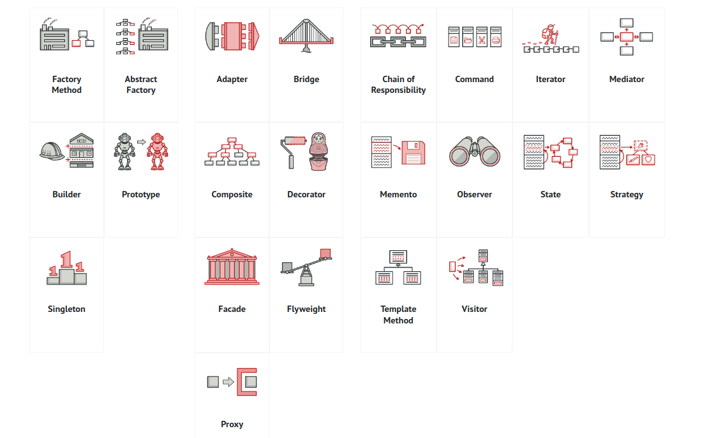

## Creational Patterns

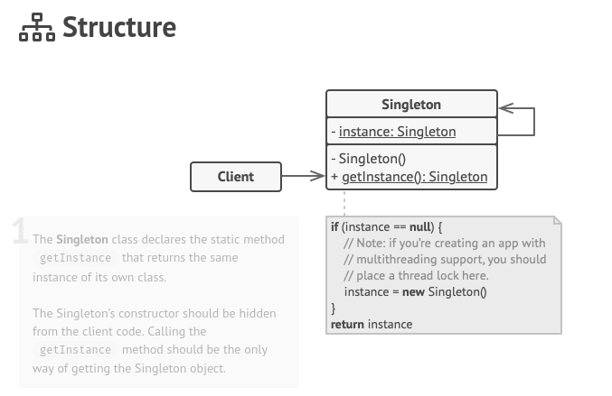

#### Singleton Pattern

This pattern puts restrictions on the instantiation of classes & ensures that only 1 instance of the class is available in the JVM at any point of time.
  - Used for logging, thread pools, driver objects and caching.
  - Used in core java classes like `java.lang.RunTime` etc.

Concepts:
  - Private constructor for restricting the object creation from outside class.
  - The only single instance of the class is a private static variable.
  - Public static method for exposing this only single instance to the outside world.


  ```java
public class Singleton {

    private static Singleton instance;
    private Singleton(){}

    public static Singleton getInstance(){
        if(instance == null){
            instance = new Singleton();
        }
        return instance;
    }
}
  ```

But, this approach fails for multi-threading environment. There are chances that 2 or more threads will create & get the different instances of the same singleton class.

```java
public class ThreadSafeSingleton {

    private static ThreadSafeSingleton instance;
    private ThreadSafeSingleton(){}

    public static synchronized ThreadSafeSingleton getInstance(){
        if(instance == null){
            instance = new ThreadSafeSingleton();
        }
        return instance;
    }
}
```  

#### Factory Pattern

Native approach for object creation is usage of constructors, but factory pattern provides alternative way for this.

- Used when for a superclass -> multiple sub-classes are there and based on some business logic, one of the sub-class is returned.
- This pattern takes out the responsibility of instantiation from the client program to the factory class.

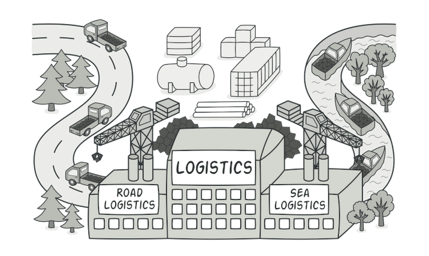

- Used when the exact types and dependencies of the objects your code should work with is not known beforehand.
- Factory pattern makes our code more robust, less coupled and easy to extend

Concepts:
- Factory class for creation of object of desired type based on the business logic.

Real-life example is a Logistic App, initially, a single transport mechanism was of land so Trucks were used & all logistics function were dependent on Truck class but later on while addition of sea & air transport, this poses problems in scaling the app.

`Button.java`
```java
public interface Button {
    void render();
}
```

`WindowsButton.java`
```java
public class WindowsButton implements Button {
    @Override
    public void render() {}
}
```

`HtmlButton.java`
```java
public class HtmlButton implements Button {
    @Override
    public void render() {}
}
```

`ButtonFactory.java` : Factory class
```java
public class ButtonFactory {
    public Button getButton() {
      if (System.getProperty("usage.property").equals("browser"))
          return new HtmlButton();
      else
          return new WindowsButton();
    }
}
```

`Runner.java`
```java
public class Runner {
    public static void main(String[] args) {
        ButtonFactory buttonFactory = new ButtonFactory();
        Button button = buttonFactory.getButton();
        button.render();
    }
}
```

#### Abstract Factory Pattern

This is another layer of abstraction over the Factory pattern.
- AbstractFactory returns the Factory of classes, each of these factory will return one of the sub-classes.
- This is basically Factory pattern applied over the Factory pattern implementation.

Real life example is: Honda builds SportsCar & LuxuryCar for 2 locations: USA & India. Based on location, Cars specification varies for all 2 subclasses of car like steering wheel side.
Here AbstractFactory comes to our rescue.

`Car.java`
```java
public abstract class Car {
    private CarType model = null;
    private Location location = null;

    public Car(CarType model, Location location){
      this.model = model;
      this.location = location;
    }
    //getters and setters

    protected abstract void construct();
}
```

`SportCar.java`
```java
public class SportCar extends Car {
  public SportCar(Location location) {
    super(CarType.SPORTS, location);
    construct();
  }

  @Override
  protected void construct() {
    System.out.println("Building Sports car");
    //add accessories
  }
}
```

`LuxuryCar.java`
```java
public class LuxuryCar extends Car {
  public LuxuryCar(Location location) {
    super(CarType.LUXURY, location);
    construct();
  }

  @Override
  protected void construct() {
    System.out.println("Building Luxury car");
    //add accessories
  }
}
```

`Location.java`
```java
public enum Location {
  USA, ASIA
}
```

`CarType.java`
```java
public enum CarType {
  SPORTS, LUXURY
}
```

`CarFactory.java`
```java
public class CarFactory {
    private CarFactory() {}

    public static Car buildCar(CarType type) {
        Car car = null;
        Location location = System.getProperty("location.info");

        switch(location) {
          case USA: car = USACarFactory.buildCar(type); break;
          case ASIA: car = AsiaCarFactory.buildCar(type); break;
        }
        return car;
    }
}
```

`USACarFactory.java`
```java
public class USACarFactory {
    public static Car buildCar(CarType model) {
        Car car = null;
        switch (model) {
          case SPORTS: car = new SportCar(Location.USA); break;
          case LUXURY: car = new LuxuryCar(Location.USA); break;
        }
        return car;
    }
}
```

`AsiaCarFactory.java`
```java
public class USACarFactory {
  public static Car buildCar(CarType model) {
    Car car = null;
    switch (model) {
      case SPORTS: car = new SportCar(Location.ASIA); break;
      case LUXURY: car = new LuxuryCar(Location.ASIA); break;
      default:
    }
    return car;
  }
}
```

`Runner.java`
```java
public class Runner
{
  public static void main(String[] args)
  {
    CarFactory.buildCar(CarType.SPORTS);
    CarFactory.buildCar(CarType.LUXURY);
  }
}
```

#### Builder Pattern

This pattern helps in constructing complex objects in a step-by-step manner & the final step returns the object.

- Objects are having lot many attributes & having separate constructors for invoking these attributes for object creation is really cumbersome.
- StringBuilder & StringBuffer in java uses Builder DP.

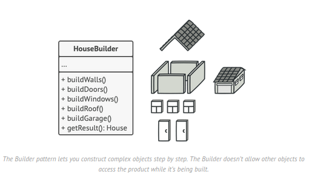

Concepts
- Builder class is a static nested class inside the main object class.
- Builder class must have a public parameterized constructor with all mandatory data members.
- Builder class should have setters for all optional data members & should return Builder object.
- build() method is required which returns the final object to the runner.

`Mobile.java`
```java
public class Mobile {
  private String RAM;
  private String Size;
  private String Camera;
  boolean is4GEnabled;

  // GETTERS for these 5 private members

  private Mobile(MobileBuilder builder) {
    this.RAM = builder.RAM;
    this.Size = builder.Size;
    this.Camera = builder.Camera;
    this.is4GEnabled = builder.is4GEnabled;
  }

  public static class MobileBuilder {
    private String RAM;
    private String Size;
    private String Camera;
    boolean is4GEnabled;

    public MobileBuilder(String RAM, String Size) {
      this.RAM = RAM; this.Size = Size;
    }

    public MobileBuilder setCamera(String Camera) {
      this.Camera = Camera;
      return this;
    }

    public MobileBuilder setIs4GEnabled(boolean is4GEnabled) {
      this.is4GEnabled = is4GEnabled;
      return this;
    }

    public Mobile build() {
      return new Mobile(this);
    }
  }
}
```

`Runner.java`
```java
public class Runner {
    public static void main(String[] args) {
        Mobile mobile1 = new Mobile.MobileBuilder("4 GB", "6 inch").setCamera("12px").setIs4GEnabled(true).build();
        Mobile mobile2 = new Mobile.MobileBuilder("2 GB", "4.2 inch").setIs4GEnabled(false).build();
	}
}
```

#### Prototype Pattern

Prototype is a template of the actual object to be constructed later. In java, Prototyping means cloning or replicating an object.

- Whether deep copy or shallow copy, depends totally on the business needs.
- Useful when large number of instances of classes are required, which are all nearly same.
- This DP also supplements cases when we require exact copies of existing objects but don't want to be dependent on their classes.

If the cost of object creation is large & creation process is resource-intensive, we use cloning.

**Issues with normal approach**
If we have to exactly copy an existing object natively, we create a new object of the same class, traverse all fields of existing object & copy values to the new object. Here, catch is that maybe some fields are private & couldn't be accessed/copied.

Concepts
- An interface/class implementing Cloneable having abstract clone() method declared.
- Prototype registry for holding the prominent prototypes available to us.
- Separate Prototype models which inherits the base interface & implements clone() method in them.

`SolrCore.java `
```java
public interface SolrCore extends Cloneable {
    public SolrCore clone() throws CloneNotSupportedException;
}
```

`Intent.java `
```java
public class Intent implements SolrCore {
    private String name = null;

    @Override
    public Intent clone() throws CloneNotSupportedException {
        return (Intent) super.clone();
    }
}
```

`Mapping.java`
```java
public class Mapping implements SolrCore {
    private String name = null;

    @Override
    public Mapping clone() throws CloneNotSupportedException {
        return (Mapping) super.clone();
    }
}
```

`Mcat.java`
```java
public class Mcat implements SolrCore {
    private String name = null;

    @Override
    public Mcat clone() throws CloneNotSupportedException {
        return (Mcat) super.clone();
    }
}
```

`CoreDirectory.java`
```java
public class CoreDirectory {
    public static class CoreName {
        public static final String INTENT = "intent";
        public static final String MCAT = "mcat";
        public static final String MAPPING = "mapping";
    }

    private static java.util.Map<String , SolrCore> cores = new java.util.HashMap<>();

    static {
        cores.put(CoreName.INTENT, new Intent());
        cores.put(CoreName.MCAT, new Mcat());
        cores.put(CoreName.MAPPING, new Mapping());
    }

    public static SolrCore getInstance(final String s) throws CloneNotSupportedException {
        return ((SolrCore) cores.get(s)).clone();
    }
}
```

`Runner.java`
```java
public class Runner {
    public static void main(String[] args) {
        try {
            String mappingCore1  = SolrCore.getInstance(CoreName.MAPPING).toString();
            String intentCore1  = SolrCore.getInstance(CoreName.INTENT).toString();
            String mappingCore2  = SolrCore.getInstance(CoreName.MAPPING).toString();
        }
        catch (CloneNotSupportedException e) {
            e.printStackTrace();
        }
    }
}
```
---


## Structural Patterns

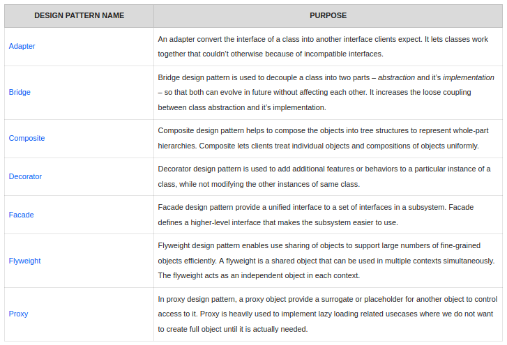

#### Adapter Pattern

Allows objects with imcompatible interfaces to collaborate.
- Helps creating a middle-layer class that serves as translator between the legacy code & new code.
- Arrays.asList() is a quite famous adapter used.
- Also known as Wrapper Pattern
- 2 ways of implementing adapter patter:
  - Class adapter which uses inheritence
  - Object adapter which uses composition

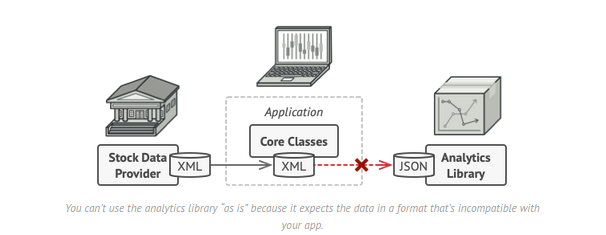
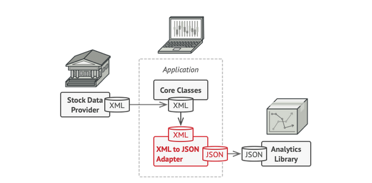

`RoundHole.java`
```java
public class RoundHole {
    private double radius;

    public RoundHole(double radius) {
        this.radius = radius;
    }

    public boolean fits(RoundPeg rpeg) {
        if(this.radius >= rpeg.getRadius())
            return true;
        else
            return false;
    }
}
```

`RoundPeg.java`
```java
public class RoundPeg {
    private double radius;

    public RoundPeg(double radius) {
        this.radius = radius;
    }

    public double getRadius() {
        return this.radius;
    }
}
```

`SquarePeg.java`
```java
public class SquarePeg {
    private double side;

    public SquarePeg(double side) {
        this.side = side;
    }

    public double getSide() {
        return this.side;
    }
}
```

`SquarePegAdapter.java`
```java
public class SquarePegAdapter extends RoundPeg {
    private SquarePeg sqpeg;

    public SquarePegAdapter(SquarePeg sqpeg) {
        this.sqpeg = sqpeg;
    }

    @Override
    public double getRadius() {
        return Math.sqrt(Math.pow(sqpeg.getSide()/2, 2)*2);
    }
}
```

`Runner.java`
```java
public class Runner {
    public static void main(String[] args) {
        RoundHole hole = new RoundHole(5);
        RoundPeg rpeg = new RoundPeg(5);
        hole.fits(rpeg);                                                 // true

        SquarePeg sqpeg = new SquarePeg(6);
        hole.fits(sqpeg);                                                // compilation error

        SquarePegAdapter sqpegAdapter = new SquarePegAdapter(sqpeg);
        hole.fits(sqpegAdapter);                                         // false
    }
}
```

#### Bridge Pattern

Used for decoupling abstraction from its implementation so that both can vary  independently.

- Used when the system needs to be extended in several orthogonal dimensions.
- Used when we wish to switch the implementation at run-time.
- Used for applications requiring platform independence.

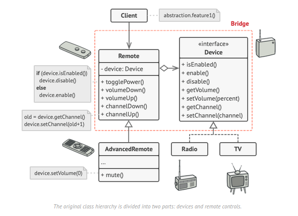

#### Composite Pattern

Used mainly for the cases when objects form a tree-like hierarchy. In this hierarchy, each node is either a composite or a leaf node.

- Provides 2 basic element types which share common interface: simple leaves & complex containers. These containers can further contain simple leaves & more containers making this a tree structre.
- Using this pattern, simple as well complex elements are treated uniformly.

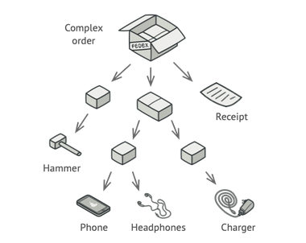

`FileSystemObject.java`
```java
public interface FileSystemObject {
  public abstract void print();
}
```

`File.java`
```java
public class File extends FileSystemObject {
  private String fileName;
  public File(String fileName) {
      this.fileName = fileName;
  }

  @Override
  public void print() {
      Sout(fileName);
  }
}
```

`Folder.java`
```java
public class Folder extends FileSystemObject {
    private String folderPath;
    private List<String> childrens;

    public Folder(String folderPath) {
        this.folderPath = folderPath;
        this.childrens = new ArrayList<>();
    }
    public add(FileSystemObject fobj) {
        this.childrens.add(fobj);
    }

    @Override
    public void print() {
        Sout(folderPath);
        for(FileSystemObject fobj:childrens) {
            fobj.print();
        }
    }
}
```

`Runner.java`
```java
public class Runner {
    public static void main(String[] args) {

        FileSystemObject file1 = new File("model-v1.bin");
        FileSystemObject file2 = new File("model-v2.bin");
        FileSystemObject file3 = new File("dataset.csv");
        FileSystemObject folder1 = new Folder("/ml");
        FileSystemObject folder2 = new Folder("/dataset");
        FileSystemObject folder3 = new Folder("/models");

        folder2.add(file3);
        folder3.add(file1);
        folder3.add(file2);
        folder1.add(folder2);
        folder1.add(folder3);

        folder1.print();
    }
}
```

#### Decorator Pattern

Used to extend the behavior of an instance at runtime. This modification doesn't impact the other instances.

- Provides alternative to the native approach of subclassing for functionality extensions.
- Also called as wrapper design pattern just like adapter dp.
- Decorator dp lets us attach these new behaviors to objects by placing these objects inside special wrapper objects (decorators) that contain these behaviors.

Concepts
- Component interface
- Component implementation which extends component interface
- Decorator which extends component interface & posses HAS-A relation with component implementation
- Concrete decorators which extend Decorator & adds extra functionalities.

`DataSource.java`
```java
public interface DataSource {
    void writeData(String data);
    String readData();
}
```

`FileDataSource.java`
```java
public class FileDataSource implements DataSource {
    private String name;

    public FileDataSource(String name) {
        this.name = name;
    }

    @Override
    public void writeData(String data) {
        SOUT("Writing data to file");
    }

    @Override
    public String readData() {
        SOUT("Reading data from file");
    }
}
```

`DataSourceDecorator.java`
```java
public class DataSourceDecorator implements DataSource {
    private DataSource wrappee;

    DataSourceDecorator(DataSource source) {
        this.wrappee = source;
    }

    @Override
    public void writeData(String data) {
        wrappee.writeData(data);
    }

    @Override
    public String readData() {
        return wrappee.readData();
    }
}
```

`EncryptionDecorator.java`
```java
public class EncryptionDecorator extends DataSourceDecorator {
    public EncryptionDecorator(DataSource source) {
        super(source);
    }

    @Override
    public void writeData(String data) {
        super.writeData(encode(data));
    }

    @Override
    public String readData() {
        return decode(super.readData());
    }
}
```

`CompressionDecorator.java`
```java
public class CompressionDecorator extends DataSourceDecorator {
    public CompressionDecorator(DataSource source) {
        super(source);
    }

    @Override
    public void writeData(String data) {
        super.writeData(compress(data));
    }

    @Override
    public String readData() {
        return decompress(super.readData());
    }  
}
```

`Runner.java`
```java
public class Runner {
    public static void main(String[] args) {
        DataSourceDecorator encoded = new CompressionDecorator(
                                         new EncryptionDecorator(
                                             new FileDataSource("input.txt")));  
        DataSource plain = new FileDataSource("input.txt");

        SOUT(plain.readData());
        SOUT(encoded.readData());
    }
}
```

#### Facade Pattern

Used for providing simplified interface to set of complex subsystems.

- Is appropriate when we have a complex subsystems, which we desire to expose in a simplistic manner.
- It hides the internal complexities from the outer world.
- Also decouples the code making it easier to modify/rectify the subsystems without affecting the external client facing interfaces.

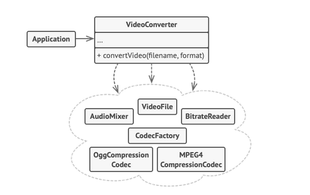

`MCATService.java`
```java
public class MCATService {
    public List<String> suggestMCATs(String searchQuery) {
        String modifiedSearchQuery = new SearchQueryFormatter.clean(searchQuery);
        List<String> mcats = new SolrMappingLogic.getTopMappings(modifiedSearchQuery);
        mcats.addAll(new SolrMCATLogic.getExactMCATs(modifiedSearchQuery));
        mcats.addAll(new SolrMCATLogic.getSimilarMCATs(mcats.get(0)));
        mcats = new BusinessLogic.reorganise(mcats);
    }
}
```

We have several subsystems in place namely, SearchQueryFormatter.java, SolrMappingLogic.java, SolrMCATLogic.java, BusinessLogic.java etc but MCATService will act as facade to us.

`Runner.java`
```java
public class Runner {
    public static void main(String[] args) {
        List<String> mcats = new MCATService.suggestMCATs("Lg washing machine 4kg");
    }
}
```

Due to decoupling between the interface & implementation, its easy to modify/rectify/change the implementation.

#### Flyweight Pattern

Used in scenarios where lots of similar objects are spawned in the system. Since, each of these objects consumes memory which is crucial for low storage devices like mobiles or embedded systems, Flyweight pattern is highly useful.

- We try to fit more objects in the available RAM by sharing common data between these objects rather than keeping that data in each object.
- Flyweight is a shared object which can be used in multiple contexts simultaneously.

Concepts
- Number of objects created should be huge
- Object properties can be divided into intrinsic & extrinsic. Intrinsic properties are part of the flyweight class & extrinsic properties are set by the client code.

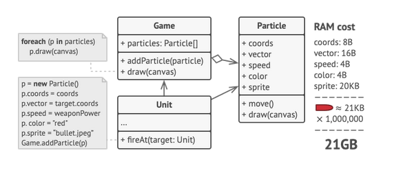

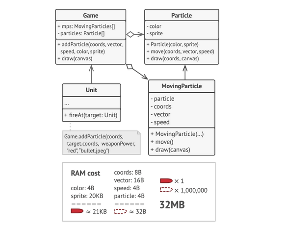

#### Proxy Pattern

Used in scenarios when we require to represent the actual service object with a simpler one. Proxy object serves as placeholder for the actual service objects.

Types of proxies:
- Virtual proxy used for lazy initialisation. If the actual service object is too heavy & memory-hungry to be created.
- Protection proxy used for access control. If the actual service object requires some sort of authentication.
- Remote proxy used for remote handling & connection establishment stuff.
- Logging & Caching proxy used for logging & request/data caching purposes.

`CommandExecutor.java`
```java
public interface CommandExecutor {
    public void runCommand(String command, String user);
}
```

`CommandExecutorImpl.java`
```java
public class CommandExecutorImpl extends CommandExecutor {
    @Override
    public void runCommand(String command, String user) {
        Runtime.getRuntime().exec(command);
    }
}
```

`CommandExecutorProxy.java`
```java
public class CommandExecutorProxy extends CommandExecutorImpl {
    @Override
    public void runCommand(String command, String user) {
        if(user.equals("admin")) {
            super.runCommand(command);
        } else
            Sout("Permission Denied");
    }
}
```

`Runner.java`
```java
public class Runner {
    public static void main(String[] args) {
        new CommandExecutorProxy.runCommand("ls", "admin");
        new CommandExecutorProxy.runCommand("rm", "jalaz");
    }
}
```

---

## Behavioral Patterns

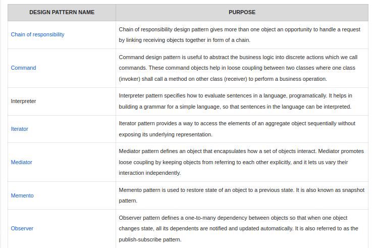
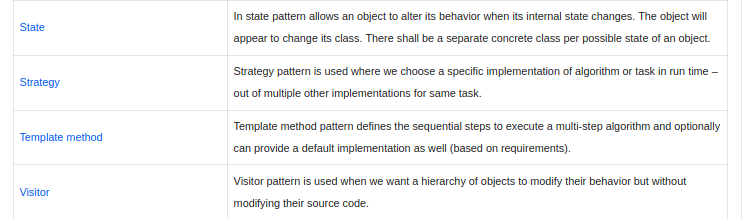

#### Chain of responsibility

Used in scenarios when a client's request is passed through a chain of handlers. Each handler upon receiving the request decides whether to process it or pass it to the next handler.

- Java Exception handling with multiple catch blocks is an excellent example.
- Customer servicing support is a good real life example.
- Use COR when these handlers are to be decided at run-time.

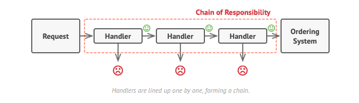

`Dispenser.java`
```java
public interface Dispenser {
    void setNextDispencer(Dispenser next);
    void dispense(Integer amount);
}
```

`Rupee2000Dispenser`
```java
public class Rupee2000Dispenser implements Dispenser {

  private Dispenser next = null;

	@Override
	public void setNextDispencer(Dispenser next) {
		this.next = next;
	}

	@Override
	public void dispense(Integer amount) {
			int num = amount/2000;
			int remainder = amount % 2000;
			System.out.println("Dispensing "+num+" 2000 note");
			if(remainder !=0) {
        if(next!=null)
          this.next.dispense(remainder);
        else
          Sout("Couldn't dispense remaining amount");
      }
	}
}
```

`Rupee500Dispenser`
```java
public class Rupee500Dispenser implements Dispenser {

  private Dispenser next = null;

  @Override
  public void setNextDispencer(Dispenser next) {
    this.next = next;
  }

  @Override
  public void dispense(Integer amount) {
      int num = amount/500;
      int remainder = amount % 500;
      System.out.println("Dispensing "+num+" 500 note");
      if(remainder !=0) {
        if(next!=null)
          this.next.dispense(remainder);
        else
          Sout("Couldn't dispense remaining amount");
      }
  }
}
```

`Rupee100Dispenser`
```java
public class Rupee100Dispenser implements Dispenser {

	private Dispenser next = null;

	@Override
	public void setNextDispencer(Dispenser next) {
		this.next = next;
	}

	@Override
	public void dispense(Integer amount) {
			int num = amount/100;
			int remainder = amount % 100;
			System.out.println("Dispensing "+num+" 100 note");
			if(remainder !=0) {
        if(next!=null)
          this.next.dispense(remainder);
        else
          Sout("Couldn't dispense remaining amount");
      }
	}
}
```

`ATMDispenseChain.java`
```java
public class ATMDispenseChain {
  public ATMDispenseChain() {
    private Dispenser dispenser;
    public ATMDispenseChain(){
      dispenser = new Rupee2000Dispenser();
      dispenser.setNextDispencer(new Rupee500Dispenser().setNextDispencer(new Rupee100Dispenser()));
    }
  }
}
```

`Runner.java`
```java
public class Runner {
  public static void main(String[] args) {
    ATMDispenseChain atmdispenser = new ATMDispenseChain();
    atmdispenser.dispense(2600);
    atmdispenser.dispense(3300);
  }
}
```

#### Command Pattern

Used to abstract business logic into discrete actions called commands.
- Achieves loose coupling between 2 classes: `Invoker` class calls method on `Receiver` class to perform business operation called `Command`.
- Runnable in java uses command DP.

`FileSystemReceiver.java`
```java
public interface FileSystemReceiver {
    void openFile();
    void closeFile();
}
```

`LinuxFileSystemReceiver.java`
```java
public class LinuxFileSystemReceiver implements FileSystemReceiver {
  	@Override
  	public void openFile() {    System.out.println("Opening file in Linux"); }

  	@Override
  	public void closeFile() {		System.out.println("Closing file in Linux");	}
}
```

`WindowsFileSystemReceiver.java`
```java
public class WindowsFileSystemReceiver implements FileSystemReceiver {
  	@Override
  	public void openFile() {    System.out.println("Opening file in Windows"); }

  	@Override
  	public void closeFile() {		System.out.println("Closing file in Windows");	}
}
```

`Command.java`
```java
public interface Command {
    void run();
}
```

`OpenFileCommand.java`
```java
public class OpenFileCommand implements Command {
    private FileSystemReceiver fileSystem;

    public OpenFileCommand(FileSystemReceiver fs){ this.fileSystem = fs; }

    @Override
    public void run() {		this.fileSystem.openFile();	}
}
```

`CloseFileCommand.java`
```java
public class CloseFileCommand implements Command {
    private FileSystemReceiver fileSystem;

    public CloseFileCommand(FileSystemReceiver fs){ this.fileSystem = fs; }

    @Override
    public void run() {		this.fileSystem.closeFile();	}
}
```

```java
public class FileInvoker {
    public Command command;
    public FileInvoker(Command c) {  this.command = c;	}
    public void execute() {	this.command.run();	}
}
```

`FileSystemClient.java`
```java
public class FileSystemClient {
  	public static void main(String[] args) {
        FileSystemReceiver fs;
        if(System.getProperty("os.name").contains("Windows")) {
            fs = new WindowsFileSystemReceiver();
        } else {
            fs = new UnixFileSystemReceiver();
        }

    		OpenFileCommand openFileCommand = new OpenFileCommand(fs);
        FileInvoker file = new FileInvoker(openFileCommand);
    		file.execute();

    		CloseFileCommand closeFileCommand = new CloseFileCommand(fs);
        FileInvoker file = new FileInvoker(closeFileCommand);        
        file.execute();
  	}
}
```

#### Interpreter Pattern

Used for defining a grammatical representation for a language and provides an interpreter to deal with this grammar
- Not much prevelant design pattern
- Used in java.util.Pattern class.
- Useful for creating syntax tree of the grammer.

#### Iterator Pattern

Lets us traverse elements of a group of objects (collection) without exposing the underlying representations (list, map, set etc.)
- Different kinds of iterators can be provided as per our requirements.
- Use Iterator DP, when collection has complex data structure under the hood & we wish to hide its complexity from the clients.

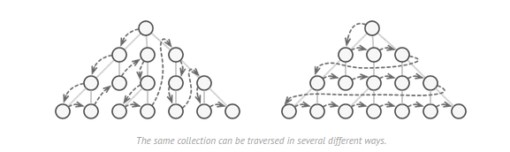

<ins>**Constituents:**</ins>:
- Iterator
- Aggregate or Collection
- ConcreteIterator

`Channel.java`
```java
public class Channel {
  	private String name;
  	private String type;

  	public Channel(String name, String type){
  		this.number = name;
  		this.type = type;
  	}

  	public String getName() {	return name;	}
  	public String getType() {	return type;	}

  	@Override
  	public String toString(){
  		return "Name="+name+", Type="+type;
  	}
}
```

`ChannelCollection.java`
```java
public interface ChannelCollection {
  	public void addChannel(Channel c);
  	public void removeChannel(Channel c);
  	public ChannelIterator iterator(String type);
}
```

`ChannelIterator.java`
```java
public interface ChannelIterator {
    public boolean hasNext();
    public Channel next();
}
```

`ChannelCollectionImpl.java`
```java
public class ChannelCollectionImpl implements ChannelCollection {
    private List<Channel> channelsList = new ArrayList<>();
    public void addChannel(Channel c) {	this.channelsList.add(c);	}
    public void removeChannel(Channel c) {	this.channelsList.remove(c);	}

    @Override
  	public ChannelIterator iterator(String type) {
  		return new ChannelIteratorImpl(type, this.channelsList);
  	}
}
```

`ChannelIteratorImpl.java`
```java
public class ChannelIteratorImpl implements ChannelIterator {
    private String type;
    private List<Channel> channelsList;
    private Integer position;

    public ChannelIteratorImpl(String type, List<Channel> channelsList) {
        this.type = type;   this.channelsList = channelsList;   this.position = 0;
    }

    @Override
    public boolean hasNext() {
        while(position < channelsList.size()) {
            Channel c = channelsList.get(position);
            if(c.getType().equals(type) || type.equals("ALL"))
                return true;
            else
                position++;
        }
        return false;
    }

    @Override
		public Channel next() {
			Channel c = channelsList.get(position);
			position++;
			return c;
		}
}
```

`Runner.java`
```java
public class Runner {
    public static void main(String args[]) {
        ChannelCollection channels = new ChannelIteratorImpl();
        channels.addChannel(new Channel("ABP News", "News"));
        channels.addChannel(new Channel("MTV", "Music"));
        channels.addChannel(new Channel("IndiaTV", "News"));
        channels.addChannel(new Channel("Aaj Tak", "News"));
        channels.addChannel(new Channel("Mastii", "Music"));
        channels.addChannel(new Channel("B4U", "Music"));
        channels.addChannel(new Channel("Zee News", "News"));
        channels.addChannel(new Channel("NDTV", "News"));

        ChannelIterator newsChannelIterator = channels.iterator("News");
        ChannelIterator musicChannelIterator = channels.iterator("Music");
        ChannelIterator allChannelIterator = channels.iterator("All");

        while(newsChannelIterator.hasNext()) {
          Channel c = newsChannelIterator.next();
          SOUT(c.toString());
        }

        while(musicChannelIterator.hasNext()) {
          Channel c = musicChannelIterator.next();
          SOUT(c.toString());
        }

        while(allChannelIterator.hasNext()) {
          Channel c = allChannelIterator.next();
          SOUT(c.toString());
        }
    }
}
```

#### Mediator Pattern

Used to provide a centralised communication medium to objects.
- Reduces chaotic dependencies between object by restricting direct communicatio  between them & forces them to collaborate only via `Mediator` object.
- ATC at airport is a real-time great example for Mediator DP.
- Fewer the dependencies a class carries, easier is to modify & maintain that class.
- Objects communicating via mediator are called `Colleague` objects.
- Colleagues are not aware of each other's existence, thus enabling loose coupling.

<ins>**Constituents**</ins>:
- Mediator – Interface for communication between Colleagues.
- Colleague – Interface for Colleagues.
- ConcreteColleague – Individual object which communicates with each other via Mediator.

`ATC.java`
```java
public class ATC {
    private List<String> airportList = new ArrayList<>();
    private isAirStripFree = true;

    public void allowTakeOff(String flightId) {
      if(isAirStripFree)
        airportList.remove(flightId);
    }

    public void allowLanding(String flightId) {
      if(isAirStripFree)
        airportList.add(flightId);
    }
}
```

`Flight.java`
```java
public interface Flight {
    String flightId;
    ATC controller;
    public Flight(String id, ATC atc) {  flightId = id; controller = atc; }
    public void seekTakeOff();
    public void seekLanding();
}
```

`AirlinesFlight.java`
```java
public class AirlinesFlight implements Flight {
  public AirlinesFlight(String id, ATC atc) {  super(id, atc);  }
  public void seekTakeOff() { controller.allowTakeOff(flightId); }
  public void seekLanding() { controller.allowLanding(flightId); }
}
```

`CargoFlight.java`
```java
public class CargoFlight implements Flight {
  public CargoFlight(String id, ATC atc) {  super(id, atc);  }
  public void seekTakeOff() { controller.allowTakeOff(flightId); }
  public void seekLanding() { controller.allowLanding(flightId); }
}
```

`Runner.java`
```java
public class Runner {
    public static void main(String args[]) {
        ATC atc = new ATC();
        Flight spicejetBLU_DLI = new AirlinesFlight("SP121", atc);
        Flight dtdcBLU_KUK = new CargoFlight("DTDC37", atc);
        Flight goairCHD_BLU = new AirlinesFlight("GA763", atc);

        goairCHD_BLU.seekLanding();
        dtdcBLU_KUK.seekTakeOff();
        goairCHD_BLU.seekTakeOff();
        spicejetBLU_DLI.seekTakeOff();
    }
}
```

#### Memento Pattern

Used to restore state of an object to a previous state. Also called as snapshot pattern.
- Used in IDEs for creating snapshots of project in development.
- Used in undo/redo operations.
- Used in such applications in which object’s state is continuously changing and the user may decide to rollback or undo the changes at any point.

<ins>**Constituents**</ins>:
- Originator – Creates & rolls back a Memento.
- Caretaker – Manages & keeps track of multiple Mementos.
- Memento – Lock box that is written and read by the Originator, and shepherded by the Caretaker.
  - Is an Immutable object so that once created, its state couldn't be changed.

`Article.java`
```java
public class Article
{
    private long id;
    private String title;    
    private String content;

    public Article(long id, String title) {
        this.id = id;
        this.title = title;
    }

    //Setters and Getters

    public ArticleMemento createMemento() {
        return new ArticleMemento(id, title, content);
    }

    public void restore(ArticleMemento m) {
        this.id = m.getId();
        this.title = m.getTitle();
        this.content = m.getContent();
    }

    @Override
    public String toString() {
        return "Article [id=" + id + ", title=" + title + ", content=" + content + "]";
    }
}
```

`ArticleMemento.java`
```java
public final class ArticleMemento
{
    private final long id;
    private final String title;
    private final String content;

    public ArticleMemento(long id, String title, String content) {
        this.id = id;
        this.title = title;
        this.content = content;
    }

    // Getters for 3 variables
}
```

`Runner.java`
```java
public class Runner
{
    public static void main(String[] args)
    {
        Article article = new Article(1, "AWS");
        article.setContent("EC2 is Elastic Compute Cloud");
        SOUT(article);

        ArticleMemento memento = article.createMemento();

        article.setContent("S3 is Simple Storage Service");
        SOUT(article);

        article.restore(memento);
        SOUT(article);
    }
}
```

`OUTPUT`
```bash
Article [id=1, title=AWS, content=EC2 is Elastic Compute Cloud]
Article [id=1, title=AWS, content=S3 is Simple Storage Service]
Article [id=1, title=AWS, content=EC2 is Elastic Compute Cloud]
```

#### Observer Pattern

Defines a one-to-many dependency between objects so that when one object changes state, all its dependents are notified and updated automatically. Also called as publish-subscribe pattern.

- In observer pattern, there are many observers (subscriber objects) that are observing a particular subject (publisher object).
- Helps in making the objects loosely coupled.
- Defines a subscription mechanism to notify multiple objects about any events that happen to the object they’re observing.
- Used when changes in one object state may require changing other objects.
- Used in real-time like newspaper subscription, push notifications, database triggered updates etc.
- Model-View-Controller (MVC) frameworks also use Observer pattern where Model is the Subject and Views are observers that can register to get notified of any change to the model.

<ins>**Constituents**</ins>:
- Subject – Interface defining the operations for attaching and de-attaching Observers to Subject.
- ConcreteSubject – concrete Subject class. It maintain the state of the object and when a change in the state occurs it notifies the attached Observers.
- Observer – Interface defining the operations that are used for notify this object.
- ConcreteObserver – concrete Observer implementations.

`Subject.java`
```java
public interface Subject {
    public void attach(Observer o);
    public void detach(Observer o);
    public void notifyUpdate(Message m);
}
```

`MessagePublisher.java`
```java
public class MessagePublisher implements Subject {
    private List<Observer> observers = new ArrayList<>();

    @Override
    public void attach(Observer o) {    observers.add(o);    }

    @Override
    public void detach(Observer o) {    observers.remove(o);    }

    @Override
    public void notifyUpdate(Message m) {
        for(Observer o: observers) {
            o.update(m);
        }
    }
}
```

`Observer.java`
```java
public interface Observer {
    public void update(Message m);
}
```

`MessageSubscriber.java`
```java
public class MessageSubscriber implements Observer {
    String subscriptionId;

    public MessageSubscriber(String subscriptionId) {
        this.subscriptionId = subscriptionId;
    }

    @Override
    public void update(String message) {
        SOUT("MessageSubscriber :: " +subscriptionId + " | " + message);
    }
}
```

`Runner.java`
```java
public class Runner {
    public static void main(String[] args) {
        MessageSubscriber s1 = new MessageSubscriber("1");
        MessageSubscriber s1 = new MessageSubscriber("2");
        MessageSubscriber s1 = new MessageSubscriber("3");
        MessagePublisher p = new MessagePublisher();

        p.attach(s1);
        p.attach(s2);
        p.notifyUpdate(new Message("First Message"));   //s1 and s2 will receive the update

        p.detach(s1);
        p.attach(s3);
        p.notifyUpdate(new Message("Second Message")); //s2 and s3 will receive the update
    }
}
```

#### State Pattern

Lets an object alter its behavior when its internal state changes. It appears as if the object changed its class.
- For every possible state of an object, there is a separate concrete class.
- Each concrete state object will have logic to accept/reject state transition request.
- Java.Thread is an example of state pattern.

<ins>**Constituents**</ins>:
- State – Interface define operations which each state must handle.
- Concrete States – classes which contain the state specific behavior.
- Context – Defines an interface to client to interact.

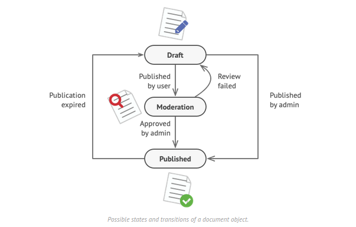

`DocumentState.java`
```java
public interface PackageState {
    public void updateState(DeliveryContext ctx);
}
```

`Ordered.java`
```java
public class Ordered implements PackageState {
  @Override
  public void updateState(DeliveryContext ctx) {
      SOUT("Package: Ordered !!");
      ctx.setCurrentState(new Shipped());
  }
}
```

`Shipped.java`
```java
public class Shipped implements PackageState {
  @Override
  public void updateState(DeliveryContext ctx) {
      SOUT("Package: Shipped !!");
      ctx.setCurrentState(new Delivered());
  }
}
```

`Delivered.java`
```java
public class Delivered implements PackageState {
  @Override
  public void updateState(DeliveryContext ctx) {
      SOUT("Package: Delivered !!");
  }
}
```

`DeliveryContext.java`
```java
public class DeliveryContext {
    private PackageState currentState;
    private String packageId;

    public DeliveryContext(PackageState currentState, String packageId) {
        this.currentState = currentState;
        this.packageId = packageId;
    }

    public void update() {
        currentState.updateState(this);
    }
}
```

`Runner.java`
```java
public class Runner {
    public static void main(String[] args) {
        DeliveryContext ctx = new DeliveryContext(new Ordered(), "Realme ear phones");
        ctx.update();       // Ordered
        ctx.update();       // Shipped
        ctx.update();       // Delivered
    }
}
```


#### Strategy Pattern

Used when we choose a specific implementation of task in run time – out of multiple other implementations for same task.

- Involves removing the algorithm from its host class and putting it in separate class, so that there might be different strategies, which can be selected in runtime.
- Allows to add new algorithm without modifying existing algorithms or context class.

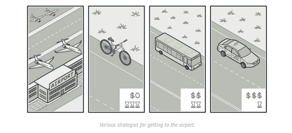

`UDGOrderingStrategy.java`
```java
public interface UDGOrderingStrategy {
    public List<String> reorder(List<String>);
}
```

`UDGSearchContext.java`
```java
public class UDGSearchContext {
    UDGOrderingStrategy strategy;

    public void setStrategy(UDGOrderingStrategy strategy) {
        this.strategy =  strategy;
    }

    public use(List<String> usergroups) {
        strategy.reorder(usergroups);
    }
}
```

`SupplierUsageStrategy.java`
```java
public class SupplierUsageStrategy implements UDGOrderingStrategy {
    public List<String> reorder(List<String> usergroups) {
        SOUT("Reordering usergroups on supplier usage");
        return usergroups;
    }
}
```

`TextMatchingStrategy.java`
```java
public class TextMatchingStrategy implements UDGOrderingStrategy {
    public List<String> reorder(List<String> usergroups) {
        SOUT("Reordering usergroups on text matching");
        return usergroups;
    }
}
```

`Runner.java`
```java
public class Runner {
    public static void main(String[] args) {
        UDGSearchContext context = new UDGSearchContext();
        List<String> usergroups = {"lg washing machine", "automatic washing machine", "home washing machine", "industrial washing machine"};

        context.setStrategy(new SupplierUsageStrategy());
        context.use(usergroups);

        context.setStrategy(new TextMatchingStrategy());
        context.use(usergroups);
    }
}
```


#### <ins>Template method Pattern</ins>

Used to create a method stub (sequence & default methods) and deferring some of the steps of implementation to the subclasses.

- Used for defining fixed sequencial steps for any alogirithmic process. This basic skeleton can't be overridden in sub classes.
- Template method must be final so that, any changes in the underlying methods & their sequence in forbidden. Here, buildhouse() is a template method.
- All default functions must be final so that, no change can be done in subclasses.
- All such functions which needs to be implemented in subclasses must be abstract.

`House.java`
```java
public abstract class House {
    public final void buildhouse() {
        constructBase();
        constructWalls();
        paintHouse();
    }

    public abstract void constructWalls();

    private final void constructBase() {
        SOUT("Base has been constructed.");
    }

    private final void paintHouse() {
        SOUT("House has been painted.");
    }
}
```

`ConcreteHouse.java`
```java
public class ConcreteHouse extends House {
    @Override
    public void constructWalls() {
        SOUT("Concrete halls has been constructed.");
    }
}
```

`GlassHouse.java`
```java
public class GlassHouse extends House {
    @Override
    public void constructWalls() {
        SOUT("Glass halls has been constructed.");
    }
}
```

`Runner.java`
```java
public class Runner {
    public static void main(String args[]) {
        House house = null;

        house = new ConcreteHouse();
        house.buildhouse();

        house = new GlassHouse();
        house.buildhouse();
    }
}
```

#### <ins>Visitor Pattern</ins>

Used when we wish to add new behavior to an existing hierarchy of classes but without modifying their source codes.

- Separates the algorithm from the data structure on which it operates upon.
- Double dispatch mechanism is used.

<ins>**Constituents**</ins>:
- Vistor – Used for adding the additional behavior. (LoggingVisitor.java)
- ConcreteVisitor – (CatalinaLogging.java, KibanaLogging.java)
- Visitable – The data structure on which some additional behavior is added using Visitor. (QueryFormatter.java)
- ConcreteVisitable – (MCATSearchQueryFormatter.java, UserGroupSearchQueryFormatter.java)

`QueryFormatter.java`
```java
public abstract class QueryFormatter {
    public final void removeLocations(String searchQuery){ }
    public final void removeMUs(String searchQuery){ }
    public void logResults(LoggingVisitor v);
}
```

`MCATSearchQueryFormatter.java`
```java
public class MCATSearchQueryFormatter extends QueryFormatter {
    public void logResults(LoggingVisitor v) {
        v.visit(this);
    }
}
```

`UserGroupSearchQueryFormatter.java`
```java
public class UserGroupSearchQueryFormatter extends QueryFormatter {
    public void logResults(LoggingVisitor v) {
        v.visit(this);
    }
}
```

`LoggingVisitor.java`
```java
public interface LoggingVisitor {
    public void visit(MCATSearchQueryFormatter mcatsearch);
    public void visit(UserGroupSearchQueryFormatter usergroupsearch);
}
```

`CatalinaLogging.java`
```java
public class CatalinaLogging extends LoggingVisitor {
    @Override
    public void visit(MCATSearchQueryFormatter mcatsearch) {
        SOUT("Catalina logging configured for MCAT Search API");
    }

    @Override
    public void visit(UserGroupSearchQueryFormatter usergroupsearch) {
        SOUT("Catalina logging configured for UserGroup Search API");
    }
}
```

`KibanaLogging.java`
```java
public class KibanaLogging extends LoggingVisitor {
    @Override
    public void visit(MCATSearchQueryFormatter mcatsearch) {
        SOUT("Kibana logging configured for MCAT Search API");
    }

    @Override
    public void visit(UserGroupSearchQueryFormatter usergroupsearch) {
        SOUT("Kibana logging configured for UserGroup Search API");
    }
}
```

Here, both Search APIs are already functioning data objects. We have added logging to these using Visitors.

[How to do in java](https://howtodoinjava.com/gang-of-four-java-design-patterns/)
[Journal Dev](https://www.journaldev.com/1827/java-design-patterns-example-tutorial)
[Refactoring Guru](https://refactoring.guru/design-patterns/java)

---

## Miscellaneous Design Patterns

#### DAO Design Pattern

#### Dependency Injection Pattern

#### MVC Pattern
