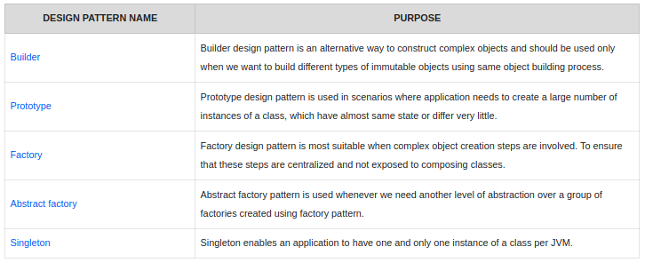

Design patterns - Solutions to some prominent & frequent problems, one faces while designing softwares.
  - "Evolved" not "Discovered".
  - Provides guidelines for solving a particular problem in particular way in some particular context. No strictness on implementation.
  - Using DPs, code becomes more flexible, reusable and maintainable.
  - Gang of Four (GoF) Design Patterns - standard 23 DPs.


3 different kinds of design patterns are there:
  - <ins>Creational Patterns</ins> : Deals with object creation.
  - <ins>Structural Patterns</ins> : Deals with the composition of objects & classes.
  - <ins>Behavioral Patterns</ins> : Focuses on interactions between objects.

Also a 4th category: <ins>J2EE Patterns</ins> which specifically deals with presentation tier.

## Creational Patterns



#### Singleton Pattern

This pattern puts restrictions on the instantiation of classes & ensures that only 1 instance of the class is available in the JVM at any point of time.
  - Used for logging, thread pools, driver objects and caching.
  - Used in core java classes like `java.lang.RunTime` etc.

Concepts:
  - Private constructor for restricting the object creation from outside class.
  - The only single instance of the class is a private static variable.
  - Public static method for exposing this only single instance to the outside world.


  ```java
public class Singleton {

    private static Singleton instance;
    private Singleton(){}

    public static Singleton getInstance(){
        if(instance == null){
            instance = new Singleton();
        }
        return instance;
    }
}
  ```

But, this approach fails for multi-threading environment. There are chances that 2 or more threads will create & get the different instances of the same singleton class.

```java
public class ThreadSafeSingleton {

    private static ThreadSafeSingleton instance;
    private ThreadSafeSingleton(){}

    public static synchronized ThreadSafeSingleton getInstance(){
        if(instance == null){
            instance = new ThreadSafeSingleton();
        }
        return instance;
    }
}
```  

#### Factory Pattern

Native approach for object creation is usage of constructors, but factory pattern provides alternative way for this.

- Used when for a superclass -> multiple sub-classes are there and based on some business logic, one of the sub-class is returned.
- This pattern takes out the responsibility of instantiation from the client program to the factory class.


- Used when the exact types and dependencies of the objects your code should work with is not known beforehand.
- Factory pattern makes our code more robust, less coupled and easy to extend

Concepts:
- Factory class for creation of object of desired type based on the business logic.

Real-life example is a Logistic App, initially, a single transport mechanism was of land so Trucks were used & all logistics function were dependent on Truck class but later on while addition of sea & air transport, this poses problems in scaling the app.

`Button.java`
```java
public interface Button {
    void render();
}
```

`WindowsButton.java`
```java
public class WindowsButton implements Button {
    @Override
    public void render() {}
}
```

`HtmlButton.java`
```java
public class HtmlButton implements Button {
    @Override
    public void render() {}
}
```

`ButtonFactory.java` : Factory class
```java
public class ButtonFactory {
    public Button getButton() {
      if (System.getProperty("usage.property").equals("browser"))
          return new HtmlButton();
      else
          return new WindowsButton();
    }
}
```

`Runner.java`
```java
public class Runner {
    public static void main(String[] args) {
        ButtonFactory buttonFactory = new ButtonFactory();
        Button button = buttonFactory.getButton();
        button.render();
    }
}
```

#### Abstract Factory Pattern

This is another layer of abstraction over the Factory pattern.
- AbstractFactory returns the Factory of classes, each of these factory will return one of the sub-classes.
- This is basically Factory pattern applied over the Factory pattern implementation.

Real life example is: Honda builds SportsCar & LuxuryCar for 2 locations: USA & India. Based on location, Cars specification varies for all 2 subclasses of car like steering wheel side.
Here AbstractFactory comes to our rescue.

`Car.java`
```java
public abstract class Car {
    private CarType model = null;
    private Location location = null;

    public Car(CarType model, Location location){
      this.model = model;
      this.location = location;
    }
    //getters and setters

    protected abstract void construct();
}
```

`SportCar.java`
```java
public class SportCar extends Car {
  public SportCar(Location location) {
    super(CarType.SPORTS, location);
    construct();
  }

  @Override
  protected void construct() {
    System.out.println("Building Sports car");
    //add accessories
  }
}
```

`LuxuryCar.java`
```java
public class LuxuryCar extends Car {
  public LuxuryCar(Location location) {
    super(CarType.LUXURY, location);
    construct();
  }

  @Override
  protected void construct() {
    System.out.println("Building Luxury car");
    //add accessories
  }
}
```

`Location.java`
```java
public enum Location {
  USA, ASIA
}
```

`CarType.java`
```java
public enum CarType {
  SPORTS, LUXURY
}
```

`CarFactory.java`
```java
public class CarFactory {
    private CarFactory() {}

    public static Car buildCar(CarType type) {
        Car car = null;
        Location location = System.getProperty("location.info");

        switch(location) {
          case USA: car = USACarFactory.buildCar(type); break;
          case ASIA: car = AsiaCarFactory.buildCar(type); break;
        }
        return car;
    }
}
```

`USACarFactory.java`
```java
public class USACarFactory {
    public static Car buildCar(CarType model) {
        Car car = null;
        switch (model) {
          case SPORTS: car = new SportCar(Location.USA); break;
          case LUXURY: car = new LuxuryCar(Location.USA); break;
        }
        return car;
    }
}
```

`AsiaCarFactory.java`
```java
public class USACarFactory {
  public static Car buildCar(CarType model) {
    Car car = null;
    switch (model) {
      case SPORTS: car = new SportCar(Location.ASIA); break;
      case LUXURY: car = new LuxuryCar(Location.ASIA); break;
      default:
    }
    return car;
  }
}
```

`Runner.java`
```java
public class Runner
{
  public static void main(String[] args)
  {
    CarFactory.buildCar(CarType.SPORTS);
    CarFactory.buildCar(CarType.LUXURY);
  }
}
```

#### Builder Pattern

This pattern helps in constructing complex objects in a step-by-step manner & the final step returns the object.

- Objects are having lot many attributes & having separate constructors for invoking these attributes for object creation is really cumbersome.
- StringBuilder & StringBuffer in java uses Builder DP.


Concepts
- Builder class is a static nested class inside the main object class.
- Builder class must have a public parameterized constructor with all mandatory data members.
- Builder class should have setters for all optional data members & should return Builder object.
- build() method is required which returns the final object to the runner.

`Mobile.java`
```java
public class Mobile {
  private String RAM;
  private String Size;
  private String Camera;
  boolean is4GEnabled;

  // GETTERS for these 5 private members

  private Mobile(MobileBuilder builder) {
    this.RAM = builder.RAM;
    this.Size = builder.Size;
    this.Camera = builder.Camera;
    this.is4GEnabled = builder.is4GEnabled;
  }

  public static class MobileBuilder {
    private String RAM;
    private String Size;
    private String Camera;
    boolean is4GEnabled;

    public MobileBuilder(String RAM, String Size) {
      this.RAM = RAM; this.Size = Size;
    }

    public MobileBuilder setCamera(String Camera) {
      this.Camera = Camera;
      return this;
    }

    public MobileBuilder setIs4GEnabled(boolean is4GEnabled) {
      this.is4GEnabled = is4GEnabled;
      return this;
    }

    public Mobile build() {
      return new Mobile(this);
    }
  }
}
```

`Runner.java`
```java
public class Runner {
    public static void main(String[] args) {
        Mobile mobile1 = new Mobile.MobileBuilder("4 GB", "6 inch").setCamera("12px").setIs4GEnabled(true).build();
        Mobile mobile2 = new Mobile.MobileBuilder("2 GB", "4.2 inch").setIs4GEnabled(false).build();
	}
}
```

#### Prototype Pattern

Prototype is a template of the actual object to be constructed later. In java, Prototyping means cloning or replicating an object.

- Whether deep copy or shallow copy, depends totally on the business needs.
- Useful when large number of instances of classes are required, which are all nearly same.
- This DP also supplements cases when we require exact copies of existing objects but don't want to be dependent on their classes.

If the cost of object creation is large & creation process is resource-intensive, we use cloning.

**Issues with normal approach**
If we have to exactly copy an existing object natively, we create a new object of the same class, traverse all fields of existing object & copy values to the new object. Here, catch is that maybe some fields are private & couldn't be accessed/copied.

Concepts
- An interface/class implementing Cloneable having abstract clone() method declared.
- Prototype registry for holding the prominent prototypes available to us.
- Separate Prototype models which inherits the base interface & implements clone() method in them.

`SolrCore.java `
```java
public interface SolrCore extends Cloneable {
    public SolrCore clone() throws CloneNotSupportedException;
}
```

`Intent.java `
```java
public class Intent implements SolrCore {
    private String name = null;

    @Override
    public Intent clone() throws CloneNotSupportedException {
        return (Intent) super.clone();
    }
}
```

`Mapping.java`
```java
public class Mapping implements SolrCore {
    private String name = null;

    @Override
    public Mapping clone() throws CloneNotSupportedException {
        return (Mapping) super.clone();
    }
}
```

`Mcat.java`
```java
public class Mcat implements SolrCore {
    private String name = null;

    @Override
    public Mcat clone() throws CloneNotSupportedException {
        return (Mcat) super.clone();
    }
}
```

`CoreDirectory.java`
```java
public class CoreDirectory {
    public static class CoreName {
        public static final String INTENT = "intent";
        public static final String MCAT = "mcat";
        public static final String MAPPING = "mapping";
    }

    private static java.util.Map<String , SolrCore> cores = new java.util.HashMap<>();

    static {
        cores.put(CoreName.INTENT, new Intent());
        cores.put(CoreName.MCAT, new Mcat());
        cores.put(CoreName.MAPPING, new Mapping());
    }

    public static SolrCore getInstance(final String s) throws CloneNotSupportedException {
        return ((SolrCore) cores.get(s)).clone();
    }
}
```

`Runner.java`
```java
public class Runner {
    public static void main(String[] args) {
        try {
            String mappingCore1  = SolrCore.getInstance(CoreName.MAPPING).toString();
            String intentCore1  = SolrCore.getInstance(CoreName.INTENT).toString();
            String mappingCore2  = SolrCore.getInstance(CoreName.MAPPING).toString();
        }
        catch (CloneNotSupportedException e) {
            e.printStackTrace();
        }
    }
}
```
---


## Structural Patterns

#### Adapter

#### Bridge

#### Composite

#### Decorator

#### Facade

#### Flyweight

#### Proxy

---

## Behavioral Patterns

#### Chain of responsibility

#### Command

#### Interpreter

#### Iterator

#### Mediator

#### Memento

#### Observer

#### State

#### Strategy

#### Template method

#### Visitor

[How to do in java](https://howtodoinjava.com/gang-of-four-java-design-patterns/)
[Journal Dev](https://www.journaldev.com/1827/java-design-patterns-example-tutorial)
[Refactoring Guru](https://refactoring.guru/design-patterns/java)

---

## Miscellaneous Design Patterns

#### DAO Design Pattern

#### Dependency Injection Pattern

#### MVC Pattern
