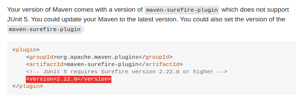

Testing is the process of checking an application functionalities. Unit testing is done on developer's end.

### Terminologies

1. <ins>**Test fixture**</ins>
  - Set of objects which are used as a baseline for running tests.
  - Also called as test precondition.
  - For eg, a test fixture = fixed string, which is used as input for a method. The test would validate if the method behaves correctly with this input.


2. <ins>**Unit testing**</ins>
  - Unit test - piece of code that executes a specific functionality in the codebase and asserts a certain behavior or state.
  - Test coverage - percentage of code which is tested by unit tests
  - Targets a small unit of code, e.g., a method or a class only.
  - For unit testing code having external dependencies, either use mock objects or mocking frameworks like Mockito.


3. <ins>**Integration testing**</ins>
  - Aims to test the behavior of a component or the integration between a set of components.
  - Also called as functional testing.
  - Checks that the whole system works as intended overall.


4. <ins>**Performance testing**</ins>
  - Used to benchmark software components repeatedly.
  - Also called as load testing.
  - Purpose is to ensure that the code under test runs fast enough even if it’s under high load


5. <ins>**Calibration testing**</ins>
  - Not an industry conventions, but quite useful for consumer-centric services.
  - Results need to be calibrated before & after dev-changes for confirming go-to-live decision.
  - For Eg, used heavily in applications like search, recommendations etc.


6. <ins>**Standard conventions**</ins>
  - src/main/java - for Java classes
  - src/test/java - for test classes
  - Popular testing frameworks are JUnit and TestNG.
  - use the "Test" suffix at the end/start of test classes names. (Junit)
  - a test name should explain what the test does.

||Manual testing|Automation testing|
|---|---|---|
|Executing test cases|completely manual or script|using an automation tool|
||Time-consuming and tedious|fast and simple once setted|
|Investment in HR|Huge|Minimal|
|Reliability|less, has chances of human errors|More & are precise|


## JUnit

JUnit is a unit testing framework for Java programming language.
  - JUnit is important in the test-driven development with Java.
  - JUnit 5 is the existing version.
  - `JUnit 5 = JUnit Platform + JUnit Jupiter + JUnit Vintage`
    - JUnit Platform: Integrating JUnit with mvn plugins & build tools.
    - JUnit Jupiter: Writing tests & test runners
    - JUnit Vintage: Providing backward compaitibity for running tests written in JUnit4 using JUnit5.

<ins>**Initialisation**</ins>

`pom.xml`

```bash
<dependencies>
    <dependency>
        <groupId>org.junit.jupiter</groupId>
        <artifactId>junit-jupiter-engine</artifactId>
        <version>5.5.2</version>
        <scope>test</scope>
    </dependency>
    <dependency>
        <groupId>org.junit.platform</groupId>
        <artifactId>junit-platform-runner</artifactId>
        <version>1.5.2</version>
        <scope>test</scope>
    </dependency>
</dependencies>
```

`build.gradle`

```bash
testRuntime("org.junit.jupiter:junit-jupiter-engine:5.5.2")
testRuntime("org.junit.platform:junit-platform-runner:1.5.2")
```

#### Important Annotations

- **@Test** : Marks the method as a junit test

- **@DisplayName** : Provides custom name for a test

- **@BeforeAll** :
  - Makes the method to run at the very start, before all the test methods in that test class.
  - This method must be static.
  - Used for declaring objects, creating connections etc.

- **@BeforeEach** :
  - Makes the method to run before each test method in that test class.
  - Used for initialising objects, setting states etc.

- **@AfterEach**
  - Makes the method to run after each test method in that test class.
  - Used for reinitialising objects, clearing states etc.

- **@AfterAll**
  - Makes the method to run at the very end, after all the test methods in that test class.
  - This method must be static.
  - Used for destroying objects, closing connections etc.

- **@Tag**
  - Used for marking the test methods or test classes with tags for test discovering and filtering
  - Eg: Tags can be "dev", "stg" or "prod", & different test suites can be configured for them.

- **@Disable**
  - Used to disable or ignore a test class or method from the test suite.

#### Important Terminologies

- **Test Suites**

- **Assertions**

- **Assumptions**

### Usage in Simple Projects

- Download the simple project which I used for this article using

  ```bash
  wget https://github.com/jaykay12/tech/assets/demos/junit-basic.zip
  ```

 Open it as a project in IntelliJ. Once loaded, right click on `pom.xml` file & run "Add as Maven project".

- `Calculator.java`

  ```java
  package tech.jaykay12;

  public class Calculator {
      public Integer adder(Integer a1, Integer a2) {
          return a1+a2;
      }

      public Integer adder(Integer a1, Integer a2, Integer a3) {
          return a1+a2+a3;
      }
  }
  ```

- `CalculatorTest.java`

  ```java
  package tech.jaykay12;

  import org.junit.jupiter.api.*;

  public class CalculatorTest {

      static Calculator calculator = null;

      @BeforeAll
      public static void initialiser(){
          calculator = new Calculator();
      }

      @Test
      public void Adder2Words(){
          Assertions.assertEquals(4, calculator.adder(2, 2));
      }

      @Test
      public void Adder3Words(){
          Assertions.assertEquals(0, calculator.adder(-1,2,-1));
      }

      @AfterAll
      public static void cleaner(){
          calculator = null;
      }
  }
  ```
- <ins>**Running from IntelliJ**</ins>:

  

- <ins>**Running from mvn command line tool**</ins>:

  ```bash
  jalaz@jalaz-personal:~/tdd-java/junit-basic$ mvn test
  [INFO] Scanning for projects...
  [INFO]
  [INFO] ---------------------< tech.jaykay12:junit-basic >----------------------
  [INFO] Building junit-basic 1.0-SNAPSHOT
  [INFO] --------------------------------[ jar ]---------------------------------
  [INFO]
  [INFO] --- maven-compiler-plugin:3.8.1:compile (default-compile) @ junit-basic ---
  [INFO] Nothing to compile - all classes are up to date
  [INFO]
  [INFO] --- maven-surefire-plugin:2.22.0:test (default-test) @ junit-basic ---
  [INFO]
  [INFO] -------------------------------------------------------
  [INFO]  T E S T S
  [INFO] -------------------------------------------------------
  [INFO] Running tech.jaykay12.CalculatorTest
  [INFO] Tests run: 2, Failures: 0, Errors: 0, Skipped: 0, Time elapsed: 0.068 s - in tech.jaykay12.CalculatorTest
  [INFO]
  [INFO] Results:
  [INFO]
  [INFO] Tests run: 2, Failures: 0, Errors: 0, Skipped: 0
  [INFO]
  [INFO] ------------------------------------------------------------------------
  [INFO] BUILD SUCCESS
  [INFO] ------------------------------------------------------------------------
  [INFO] Total time:  3.537 s
  [INFO] Finished at: 2020-10-15T19:08:39+05:30
  [INFO] ------------------------------------------------------------------------
  ```

- `Important Points`
  - Configure pom.xml file correctly.

  - Keep the directory structure of _src/main/java/<PACKAGE_NAME>_ & _src/test/java/<PACKAGE_NAME>_ in sync.

  - If using JUnit5 overall & want to run tests using both methods, then add this to pom.xml
  


### Usage in Spring-Boot APIs

#### JUnit vs TestNG

||JUnit|TestNG|
|---|---|---|
||||
||||
||||

## Mockito

### Simple Usage

### Usage in Spring-Boot API & SolR
