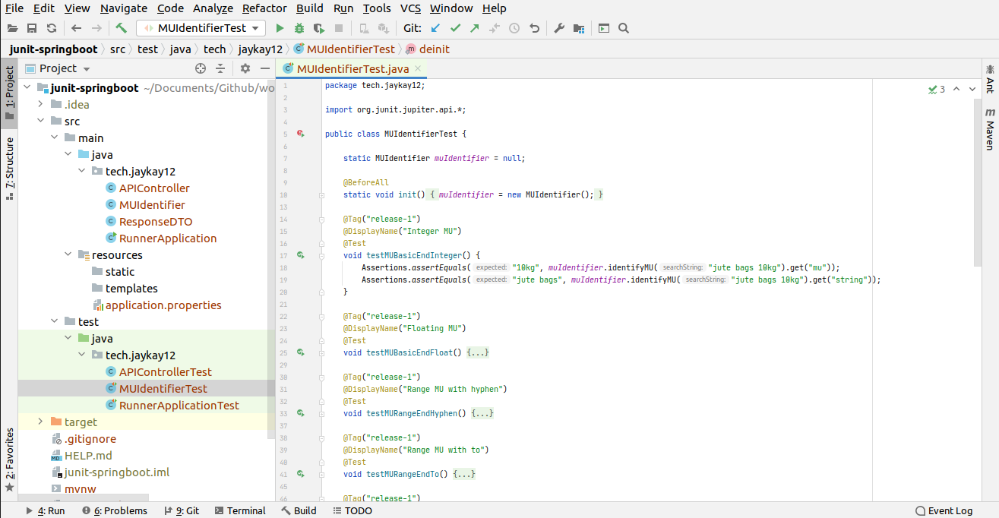
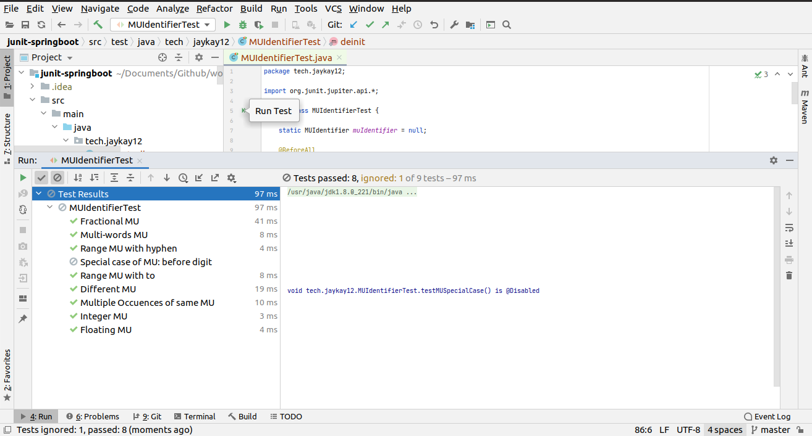
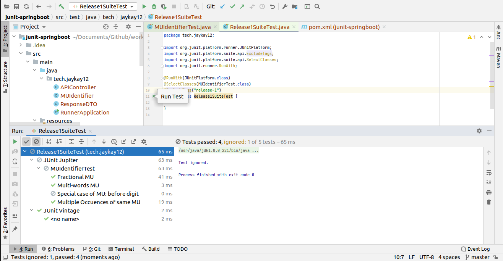
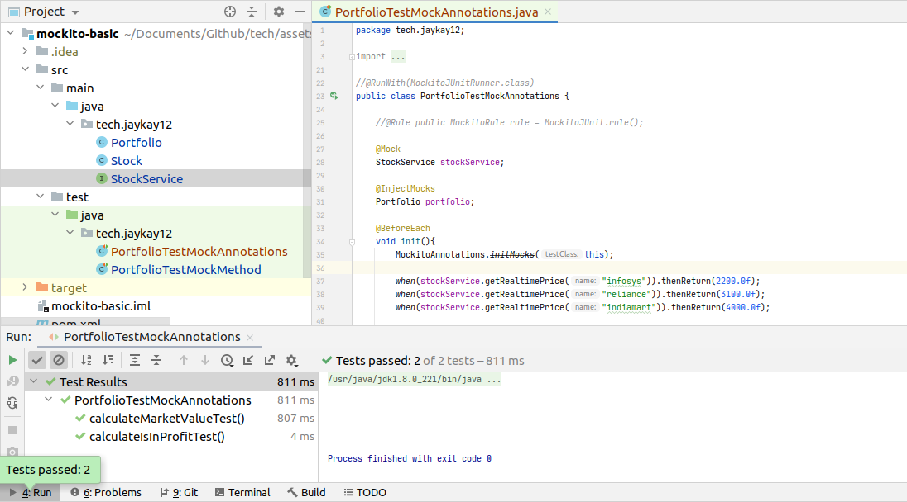
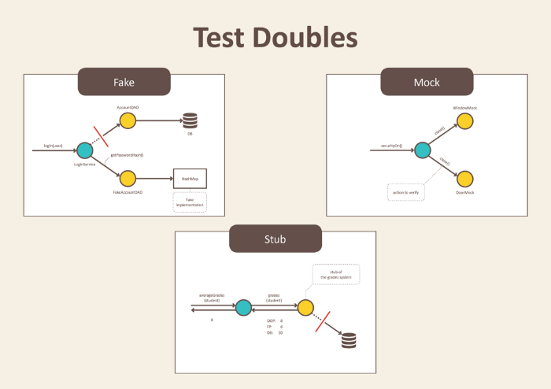

Testing is the process of checking an application functionalities. Unit testing is done on developer's end.

JUnit is used for state unit testing while Mockito is used for behaviour unit testing.
For sorting algorithm, state unit testing is best, as here results matters. For DB applications, beahviour unit testing is best.

### Terminologies

1. <ins>**Test fixture**</ins>
  - Set of objects which are used as a baseline for running tests.
  - Also called as test precondition.
  - For eg, a test fixture = fixed string, which is used as input for a method. The test would validate if the method behaves correctly with this input.


2. <ins>**Unit testing**</ins>
  - Unit test - piece of code that executes a specific functionality in the codebase and asserts a certain behavior or state.
  - Test coverage - percentage of code which is tested by unit tests
  - Targets a small unit of code, e.g., a method or a class only.
  - For unit testing code having external dependencies, either use mock objects or mocking frameworks like Mockito.


3. <ins>**Integration testing**</ins>
  - Aims to test the behavior of a component or the integration between a set of components.
  - Also called as functional testing.
  - Checks that the whole system works as intended overall.


4. <ins>**Performance testing**</ins>
  - Used to benchmark software components repeatedly.
  - Also called as load testing.
  - Purpose is to ensure that the code under test runs fast enough even if it’s under high load
  - Apache JMeter is used for load testing.


5. <ins>**Calibration testing**</ins>
  - Not an industry conventions, but quite useful for consumer-centric services.
  - Results need to be calibrated before & after dev-changes for confirming go-to-live decision.
  - For Eg, used heavily in applications like search, recommendations etc.


6. <ins>**Standard conventions**</ins>
  - src/main/java - for Java classes
  - src/test/java - for test classes
  - Popular testing frameworks are JUnit and TestNG.
  - use the "Test" suffix at the end/start of test classes names. (Junit)
  - a test name should explain what the test does.

||Manual testing|Automation testing|
|---|---|---|
|Executing test cases|completely manual or script|using an automation tool|
||Time-consuming and tedious|fast and simple once setted|
|Investment in HR|Huge|Minimal|
|Reliability|less, has chances of human errors|More & are precise|


## JUnit

JUnit is a unit testing framework for Java programming language.
  - JUnit is important in the test-driven development with Java.
  - JUnit 5 is the existing version.
  - `JUnit 5 = JUnit Platform + JUnit Jupiter + JUnit Vintage`
    - JUnit Platform: Integrating JUnit with mvn plugins & build tools.
    - JUnit Jupiter: Writing tests & test runners
    - JUnit Vintage: Providing backward compaitibity for running tests written in JUnit4 using JUnit5.


<ins>**Initialisation**</ins>

`pom.xml`

```bash
<dependencies>
    <dependency>
        <groupId>org.junit.jupiter</groupId>
        <artifactId>junit-jupiter-engine</artifactId>
        <version>5.5.2</version>
        <scope>test</scope>
    </dependency>
    <dependency>
        <groupId>org.junit.platform</groupId>
        <artifactId>junit-platform-runner</artifactId>
        <version>1.5.2</version>
        <scope>test</scope>
    </dependency>
</dependencies>
```

`build.gradle`

```bash
testRuntime("org.junit.jupiter:junit-jupiter-engine:5.5.2")
testRuntime("org.junit.platform:junit-platform-runner:1.5.2")
```

#### Important Annotations

- **@Test** : Marks the method as a junit test

- **@DisplayName** : Provides custom name for a test
  - Invoked as `@DisplayName("MU Cleaning: Fractions")`

- **@BeforeAll** :
  - Signals that the annotated method should be executed before all tests in the current test class.
  - This method must be static.
  - Replacement of `@BeforeClass` of JUnit4.
  - Used for declaring objects, creating connections etc.

- **@BeforeEach** :
  - Signals that the annotated method should be executed before each `@Test` method in the current class.
  - Replacement of `@Before` of JUnit4.
  - Used for initialising objects, setting states etc.

- **@AfterEach**
  - Makes the method to run after each test method in that test class.
  - Replacement of `@After` of JUnit4.
  - Used for reinitialising objects, clearing states etc.

- **@AfterAll**
  - Makes the method to run at the very end, after all the test methods in that test class.
  - This method must be static.
  - Replacement of `@AfterClass` of JUnit4.
  - Used for destroying objects, closing connections etc.

- **@RepeatedTest**
  - Enables multiple runs of the annotated test method.
  - Invoked as `@RepeatedTest(5)`

- **@Tag**
  - Used for marking the test methods or test classes with tags for test discovering and filtering
  - Eg: Tags can be "dev", "stg" or "prod", & different test suites can be configured for them.

- **@Disable**
  - Used to disable or ignore a test class or method from the test suite.
  - Equivalent to the `@Ignored` of JUnit4.

<ins>**JUnit5 Test Exceution Cycle**</ins>


#### Important Terminologies

- **Test Suites**
  - Required for running tests which are spread out in multiple classes or packages.
  - 2 annotations: `@SelectPackages` & `@SelectClasses` are used for creating test suites.
  - `@RunWith(JUnitPlatform.class)` is required for executing the test suite.
  - Other annotations like `@IncludePackages`, `@ExcludePackages`, `@IncludeClassNamePatterns`, `@ExcludeClassNamePatterns`, `@IncludeTags` & `@ExcludeTags` are used for filtering packages, test classes & test methods.

  ```java
  @RunWith(JUnitPlatform.class)
  @SelectPackages("search.mcat.service.logics")
  @SelectClasses(SearchStringCleaner.class, SearchStringTruncator.class)
  @ExcludePackages("search.mcat.service.logics.mcat")
  @IncludeClassNamePatterns("^VirtualMapping.*Test(s)?$")
  @ExcludeTags("production")
  public class TestSuiteExample {

  }
  ```

- **Assertions**
  - Required for validating the expected output with the actual output of a testcase.
  - For simplicity, all JUnit Jupiter assertions are static methods.

  ```java
  void testCase() {
      Assertions.assertEquals(4, Calculator.add(2, 2));                                     // Passed
      Assertions.assertNotEquals(4, Calculator.add(2, 2), "Adder Test");                    // Failed

      Assertions.assertArrayEquals(new int[]{1,2,3}, new int[]{1,2,3}, "Array Equal Test"); // Passed

      Assertions.assertNotNull(null);               // Failed
      Assertions.assertNotNull("Jalaz Kumar");      // Passed

      Assertions.assertTimeout(Duration.ofMillis(100), () -> {
          Thread.sleep(200);
          return "result";
      });                                                               // Failed. {timeout, executable task} are 2 the 2 parameters

      Assertions.fail("This is destined to fail");                      // Failed.
  }
  ```

- **Assumptions**
  - Required for supporting conditional test execution.
  - Failed assumption leads to the test being aborted.
  - In test report, these test will be marked as passed.
  - JUnit jupiter Assumptions class has two such static methods: `assumeFalse()` & `assumeTrue()`
  - Both validates the given assumption to {true/false}and if assumption is {true/false} – test proceed, otherwise test execution is aborted.

  ```java
  public class AssumptionsTest {
      @Test
      void testOnDev() {
          System.setProperty("ENV", "development");
          Assumptions.assumeTrue("development".equals(System.getProperty("env")));
          //remainder of test will proceed
      }

      @Test
      void testOnProd() {
          System.setProperty("ENV", "production");
          Assumptions.assumeTrue("development".equals(System.getProperty("ENV")));
          //remainder of test will be aborted
      }
  }
  ```

### Usage in Simple Projects

- Download the simple project which I used for this article using

  ```bash
  wget https://github.com/jaykay12/tech/blob/master/assets/demos/junit-springboot.zip
  ```

 Open it as a project in IntelliJ. Once loaded, right click on `pom.xml` file & run "Add as Maven project".

- `Calculator.java`

  ```java
  package tech.jaykay12;

  public class Calculator {
      public Integer adder(Integer a1, Integer a2) {
          return a1+a2;
      }

      public Integer adder(Integer a1, Integer a2, Integer a3) {
          return a1+a2+a3;
      }
  }
  ```

- `CalculatorTest.java`

  ```java
  package tech.jaykay12;

  import org.junit.jupiter.api.*;

  public class CalculatorTest {

      static Calculator calculator = null;

      @BeforeAll
      public static void initialiser(){
          calculator = new Calculator();
      }

      @Test
      public void Adder2Words(){
          Assertions.assertEquals(4, calculator.adder(2, 2));
      }

      @Test
      public void Adder3Words(){
          Assertions.assertEquals(0, calculator.adder(-1,2,-1));
      }

      @AfterAll
      public static void cleaner(){
          calculator = null;
      }
  }
  ```
- <ins>**Running from IntelliJ**</ins>:

  

- <ins>**Running from mvn command line tool**</ins>:

  ```bash
  jalaz@jalaz-personal:~/tdd-java/junit-basic$ mvn test
  [INFO] Scanning for projects...
  [INFO]
  [INFO] ---------------------< tech.jaykay12:junit-basic >----------------------
  [INFO] Building junit-basic 1.0-SNAPSHOT
  [INFO] --------------------------------[ jar ]---------------------------------
  [INFO]
  [INFO] --- maven-compiler-plugin:3.8.1:compile (default-compile) @ junit-basic ---
  [INFO] Nothing to compile - all classes are up to date
  [INFO]
  [INFO] --- maven-surefire-plugin:2.22.0:test (default-test) @ junit-basic ---
  [INFO]
  [INFO] -------------------------------------------------------
  [INFO]  T E S T S
  [INFO] -------------------------------------------------------
  [INFO] Running tech.jaykay12.CalculatorTest
  [INFO] Tests run: 2, Failures: 0, Errors: 0, Skipped: 0, Time elapsed: 0.068 s - in tech.jaykay12.CalculatorTest
  [INFO]
  [INFO] Results:
  [INFO]
  [INFO] Tests run: 2, Failures: 0, Errors: 0, Skipped: 0
  [INFO]
  [INFO] ------------------------------------------------------------------------
  [INFO] BUILD SUCCESS
  [INFO] ------------------------------------------------------------------------
  [INFO] Total time:  3.537 s
  [INFO] Finished at: 2020-10-15T19:08:39+05:30
  [INFO] ------------------------------------------------------------------------
  ```

- `Important Points`
  - Configure pom.xml file correctly.

  - Keep the directory structure of `src/main/java/<PACKAGE_NAME>` & `src/test/java/<PACKAGE_NAME>` in sync.

  - If using JUnit5 overall & want to run tests using both methods, then add this to pom.xml

  


### Usage in Spring-Boot APIs

- Download the Spring Boot API which I used for this article using

  ```bash
  wget https://github.com/jaykay12/tech/blob/master/assets/demos/junit-springboot.zip
  ```

 Open it as a project in IntelliJ. Once loaded, right click on `pom.xml` file & run "Add as Maven project".

- The main content files of the API are as follows:
  - **RunnerApplication.java**: Main file which instantiates the Spring boot application and loads controllers.

  - **APIController.java**: file which maps the requests(get/post)

  - **MUIdentifier.java**: main logic file which identifies MUs from the keyword

  - **MUIdentifierTest.java**: main test file which contains unit tests for the logic written in MUIdentifier

  

- For initiating test-driven development in spring boot application, add this to the `pom.xml` file.

  ```bash
  <dependency>
      <groupId>org.springframework.boot</groupId>
      <artifactId>spring-boot-starter-test</artifactId>
      <scope>test</scope>
  </dependency>
  ```

- Run the unit tests

  

- Now, Test Suites is basically a way for clubbing various tests filtered on the basis of packages, tags and classes. JUnit5 as of now, doesn't support Test Suites, so JUnitPlatform which is part of JUnit4 is used for running the Test Suites.

  Add this to the `pom.xml` for performing TDD using Test Suites

  ```bash
  <dependency>
      <groupId>org.junit.platform</groupId>
      <artifactId>junit-platform-runner</artifactId>
      <version>1.0.3</version>
      <scope>test</scope>
  </dependency>
  <dependency>
      <groupId>org.junit.platform</groupId>
      <artifactId>junit-platform-launcher</artifactId>
      <version>1.0.3</version>
      <scope>test</scope>
  </dependency>

  ```

- Run the Test Suites

  


## Mockito


Mockito is a mocking framework for Java Programming language.
  - Used to provide data for the JUnit tests.
  - Mockito enables writing tests using the mocking approach instead of the traditional approach of creating the "test doubles" manually.
  - Uses Java Reflection for creating mock objects for a given interface.

**Mocking**
  - Used for testing the functionality of class in isolation.
  - No need of setting up database connection or file io is required.
  - Using Mock objects, we mock the real service. The mock object returns dummy data for some dummy input in the same manner as real service would have provided.

### Simple Usage

- Download the simple project which I used for this article using

  ```bash
  wget https://github.com/jaykay12/tech/blob/master/assets/demos/mockito-springboot.zip
  ```

 Open it as a project in IntelliJ. Once loaded, right click on `pom.xml` file & run "Add as Maven project".

<ins>**Initialisation**</ins>

Add this to your `pom.xml` file.

```bash
<dependencies>
    <dependency>
        <groupId>org.mockito</groupId>
        <artifactId>mockito-core</artifactId>
        <version>3.5.13</version>
    </dependency>
</dependencies>
```

- `Stock.java`

  ```java
  package tech.jaykay12;

  public class Stock {
      private String name;
      private int quantity;

      public Stock(String name, int quantity) {
          this.name = name;
          this.quantity = quantity;
      }

      public String getName() { return name; }

      public float getQuantity() { return quantity; }
  }
  ```

- `Portfolio.java`

  ```java
  package tech.jaykay12;

  import java.util.List;

  public class Portfolio {
      private List<Stock> stocks;
      private StockService stockService;
      private Float portfolioValue;

      public Portfolio(List<Stock> stocks, Float portfolioValue) {
          this.stocks = stocks;
          this.portfolioValue = portfolioValue;
      }

      public void setStockService(StockService stockService) { this.stockService = stockService; }

      public Float calculateMarketValue() {
          Float marketValue = 0.0f;
          for(Stock stock: this.stocks) {
              marketValue += (stock.getQuantity()*stockService.getRealtimePrice(stock.getName()));
          }
          return marketValue;
      }

      public Boolean isInProfit() {
          return (portfolioValue<calculateMarketValue()?true:false);
      }

  }
  ```

- `StockService.java`

  ```java
  package tech.jaykay12;

  public interface StockService {
      public float getRealtimePrice(String name);
  }
  ```

- `PortfolioTest.java`

  ```java
  //@RunWith(MockitoJUnitRunner.class)
  public class PortfolioTestMockAnnotations {

      //@Rule public MockitoRule rule = MockitoJUnit.rule();

      @Mock
      StockService stockService;

      @InjectMocks
      Portfolio portfolio;

      @BeforeEach
      void init(){
          MockitoAnnotations.initMocks(this);

          when(stockService.getRealtimePrice("infosys")).thenReturn(2200.0f);
          when(stockService.getRealtimePrice("reliance")).thenReturn(3100.0f);
          when(stockService.getRealtimePrice("indiamart")).thenReturn(4000.0f);

          List<Stock> stocks = new ArrayList<>();
          stocks.add(new Stock("infosys",10));
          stocks.add(new Stock("reliance", 5));
          portfolio = new Portfolio(stocks, 35000.0f);
          portfolio.setStockService(stockService);
      }

      @Test
      public void calculateMarketValueTest() {
          Assertions.assertEquals(portfolio.calculateMarketValue(),37500);
      }

      @Test
      public void calculateIsInProfitTest() {
          Assertions.assertTrue(portfolio.isInProfit());
      }
  }
  ```

  Here, for @RunWith & @Rules, NPE was thrown, but tests ran smoothly with initMocks().
  Question has been logged in [StackOverflow](https://stackoverflow.com/questions/64469561/not-able-to-use-rule-runwith-annotation-but-the-deprecated-initmocks-work) for the same.

- 


#### Important Concepts of Mockito

<ins>**Fakes, Stubs, Mocks & Spys**</ins>

- For automated testing, we use objects that look and behave like their production equivalent, but are actually simplified. They are necessary for executing self validating & isolated tests. These objects are called `TestDoubles`.

- Really good blog post for this concept: https://blog.pragmatists.com/test-doubles-fakes-mocks-and-stubs-1a7491dfa3da



- `Fakes`
  - Have working implementations, but not same as production one.
  - Usually take some shortcut for getting simplified functionality of the production.
  - Example: Using HashMap for testing features of Login APIs instead of production DBs.
  - Process of creating fakes is Faking.

- `Stubs`
  - Holds predefined data and uses it to answer calls during tests.
  - Used when objects that would answer with real data couldn't be involved.
  - Example: Testing business logic in Search APIs using stubbed Apache Solr response documents.
  - Process of creating stubs is Stubbing.
  - Mainly used for performing state verification.

- `Mocks`
  - They register calls they receive.
  - In test assertion we can verify on Mocks that all expected actions were performed.
  - Example: Testing the functionalities of Portfolio by mocking the actual service of providing Real-time stock prices in similar manner as any Real-time API.
  - Process of creating & using mocks is called Mocking.
  - Main function of using mocks is that it gives full control over the behavior of the mocked objects. The mock objects are generally used for behavior verification.
  - Used for testing a large suite of tests where stubs are not sufficient. One of the essential functions of mock is, we can verify how many times a given method is called.

- `Spies`
  - Are partially mock objects.
  - In spying, partial object or a half dummy of the real object is created by stubbing the real ones.
  - Are useful when we have a huge class full of methods, and we want to mock certain methods.

<ins>**Important methods of mockito**</ins>  

- when()
  - Used for state testing
  - Enables stubbing methods
  - Pattern is like `when(mock.someCode ()).thenReturn(5);`

- verify()
  - Used for behaviour Testing
  - Used to check whether some specified methods are called or not.
  - Also used to test the number of invocations of any particular method.

[Excellent blog posts](https://www.javatpoint.com/methods-of-mockito)
