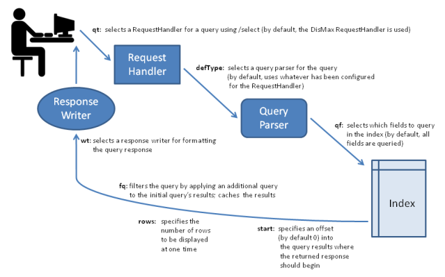
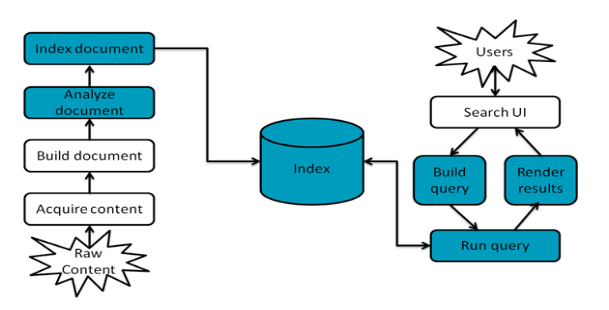

## Searching in Solr

- For searching anything on solr, userquery is processed by a `RequestHandler`. It handles all the incoming requests on solr like search requests, health check requests, index replication requests etc. For searching, default /select request handler is used.

- For further processing of query, `QueryParser` is invoked by the RequestHandler, which interprets the terms and parameters of query.

  QueryParsers are extended from the class: QParserPlugin. For creating custom query parser, this class needs to be extended.

  3 main query parsers in solr:
  - **Standard Query Parser**
    - Default one
    - Also called Lucene Query Parser
    - Allows greater precision in search

  - **DisMax Query Parser**
    - More tolerant to syntax errors
    - Provides similar experience as normal seach engines like google.

  - **EDisMax Query Parser**
    - Extended DisMax.
    - Improved version of DisMax.
    - Handles full lucene query syntax while still tolerating syntax errors.

  Input to Query Parsers comprises of:
    1. Search strings for querying in index
    2. Parameters for fine tuning this search like boosting, query-fields, query-slopes, filter queries etc.
    3. Parameters for controlling the response presentation like fl, wt etc.


- While creating response using `ResponseWriter`, the results can be grouped using 2 techniques:
    1. Faceting
    2. Clustering





### Query Syntax and Parsing

#### Common Query Parameters

- <ins>**defType**</ins>
  - Selects the query parser that Solr should use to process q in the request
  - `http://localhost:8985/solr/mcat/select?q=jute%20bag&fl=name,id&defType=dismax`
  - By default, defType="lucene" is used.
  - `http://localhost:8985/solr/mcat/select?q=jute%20bag&fl=name,id`

- <ins>**sort**</ins>
  - Arranges search results in either ascending (asc) or descending (desc) order.
  - Can be used with either numerical or alphabetical content.
  - `http://localhost:8985/solr/mcat/select?q=bags&fl=name&wt=json&sort=total_prod_count asc`
  - By default, sort=desc is used.

- <ins>**start**</ins>
  - Specifies an offset into the result set of query and instructs solr to begin displaying results from this offset.
  - By default: start=0
  - `http://localhost:8985/solr/mcat/select?q=bags&fl=name&wt=json&start=100`
  - Motive is to be used effectively for paging.

- <ins>**rows**</ins>
  - Specifies the maximum number of documents that solr should return.
  - Use to paginate results from a query
  - By default: rows=10
  - `http://localhost:8985/solr/mcat/select?q=bags&fl=name&wt=json&rows=50`

- <ins>**fq**</ins>
  - FilterQuery parameter
  - Defines a query that can be used to restrict the superset of documents that can be returned, without influencing score.
  - Analogous to "WHERE" clause of SQL.
  - Service MCATs: `http://localhost:8985/solr/mcat/select?q=car%20wash&fl=name&wt=json&fq=type:S`
  - Product MCATs of a fixed SubCat: `http://localhost:8985/solr/mcat/select?q=car%20wash&fl=name&wt=json&fq=type:P&fq=catid:27`
  - Motive: Very useful for speeding up complex queries, since the queries specified with fq are cached independently apart from the main query.

- <ins>**fl**</ins>
  - FieldList parameter
  - Limits the fields included in the query response.
  - By default: fl=*
  - `http://localhost:8985/solr/mcat/select?q=bags&wt=json&fl=id,name,type`
  - Use aliasing of field names like `http://localhost:8985/solr/mcat/select?q=bags&wt=json&fl=id,name,products:total_prod_count`

- <ins>**debug**</ins>
  - debug=query, debug=timing, debug=all etc are various variations as per the usecase of debugging.
  - By default: debug=false; Not to include debugging information

- <ins>**timeAllowed**</ins>
  - specifies the amount of time, in milliseconds, allowed for a search to complete.
  - If this time expires, any partial results will be returned, but values such as numFound, facet counts, and result stats may not be overall accurate.
  - `http://localhost:8985/solr/mcat/select?q=bags&wt=json&fl=id,name&rows=10&timeAllowed=10`


- <ins>**omitHeader**</ins>
  - If set to true, header is excluded from the response which contains info about requests, like time_taken, numFound etc.
  - By default: omitHeader=true

- <ins>**wt**</ins>
  - Selects the Response Writer that solr should use for formatting the query’s response.
  - By default: wt=xml
  - `http://localhost:8985/solr/mcat/select?q=bags&fl=id,name,catid,catname,groupid,groupname&wt=json`
  - `http://localhost:8985/solr/mcat/select?q=bags&fl=id,name,catid,catname,groupid,groupname&wt=csv`

- <ins>**cache=false**</ins>
  - Used for disabling result caching at solr's end.

- <ins>**echoParams**</ins>
  - Controls the info about request parameters that should be included in the response header.
  - By default: echoParams=explicit
  - `http://localhost:8985/solr/mcat/select?q=bags&fl=id,name,score&wt=json&echoParams=all`
  - `http://localhost:8985/solr/mcat/select?q=bags&fl=id,name,score&wt=json&echoParams=none`

### Standard Query Parser
In addition to the Common Query Parameters, Faceting Parameters, Highlighting Parameters etc, it supports these parameters as well:

- <ins>**q**</ins>
  - Defines a query using standard query syntax(tight syntax, gives syntactic errors)
  - Mandatory parameter.

- <ins>**df**</ins>
  - DefaultField parameter
  - Defines the by default field, inwhich q should be searched against.
  - Overidden by qf(QueryField)

- <ins>**sow**</ins>
  - Split on whitespace
  - Seeting to false, very useful for analysis of words without splitting like multi-word synonyms, shingles etc.
  - By default: true, analysis is invoked on each space separated word.

Query sent to StandarQueryParser is composed of terms and operators. Terms are of 2 types:
  - single term such as q=lg, q=washing machine, q=lg washing machine : `Term Query`
  - search phrases such as q=\"lg washer\", q=\"washing machine\" : `Phrase Query`


In setting up q, we can specify fields as well. In Schema, df is defined, if no field is provided in q like q=jute bags then, it will be searched in df. But a query like q=title:jute bags will search this in the field: title.


Various term modifiers are used for further encouraging the result set:
  - `Wildcard searches`
    - Can only be applied to single terms, but not to search phrases
    - q=te?t will match test, text, teit etc.
    - q=tes* will match test, testing, tesla, tesseract etc.


  - `Fuzzy searches`
    - Used to discover terms that are similar to a specified term without necessarily being an exact match
    - q=roam~ will match terms like rome, roam, roams, foam, & foams.
    - q=roam~1 will only match terms like roams, foam as edit distance is fixed at 1.


  - `Proximity searches`
    - Looks for terms that are within a specific distance from one another.
    - Used with search phrases
    - q="redmi cover"~5 will match all documents having redmi and cover at atmost distance of 5.
    - The distance referred to here is the number of term movements needed to match the specified phrase.


  - `Range searches`
    - Matches documents whose values for the specified field or fields fall within the range
    - q=rating:[8 TO 10] will match all rating documents having ratings 8,9,10.
    - q=rating:{0 TO 6} will match all rating documents having ratings 1,2,3,4,5.


  - `Boosting in searches`
    - Lucene/Solr provides the relevance level of all matching documents based on the terms found in them.
    - The relevancy can be controlled by using boosting on the basis of terms/pharses.
    - q=jakarta^4 apache in term query, will boost scores of all documents having jakarta by 4 & make them more relevant.
    - q="Apache Solr"^4 "Apache Lucene" in phrase query, will boost scores of all documents having "Apache Solr" by 4, making them more relevant.


### DisMax Query Parser
Designed for processing simple phrases (without complex syntax) entered by users and searching for individual terms across several fields using different boosting.

- DisMax is quite similar to Google, as its having simple syntax & rarely throws errors.

- DisMax stands for Maximum Disjunction

- Standard Definition: _Query  which generates the union of documents produced by its subqueries, and that scores each document with the maximum score for that document as produced by any subquery, plus a tie breaking increment for any additional matching subqueries._

In addition to the common request parameter, highlighting parameters, and simple facet parameters, the DisMax query parser supports the following parameters:

- <ins>**q**</ins>
  - Defines the raw input strings for the query.
  - Same as the q of standard query parser.
  - Here, wildcard characters such as * are not supported.

- <ins>**q.alt**</ins>
  - Calls the standard query parser and defines query input strings, when the q parameter is not used.
  - Can be used for comparing scoring between lucene & dismax.

- <ins>**qf**</ins>
  - QueryField parameter
  - Specifies the fields in the index on which to perform the query.
  - If not provided, then by default: df becomes the qf.
  - `http://localhost:8985/solr/mcat/select?q=bags&fl=name&qf="name^2.3 altname genericshingle^0.4"` -> Matches all documents having bags but gives boost of 2.3 to documents having bags in name, no boost to documents having bags in their alt names & reduces the relevancy of documents having bags identified as generic shingle for them.
  - qf is basically used for selecting documents in result set from the complete index.
  - qf, qs affects the result set of a query

- <ins>**pf**</ins>
  - PhraseField parameter
  - Once the list of matching documents has been identified using the fq and qf parameters, Used to "boost" the score of those documents where terms of q appear in close proximity.
  - pf is basically ised for reodering the documents in the result set.
  - Synatx is same as that of qf
  - pf, ps  affects the scoring of documents in the result set


- <ins>**ps**</ins>
  - Phrase Slop parameter
  - Specifies the amount of "phrase slop" that should be applied to the queries specified by pf parameter.
  - Phrase slop is the number of positions we are allowed to move our tokens wrt to one another for matching the phrase specified in q parameter.

- <ins>**qs**</ins>
  - Query Phrase Slop parameter
  - Specifies the amount of slop permitted on phrase queries explicitly included in the user’s query string with the qf parameter


- <ins>**mm**</ins>
  - Minimum Should Match parameter
  - In q, we can specify our terms with 3 variations: By default, its optional term. + (mandatory term) & -(prohibited term). For optional term, mm is used.
  - Default, mm=100%, all optional terms should match.
  - q="white beaded embroidered jute bags"&mm=3, which will match all documents in which any 3 of these terms : {white, beaded, embroidered, jute, bags} are present.
  - mm=-2, will match all documents inwhich (total_num_terms-2) terms will be matching.
  - mm=75% & mm=-25% are also useful.
  - mm=2<80% 6<-3, means that for searchqueries with 1 & 2 terms, all are required. For searchqueries having terms: (3,4,5,6) 80% match is required. For greater than 6 terms, mm=-3 is the condition.

- <ins>**tie**</ins>
  - TieBreaker parameter
  - Specifies a float value [0.0-1.0] which is used as tie breaker in DisMax parsers.
  - By default: tie=0.0
  - When a term from "q" is matched against multiple "qf", a document will be having differing score for each of these qf matching. tie controls the affect of these subquery score on the final score of the query.
  - If tie=0.0 (disjunction max query): final score of document is the maximum subquery-score
  - If tie=1.0 (disjunction sum query): final score of document in the sum of subquery-scores. Pays no attention to maximum matching subquery.
  - Beneficial is to set tie close to 0.

- <ins>**bq**</ins>
  - Boost Query parameter
  - Specifies an query clause that will be added to the user’s main query to influence the score.
  - q=cheese&bq=date:[NOW/DAY-1YEAR TO NOW/DAY], will boost documents on the basis of recentness.
  - `http://localhost:8983/solr/techproducts/select?q=video&defType=edismax&qf=features^20.0+text^0.3&bq=cat:electronics^5.0`


### EDisMax Query Parser
An improved version of DisMax Query Parser.
In addition to all the listed parameters of DisMax query parser, also supports:
  - supports the lucene query parser syntax
  - supports queries with AND, NOT, OR, - or +.
  - improved proximity searches, boosting and stopword handling

EDisMax has the following parameters along with DisMax parameters:
- <ins>**sow**</ins>
  - Split on Whitespace parameter
  - By default: sow=true, analysis is carried out on individual space-separated terms
  - If sow=false, analysis is carried out on complete words, useful for multi-word synonyms.

- <ins>**mm.autoRelax**</ins>
  - Very useful for relaxing mm clause whenever stopwords are playing their role & results are hampered.
  - Cons is that precision of search results may be reduced.

#### Using Slop & pf, qf concepts

In DisMax & EDisMax, along with normal query used for matching documents, additional query is also there in the form of phrase search used for boosting the documents.
For Eg: suppose a query with following solr params:

```bash
q=jute bags
qf=productname^5 mcatname^10
pf=productname^50 mcatname^20
defType=dismax
```

Parsed solr query for matching results `qf`:
```bash
(+(productname:jute^5 OR mcatname:jute^10) AND (productname:bags^5 OR mcatname:bags^10))
```

Additional solr query for boosting results `pf`:
```bash
productname:"jute bags"^50 OR mcatname:"jute bags"^20
```

Any document in the index that has both the terms "jute" and "bags" will match; however if some of those documents have both of the terms as a phrase, it will score much higher because it’s more relevant.

`ps`: Adding a ps=3 with the query means that a slop of 3 is allowed for the phrase search. All documents having productname/mcatname: "jute term1 term2 term3 bags" will match the query and exist in the result set.

`qs`: For Query Slop, the concept is similar as ps, but its used when user hits query in the form of phrase search instead of term search. If q="Jalaz Choudhary" is queried with qs=1, then it will match all documents having title: "Jalaz Choudhary", "Jalaz Kumar Choudhary", "Jalaz Singh Choudhary", "Jalaz K. Choudhary".


    Apart from these 3 important query parsers, there are few others as well namely:
    - Boost query parsers
    - Complex phrase query parsers
    - Field query parsers
    - Function query parser
    - Lucene query parser
    - Learning to Rank query parser etc.

## Request Handlers & Search Components

  - `Request Handler` is a Solr plug-in which defines the logic that should be used for processing any request at Solr's end.

  - Is defined with a name and a class.

  - `http://localhost:8983/solr/gettingstarted/select?q=solr`
  This query is processed by the request handler with the name `/select`, which is the by default handler for query request in solr.

  - Solr supports a variety of request handlers. Some are designed for processing search queries, while others manage tasks such as index replication.

  - Mainly 4 types of RequestHandlers:
    - **QueryHandler**
      - Primary request handler, handles the search queries.
      - Have 4 sections: defaults, invariants, appends and components.

    - **UpdateRequestHandler** or **IndexHandler**
      - Process updates to the solr index.
      - `/update` - UpdateRequestHandler - Add, delete and update indexed documents

    - **ShardHandler**
      - Configured for searching across the shards of a cluster
      - Used only with distributed search.

    - **Implicit Handler**
      - Implicit -> As they need not be configured in solrconfig.xml explicitly.
      - Few notable ones are:
          1. /replication
          2. /config - SolrConfigHandler - Retrieve/modify Solr configuration.
          3. /admin/ping - PingRequestHandler - Health check.
          4. /admin/properties - PropertiesRequestHandler - Return JRE system properties.
          5. /schema - SchemaHandler - Retrieve/modify Solr schema.


<ins>**Defining a SearchHandler & its usage**</ins>

Search Handlers can be configured with three sets of Query Params:

- `defaults`
  - provides default values to parameters which are used when no value is provided to these parameters during querying.


- `appends`
  - provides param values which are used additionally to the values specified at request time (or as defaults)
  - These might be filter queries, or other query rules that should be added to each query.
  - No mechanism in Solr for overriding these additions at client end. (Use cautiously)


- `invariants`
  - provides param values that will be used in spite of any values provided at request time.
  - Used by Solr maintainer to lock down the options available to Solr clients.
  - Any params values specified here are used regardless of the "defaults", or the "appends" params.
  - Allows definition of parameters that cannot be overridden by a client.

```bash
<requestHandler name="/solrlearning" class="solr.SearchHandler">
    <lst name="invariants">
        <str name="facet">false</str>
    </lst>
    <lst name="defaults">
        <str name="rows">100</str>
        <str name="wt">json</str>
        <str name="df">namex</str>
  	 </lst>
  	<lst name="appends">
    		<str name="fl">id,name,score</str>
	 </lst>
</requestHandler>
```

- `http://localhost:8985/solr/mcat/solrlearning?q=bags`
- `http://localhost:8985/solr/mcat/select?qt=/solrlearning&q=bags`

<ins>**Different Usages**</ins>
- `http://localhost:8985/solr/mcat/select?qt=/solrlearning&q=bags` -> 100 documents in json response format will be retrieved using defaults. "bags" will be searched in namex & each document will be having id, name, score.

- `http://localhost:8985/solr/mcat/select?qt=/solrlearning&q=bags&rows=1000` -> 1000 documents are retrieved overridding the defaults value.

- `http://localhost:8985/solr/mcat/select?qt=/solrlearning&q=bags&fl=catname,groupname` -> 100 documents are retrieved with each document having id, name, score, catname, groupname.

- `http://localhost:8985/solr/mcat/solrlearning?q=bags&facet=true` -> No faceting will be performed due to role of invariants. These settings are done for restricting the usage in client end by the admins. Since, facet is heavy operation thus, in example it was taken as reference.

### Faceting in Solr

Faceting is the arrangement of search results into categories based on the indexed terms.
This is somewhat analogous to the GROUP BY of SQL.

- <ins>**facet**</ins>
  - If set to true, this parameter enables facet counts in the query response.
  - By default: facet=false

- <ins>**facet.query**</ins>
  - Allows to specify an arbitrary query in the Lucene default syntax to generate a clear facet count.
  - `http://localhost:8985/solr/mcat/select?q.alt=*:*&fl=name,id&wt=json&facet=true&facet.query=type:S` -> Provides facet counts for Service-type MCATs.

<ins>**Field Value Faceting**</ins>

- <ins>**facet.field**</ins>
  - Identifies a field that should be treated as a facet.
  - `http://localhost:8985/solr/mcat/select?q.alt=*:*&fl=name,id&wt=json&facet=true&facet.field=catid` -> Provides facet counts(mcats) for all 800 cats in IM.

- <ins>**facet.prefix**</ins>
  - Limits the terms on which to facet to those starting with the given string prefix.
  - `http://localhost:8985/solr/mcat/select?q.alt=*:*&fl=name,id&wt=json&facet=true&facet.field=catid&facet.prefix=8` -> Provides facet counts(mcats) for those cats in IM which start with 8, like "81", "801", "852" etc.

- <ins>**facet.contains**</ins>
  - Limits the terms on which to facet to those containing the given substring.
  - `http://localhost:8985/solr/mcat/select?q.alt=*:*&fl=name,id&wt=json&facet=true&facet.field=catid&facet.contains=45` -> Provides facet counts(mcats) for those cats in IM which contains 45 as substring, like "145", "452", "845" etc.

- <ins>**facet.sort**</ins>
  - Determines the ordering of the facet field constraints.
  - `http://localhost:8985/solr/mcat/select?q.alt=*:*&fl=name,id&wt=json&facet=true&facet.field=groupid&facet.sort=count` -> Provides facet counts(mcats) for the 53 groups in IM ordered by frequency.

- <ins>**facet.limit**</ins>
  - Specifies the maximum number of values that should be returned for the facet fields.
  - Used for getting top N facets.
  - `http://localhost:8985/solr/mcat/select?q.alt=*:*&fl=name,id&wt=json&facet=true&facet.field=groupid&facet.sort=count&facet.limit=10`
  - By default: facet.limit=100

- <ins>**facet.mincount**</ins>
  - Specifies the minimum counts required for a facet field to be included in the response.
  - By default: facet.mincount=0
  - `http://localhost:8985/solr/mcat/select?q.alt=*:*&fl=name,id&wt=json&facet=true&facet.field=groupid&facet.mincount=5000` -> Provides facet counts(mcats) for those group ids having atleast 5000 mcats under their umbrella.

<ins>**Range Faceting**</ins>

Can be applied on any date field or any numeric field that supports range queries.

- <ins>**facet.range**</ins>
  - Defines the field for which Solr should create range facets

- <ins>**facet.range.start**</ins>
  - Specifies the lower bound of the range.

- <ins>**facet.range.end**</ins>
  - Specifies the upper bound of the range.

- <ins>**facet.range.gap**</ins>
  - Signifies the span of each range expressed as a value.

`http://localhost:8985/solr/keyword-mapping/select?q.alt=*:*&fl=name,mcatname&wt=json&facet=true&facet.range=indexeddate&facet.range.start=NOW/DAY-30DAYS&facet.range.end=NOW/DAY&facet.range.gap=%2B1DAY` -> Provides mappings(product/buylead/virtual) indexed on the facet of indexing date.

<ins>**Pivot Faceting**</ins>

Pivoting is a summarization tool that lets you automatically sort, count, total or average data stored in a table. The results are typically displayed in a second table showing the summarized data

`http://localhost:8985/solr/mcat/select?q.alt=*:*&fl=name,id&wt=json&facet=true&facet.pivot=groupid,type` -> Provides faceting as pivoted first on the mcats count in group & then for each group further pivoted into service-type MCATs count or product-type MCATs count.


### Solr Clustering

- The clustering plugin automatically discovers groups from the documents in result set and assigns human-readable labels to these groups.

- Clustering groups these documents by the similarities discovered during searching, rather than when content is indexed.

- Clustering result lacks the neat hierarchical organization as faceting, but clustering can reveal unexpected commonalities between the documents.

- `Clustering algorithm` is the actual logic that discovers relationships among the documents and forms human-readable cluster labels. Major algorithms are:
  - LingoClusteringAlgorithm (open source)
  - STCClusteringAlgorithm (open source)
  - BisectingKMeansClusteringAlgorithm (open source)
  - Lingo3GClusteringAlgorithm (commercial)

Depending on these algorithms, clusters will vary for any fixed set of documents.

<ins>**QuickStart**</ins>

- Loading external jars for clustering enabling, make these entries in the `solrconfig.xml`

  ```bash
  <lib dir="${solr.install.dir:../../..}/contrib/clustering/lib/" regex=".*\.jar" />
  <lib dir="${solr.install.dir:../../..}/dist/" regex="solr-clustering-\d.*\.jar" />
  ```

- Register as a Search Component in the `solrconfig.xml`

  ```bash
  <searchComponent name="clustering_lingo" class="solr.clustering.ClusteringComponent">
      <lst name="engine">
          <str name="name">lingo</str>
          <str name="carrot.algorithm">org.carrot2.clustering.lingo.LingoClusteringAlgorithm</str>
        </lst>
  </searchComponent>
  ```

- Link this component to the Request Handler in the `solrconfig.xml`

  ```bash
  <requestHandler name="/solrlearning" class="solr.SearchHandler">
      <lst name="invariants">
          <str name="facet">false</str>
      </lst>
      <lst name="defaults">
          <bool name="clustering">true</bool>
          <bool name="clustering.results">true</bool>

          <!-- logical field to physical field mapping which clustering algo requires -->
          <str name="carrot.url"></str>
          <str name="carrot.title">name</str>
          <str name="carrot.snippet">description</str>

          <!-- normal parameters of the request handler inwhich clustering is enabled -->
          <str name="rows">100</str>
          <str name="wt">json</str>
          <str name="df">namex</str>
      </lst>
      <lst name="appends">
          <str name="fl">id,name,score</str>
      </lst>
      <!-- registering the search component in the request handler -->
      <arr name="last-components">
          <str>clustering_lingo</str>
      </arr>
  </requestHandler>
  ```

- <ins>**clustering**</ins>
  - When true, clustering component is enabled


- <ins>**clustering.engine**</ins>
  - Used for declaring the engine that should be used.
  - If not present, the first declared engine in the search component will become the default one.


- <ins>**clustering.results**</ins>
  - When true, the component will perform clustering of search results.


- <ins>**carrot.algorithm**</ins>
  - Used inside declaration of the clustering component.
  - Declares the algorithm class to be used for clustering.


- <ins>**carrot.produceSummary**</ins>
	- When true the clustering component will run a highlighter pass on the content of logical fields pointed to by carrot.title and carrot.snippet. Otherwise full content of those fields will be clustered.

`Clustering Component` clusters the "documents" consisting of logical parts which are mapped onto physical schema of data stored in solr.

- <ins>**carrot.title**</ins>
  - The field that should be mapped to the logical document’s title for computing clusters.
  - More weight is given to the title compared to the snippet.
  - This should contain noise-free & precise data.
  - Can be left blank if no clear title is available.


- <ins>**carrot.snippet**</ins>
  - The field that should be mapped to the logical document’s main content.
  - If this mapping points to very large content fields the performance of clustering may drop significantly.


- <ins>**carrot.url**</ins>
  - The field that should be mapped to the logical document’s content URL.


`Drawbacks of clustering`

- Increased cost of fetching a larger-than-usual number of search results (50, 100 or more documents),
- Additional computational cost of the clustering itself.
- For simple queries, the clustering time will usually dominate the fetch time. If the document content is very long the retrieval of stored content can become a bottleneck.

`Remedies`

- Feeding less content to the clustering algorithm by enabling carrot.produceSummary attribute,
- Clustering should be performed on selected fields (titles only) to make the input smaller,
- Using a faster algorithm (STC instead of Lingo, Lingo3G instead of STC),
- Tuning the performance attributes related directly to a specific algorithm.


### ReRanking & Learn to Rank
_Update pending_

#### Lucene workflow


### Lucene Score Calculation
_Update pending_
