## Feedforward Network

In simple feedforward networks, for some input & weights, predictions are made. The basic classification & prediction systems come under this domain as each output is independent of the previous or next output.

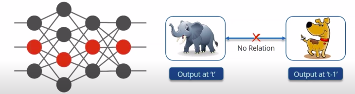

But there exists, various applications dealing with sequential data or time-series data like translation, image captioning, query correction where the current output is dependent on the previous output as well. This relation is also sometimes termed as context-specific for nlp applications.

Summing up these issues in feedforward networks:
- can't handle sequential data
- considers only the current input
- can't memorize previous outputs

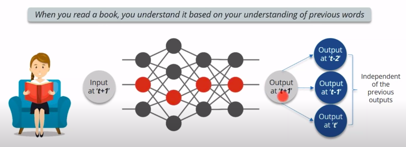

### Sequence Models

Basically, Deep learning solutions which tend to work upon sequence data are termed as Sequence Models.

Few examples of sequence data are:

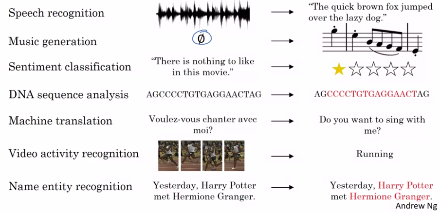

## Recurrent Neural Network (RNNs)

RNNs are specialised neural networks which are designed to handle time-series or sequential form of data. RNNs are basically feedforward networks with an internal state (memory).

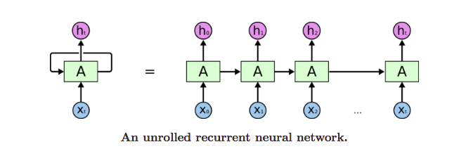

This memory allows the network to learn long-term dependencies in a sequence, means while making a prediction the entire context is taken into account for.

The general RNN architecture as presented here only works in forward direction and takes into account only the previous outputs before predicting the current output. Bi directional - RNNs are separate classes of RNNs which take previous as well as future outputs in consideration.

<ins>**Mathematical formulation**</ins>

Here,
- X is the input layer & Y is the output layer.
- X(t) is the input at time instance, t.
- W(i) is the weight associated with input layer, W(R) is the weight associated with recurrent layer, W(y) is the weight associated with output layer.
- b(h) & b(y) are the biases associated.

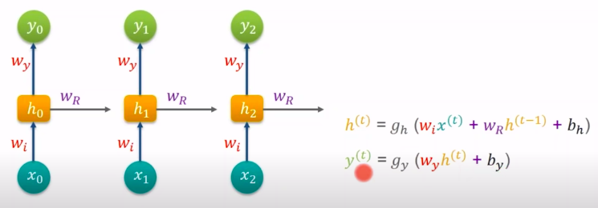

<ins>**Training**</ins>

RNNs uses the standard backpropagation algorithm, but it is applied on every time instance. Thus, it is also called BTT (Backpropagation Through Time)

The programming frameworks like Keras, Tensorflow implicitly takes care of the training phase & backpropagation algorithm.

In `Simple ANNs`, using feedforward mechanism, predicted outputs are computed. Since, here we are dealing with supervised learning so, error is calculated between the actual labels & predicted labels. This difference of error is called gradient & is propagated backwards for weights adjustment, thus called backpropagation training.

In case of `RNNs`, we are having sequence of inputs i.e time series data coming in a progressing time instant, thus this backward propagation of gradient is done for the preceding time instant & is called backpropagation through time.

<ins>**Types of RNNs**</ins>

Generally, the number of input, T(x) is equal to the number of output, T(y). But, this is not always the case.  Prominent RNN architectures are:
- Many to Many (Speech recognition, Language translation)
- Many to One (Sentiment analysis)
- One to Many (Music generation, Story generation)

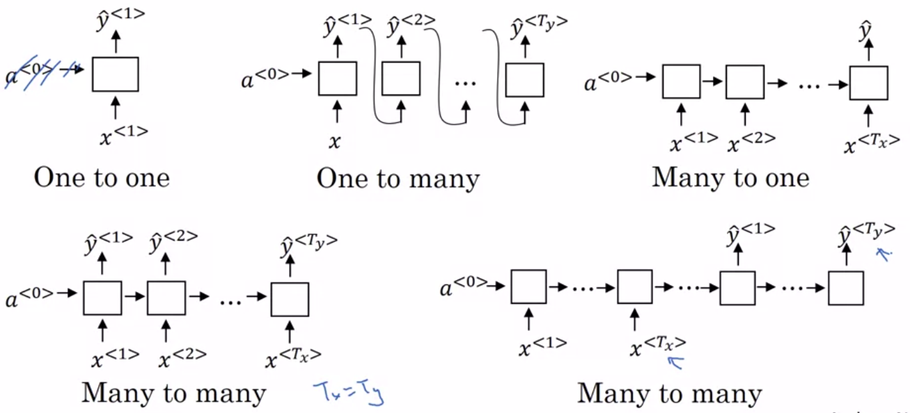

<ins>**Issues in RNNs**</ins>

There are 2 primary issues faced in RNNs:
- Vanishing Gradients
- Exploding Gradients

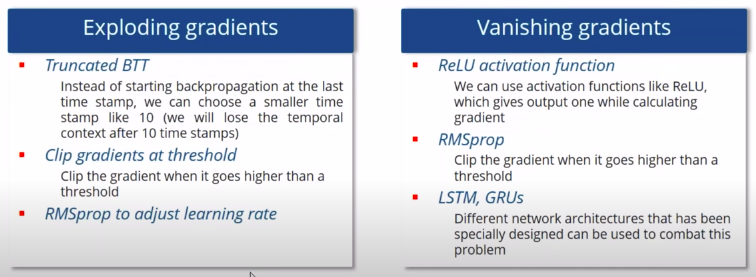

---

### Variations in RNNs

GRUs & LSTMs are 2 primary variations of vanilla RNNs, which solve the prominent issue of vanishing gradient caused due to short term memory of a RNN native cell.

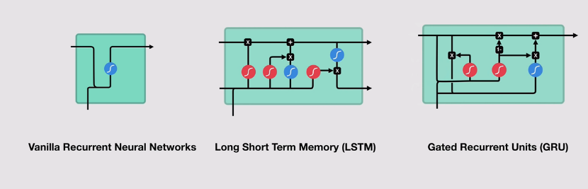

`Sigmoid` activation function basically maps any value to the range [0,1], thus acts as an filter.

`tanh` activation function basically maps any value to the range [-1,1], thus acts as a narrower. It never allows any input to get exploded, keeps it in a defined range.

[Great Video for learning about GRU & LSTM functioning](https://www.youtube.com/watch?v=8HyCNIVRbSU)
[Geat blog post for LSTM Understanding](http://colah.github.io/posts/2015-08-Understanding-LSTMs/)

### LSTM (Long-Short Term Memory)

Particular type of RNN with a mechanism to avoid the vanishing gradient problem and learn long-term dependencies along with the short-trem dependencies.

Core concepts of LSTM is the cell state & the gates.

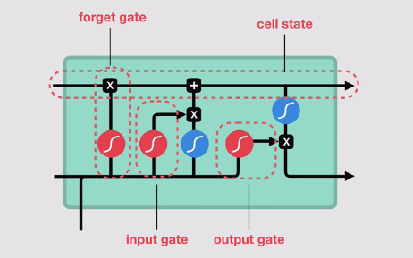

`Cell state` acts as the transport highway & propagates the relative information throughout the input sequence. So, this cell state acts as the memory of the cell & sustains information about the sequence & mitigates the short term memory issues of vanilla RNN.

`Gates` are used to add or remove the information to the cell state. Gates are actually ANNs which decides which information is relevant to keep or forget during the training phase. There are 3 major gates which regulate information flow in an LSTM cell:
- forget gate
- input gate
- output gate

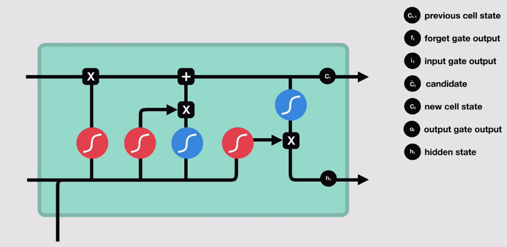

### GRU (Gated Relay Unit)

Newer generation of RNNs and is pretty similar to an LSTM. GRU's got rid of the cell state and used the hidden state to transfer information. It also only has two gates, a reset gate and update gate.

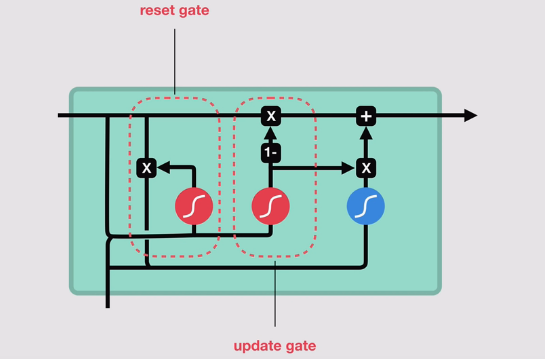

||GRU|LSTM|
|---|---|---|
|Training parameters|Less|More|
|Memory usage|Less|High|
|Execution & training|Faster|Slower|
|Accuracy on long sequences|Less|High|

If sequence is large or accuracy is very critical -> LSTM whereas for less memory consumption and faster operation -> GRU.

### BRNNs (Bi-directional RNNs)

### DRNNs (Deep RNNs)

<ins>**Practical LSTM**</ins>

https://coursera.com

https://towardsdatascience.com/recurrent-neural-networks-by-example-in-python-ffd204f99470

https://www.simplilearn.com/tutorials/deep-learning-tutorial/rnn
