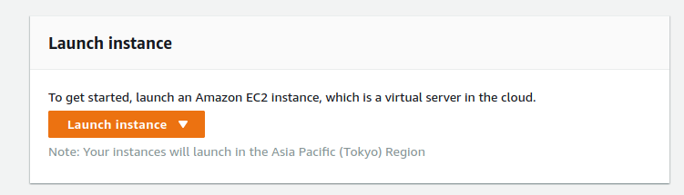
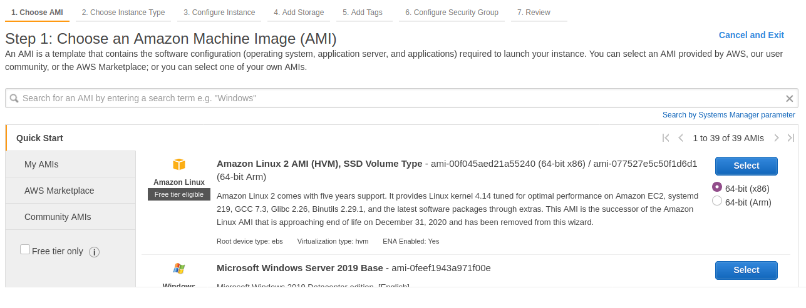
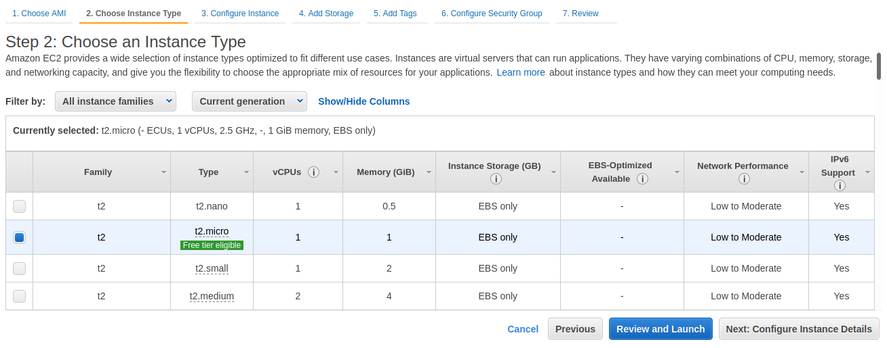
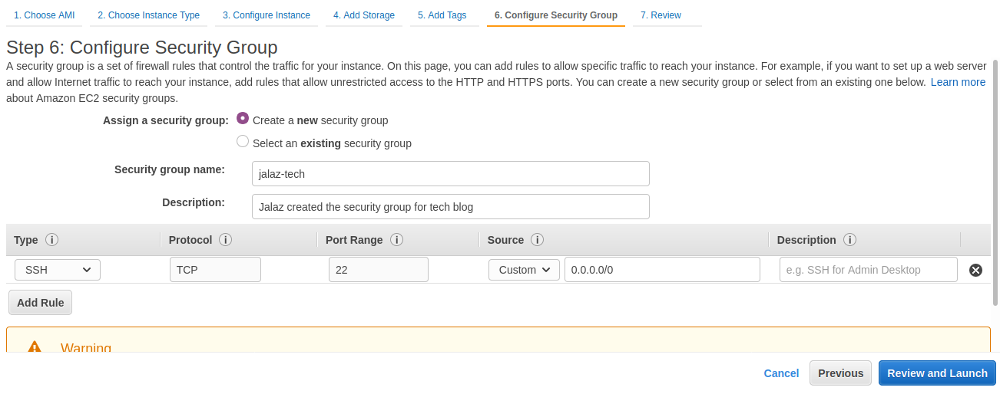
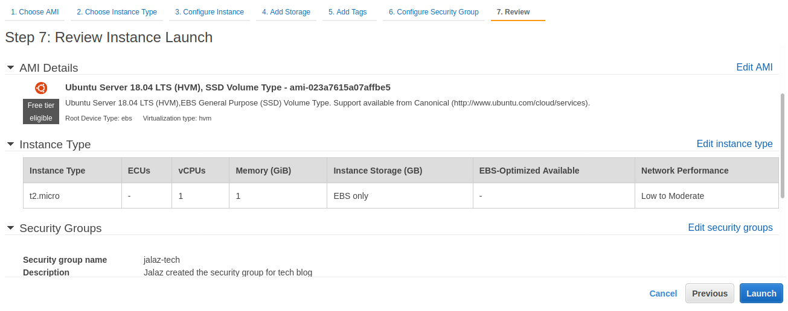
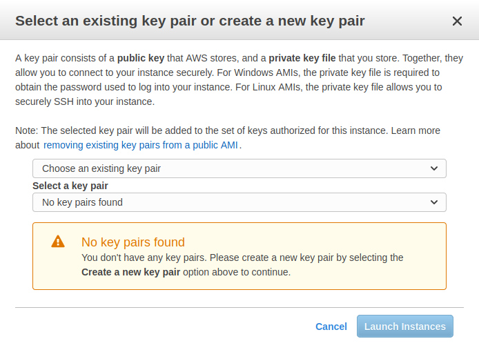
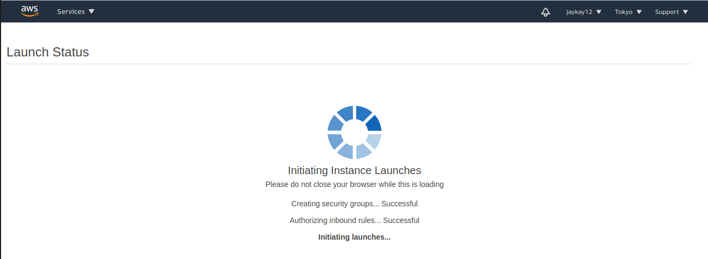
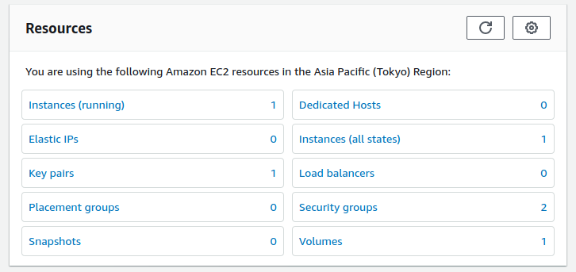

AWS or Amazon Web Services provides on-demand cloud computing services & APIs to subscribers on the metered pay-as-you-go basis.
[AWS Developer Console](https://aws.amazon.com/console/)


AWS Elastic Compute Cloud is a web service which provides secure & resizable compute capacity on the cloud.

Features:
- Virtual computing environments(virtual servers) in the AWS cloud called instances.
- Pre-configured AMIs.
- Variety of Instance types.
- Security for instances using key pairs.
- Additional firewall mechanism around the instance using security groups.
- Supports virtual networks or virtual private clouds.
- Temporary instance storage using instance store volumes.
- Persistent instance storage using Amazon EBS volumes.

#### Concepts

- <ins>**AMI**</ins>
  - Amazon Machine Images
  - Preconfigured templates for your instances.
  - Contains the software configuration (OS, application server, and applications) required to launch the instance.
  - Famous ones are:
    - Amazon Linux 2 AMI (HVM)
    - Microsoft Windows Server 2019 Base
    - Red Hat Enterprise Linux 8 (HVM)
    - SUSE Linux Enterprise Server 15 SP2 (HVM)
    - Ubuntu Server 20.04 LTS (HVM)
    - Ubuntu Server 18.04 LTS (HVM) etc.


- <ins>**Instance types**</ins>
  - Various configurations of CPU, memory, storage, and networking capacity for the instances.
  - Instance types are optimized to fit different use cases.
  - Famous ones are:
    - t2.nano (1 CPU, 0.5 GB)
    - t2.micro (1 CPU, 1 GB)
    - z1d.metal (48 CPU, 384 GB)
    - x1e.32xlarge (128 CPU, 3904 GB)


- <ins>**Key pairs**</ins>
  - Consists of _public key_ that AWS stores & _private key_ that we store.
  - When we launch a new instance, key pair is assigned to it. Then, for logging in to it, we use the private key.
  - Always store the private key or `.pem` file in a secure place as anyone who has this private key can log in on your behalf.


- <ins>**Security groups**</ins>
  - Set of firewall rules that control the traffic for the instance.
  - Acts as a virtual firewall for the EC2 instances to control incoming and outgoing traffic.
  - Inbound rules control the incoming traffic to your instance, and outbound rules control the outgoing traffic from your instance


- <ins>**Virtual private clouds**</ins>
  - Amazon Virtual Private Cloud (Amazon VPC) lets you provision a logically isolated section of the AWS Cloud where you can launch AWS resources.
  - IndiaMART Search GCP cluster is an example of VPC wherein R&D server is accessible from Fts-master2, Repeater server etc without any latency & security concerns as all 3 servers are in the same VPC.


- <ins>**Amazon EBS**</ins>
  - Amazon Elastic Block Store
  - Easy to use, high performance block storage service designed for use with Amazon EC2.
  - Used with the EC2 cloud service to store persistent data. This means that the data is retained even when the EC2 instances are shut down.

## Creation & Handling

#### Creation

- **Step 1**: Initiation

  


- **Step 2**: Selecting the suitable AMI (Me: Ubuntu 18.04)

  


- **Step 3**: Selecting the best Instance type (Me: t2.micro)

  


- **Step 4**: Configuring Instances, Storages or Tags (Optional)

- **Step 5**: Adding Security group to the instance
  - We can add rules to allow specific traffic to reach the instance.
  - For eg, For a web server running on instance and allow internet traffic, add rules that allow unrestricted access to the HTTP and HTTPS ports.

  


- **Step 6**: Review the instance state & configurations, once sure. Go ahead.

  


- **Step 7**: For securing the instance, AWS uses Public-Private key based authentication.

  

Create a Key-pair in this step & secure/download the key generated in this step as it will used for logging into the instance.

`Setting up stuff`:

  

`In Launch`:

  

`Launched`:

  

#### Connecting

- **Step 1**: Locate the private key stored in Step 7 & provide read permissions.
`chmod 400 jalaz-tech.pem`

- **Step 2**: Grab the Public IP of the instance from AWS Instance console.

- **Step 3**: Using SSH client log into the instance.

```bash
jalaz@jalaz-personal:~$ ssh -i "jalaz-tech.pem" ubuntu@54.199.225.204
Welcome to Ubuntu 18.04.5 LTS (GNU/Linux 5.4.0-1029-aws x86_64)

 * Documentation:  https://help.ubuntu.com
 * Management:     https://landscape.canonical.com
 * Support:        https://ubuntu.com/advantage

  System information as of Thu Dec 10 19:09:09 UTC 2020

  System load:  0.0               Processes:           90
  Usage of /:   14.6% of 7.69GB   Users logged in:     0
  Memory usage: 17%               IP address for eth0: 172.31.33.234
  Swap usage:   0%

  0 packages can be updated.
  0 updates are security updates.
ubuntu@ip-172-31-33-234:~$
```

#### Advanced Concepts


## Deploying KitabGhar on EC2 Instance

#### Setting up

**Step 1** Cloning the repo
```bash
ubuntu@ip-172-31-33-234:~/kitabghar$ git clone https://github.com/jaykay12/KitabGhar.git
Cloning into 'KitabGhar'...
remote: Enumerating objects: 3, done.
remote: Counting objects: 100% (3/3), done.
remote: Compressing objects: 100% (3/3), done.
remote: Total 416 (delta 0), reused 0 (delta 0), pack-reused 413
Receiving objects: 100% (416/416), 1.96 MiB | 1.93 MiB/s, done.
Resolving deltas: 100% (225/225), done.
```

**Step 2** Transferring files(books/posters) to the instance

#### Setting up KitabGhar Database: MySQL

**Step 1**: Refresh the Ubuntu packages by running `sudo apt update`

**Step 2**: Install MySQL
```bash
ubuntu@ip-172-31-33-234:~$ sudo apt install mysql-server
Reading package lists... Done
Building dependency tree... Done
...
...
...
Setting up mysql-client-5.7 (5.7.32-0ubuntu0.18.04.1) ...
Setting up mysql-server-5.7 (5.7.32-0ubuntu0.18.04.1) ...
Processing triggers for systemd (237-3ubuntu10.42) ...
Processing triggers for man-db (2.8.3-2ubuntu0.1) ...
```

**Step 3**: Secure the MySQL environment by running `sudo mysql_secure_installation`

**Step 4**: By default, the general command of `mysql -u root -p` doesn't work. Run the following commands for getting this done.
```bash
ubuntu@ip-172-31-33-234:~$ mysql -u root -p
Enter password:
ERROR 1045 (28000): Access denied for user 'root'@'localhost' (using password: YES)

ubuntu@ip-172-31-33-234:~$ sudo mysql
mysql> ALTER USER 'root'@'localhost' IDENTIFIED WITH mysql_native_password BY 'jalaz';
Query OK, 0 rows affected (0.00 sec)
mysql> exit

ubuntu@ip-172-31-33-234:~$ mysql -u root -p
Enter password:
mysql>
```

**Step 5**: Configuring KitabGhar DB
```bash
ubuntu@ip-172-31-33-234:~$ mysql -u root -p
Enter password:
mysql> show databases;
+--------------------+
| Database           |
+--------------------+
| information_schema |
| mysql              |
| performance_schema |
| sys                |
+--------------------+

mysql> CREATE DATABASE kitabghar;
Query OK, 1 row affected (0.00 sec)

mysql> show databases;
+--------------------+
| Database           |
+--------------------+
| information_schema |
| kitabghar          |
| mysql              |
| performance_schema |
| sys                |
+--------------------+

mysql> exit
Bye

ubuntu@ip-172-31-33-234:~$ cd kitabghar/KitabGhar/
ubuntu@ip-172-31-33-234:~/kitabghar/KitabGhar$ mysql -u root -p kitabghar < KitabGhar.sql
Enter password:
ubuntu@ip-172-31-33-234:~/kitabghar/KitabGhar$ mysql -u root -p
Enter password:

mysql> use kitabghar;
Database changed
mysql> show tables;
+---------------------+
| Tables_in_kitabghar |
+---------------------+
| books               |
| connections         |
| reviews             |
| shelfs              |
| users               |
+---------------------+
```

`KitabGhar database is running good & configured on MySQL server`


#### Setting up KitabGhar Portal: Tomcat

#### Setting up KitabGhar Recommend API: Python-flask
