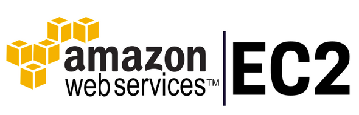

AWS or Amazon Web Services provides on-demand cloud computing services & APIs to subscribers on the metered pay-as-you-go basis.
[AWS Developer Console](https://aws.amazon.com/console/)

AWS Elastic Compute Cloud is a web service which provides secure & resizable compute capacity on the cloud.

Features:
- Virtual computing environments(virtual servers) in the AWS cloud called instances.
- Pre-configured AMIs.
- Variety of Instance types.
- Security for instances using key pairs.
- Additional firewall mechanism around the instance using security groups.
- Supports virtual networks or virtual private clouds.
- Temporary instance storage using instance store volumes.
- Persistent instance storage using Amazon EBS volumes.

#### Concepts

- AMI

- Instance types

- Key pairs

- Security groups

- Virtual private clouds

- Amazon EBS

## Creation & Handling

#### Creation

#### Connecting

#### Advanced Concepts

## Deploying KitabGhar on EC2 Instance

#### Setting up MySQL Database

#### Setting up KitabGhar Portal

#### Setting up KitabGhar Recommend API
