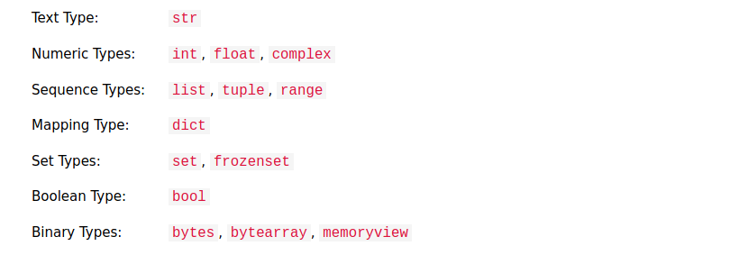
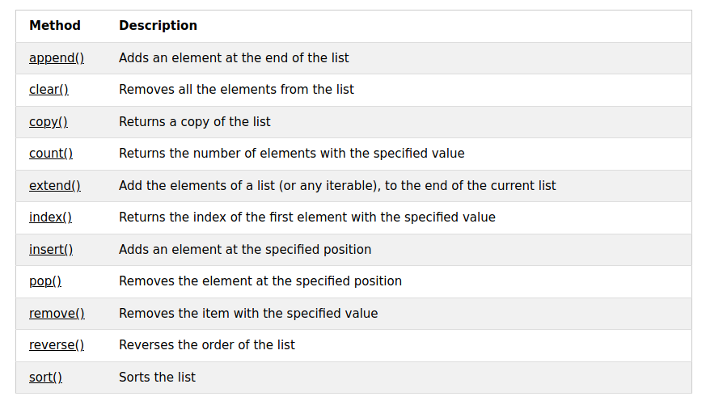
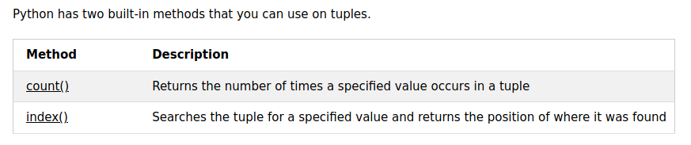
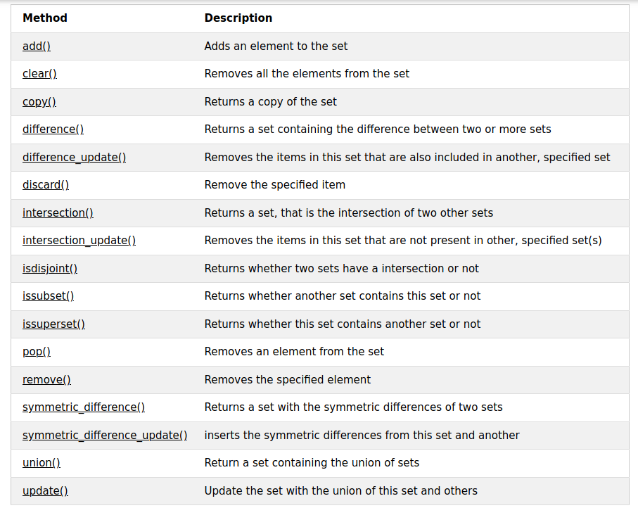
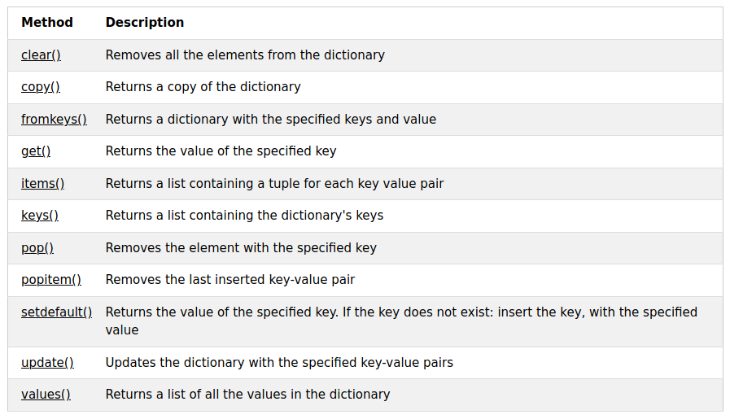

Python is a popular programming language. Created by Guido van Rossum (1991).

Used for:
- web development (server-side) (flask, pjango)
- software development (pyqt5, tkinter)
- mathematics (numpy, scipy)
- scripting
- data science (pandas, sklearn, tensorflow)

Simple Syntax. Interpreted language.
Can be treated in procedural way, object-oriented way and functional way.

## Basics of Python

<ins>**Comments**</ins>
```python
# Single line comments
'''
Multi
line
comment
'''
```

<ins>**Variables**</ins>
- No separate command of declaring variables.
- No need to specify datatype of variable.
- For specifying datatype, casting is used.
- _type()_ is used for getting the datatype of variable.

<ins>**Built-in datatype**</ins>




#### Conditionals & Iterations

<ins>if-elif-else blocks</ins>
```python
sp=1500
cp=1200
if(sp>cp):
	print("Profit of",sp-cp)
elif(cp>sp):
	print("Loss of",cp-sp)
else:
	print("equal equal")
```

<ins>taking input & for loop</ins>
```python
count=0
print("Input your name")
name = input()
for letter in name:
	if letter in ['A','E','I','O','U','a','e','i','o','u']:
		count = count +1
print("You have",count,"Vowels in name")
```

<ins>while loop</ins>
```python
var=1
while(var<=10):
	print(var)
	var =var+1
```

<ins>break & continue</ins>
```python
for var1 in range(1,15):
	if var1 in range(5,8):
		continue
	elif var1 in [0,14]:
		break
	else:
		print(var1)
```

<ins>pass</ins>
```python
for x in [0, 1, 2]:
	 pass
```
#### Collections

4 built-in datatypes for storing collections of data.

|list|tuple|set|dictionary|
|---|---|---|---|
|ordered|ordered|unordered|unordered|
|changeable|unchangeable|unchangeable|changeable|
|indexed|indexed|unindexed||
|duplicate items allowed|duplicate items allowed|no duplicate items allowed|no duplicate items allowed|
|created using square brackets|created using round brackets|written with curly brackets|written with curly brackets|

<ins>**list**</ins>
```python
listJK = ["mcat-search", "product-search", "bl-search", "group-search", "auto-suggest"]
print(listJK)
print(listJK[0])

len(listJK)

complexList = ["abc", 34, True, 40, "male"]			# Different datatypes can be part of list

listFruits = list(("apple", "banana", "cherry")) # Creation using constructor
print(listFruits)

if "apple" in listFruits:
	print("In OP usage")

listFruits[1] = "orange"					  # Changing Allowed
listFruits.insert(1, "banana")				# Insertion at any position Allowed
listFruits.append("melon")				    # Addition Allowed

listCompanies = ["google", "facebook", "amazon"]
listNew = ["netflix", "microsoft"]
listCompanies.extend(listNew)

listFruits.remove("apple")
listFruits.pop(2)								# Removes the specified indexed element
listFruits.pop()								# Removes the last indexed element

listCompanies.clear()						# Empties the list
```

`List Comprehension & looping`

newlist = [expression for item in iterable if condition == True]

```python
newlist = [x.upper() for x in fruits if x in ["apple", "banana", "cherry"]]

for company in listCompanies:
  print(company)

for i in range(len(listCompanies)):
	print(listCompanies[i])

i = 0
while(i<len(listCompanies)):
	print(listCompanies[i])
	i = i+1		 
```



<ins>**tuple**</ins>
```python
tupleJK = ("apple", "banana", "cherry")
print(tupleJK)
len(tupleJK)

tupleJK = tuple(("apple", "banana", "cherry")) 			# Creation using constructor
print(tupleJK)

# Tuples are unchangeable, meaing that you cannot change, add, or remove items once the tuple is created.
# Work-around for this is: tuple -> list -> {modify} -> tuple

y = list(tupleJK)
y.remove("apple")
y[0] = "orange"
y.append("melon")
tupleJK = tuple(y)

# Unpacking tuples
fruits = ("apple", "banana", "cherry", "strawberry", "raspberry")
(green, yellow, *red) = fruits
```



<ins>**set**</ins>
```python
setJK = {"c", "java", "python"}
print(setJK)
len(setJK)

setJK = set(("apple", "banana", "cherry")) 			# Creation using constructor

setJK.add("orange")

setJK.remove("banana")				# Raises error if item to remove doesn't exist
setJK.discard("banana")				# Doesn't raises error if item to remove doesn't exist

tropicalFruits = {"melon", "apricot"}
setJK.update(tropicalFruits)			# Adding a python collections into set

setNew = setJK.union(tropicalFruits)		# Joining sets using union op
```



<ins>**dict**</ins>
- Stores data values in key-value pairs
- value of dictionary items can be of any datatype & are referred using the keys.

```python
dictJK =	{ "brand": "Ford", "model": "Mustang", "year": 1964 }
brand = dictJK["brand"]
brand = dictJK.get("brand")

len(dictJK)

keyDictJK = dictJK.keys()
valueDictJK = dictJK.values()
itemsDictJK = dictJK.items()				# Tuple of items

# All these 3 are views of dictionary, any modifications in dictionary are reflected in these lists.

if "model" in dictJK:
	print("key is present")

dictJK["year"] = 1987
dictJK.update({"year": 1987})

dictJK["color"] = "Red"
dictJK.update({"color": "Red"})

dictJK.pop("model")

dictJK.clear()

# Looping Dictionaries

for x in dictJK:
	print(x)
	print(dictJK[x])

for x in dictJK.keys():
	print(dictJK[x])

for x,y in dictJK.items():
	print(x,y)

# Copying Dictionaries

dict1 = dict2			# Only references, softcopy is created
dict1 = dict2.copy()		# WA 1
dict1 = dict(dict2)			# WA 2

```



#### String Ops

```python
name = "Jalaz Kumar"
print(name)
print(name[1])

for x in name:
	print(x)

len(name)

# Slicing
print(name[3:])
print(name[:4])
print(name[1:4])

m1Name = name.lower()
m2Name = name.upper()
m3Name = name.replace('J','K')

print(name.split())

a = "Hello"
b = "World"
print(a + " " + b)

myorder = "I want to pay {2} dollars for {0} pieces of item {1}."
print(myorder.format(10, 75655, 23))
```

There are several other important methods:
- capitalize()
- count()
- encode()
- find()
- isdigit()
- join()
- split()
- strip()
- title()
- swapcase()

### Functions

- <ins>Simple arguments</ins>
```python
	def Summation(a,b):
		val = a+b
		return val

	result = Summation(3,4)
```

- <ins>Arbitrary arguments</ins> (\*args)
	- Any number of arguments as function parameters
```python
	def variableFunc(*params):
		for var in params:
			print(var)
		return

	variableFunc(10,20,True,"Hello")
```

- <ins>Keyword arguments</ins>
	- arguments in the form of key-value pair
	- ordering of arguments doesn't matter
```python
	def calcMarks(maths, physics, chemistry):
		return maths+physics+chemistry

	calcMarks(chemistry=95, maths=98, physics=96)
```

- <ins>Keyword Arbitrary arguments</ins>
	- any number of keyword arguments as function parameters
```python
	def results(**requestparams):
		if "result_count" in requestparams:
			blah blah blah

	results(result_url="kw-mapping", result_count="189")
```

- <ins>Default parameters</ins>
```python
	def getNation(country = "india"):
		print("My nation is "+country)

	getNation("nepal")
	getNation()
	getNation("britain")
```

- <ins>Python lambda</ins>
	- lambda is a small anonymous function
	- can take any number of arguments, but can have only 1 expression
```python
	product = lambda a,b:a*b
	print("Result:",product(12,5))
```
	- power of lambda is shown when used inside another function
```python
	def myfunc(n):
	  	return lambda a : a * n

	mydoubler = myfunc(2)
	mytripler = myfunc(3)

	print(mydoubler(11))
	print(mytripler(11))
```

### Python OOPs

- Is an object-oriented programming language
- Almost everything in Python is an object, with its properties and methods.


`__init__()`
- built-in function called implictly when the object is created.
- used as initializer
- behaves in similar manner as constructors of java/c++ but is not. (`__new__()` & `__init__()` combinely acts as constructor)

`self`
- refers to the current instance of the class
- used for accessing the class variables & functions
- has to be always the first parameter of the functions

```python
class Person:
	def __init__(self, name, age):
		self.name = name
		self.age = age

	def printName(self):
		print("Hello, my name is " + self.name)

p1 = Person("Jalaz", 25)
print(p1.name)
print(p1.age)
p1.printName()
```

<ins>**Inheritence**</ins>
```python
class Person:
	def __init__(self, name):
		self.name = name

	def printName(self):
		print("Hello, my name is " + self.name)

class Student(Person):
	def __init__(self, name, class):
		Person.__init__(self, name)
		self.class = class

	def printClass(self):
		print("Class is "+ self.class)

s1 = Student("Jalaz", "5th year")
s1.printName()												# Call to the parent class' function
s1.printClass()												# Call to the child class' function
```

`super()`
- can also be used in child class' `__init__()` for initialising parent class' variables.

```python
var = 100
def test():
	global var
	var = var +10
	print(var)
	return

test()
print(var)
```

```python
num = int(input("Enter Numerator"))
den = int(input("Enter Denominator"))

try:
	res = num/den
except:
	print("Division by Zero not Allowed!")
else:
	print("Result:",res)
```

```python
print("Welcome to File Management System:")
while True:
	print("1-Read file\n2-Write File\n3-Append File\n--(Hit 0 to EXIT!)--")
	choice = int(input())
	if choice==0:
		break

	if choice==1:
		fileName=input("File Name:")
		myobj = open(fileName,"r")
		text = myobj.read()
		print(text)
		myobj.close()

	elif choice==2:
		fileName=input("New File Name:")
		myobj = open(fileName,"w")
		test = input("Input Your Content:")
		myobj.write(test)
		myobj.close()

	elif choice==3:
		fileName=input("File Name:")
		myobj = open(fileName,"a")
		test = input("Enter Content to be appended:")
		myobj.write(test)
		myobj.close()

```

<ins>As Module</ins>
```python
def hello():
	name = input("Provide your Name:")
	print("Hello, ",name,"!What's Up?")
```

<ins>OS Package</ins>
```python
import os
os.rename("/home/jaykay12/Documents/test","/home/jaykay12/Documents/newtest")
os.remove("/home/jaykay12/Documents/newtest")
```
