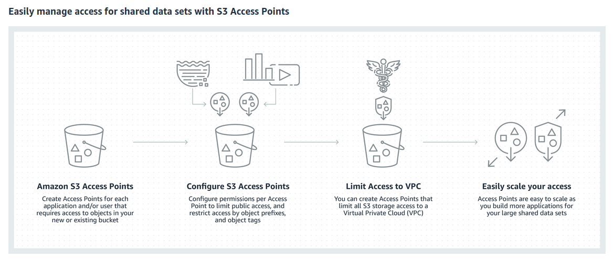
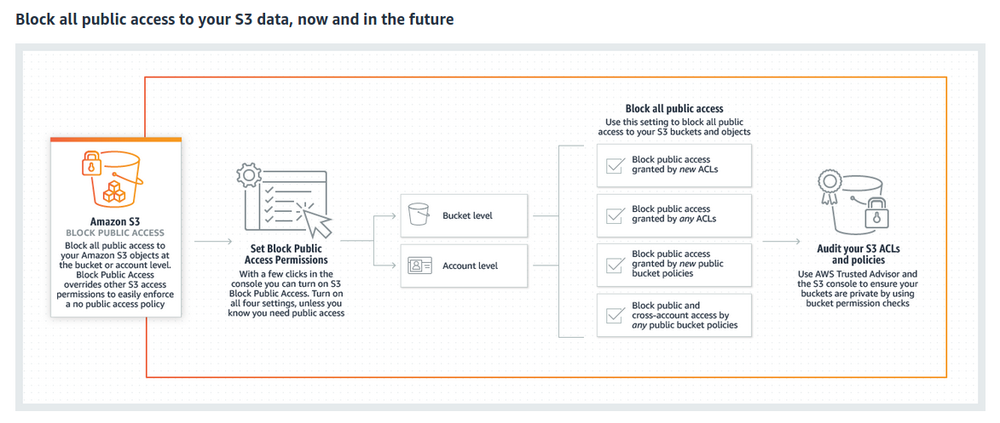

Amazon Simple Storage Service (Amazon S3) is storage for the internet
- Can be used to store and retrieve any amount of data at any time, from anywhere on the web.
- S3 is a highly scalable, reliable, fast, inexpensive data storage infrastructure by Amazon.

Amazon S3 stores data in the form of `objects` within `buckets`.
- **Object** is a file and any optional metadata that describes the file. On any object, permissions can be set.
- **Buckets** are containers for objects. For each bucket, access control & the geographical region where s3 should store the bucket can be choosen.

## S3 Features

<ins>**Prominent Features:**</ins>
- Storage Management using S3 APIs, S3 Batch operations & S3 Replication.
- Storage Monitoring using S3 Cloudwatch, S3 Cloudtrail & S3 Event Notifications.
- Storage Anaytics & insights using S3 Storage lens.
- S3 storage classes managements using S3 Standard, S3 Intelligent Tiering, S3 One Zone-IA, S3 Glacier & S3 Glacier deep archive.
- Access Managements using AWS IAM & S3 Access Points.
- Security using Amazon VPC & S3 Block Public Access.
- In-place querying & analysis of humongous data using S3 Select, Amazon Athena & Amazon RedShift.
- Efficient & reliable data transfer using AWS Storage Gateways, AWS DataSync & S3 Transfer acceleration.

1. **S3 Storage Lens**

2. **S3 Intelligent Tiering**

3. **S3 Access Points**

4. **S3 Batch Operations**

5. **S3 Block Public Access**

## Concepts

<ins>Buckets</ins>

<ins>Access Points</ins>
