Amazon Simple Storage Service (Amazon S3) is storage for the internet
- Can be used to store and retrieve any amount of data at any time, from anywhere on the web.
- S3 is a highly scalable, reliable, fast, inexpensive data storage infrastructure by Amazon.

Amazon S3 stores data in the form of `objects` within `buckets`.
- **Object** is a file and any optional metadata that describes the file. On any object, permissions can be set.
- **Buckets** are containers for objects. For each bucket, access control & the geographical region where s3 should store the bucket can be choosen.

## Introduction to S3

<ins>**Prominent Features of S3:**</ins>
- Storage Management using S3 APIs, S3 Batch operations & S3 Replication.
- Storage Monitoring using S3 Cloudwatch, S3 Cloudtrail & S3 Event Notifications.
- Storage Anaytics & insights using S3 Storage lens.
- S3 storage classes managements using S3 Standard, S3 Intelligent Tiering, S3 One Zone-IA, S3 Glacier & S3 Glacier deep archive.
- Access Managements using AWS IAM & S3 Access Points.
- Security using Amazon VPC & S3 Block Public Access.
- In-place querying & analysis of humongous data using S3 Select, Amazon Athena & Amazon RedShift.
- Efficient & reliable data transfer using AWS Storage Gateways, AWS DataSync & S3 Transfer acceleration.

1. **S3 Storage Lens**
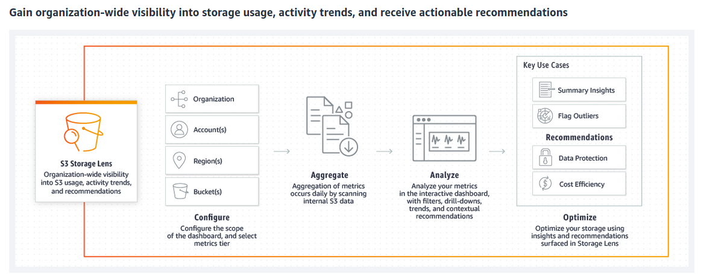

2. **S3 Intelligent Tiering**
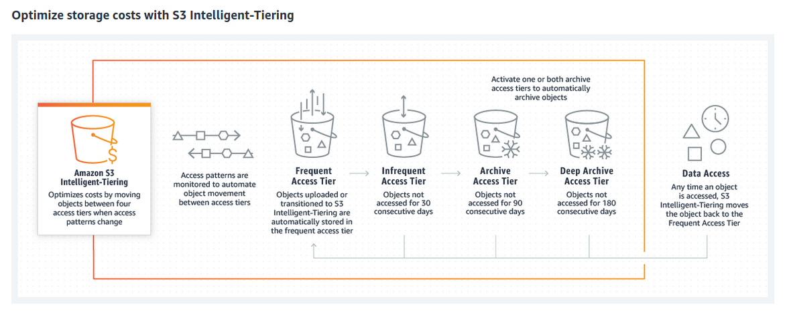

3. **S3 Access Points**
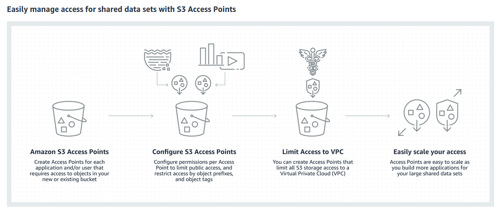

4. **S3 Batch Operations**
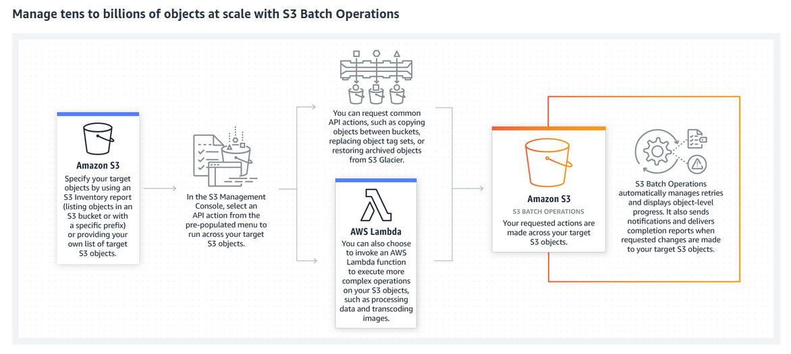

5. **S3 Block Public Access**
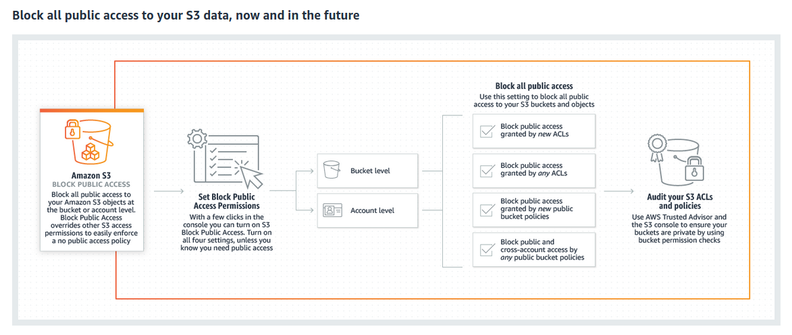

## S3 Terminology

<ins>**Bucket**</ins>
- Container for objects stored in Amazon S3.
- Organizes the Amazon S3 namespace at the highest level.
- Play a pivotal role in access control & authentication.
- If an object: _profiles/jalaz.jpg_ is stored in bucket: _kitabghar_ in the US West region, then it is addressable by URL: `https://kitabghar.s3.us-west-2.amazonaws.com/profiles/jalaz.jpg`

<ins>**Object**</ins>
- Fundamental entities stored in Amazon S3.
- Objects consist of object data and metadata.
- Is uniquely identified within a bucket by a key (name) and a version ID.

<ins>**Keys**</ins>
- Unique identifier for an object within a bucket.
- Every object in a bucket has exactly one key.
- Every object in Amazon S3 can be uniquely addressed through the combination of the web service endpoint, bucket name, key, and optionally, a version.

<ins>**Regions**</ins>
- Geographical region where Amazon S3 will store the buckets that you create.
- Region choice should be to optimize latency, minimize costs, or address regulatory requirements.

S3 provides strong read-after-write consistency for PUTs and DELETEs of objects in an S3 bucket in all AWS Regions.

### Managing IAM (Identity & Access Management)

We can always use AWS account to log-in & carry out tasks but creating & using IAM users is highly encouraged.

`IAM user`
- Entity that you create in AWS to represent the person/application that uses it to interact with AWS.
- Consists of a name and credentials.
- IAM user with administrator permissions is not the same thing as the AWS account root user.

**Step 1:** Log-in to Console using AWS Account credentials & Open [IAM Portal](https://console.aws.amazon.com/iam/home?region=ap-northeast-1)

**Step 2:** <Will update later>

### Basic Workflow

**Step 1:** Creating a bucket on AWS S3

`Starting up`

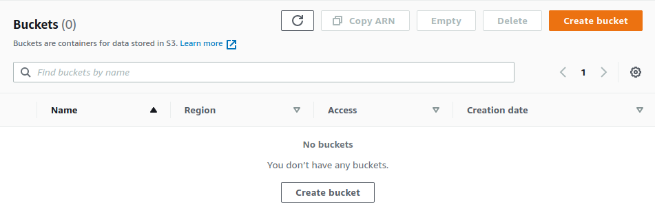

`Selecting configurations`
- Selecting Region where S3 bucket should reside
- Choosing access permissions & policies for the bucket

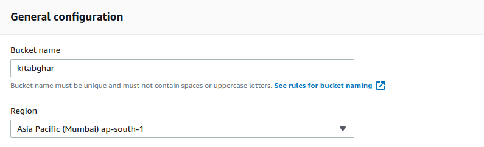

`Completed`

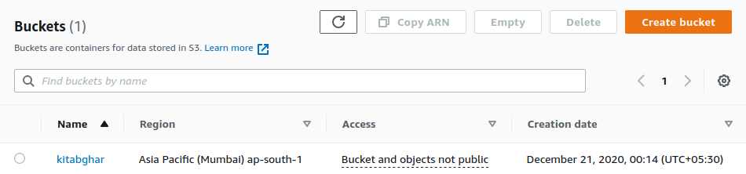

**Step 2:** Uploading & downloading objects in bucket

`Uploading file/folder`

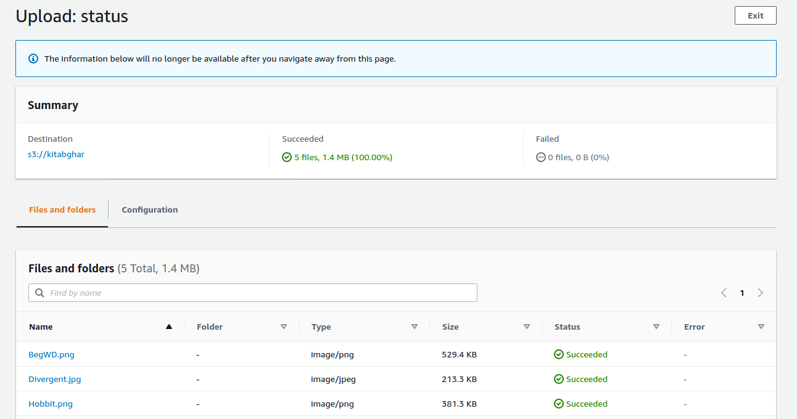

`Downloading file/folder`

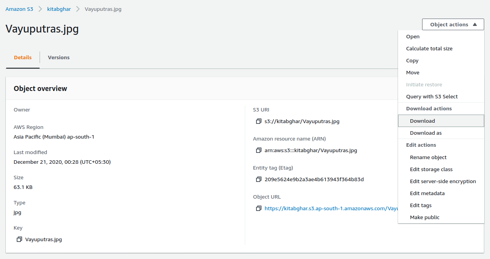

**Step 3:** Deleting bucket or objects

`Emptying or Deleting bucket`

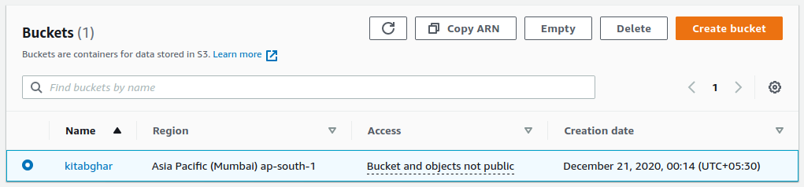

`Deleting object`

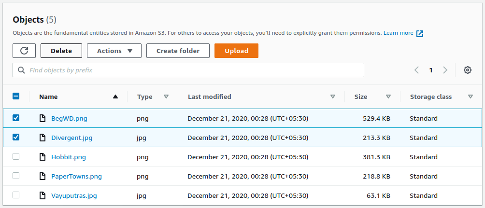

---

## Developer Guide (Java SDK)

Will be updated later

## Developer Guide (Boto package for python)

Will be updated later

## Developer Guide (S3 REST APIs)

Making REST API calls from code is quite cumbersome. It requires us to setup mechanism for setting valid credentials & calculating signatures along with API calls for getting authenticated.

Thus, AWS SDKs & AWS CLI is preferred & recommended.
