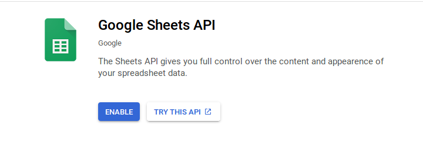
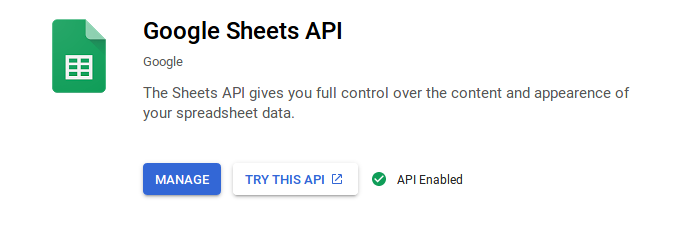
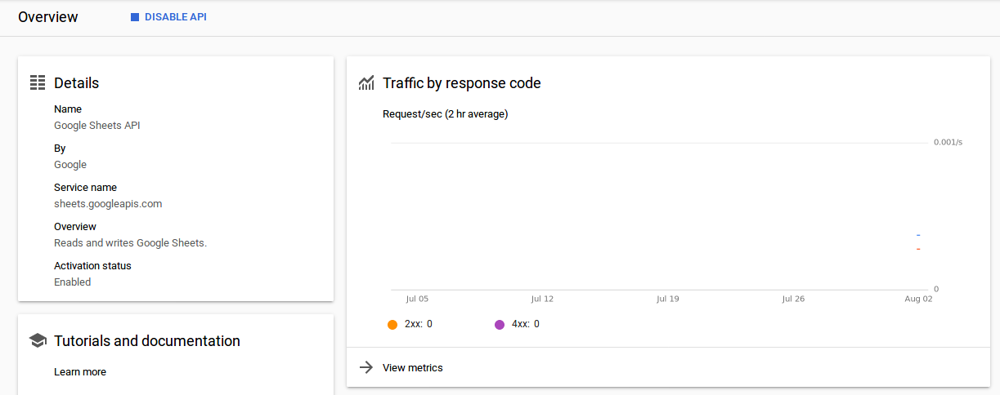
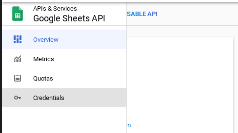
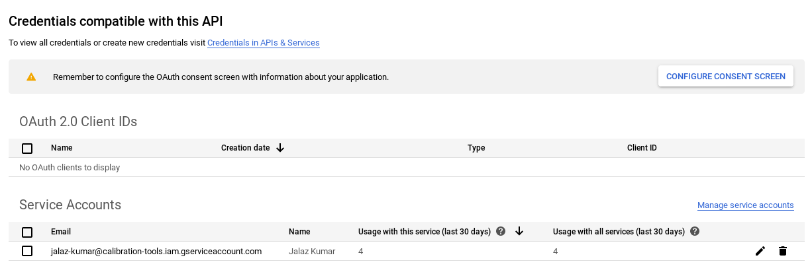
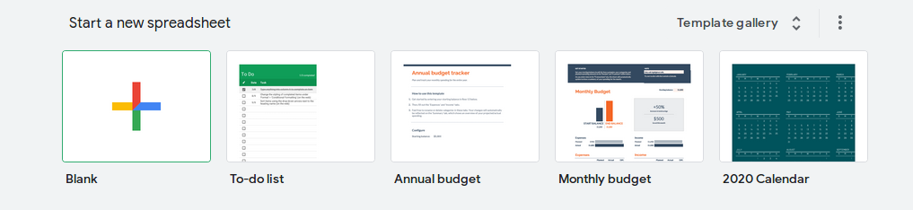
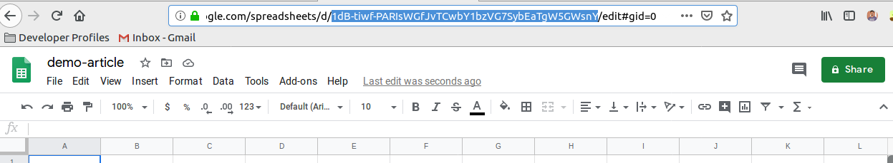
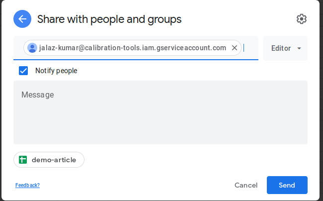
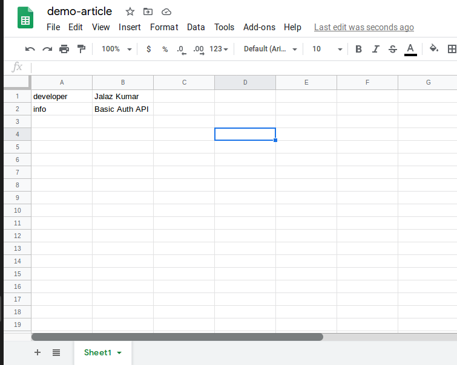

Google Sheets API allows Read, write, and format data in Sheets. The Sheets API gives you full control over the content and appearence of your spreadsheet data. Find more data at [Home Page](https://developers.google.com/sheets/api)

## Setting up Google Sheets API (Required Only once)

**Step 1:** Log into the Google developer [API console](https://console.developers.google.com/) & create a project enabling Google Sheets API.


**Step 2:** Enable the Google Sheets API by toggling button





**Step 3:** You can track the API usage



**Step 4:** Create credentials as `Service Accounts` from here:



**Step 2:** Copy the credentials file and store it in local system with name `credentials.json`



## Setting up Google Spreadsheets (Required everytime)

**Step 2:** Create a blank spreadsheet from [Google Sheets](https://docs.google.com/spreadsheets/u/0/)



**Step 3:** Copy the spreadsheet id from the sheet URL



**Step 4:** Share the spreadheet with the account associated to Google Sheets API with an editor access



## Python Scripts for accessing data

**Step 1:** Install dependencies from pip
```bash
pip install urllib
pip install requests
```

**Step 2:** Add following content to the script file for accessing data from some Remote URL
```python
import urllib.request as urllib2
import json, sys
import requests

server = "https://auth-api-flask.herokuapp.com/api/"
spreadsheetID = "1dB-tiwf-PARIsWGfJvTCwbY1bzVG7SybEaTgW5GWsnY"

connection = urllib2.urlopen(server)
response = json.load(connection)
developer = str(response['developer'])
information = str(response['info'])
```

We are having developer & API info stored in variables `developer` & `information`. Feel free to modify this as per your data.

## Python Scripts for populating data

**Step 1:** Install dependencies from pip
```bash
pip install httplib2
pip install googleapiclient
pip install google.oauth2
```

**Step 2:** Add following content to the script file for impprting dependencies & creating connection
```python
import httplib2
import os
from googleapiclient import discovery
from google.oauth2 import service_account

def makeConnection():
    scopes = ["https://www.googleapis.com/auth/drive", "https://www.googleapis.com/auth/drive.file", "https://www.googleapis.com/auth/spreadsheets"]
    secret_file = os.path.join(os.getcwd(), 'credentials.json')
    credentials = service_account.Credentials.from_service_account_file(secret_file, scopes=scopes)
    service = discovery.build('sheets', 'v4', credentials=credentials)
    return service

service = makeConnection()
```

**Step 3:** Add following content to the script file for preparing data
```python
range_fed = "Sheet1!A1:B2"
values = []
values.append(["developer", developer])
values.append(["info", information])
data_fed = { 'values': values }
```

**Step 4:** Add following line to the script file for posting data to the spreadsheet
```python
service.spreadsheets().values().update(spreadsheetId=spreadsheetID, body=data_fed, range=range_fed, valueInputOption='USER_ENTERED').execute()
```

> **Data Insertion: Success!**



---

_Points to be taken care of:_
- System time should be correct, if running on servers. Kindly ensure time is not skewed.
- range_fed & data_fed must sync up with each other.
- Editor access should be provided to the google account having Sheets API enabled.
