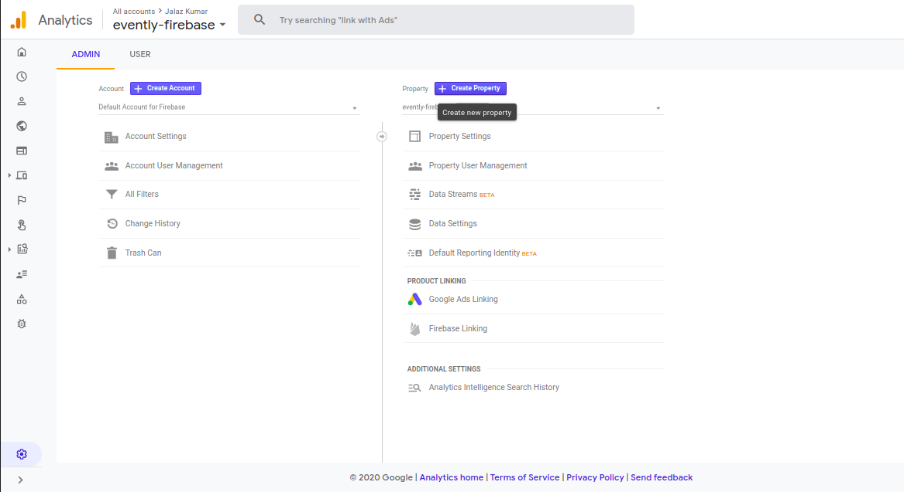
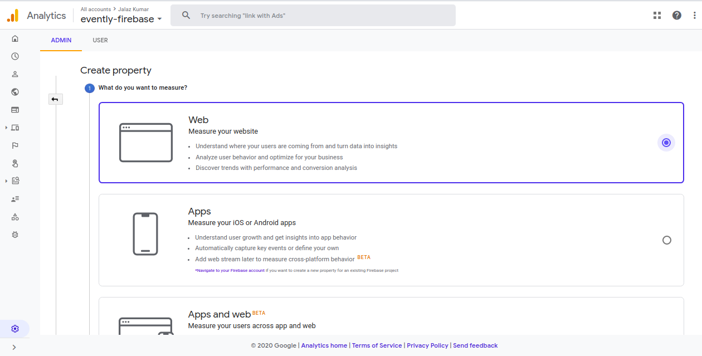
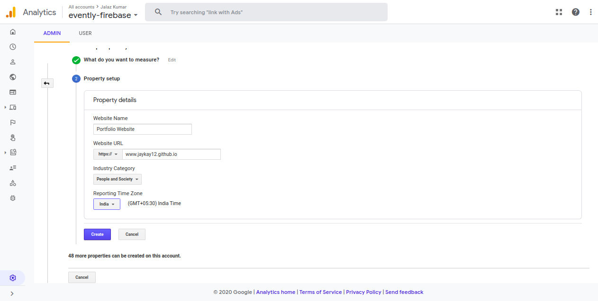
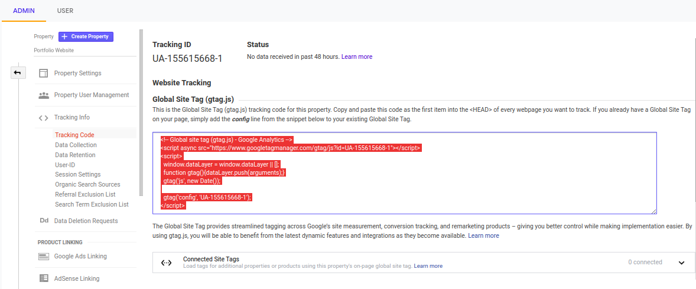
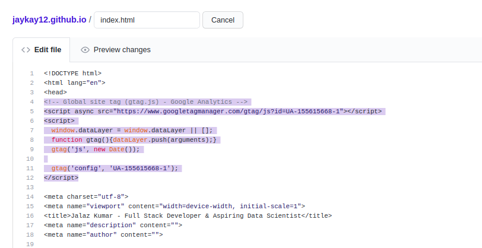
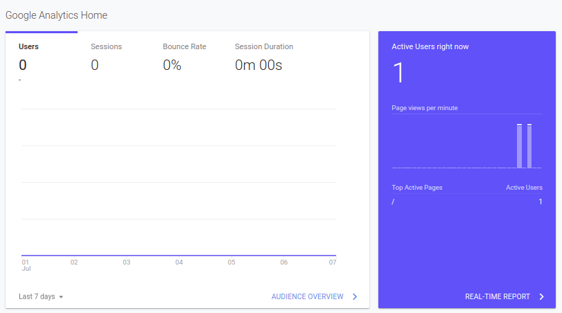

### Google Analytics
Google Analytics is a web analytics service offered by Google Inc. that tracks and reports website traffic, currently as a platform inside the Google Marketing Platform brand.
Google launched the service in November 2005 after acquiring Urchin

### Enabling GA for a property

1. Log in to [GA Portal](https://analytics.google.com/analytics/web/)

2. Create a property on GA which needs to be tracked using GA

### Linking with the website

3. Select the Gtag.js script from the portal of the property

4. Paste the Gtag.js script in website index.html page

### Tracking the crowd

5. Enjoy traffic and create inferences from the data.

