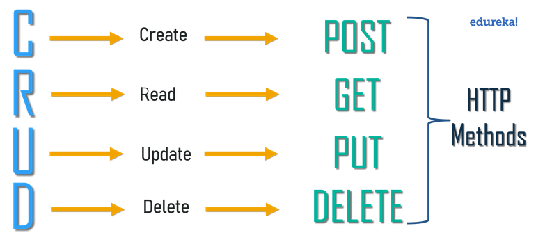
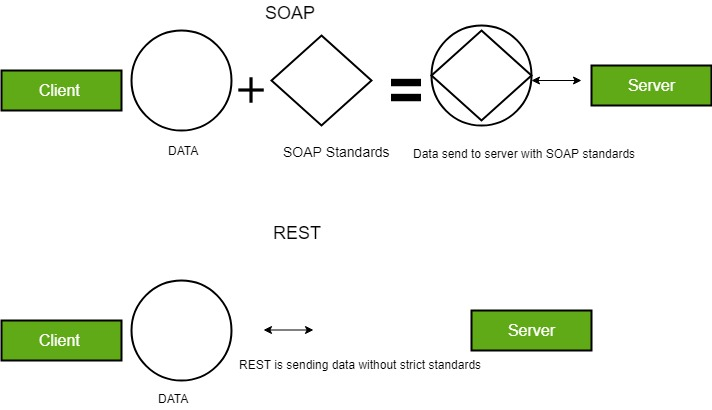

It stands for `REpresentational State Transfer`. It is a set of rules or architectural style that developers should follow while creating APIs or Web Services. Presented by Roy Fielding in 2000 as doctoral dissertation.       
Web services that conform to the REST architectural style, are called RESTful Web services, provide interoperability between computer systems on the internet.

An **API** is an application programming interface. It is a set of rules that allow programs to talk to each other. The developer creates the API on the server and allows the client to talk to it. **REST** determines how the API looks like.

Each URL is called a request while the data sent back to you is called a response.
Each request comprises of 4 components:

- <ins>**Endpoint:**</ins> Also called route, is the url you request for. Comprises of (root-endpoint + path)

- <ins>**Methods:**</ins> GET/POST/PUT/DELETE/PATCH

- <ins>**Headers:**</ins> Used to provide information to both the client and server. It can be used for many purposes, such as authentication and providing information about the body content.

- <ins>**Body:**</ins> Contains information which is to be sent to the server. This option is only used with POST, PUT, PATCH or DELETE requests. Also called "data" or "message".

_REST got its name as it's based upon creating an object of the data requested by the client on server-side and send the values of the object (state of object) as the response to the user_

## Guiding Principles of REST

- Client–server
- Stateless
- Cacheable
- Uniform interface
- Layered system
- Code on demand (optional)

**Client–server :**
Enables a uniform interface through-out and separates clients from the servers.  This enhances the portability across multiple platforms/clients as well as the scalability of the server components.

**Stateless :**
Each request from client to server must contain all of the information necessary to understand the request, and cannot take advantage of any stored context on the server. Session state is therefore kept entirely on the client.        

In other words, it should be possible to make two or more HTTP requests in any order and the same responses will be received.

**Cacheable :**
In order to provide a better performance, the applications are often made cacheable. Cache constraints require that the data within a response to a request be implicitly or explicitly labeled as cacheable or non-cacheable. If a response is cacheable, then a client cache is given the right to reuse that response data for later & equivalent requests.

**Uniform interface :**
To obtain the uniformity throughout the application, REST has the following four interface constraints:
- Resource identification
- Resource Manipulation using representations
- Self-descriptive messages
- Hypermedia as the engine of application state

**Layered system :**
The layered system style allows an architecture to be composed of hierarchical layers which allows an application to be more stable by limiting component behavior. Enhances the application’s security as components in each layer cannot interact beyond the next immediate layer they are in. Also, it enables load balancing and provides shared caches for promoting scalability.       

The requesting client need not know whether it’s communicating with the actual server, a proxy, or any other intermediary.

**Code on demand :**
This is an optional constraint and is used the least. Permits client functionality to be extended by downloading and executing code in the form of applets or scripts. This simplifies clients by reducing the number of features required to be pre-implemented.

**_Till the time, we are honoring the 6 guiding principles of REST, we can easily call our interface RESTful._**

> All these principles help RESTful applications to be simple, lightweight, and fast.

#### Request Methods

- **GET** request to _/user/_ returns a list of registered users on a system.

- **POST** request to _/user/123_ creates a user with the ID 123 using the body data.

- **PUT** request to _/user/123_ updates user 123 with the body data.

- **GET** request to _/user/123_ returns the details of user 123.

- **DELETE** request to _/user/123_ deletes user 123.

## REST Challenges

The success of REST owes much to its simplicity. Developers are free to implement RESTful APIs as they like, but there are few challenges:

- **Endpoint Consensus :**
As the codebase & number of stakeholders increase, maintaining consistency throughout the API seems difficult.       
For fetching data of user:_123_, all these are valid endpoints:
    - /user/123
    - /user/id/123
    - /user/?id=123

- **API Versioning**
In the continous development scenario, API changes are inevitable, but endpoint URLs couldn't be invalidated as they're being used either internally or by any client property.
    - Proper decommisioning is required.
    - APIs are often versioned such as _/2.0/auth-api/facebook_ supersedes _/auth-api/facebook_
    - These versions increases the workload, as multiple APIs are maintained.

- **Authentication**
For APIs which access private data or permits update/delete requests, authorization is required.
API authentication will vary depending on the use context.
Client-side applications on the same domain as RESTful API, authorization of user can be ensured using cookies.
Third-party applications must use the following methods os authorization and authentication:

    - <ins>HTTP basic authentication:</ins>
    An HTTP Authorization header containing a base64-encoded username:password string is passed in the request header.

    - <ins>API keys:</ins>
    Permission to use an API is granted by issuing a key which may have specific rights. This key is required to be passed with every API request.

    - <ins>OAuth:</ins>
    A token is obtained before any request is made by sending a Client ID and Client Secret to an OAuth Provider Server. This OAuth token is then passed with each API request unitl it expires.

    - <ins>JSON Web Tokens (JWT):</ins>
    Digitally-signed authentication tokens are securely transmitted in both the request and response header

- **Security**
RESTful API is a route for accessing and manipulating the application. Even after implementing all the authentication measures, a badly behaved client could send thousands of requests every second and crash the servers. (DDoS Attack)
Best Practises for ensuring Secure RESTful APIs are:
     - Use HTTPS
     - Use a robust Authentication method
     - Use CORS to limit client-side calls to specific domains
     - Provide minimum functionality exposed through APIs
     - Validate all endpoint URLs and body data
     - Block unexpectedly large payloads
     - Block access from unknown domains or IP addresses
     - Respond with an appropriate HTTP status code and caching header
     - Log each and every requests and investigate those failures
     - Consider rate limiting - Requests using the same API token or IP address are limited to N per minute

- **Multiple Requests and Unnecessary Data**
Restful APIs are limited by implementation. Either the response may contain more data than needed or we have to make multiple requests to gather all data.
Sometimes, (N+1) problem is encountered in RESTful APIs; N API requests must be made for each result in the parent request.

These REST conundrums led Facebook to create `GraphQL` — a web service query language.        
GraphQL addresses many of the challenges posed by RESTful APIs. It’s worth considering GraphQL once your RESTful API evolves beyond its simple starting point.

## Extra information

`Resource`:

The key abstraction of information in REST is **Resource**. Any information that can be named can be a resource: a document or image, a temporal service, a collection of other resources, a non-virtual object (e.g. a person), and so on.

REST uses a **Resource Identifier** to identify the particular resource involved in an interaction between components.

The state of the resource at any particular timestamp is known as **Resource Representation**. A representation consists of
- Data
- Metadata describing the data
- Hypermedia links which can help the clients in transition to the next desired state.

Resource representations shall be self-descriptive.

`REST vs HTTP`:

In the **REST** architectural style, data and functionality are considered resources and are accessed using Uniform Resource Identifiers (URIs). The resources are acted upon by using a set of simple, well-defined operations. The clients and servers exchange representations of resources by using a standardized interface and protocol – typically **HTTP**.

> REST != HTTP

`SWAGGER`:
A variety of tools to help design, document, mock, test, and monitor REST APIs.
[Official Site](https://swagger.io/)

`POSTMAN & POSTWOMAN`:
RESTful API testing applications. Also supports API documentations.

`SOAP APIs vs REST APIs`:

| Feature | SOAP APIs | REST APIs |
|---|---|---|
|Representation|SOAP - Simple Object Access Protocol|REST - Representational State Transfer|
|Standarization|Has an official standard because it is a protocol|Has no has no official standard at all because it is an architectural style|
|Definition|Standards-based web services access protocol|Another standard, Seeks to fix the problems with SOAP and provide a simpler method of accessing web services|
|Disparity|SOAP is a protocol, it follows a strict standard to allow communication between the client and the server|REST is an architectural style that doesn’t follow any strict standard but follows 6 constraints|
|Supported formats|SOAP uses only XML for exchanging information in its message format|REST is not restricted to XML and its the choice of implementer which Media-Type to use like XML, JSON, Plain-text|
|Relation|SOAP cannot use REST|REST can use SOAP protocol|
|Implementation|SOAP is difficult to implement and it requires more bandwidth|REST is easy to implement and requires less bandwidth|
|ACID complaints transactions|Supports this|REST lacks in it|
|Security|SOAP has SSL( Secure Socket Layer) and WS-security|REST has SSL and HTTPS|
|Secure Transactions|In the case of Bank Account Password, Card Number, etc. SOAP is preferred over REST.||
|Dependency|Language, platform, and transport independent||
|Transportation|SOAP can be sent over almost any protocol such as HTTP, SMTP, TCP, or JMS.|REST requires use of HTTP|
|Environment|Works well in distributed enterprise environments|REST assumes direct point-to-point communication|
|Efficiency|SOAP uses XML for all messages|REST mostly uses smaller message formats like JSON|
|Speed|Relatively slow|Fast (no extensive processing required)|
|Error Handling|Built-in error handling|No functionality|
||strongly function-driven|data-driven|
||SOAP APIs is largely based on HTTP and XML.|REST APIs uses multiple standards like HTTP, JSON, URL, and XML|
|Resource Utilization|Uses XML for the creation of Payload and results in the large sized file|Deploys multiple standards, so it takes fewer resources and bandwidth|
||Follow too many standards - results in error if miscommunicated & standards not met|Doesn't make emphasis on too many standards - results in corrupt API in the end|

> SOAP is like an envelope while REST is just a postcard.
