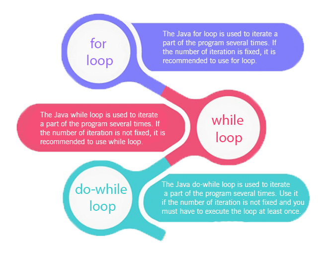

**Variables :**
- A container which holds the value while the Java program is executed.
- Basically a name of memory location.
- Name of reserved area allocated in memory
- Each variable has to be assigned with a data type.
- Java supports 3 types of variables:

   - **<ins>local variable</ins>:**
      - variable declared inside the body of a method
      - this variable can be used only inside that method & other methods of class aren't even aware about its existence.
      - this variable can never be declared `static`.

   - **<ins>instance variable</ins>:**
      - variable declared inside the class but outside the body of the method
      - value is instance specific and is not shared among instances.

   - **<ins>static variable</ins>:**
      - variable which is declared as `static`
      - Memory allocation for static variable happens only once when the class is loaded in the memory.
      - single copy can be created and shared among all the instances of the class.

```java
    class Tech {  
        int data = 50;            //instance variable  
        static int m = 100;       //static variable  
        void method() {  
            int n = 90;           //local variable  
        }  
    }
```

`int a = 10; float f = a; sout(f);` provides 10.0 signifies <ins>Widening</ins>       
`float f = 10.0; int a = (int)f; sout(a);` provides 10 signifies <ins>Narrowing/Typecasting</ins>     

**Data Types :**
Specify the different sizes and values that can be stored in the variable.

> Java is a statically-typed programming language. It means, all variables must be declared completely with name & data type before its use.


> Java uses Unicode system not ASCII code system.
> The \u0000 is the lowest range of Unicode system

## Operators
A symbol which is used to perform operations.       

There are many operators in Java:

- <ins>Unary Operator</ins>
   - require only one operand
   - Examples: `++ -- ! ~`
   - Can be of 2 types: postfix like (a++, a--) or prefix like (++a, --b)
   - Used to perform various operations:
      - incrementing/decrementing a value by one
      - negating an expression
      - inverting the value of a boolean


- <ins>Arithmetic Operator</ins>
   - Used to perform addition, subtraction, multiplication, and division.
   - require 2 operands.
   - Examples: `+ - * / %`
   - act as basic mathematical operations
   - Preference order: * / % + -


- <ins>Shift Operator</ins>
   - Examples: `<< >> >>>`
   - Left shift operator (<<)
      - Used to shift all of the bits in a value to the left side of a specified number of times.
      - 10<<2 means 10 * 2^2 = 40
      - 10<<3 means 10 * 2^3 = 80
   - Right shift operator (>>)
      - Used to move left operands value to right by the number of bits specified by the right operand.
      - 20>>2 means 20 / 2^2 = 5
      - 20>>3 means 20 / 2^3 = 2
   - (>>>) Operator
      - Same as >> for positive numbers
      - Differs for negative number as this changes the parity bit (MSB)


- <ins>Relational Operator</ins>
   - Comparision Examples: `< > <= >=`
   - Equality Examples: `== !=`


- <ins>Bitwise Operator</ins>
   - Examples: `& ^ |`
   - Bitwise AND operator (`&`)
      - Always checks both conditions whether first condition is true or false.
   - Bitwise OR operator (`|`)
      - Always checks both conditions whether first condition is true or false.
   - Bitwise XOR operator (`^`)


- <ins>Logical Operator</ins>
   - Examples: `&& || !`
   - Logical AND operator (`&&`)
      - Doesn't check second condition if first condition is false.
      - It checks second condition only if first one is true.
   - Logical OR operator (`||`)
      - Doesn't check second condition if first condition is true.
      - It checks second condition only if first one is false.
   - Logical NOT operator (`!`)

```java
    class OperatorBitwiseVSLogical {  
        public static void main(String args[]) {  
            int a=10;  
            int b=5;  
            int c=20;

            System.out.println(a<b&&a++<c);          //false && true = false
            System.out.println(a);                   //10 because second condition is not checked  
            System.out.println(a<b&a++<c);           //false && true = false  
            System.out.println(a);                   //11 because second condition is checked

            System.out.println(a>b||a++<c);          //true || true = true  
            System.out.println(a);                   //11 because second condition is not checked  
            System.out.println(a>b|a++<c);           //true | true = true  
            System.out.println(a);                   //12 because second condition is checked  
        }
    }  
```

- <ins>Ternary Operator</ins>
   - Used as one liner replacement for if-then-else statement.
   - It is the only conditional operator which takes three operands.
   - `int min=(a<b)?a:b;`


- <ins>Assignment Operator</ins>
   - One of the most common operator.
   - Used to assign the value on its right to the operand on its left.
   - Denoted by `=`


### Keywords

- `abstract`: Used to declare abstract class. Abstract class can provide the implementation of interface. It can have abstract and non-abstract methods.

- `break`: Used to break loop or switch statement. It breaks the current flow of the program at specified condition.

- `case`: Used to with the switch statements to mark blocks of text.

- `catch`: Used to catch the exceptions generated by try statements. It must be used after the try block only.

- `continue`: Used to continue the loop. It continues the current flow of the program and skips the remaining code at the specified condition.

- `default`: Used to specify the default block of code in a switch statement.

- `do`: Used in control statement to declare a loop. It can iterate a part of the program several times.

- `else`: Used to indicate the alternative branches in an if statement.

- `enum`: Used to define a fixed set of constants. Enum constructors are always private or default.

- `extends`: Used to indicate that a class is derived from another class or interface.

- `final`: Used to indicate that a variable holds a constant value. It is applied with a variable. It is used to restrict the user.

- `finally`: Indicates a block of code in a try-catch structure. This block is always executed whether exception is handled or not.

- `for`: Used to start a for loop. Used to execute a set of instructions/functions repeatedly when some conditions become true. If the number of iteration is fixed, it is recommended to use for loop.

- `if`: Tests the condition. It executes the if block if condition is true.

- `implements`: Used to implement an interface.

- `import`: Makes classes and interfaces available and accessible to the current source code.

- `instanceof`: Used to test whether the object is an instance of the specified class or implements an interface.

- `interface`: Used to declare an interface. It can have only abstract methods.

- `new`: Used to create new objects.

- `null`: Used to indicate that a reference does not refer to anything. It removes the garbage value.

- `package`: Used to declare a Java package that includes the classes.

- `private`: An access modifier. It is used to indicate that a method or variable may be accessed only in the class in which it is declared.

- `protected`: An access modifier. It can be accessible within package and outside the package but through inheritance only. It can't be applied on the class.

- `public`: An access modifier. It is used to indicate that an item is accessible anywhere. It has the widest scope among all other modifiers.

- `return`: Used to return from a method when its execution is complete.

- `static`: Used to indicate that a variable or method is a class method.

- `super`: A reference variable that is used to refer parent class object. It can be used to invoke immediate parent class method.

- `switch`: Contains a switch statement that executes code based on test value. The switch statement tests the equality of a variable against multiple values.

- `synchronized`: Used to specify the critical sections or methods in multithreaded code.

- `this`: Used to refer the current object in a method or constructor.

- `throw`: Used to explicitly throw an exception. The throw keyword is mainly used to throw custom exception. It is followed by an instance.

- `throws`: Used to declare an exception.

- `transient`: Used in serialization. If you define any data member as transient, it will not be serialized.

- `try`: Used to start a block of code that will be tested for exceptions. The try block must be followed by either catch or finally block.

- `void`: Used to specify that a method does not have a return value.

- `volatile`: Used to indicate that a variable may change asynchronously.

- `while`: Used to start a while loop. This loop iterates a part of the program several times. If the number of iteration is not fixed, it is recommended to use while loop.

## Control Statements

**Conditionals :**

- `if` block
```java
    if(condition) {  
        //code to be executed  
    }  
```


- `if-else` block
```java
    if(condition) {  
        //code if condition is true  
    } else {  
        //code if condition is false  
    }
```

- `if-else if-else` ladder
```java
    if(condition1) {  
        //code to be executed if condition1 is true  
    }else if(condition2) {  
        //code to be executed if condition2 is true  
    }  
    else if(condition3) {  
        //code to be executed if condition3 is true  
    }  
    ...  
    else {  
        //code to be executed if all the conditions are false  
    }
```

- `Nested if` block
```java
    if(condition) {    
         //code to be executed    
        if(condition) {  
            //code to be executed    
        }    
    }  
```

- `Ternary` Operator
```java
    public class Ternary {    
        public static void main(String[] args) {    
            int number = 13;
            String output = (number%2==0)?"even number":"odd number";    
            System.out.println(output);  
        }    
    }
```

- `Switch` conditional statement
Executes one statement from multiple conditions. It is like if-else-if ladder statement.

    - Can be one or N number of case values.
    - Case value must be of switch expression type only. The case value must be literal or constant. It doesn't allow variables.
    - Case values must be unique. In case of duplicate value, it renders compile-time error.
    - Java switch expression must be of byte, short, int, long (with its Wrapper type), enums and string(since Java SE 7).
    - Each case statement can have a break statement which is optional. When control reaches to the break statement, it jumps the control after the switch expression. If a break statement is not found, it executes the next case. Thus, it is also called a `fall-through` statement.
    - case value can have a default label which is optional.
    - `Nested switches` are also possible.

```java
    switch(expression) {    
        case value1:    
           //code to be executed;    
           break;  //optional  
        case value2:    
           //code to be executed;    
           break;  //optional  
        ...    
        default:     
          //code to be executed if all cases are not matched;    
    }    
```

### Iterations :



**for loop :**

- <ins>Simple For loop</ins>:
```java
    for(init;condition;incr/decr) {  
        // code to be executed
    }
```
- <ins>ForEach loop:</ins>
Used to traverse array or collection in java. It works on elements basis not index. It returns element one by one in the defined variable
```java
    public class ForEachUsage {  
        public static void main(String[] args) {  

            int arr[]={12,23,44,56,78};  
            for(int entry:arr){  
                System.out.println(entry);  
            }  
        }  
    }  
```

- <ins>Labelled & Nested for loop</ins>:
```java
    public class LabeledForExample {  
        public static void main(String[] args) {  

            outer:  
            for(int i=1;i<=3;i++){  
                inner:  
                for(int j=1;j<=3;j++){  
                    if(i==2&&j==2){  
                        break outer;  
                    }  
                    System.out.println(i+" "+j);  
                }  
            }  
        }  
    }
```

- <ins>Infinte for loop</ins>:
```java
    for(;;) {  
        //code to be executed  
    }
```

**while loop :**
```java
    while(condition) {  
        //code to be executed  
    }
```

For infintive while loop: set condition as `true`.

**do-while loop :**
```java
    do{  
        //code to be executed  
    } while(condition);  
```

For infintive while loop: set condition as `true`.

**Important Points :**

When a `break` statement is encountered inside a loop, the loop is immediately terminated and the program control resumes at the next statement following the loop.
Used to break loop or switch statement. In case of inner loop, it breaks only inner loop.     


`continue` statement is used to continue the loop. It continues the current flow of the program and skips the remaining code at the specified condition. In case of an inner loop, it continues the inner loop only.


`Comments`:
- Single Line Comment
- Multi Line Comment
- Documentation Comment

```java
    //This is single line comment

    /*
    This is a
    multi line
    comment
    */

    /**
    This is a
    documentation comment
    which is generated
    using javadoc
    */

```

### Naming Conventions

- **<ins>Class</ins> :**
   - Should start with the uppercase letter.
   - Should be a noun such as Color, Button, System, Thread, etc.


- **<ins>Interface</ins> :**
   - Should start with the uppercase letter.
   - Should be an adjective such as Runnable, Remote, ActionListener.


- **<ins>Method</ins> :**
   - Should start with lowercase letter.
   - Should be a verb such as main(), print(), println().
   - For multi-word name, use camel case such as stringParser()


- **<ins>Variables</ins> :**
   - Should start with a lowercase letter.
   - Should be meaningful such as id, name.
   - Should not start with the special characters like & (ampersand), $ (dollar), _ (underscore).
   - For multi-word name, use camel case such as updatedCounter.


- **<ins>Package</ins> :**
   - Should be a lowercase letter
   - Should cover all consisting classes such as java.lang, java.io etc.


- **<ins>Constants</ins> :**
   - Should be in uppercase letters only.
   - Should be meaningful such as RED, YELLOW.
   - For multi-word name, use _ (underscore) such as MAX_LIMIT.
