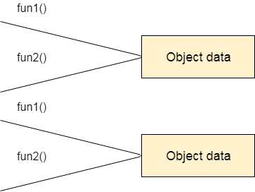
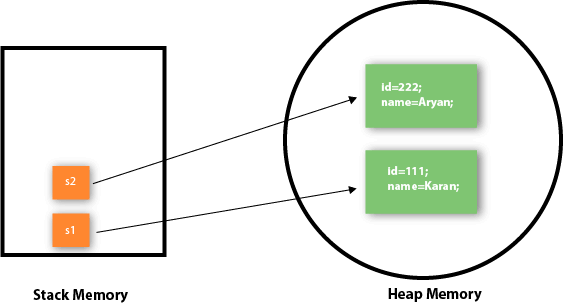
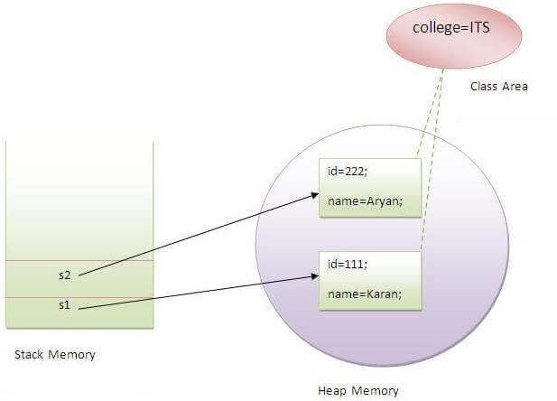
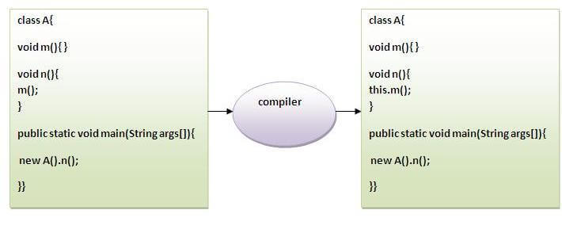
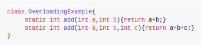
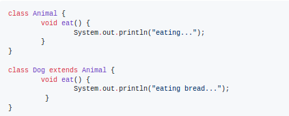

`Object-Oriented Programming` is a methodology or paradigm to design a program using classes and objects. It simplifies software development and maintenance by providing various concepts.

The popular object-oriented languages are Java, C#, PHP, Python, C++, etc. The main aim is to implement real-world entities, for example, object, classes, abstraction, inheritance, polymorphism, etc.        

`Simula` is considered the first object-oriented programming language.      

The programming paradigm where everything is represented as an object is known as a truly object-oriented programming language.
`Smalltalk` is considered the first truly object-oriented programming language.


## Java OOPS

- Object
- Class
- Inheritance
- Polymorphism
- Abstraction
- Encapsulation
- Coupling
- Cohesion
- Association
- Aggregation
- Composition


**Object:**
- Any entity that has state and behavior
- For example, chair, pen, table, keyboard, bike, etc.
- It can be physical or logical.
- Object can be defined as an instance of a class.
- Object contains an address and takes up some space in memory
- Objects can communicate without knowing the details of each other's data or code. The only necessary thing is the type of message accepted and the type of response returned by the objects.

**Class:**
- Collection of objects
- It is a logical entity.
- Class can also be defined as a blueprint from which you can create an individual object.
- Class doesn't consume any space.

**Inheritance:**
- When one object acquires all the properties and behaviors of a parent object, it is known as inheritance.
- It provides code reusability.
- It is used to achieve runtime polymorphism.
- Represents the `is-a relationship`.

**Polymorphism:**
- If one task is performed in different ways, it is known as polymorphism.
- In Java, we use method overloading and method overriding to achieve polymorphism.

**Abstraction:**
- Hiding internal details and showing functionality is known as abstraction.
- For example: phone call, we don't know the internal processing.
- In Java, we use abstract class and interface to achieve abstraction.

**Encapsulation:**
- Binding (or wrapping) code and data together into a single unit are known as encapsulation.
- For example: a capsule, it is wrapped with different medicines.
- A java class is the example of encapsulation.
- Java bean is the fully encapsulated class because all the data members are private here.

**Coupling:**
- Coupling refers to the knowledge or information or dependency of another class.
- If a class has the details information of another class, there is `strong` coupling.
- In Java, we use private, protected, and public modifiers to display the visibility level of a class, method, and field
- You can use interfaces for the `weak` coupling because there is no concrete implementation.

**Cohesion:**
- Cohesion refers to the level of a component which performs a single well-defined task.
- A single well-defined task is done by a `highly` cohesive method. Eg: java.io
- The `weakly` cohesive method will split the task into separate parts. Eg: java.util

**Association:**
- Association represents the relationship between the objects.
- There can be four types of association between the objects:
   - <ins>One to One</ins> : One country can have one prime minister
   - <ins>One to Many</ins> : a prime minister can have many ministers
   - <ins>Many to One</ins> : many MP's can have one prime minister
   - <ins>Many to Many</ins> : many ministers can have many departments


1. **Aggregation:**
    - Way to achieve Association
    - Represents the relationship where one object contains other objects as a part of its state.
    - Represents the `weak` relationship between objects
    - Termed as a `has-a relationship`.
    - Another way to reuse objects.


2. **Composition:**
    - way to achieve Association
    - Represents the relationship where one object contains other objects as a part of its state.
    - There is a `strong` relationship between the containing object and the dependent object.
    - If you delete the parent object, all the child objects will be deleted automatically.
    - Containing objects do not have an independent existence

|Object-Oriented|Procedure-Oriented|
|---|---|
|Development and maintenance easier|Not easy to manage if code grows as project size increases|
|Java,C++|C|
|provides data hiding|global data can be accessed from anywhere|
|||
|provides the ability to simulate real-world event much more effectively||

> Object-based programming language follows all the features of OOPs except Inheritance. JavaScript and VBScript are examples of object-based programming languages.

 ---

## Objects & Classes

An object in Java is the physical as well as a logical entity, whereas, a class in Java is a logical entity only.

<ins>Object</ins>:
- Object is a real-world entity.
- Object is an instance of a class.
- Has 3 characteristics:
   - State: represents the data.
   - Behavior: represents the functionality such as deposit, withdraw, etc.
   - Identity: An object identity is typically implemented via a unique ID. Is used internally by the JVM to identify each object uniquely.


<ins>Class<ins>:
- A group of objects which have common properties.
- It is a template or blueprint from which objects are created.
- It is a logical entity. It can't be physical.
- A class in Java can contain:
    - Fields
    - Methods
    - Constructors
    - Blocks
    - Nested class and interface

```java
    class <class_name> {  
        field;  
        method;  
    }  
```

In Java, `method` is like a function which is used to expose the behavior of an object.

`new` keyword is used to allocate memory at runtime. All objects get memory in Heap memory area.

**Example:**
```java
    class Student {  
       int id;  
       String name;  
    }  

    class Main {  
       public static void main(String args[]) {  
          Student s = new Student();  
          System.out.println(s.id);              // 0  
          System.out.println(s.name);            // null
       }  
    }  
```

**Ways of creating objects**
- By new keyword
- By newInstance() method
- By clone() method
- By deserialization
- By factory method etc.

`Anonymous Objects`:
An object which has no reference is known as an anonymous object. If usage of an object is only once, an anonymous object is a good approach.
```java
    Calculation c = new Calculation();       // Simple Object
    c.fact(5);

    new Calculation().fact(5);             // Anonymous Object
```

`Multiple objects creation`:
Multiple objects can be created by one type only as we do in case of primitives.
_Rectangle r1 = new Rectangle(), r2 = new Rectangle();_ just same as _int a = 10, b = 12;_

**Ways of initialising objects**
- `By reference variable`
```java
    class Student {  
       int id;  
       String name;  
    }

    class Main {  
       public static void main(String args[]) {  
          Student s = new Student();  
          s.id = 101;  
          s.name = "Jalaz";  
          System.out.println(s.id+" "+s.name);        // 101 Jalaz
       }  
    }  
```

- `By method`
```java
    class Student {  
       int rollno;  
       String name;  
       void insertRecord(int r, String n) {  
          this.rollno = r;  
          this.name = n;  
       }  
       void displayInformation() {
          System.out.println(this.rollno+" "+this.name);
       }  
    }

    class Main {  
       public static void main(String args[]){  
          Student s = new Student();  
          s.insertRecord(111,"Jalaz");    
          s.displayInformation();                  // 111 Jalaz  
       }  
    }  
```


- `By constructor`
Explained in detail.

### Constructors in Java


- A special type of method which is used to initialize the object.

- It is called when an instance of the class is created. At the time of calling constructor, memory for the object is allocated in the memory.

- Every time an object is created using the new() keyword, at least one constructor is called.

- It is called constructor because it constructs the values at the time of object creation.

- It is not necessary to write a constructor for a class. It is because java compiler creates a `default constructor`, if there is no constructor available in the class.
```java
    class Student {  
        int id;  
        String name;
        void display() {
            System.out.println(this.id+" "+this.name);
        }  

        public static void main(String args[]){  
            Student s = new Student();
            s.display();                 //0 null
        }  
    }  
```
The default constructor is used to provide the default values to the object like 0, null, etc., depending on the type.

- <ins>Rules defined for the constructor</ins>:

    - Constructor name must be the same as its class name

    - A Constructor must have no explicit return type

    - We can use access modifiers while declaring a constructor. It controls the object creation. In other words, we can have private, protected, public or default constructor in Java.

    - A constructor in Java cannot be abstract, static, final, and synchronized


- There are two types of explicit constructors in Java:

    - `no-arg constructor`
    ```java
    class Student {
        int id;

        Student() {
            System.out.println("Student is created");
            this.id = 1000;
        }  

        public static void main(String args[]){  
            Student s = new Student();                   //Student is created
        }  
    }  
    ```

    - `parameterized constructor`
    ```java
    class Student {  
        int id;  
        String name;  

        Student(int i,String n) {  
            this.id = i;  
            this.name = n;  
        }  

        void display() {
            System.out.println(this.id+" "+this.name);
        }  

        public static void main(String args[]) {  

        Student s = new Student4(111,"Jalaz");
        s.display();                               //111 Jalaz
       }  
    }
    ```

**Constructor Overloading :**
Constructor is just like a method but without return type. It can also be overloaded like Java methods.         

- This is a technique of having more than one constructor with different parameter lists.

- They are arranged in a way that each constructor performs a different task. They are differentiated by the compiler by the number of parameters in the list and their types.

```java
    class Student {  
        int id;  
        String name;  
        int age;

        Student(int i,String n){  
            this.id = i;
            this.name = n;
        }  

        Student(int i,String n,int a){  
            this.id = i;  
            this.name = n;  
            this.age = a;  
        }  

        void display(){
            System.out.println(this.id+" "+this.name+" "+this.age);
        }  

        public static void main(String args[]){  
            Student5 s1 = new Student5(111,"Ram");  
            Student5 s2 = new Student5(222,"Shyam",25);

            s1.display();                 // 111 Ram 0
            s2.display();                 // 222 Shyam 25
       }  
    }
```

**Copy Constructor in Java :**
There is `NO` copy constructor in Java as we have in C++. However, we can copy the values from one object to another like copy constructor in C++, using these ways:

- `Using constructor`:
  ```java
    class Student {  
        int id;  
        String name;  

        Student(int i,String n) {  
            this.id = i;  
            this.name = n;  
        }  

        Student(Student s) {  
            this.id = s.id;  
            this.name =s.name;  
        }  

        void display() {
            System.out.println(id+" "+name);
        }  

        public static void main(String args[]){  
            Student s1 = new Student(111,"Jalaz");  
            Student s2 = new Student(s1);  

            s1.display();                 // 111 Jalaz
            s2.display();                 // 111 Jalaz  
       }  
    }  
  ```

- `By assigning the values of one object into another`:
  ```java
      class Student {  
          int id;  
          String name;

          Student(int i,String n) {  
              this.id = i;  
              this.name = n;  
          }

          Student(){}

          void display(){
              System.out.println(id+" "+name);
          }  

          public static void main(String args[]){  
              Student s1 = new Student(111,"Ram");  
              Student s2 = new Student();  
              s2.id = s1.id;  
              s2.name = s1.name;  
              s1.display();                // 111 Ram
              s2.display();                // 111 Ram
         }  
      }
  ```

- `By clone() method of Object class`

**Important Points**

- Constructor return any value?
Yes, it is the current class instance (You cannot use return type yet it returns a value).

- Can constructor perform other tasks instead of initialization?
Yes, like object creation, starting a thread, calling a method, etc. You can perform any operation in the constructor as you perform in the method.

- <ins>Constructor class:</ins>
Java provides this class which can be used to get the internal information of a constructor in the class. It is found in the java.lang.reflect package.

#### static Keyword

> static is mainly used for memory management in Java.

**static Variable :**
- Used to refer to the common property of all objects (which is not unique for each object), For Eg: College name for students.

- They gets memory only once in the class area at the time of class loading.
```java
    class Counter {  
        static int count=0;  

        Counter() {  
            count++;  
            System.out.println(count);  
        }  

        public static void main(String args[]){  
            Counter c1=new Counter();              // 1
            Counter c2=new Counter();              // 2
            Counter c3=new Counter();              // 3
        }  
    }  
```



**static Method :**
- Belongs to the class rather than the object of a class.

- Can be invoked without the need for creating an object.

- Can access static data member and can change the value of it.

- 2 main restrictions for the static method are:
   - static method can not use non-static data member or call non-static method directly.

   - `this` and `super` cannot be used in static context.

```java
    class Student{  
         int rollno;  
         String name;  
         static String college = "APSA";  

         static void change(){  
             college = "NITH";  
         }  

         Student(int r, String n) {  
             this.rollno = r;  
             this.name = n;  
         }  

         void display() {
             System.out.println(rollno+" "+name+" "+college);
         }  
    }  

    public class TestStaticMethod {  
        public static void main(String args[]){  
            Student s1 = new Student(111,"Ram");
            Student.change();
            Student s2 = new Student(222,"Shyam");  

            s1.display();                          // 111 Ram APSA
            s2.display();                          // 222 Shyam NITH
        }  
    }  
```

**static Block :**

- Used to initialize the static data member.

- Executed before the main method at the time of classloading.

```java
    class TestStaticBlock {  
      static {
          System.out.println("Static block is invoked");
      }  

      public static void main(String args[]) {  
          System.out.println("Hello main");  
      }  
    }

    //--------------------OUTPUT---------------------
    // Static block is invoked
    // Hello main
```

- Since JDK 1.7, it is not possible to execute a Java class without the main method.
Earlier, static block were a way to achieve so.

#### this Keyword

`this` is a reference variable that refers to the current object.

There are 6 major usages of this:
- Referring current class instance variable.
- Invoking current class method. (implicitly)
- Invoking current class constructor. (useful for constructor chaining)
- Passing as an argument in the method call.
- Passing as argument in the constructor call.
- Returning the current class instance from the method.

1. If there is ambiguity between the instance variables and parameters, `this` keyword resolves the problem of ambiguity.
```java
    class Student {  
        int rollno;  

        Student(int rollno) {  
            this.rollno = rollno;    
        }

        void display() {
            System.out.println(rollno);
        }  
    }  

    class ThisInVariable{  
        public static void main(String args[]){  
            Student s1=new Student(111);
            Student s2=new Student(112);
            s1.display();
            s2.display();
        }
    }
```
If local variables(formal arguments) and instance variables are different, there is no need to use `this` keyword.

2. Invoking the method of the current class by using `this` keyword. If we don't use `this` keyword, compiler automatically adds `this` keyword while invoking the method. This is done implicitly.


3. Invoking the current class constructor. It is used to reuse the constructor. In other words, it is used for constructor chaining.
```java
    class Student{  
        int rollno;  
        String name, course;  
        float fee;  

        Student(int rollno, String name, String course) {  
            this.rollno = rollno;  
            this.name = name;  
            this.course = course;  
        }

        Student(int rollno, String name, String course, float fee){  
        this(rollno, name, course);  
        this.fee = fee;  
        }  
        void display(){System.out.println(rollno+" "+name+" "+course+" "+fee);}  
    }

    class ThisInConstructor{  
        public static void main(String args[]){  
            Student s1=new Student(111,"ram","java");  
            Student s2=new Student(112,"shyam","java",6000f);

            s1.display();                              // 111 ram java 0
            s2.display();                              // 112 shyam java 6000
        }
    }
```
> Call to this() must be the first statement in constructor or else compile-time error is thrown

---

#### Java Inheritence

Inheritance in Java is a mechanism in which one object acquires all the properties and behaviors of a parent object.          

The idea is that we can create new classes that are built upon existing classes.
When you inherit from an existing class, you can reuse methods and fields of the parent class. Moreover, you can add new methods and fields in your current class also.

`IS-A relationship` which is also known as a parent-child relationship.

For a parent class _Employee_, sub-class _Programmer_. _Programmer_ and _Employee_ carry IS_A relationship because _Programmer_ IS-A _Employee_

<ins>Usage:</ins>
- For method overriding, achieving run-time polymorphism.
- For Code Reusability.

**Types of Inheritance:**

|Supported in Java using Classes|Supported in Java using Interfaces|
|---|---|
|||

- `Single Inheritence`
```java
    class Animal {  
        void eat() {
            System.out.println("eating...");
        }  
    }

    class Dog extends Animal {  
        void bark() {
            System.out.println("barking...");
        }  
    }

    class SingleInheritance {  
        public static void main(String args[]){  
            Dog d = new Dog();  
            d.bark();  
            d.eat();  
        }
    }
```

- `Multilevel Inheritance`
```java
    class Animal {  
        void eat() {
            System.out.println("eating...");
        }  
    }

    class Dog extends Animal {  
        void bark() {
            System.out.println("barking...");
        }  
    }

    class BabyDog extends Dog {  
        void weep() {
            System.out.println("weeping...");
        }  
    }

    class MultiLevelInheritence {  
        public static void main(String args[]){  
            BabyDog b = new BabyDog();
            b.weep();  
            b.bark();  
            b.eat();  
        }
    }
```

- `Hierarchical Inheritance`
```java
    class Animal {  
        void eat() {
            System.out.println("eating...");
        }  
    }

    class Dog extends Animal {  
        void bark() {
            System.out.println("barking...");
        }  
    }

    class Cat extends Animal {  
        void meow() {
            System.out.println("meowing...");
        }  
    }

    class HierarchicalInheritence{  
        public static void main(String args[]){  
            Cat c = new Cat();  
            c.meow();  
            c.eat();  
            //c.bark();           //Compile-time Error  
        }
    }
```

To reduce the complexity and simplify the language, `multiple inheritance` is not supported in java using class.

Consider a scenario where A, B, and C are three classes. The C class inherits A and B classes. If A and B classes have the same method and you call it from child class object, there will be ambiguity to call the method of A or B class.

Since compile-time errors are better than runtime errors, Java renders compile-time error if you inherit 2 classes.

#### Java Aggregation

If a class have an entity reference, it is known as Aggregation. Aggregation represents `HAS-A relationship`.

```java
    class Employee {  
        int id;  
        String name;  
        Address address;      //Address is a class  
        ...  
    }
```

_Employee_ contains many informations such as id, name, emailId etc. It contains one more object named address, derived from class: _Address_ which contains its own informations such as city, state, country, zipcode etc.

_Employee_ has an entity reference _address_, so relationship is _Employee_ HAS-A _address_.

Inheritance should be used only if the relationship `IS-A` is maintained throughout the lifetime of the objects involved; otherwise, aggregation is the best choice.

`Address.java`
```java
    public class Address {  
        String city, state, country;  

        public Address(String city, String state, String country) {  
            this.city = city;  
            this.state = state;  
            this.country = country;  
        }    
    }
```

`Employee.java`
```java
    public class Employee {  
        int id;  
        String name;  
        Address address;  

        public Employee(int id, String name, Address address) {  
            this.id = id;  
            this.name = name;  
            this.address = address;  
        }  

        void display() {  
            System.out.println(id+" "+name);  
            System.out.println(address.city+" "+address.state+" "+address.country);  
        }  

        public static void main(String[] args) {  
            Address a1 = new Address("Almora","UK","India");  
            Address a2 = new Address("Hamirpur","HP","India");  

            Employee e1 = new Employee(111,"Ram",address1);  
            Employee e2 = new Employee(112,"Shyam",address2);  

            e1.display();  
            e2.display();  
        }  
    }
```

---

## Java Polymorphism

||Method Overloading|Method Overriding|
|---|---|---|
|Basic Definition|If a class has multiple methods having same name but different in parameters|If subclass has the same method as declared in the parent class|
|Usage|Increases the readability of the program|Provides the specific implementation of the method that is already provided by its super class|
|Scope|Performed within a single class|Occurs in two classes that have IS-A (inheritance) relationship|
|Type|Compile-time polymorphism|Run-time polymorphism|
|Method Parameters|Must be different, in number and data type|Must be the same|
|Method Return-type|Can't be performed by changing this only. Can be same or different|Must be same or covariant|
|main()|Yes, can be overloaded but the one which receives string array as arguments will be called by JVM.|No, It is a static method. Static methods can't be overridden. Static method is bound with class (class area) whereas instance method is bound with an object (heap area).|
|Example|||

**<ins>Method Overloading:</ins>**
- 2 ways to achieve:
    - By changing number of arguments
    - By changing the data type


- Not possible by changing the return type of the method only because of ambiguity.
```java
    class Adder {  
        static int add(int a,int b){return a+b;}  
        static double add(int a,int b){return a+b;}  
    }

    class Overloading {  
        public static void main(String[] args){  
            System.out.println(Adder.add(11,11));         //ambiguity: Compile Time Error
        }
    }
```


- For matching overloaded functions definitions, data-types are type promoted only if no matching types are found in normal run.
This also laeds to compile-time error if after type-promotion, ambiguity arises between different overloaded function definitions.
```java
    class Overloading {  
        void sum(int a,long b){System.out.println("a method invoked");}  
        void sum(long a,int b){System.out.println("b method invoked");}  

        public static void main(String args[]){  
            Overloading obj=new Overloading();  
            obj.sum(20,20);                     //ambiguity Compile time error
        }  
    }
```

**<ins>Run-time polymorphism:</ins>**
- Process in which a call to an overridden method is resolved at runtime rather than compile-time.

- Also called, `Dynamic Method Dispatch`.

- An overridden method is called through the reference variable of a superclass. The determination of the method to be called is based on the object being referred to by the reference variable.

- If the reference variable of Parent class refers to the object of Child class, it is known as `upcasting`.
```java
    class Bike {  
        void run() {System.out.println("running");}  
    }

    class Splendor extends Bike {  
        void run() {System.out.println("running safely with 60km");}  

        public static void main(String args[]){  
            Bike b = new Splendor();                 //upcasting  
            b.run();  
        }  
    }
    //-------------------OUTPUT-----------------------
    // running safely with 60km
```

- Method invocation is determined by the JVM not compiler, it is known as runtime polymorphism.

- Runtime polymorphism can't be achieved by data members.
```java
    class Bike {  
        int speedlimit = 90;  
    }
    class Honda extends Bike {  
        int speedlimit = 150;  
        public static void main(String args[]) {  
            Bike obj = new Honda();  
            System.out.println(obj.speedlimit);        //90
        }
    }
```

**<ins>Dynamic vs Static Binding:</ins>**
Connecting a method call to the method body is known as binding.

There are 2 types of binding:
- `Static Binding` (Early Binding).
    - When type of the object is determined at compiled time.
    - Performed by the compiler.
    - Happens if there is any private, final or static method in a class.
    ```java
     class Dog {  
        private void eat() {System.out.println("dog is eating...");}  

        public static void main(String args[]) {  
           Dog d1 = new Dog();  
           d1.eat();  
        }  
     }
    ```     

- `Dynamic Binding` (Late Binding).
    - When type of the object is determined at run-time.
    - Performed by JVM.
    ```java
      class Animal {  
          void eat() {System.out.println("animal is eating...");}  
      }  

      class Dog extends Animal {  
          void eat() {System.out.println("dog is eating...");}  

           public static void main(String args[]) {  
                Animal a = new Dog();  
                a.eat();  
           }  
      }
    ```
    - In above, object type cannot be determined by the compiler, because the instance of Dog is also an instance of Animal. So compiler doesn't know its type, only its base type.

#### super Keyword

`super` is a reference variable used to refer immediate parent class object.

There are 3 major usages of super:
- Referring immediate parent class instance variable.
- Invoking immediate parent class method.
- super() can be used for invoking immediate parent class constructor.

1. Used to access the data member of parent class. It is used mainly(primarily to resolve ambiguity between local and inherited variable) if parent class and child class have same fields.
```java
    class Animal {  
        String color = "white";  
    }

    class Dog extends Animal {  
        String color = "black";  
        void printColor() {  
            System.out.println(color);             //prints color of Dog class  
            System.out.println(super.color);       //prints color of Animal class  
        }  
    }

    class SuperWithVariable {  
        public static void main(String args[]){  
            Dog d = new Dog();  
            d.printColor();  
        }
    }
```

2. Used to invoke parent class method. It is used if the method is overridden.
```java
    class Animal {  
        void eat(){System.out.println("eating...");}  
    }  

    class Dog extends Animal {  
        void eat() {System.out.println("eating bread...");}  
        void bark() {System.out.println("barking...");}  
        void work() {  
            super.eat();                // Invokes eat() of Animal class
            bark();                     // Invokes bark()
        }  
    }

    class SuperWithMethod {  
        public static void main(String args[]){  
            Dog d = new Dog();  
            d.work();  
        }
    }
```

3. Used to invoke the parent class constructor.
```java
    class Person {  
        int id;  
        String name;  
        Person(int id, String name) {  
            this.id = id;  
            this.name = name;  
        }  
    }

    class Employee extends Person {  
        float salary;  
        Employee(int id, String name, float salary) {  
            super(id, name);                 //reusing parent constructor  
            this.salary = salary;  
        }  
        void display() {System.out.println(id+" "+name+" "+salary);}  
    }

    class SuperWithConstructor {  
        public static void main(String[] args){  
            Employee e = new Employee(1,"ankit",45000f);  
            e.display();  
        }
    }  
```

> super() is added in each class constructor automatically as first statement by compiler if there is no super() or this()

#### final Keyword

`final` keyword in java is used to restrict the user.

**final Variable :**
We can't change the value of final variable (It will be constant). Throws Compile-time error if one tries to do so.
```java
    class Bike {  
       final int speedlimit = 90;          // final variable  
       void run() {  
          speedlimit = 400;  
       }

       public static void main(String args[]) {  
           Bike obj = new  Bike();  
           obj.run();                     // Compile Time error
       }  
    }
```

**final Method :**
We can't override a final Method. Throws Compile-time error if one tries to do so.
```java
    class Bike {  
        final void run() {System.out.println("running");}     // final Method
    }  

    class Honda extends Bike {  
         void run() {System.out.println("running safely with 100kmph");}  

         public static void main(String args[]) {  
             Honda honda = new Honda();  
             honda.run();                                     // Compile time error
         }  
    }
```

**final Class :**
We can't extend a final Class. Means, can't use it for inheritence. Throws Compile-time error if one tries to do so.
```java
    final class Bike {}  

    class Honda extends Bike {  
        void run() {System.out.println("running safely with 100kmph");}  

        public static void main(String args[]) {  
            Honda1 honda = new Honda();  
            honda.run();  
        }  
    }
```

#### Extra Points

1. covariant return-type

2. Instance initializer Block

3. instanceof Operator

---

**Java Encapsulation :**

**Java Key Terms :**
