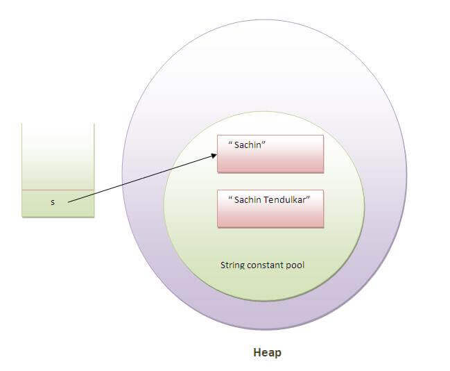
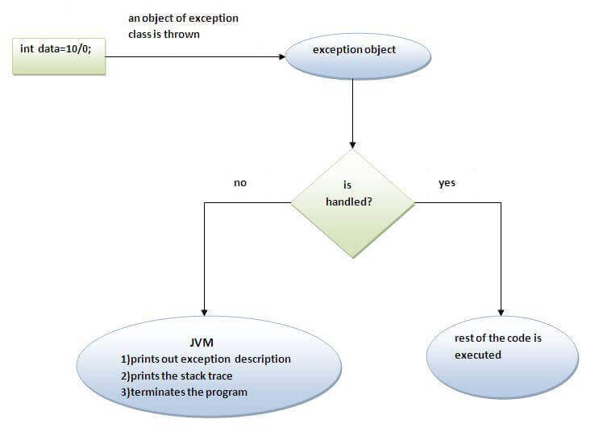
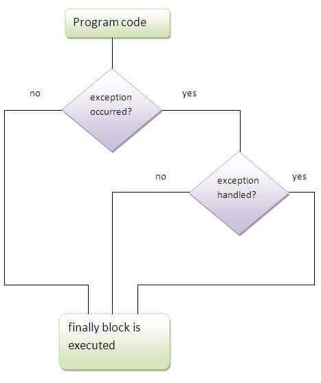
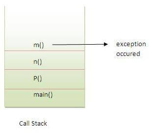
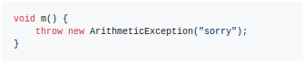
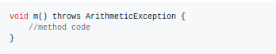
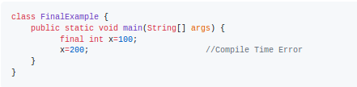
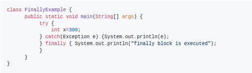
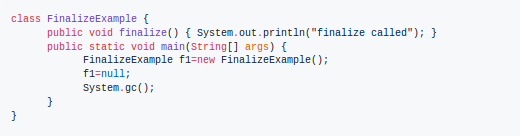

## Important Concepts

- **Java Array**

- **Object Class**

- **Wrapper Classes**

- **Command line Args**

- **Math Class**

- **Object Cloning**

## Java String

In Java, string is basically an object that represents sequence of char values. An array of characters works same as Java string.
```java
char[] ch = {'j','a','l','a','z'};  
String s1 = new String(ch);
String s2 = "jalaz";
```

`java.lang.String` class provides a lot of methods to perform operations on strings.
It implements Serializable, Comparable and CharSequence interfaces.
It is used to create a string object. s1 is created using "new" keyword and s2 is created using "string literal".

String objects are stored in a special memory area known as the "string constant pool".

Each time a `string literal` is created, JVM checks the "string constant pool" first. If the string already exists in the pool, a reference to the pooled instance is returned. If the string doesn't exist in the pool, a new string instance is created and placed in the pool.



**Immutable String**

The `CharSequence` interface is used to represent the sequence of characters. `String`, `StringBuffer` and `StringBuilder` classes implement it. We can create strings in java by using these three classes.
 - Java String is immutable.
 - For mutable strings, we use StringBuffer and StringBuilder classes.


 Immutable simply means unmodifiable or unchangeable.
 Once string object is created its data or state can't be changed but a new string object is created.

 This is for the reason that java uses the concept of string literal and stores them all in `string constant pool`. Suppose there are 5 reference variables, all refers to one object "jalaz". If one reference variable changes the value of the object, it will be affected to all the reference variables.

**String Comparision**

String in java is compared on the basis of content and reference. 3 prominent ways of achieving this:

- <ins>**equals() method**</ins>
    - Used in authentication.
    - Compares the original content of the string. It compares values of string for equality.
    - `public boolean equals(Object another)` & `public boolean equalsIgnoreCase(String another)` are 2 variations.


- <ins>**== operator**</ins>
    - Used for reference matching.
    - Compares references not values.


- <ins>**compareTo() method**</ins>
    - Used in sorting.
    - Compares values lexicographically and returns an integer value that describes if first string is less than, equal to or greater than second string.


**String Concatenation**

Forms a new string that is the combination of multiple strings. 2 ways for achieving this:

- <ins>**+ operator**</ins>
    - Also called string concatenation operator.
    - `String s = "Jalaz"+" Kumar";` is converted into `String s = (new StringBuilder()).append("Jalaz").append(" Kumar).toString();` by the JVM.


- <ins>**concat() method**</ins>
    - Achieved using `String s3 = s1.concat(s2);`  


```java
  String s1 = "Jalaz";  
  System.out.println(s1.toUpperCase());          // JALAZ  
  System.out.println(s1.toLowerCase());          // jalaz
  String s2 = "    Jalaz  "
  System.out.println(s2.trim());                 // Jalaz
  System.out.println(s1.startsWith("Ja"));       // true  
  System.out.println(s1.endsWith("n"));          // false
  System.out.println(s1.charAt(0));              // J    
  System.out.println(s1.length());               // 5  
  String s3 = "Java is a programming language. Java is a platform. Java is an Island.";    
  String s3New = s3.replace("Java","Kava");    
  System.out.println(s3New);                     // Kava is a programming language. Kava is a platform. Kava is an Island.

  String s4 = "what do you know about me";  
  System.out.println(s4.contains("do you know"));    // true
  String s5 = "ABCDEFG";  
  byte[] barr = s5.getBytes();                       // 65 66 67 68 69 70 71

  String s6 = "";  
  String s7 = "jalazkumar";  
  System.out.println(s6.isEmpty());                  // true  
  System.out.println(s7.isEmpty());                  // false

  String s8 = String.join("-","this","is","jalaz");  
  System.out.println(s8);                            // this-is-jalaz

  String s9 = "jalaz is a very good developer";  
  String s10 = s9.replace('a','e');  
  System.out.println(s10);                           // jelez is e very good developer   

  String s11 = "Jalaz is good. Jalaz is in Noida. Jalaz is coding.";  
  String s12 = s11.replaceAll("is","was");
  System.out.println(s12);                          // Jalaz was good. Jalaz was in Noida. Jalaz was coding.

  String s13 = "java string split method";
  String[] words = s13.split("\\s");                // ['java','string','split','method']

  String s14 = "hello";  
  char[] ch = s14.toCharArray();                    // ['h','e','l','l','o']  

```

**StringBuffer class**

Used to create mutable (modifiable) string. StringBuffer is synchronized i.e. thread safe. Multiple threads cannot access it simultaneously. So it is safe and will result in an order.

```java
  class StringBufferExample {  
      public static void main(String args[]) {  
          StringBuffer s1 = new StringBuffer("Hello ");  
          s1.append("Java");
          System.out.println(s1);                           // Hello Java
          StringBuffer s2 = new StringBuffer("Hello ");  
          s2.insert(1,"Java");
          System.out.println(s2);                           // HJavaello
          StringBuffer s3 = new StringBuffer("Hello");  
          s3.replace(1,3,"Java");  
          System.out.println(sb);                           // HJavalo
          StringBuffer s4 = new StringBuffer("Hello");  
          s4.delete(1,3);  
          System.out.println(s4);                           // Hlo
          StringBuffer s5 = new StringBuffer("Hello");  
          s5.reverse();
          System.out.println(s5);                           // olleH
      }  
  }
```

**StringBuilder class**

Used to create mutable (modifiable) string. Is same as StringBuffer class except that it is non-synchronized i.e. not thread safe. Available since JDK 1.5.
Major methods of StringBuffer are same here.

`StringBuilder` is more efficient than `StringBuffer`.

  |String|StringBuffer|
  |---|---|
  |Immutable|Mutable|
  |Slow and consumes more memory when you concat too many strings because every time it creates new instance|Fast and consumes less memory when you cancat strings|
  |Overrides the equals() method of Object class|Doesn't override the equals() method of Object class|


**Creating Immutable class**
Examples of immutable classes are String, Boolean, Byte, Short, Integer, Long, Float, Double etc. In short, all the wrapper classes and String class is immutable.

We can also create immutable class by creating final class that have final data members. Also, having no setters.

```java
    public final class Employee{  
        final String pancardNumber;  

        public Employee(String pancardNumber) {  
            this.pancardNumber = pancardNumber;  
        }  

        public String getPancardNumber() {  
            return pancardNumber;  
        }  
    }
```

**toString() method**:

Returns the string representation of the object.
If we print any object, java compiler internally invokes the toString() method on the object.

If we don't override the toString() method, then hashcode of address is printed.
So overriding the toString() method, returns the desired output as we like.

```java
    class StudentWithOut{  
       String name;  

       StudentWithOut(String name) {  
          this.name = name;
       }  

       public static void main(String args[]) {  
           StudentWithOut s1 = new StudentWithOut("Jalaz");
           System.out.println(s1);                   // StudentWithOut@1fee6fc
       }  
    }

    class StudentWith{  
       String name;  

       StudentWith(String name) {  
          this.name = name;
       }

       public String toString() {                     //overriding the toString() method  
          return "Students's name is "+name;  
       }   

       public static void main(String args[]) {  
           StudentWith s1 = new StudentWith("Jalaz");
           System.out.println(s1);                   // Student's name is Jalaz
       }  
    }

```

---

## Java Exception Handling
In Java, an exception is an event that disrupts the normal flow of the program.
Exception Handling is a mechanism to handle runtime errors such as ClassNotFoundException, IOException, SQLException etc.

**Introduction**

The `java.lang.Throwable` class is the root class of Java Exception hierarchy which is inherited by two subclasses: Exception and Error.


There are 3 types of Exceptions in general way:
1. Checked Exception
2. Unchecked Excepetion
3. Errors

Errors and Unchecked exceptions are treated as same by Oracle definitons.


<ins>Checked Exception:</ins>
  - All classes which directly inherit the Throwable class except RuntimeException and Error.
  - Examples: IOException, ClassNotFoundException etc.
  - Can be checked at compile-time.
  - Compiler checks whether these are handled or not. If these exceptions are not handled/declared in the program, compilation error is thrown.


<ins>Unchecked Exception:</ins>
  - All classes which directly inherit the RuntimeException class.
  - Examples: NullPointerException, ArithmeticException etc.
  - These can only be checked at run-time.

<ins>Error:</ins>
  - These are irrecoverable.
  - They indicate that something severe enough has gone wrong, the application should crash rather than try to handle the error.
  - Examples: OutOfMemoryError, StackOverflowError etc.

**Important Terminology (Keywords):**

  - `try`
     - Used to specify a block where we should place exception code.
     - Must be followed by either catch or finally. We can't use try block alone.


  - `catch`
     - Used to handle the exception.
     - Must be preceded by try block which means we can't use catch block alone.
     - Can be followed by finally block later.


  - `finally`
     - Used to execute the important code of the program.
     - Always executed whether an exception is handled or not.
     - Examples: closing connection, stream etc.
     - Can be used to put "cleanup" code such as closing a file, closing connection etc.


  - `throw`: Used to throw an exception.

  - `throws`
     - Used to declare exceptions.
     - Doesn't throw an exception, rather specifies that there may occur an exception in the method.
     - Always used with method signature.


```java
    public class JavaException {  
        public static void main(String args[]) {  
           try {   
                  int a1 = 50/0;                      //ArithmeticException
                  String s1 = null;  
                  int len = s1.length();              //NullPointerException
                  String s2 = "abc";
                  int i = Integer.parseInt(s);        //NumberFormatException
                  int a2[] = new int[5];
                  a2[10] = 50;                        //ArrayIndexOutOfBoundsException

           } catch(ArithmeticException e) {System.out.println(e);
           } catch(NullPointerException e) {System.out.println(e);
           } catch(NumberFormatException e) {System.out.println(e);
           } catch(ArrayIndexOutOfBoundsException e) {System.out.println(e);
           }
           finally {
                System.out.println("finally block is always executed");
           }  
           System.out.println("Rest code ...");  
        }  
    }  
```



`try` block can be followed by one or more `catch` blocks. Each catch block must contain a different exception handler.
   - At a time only one exception occurs and at a time only one catch block is executed.
   - All catch blocks must be ordered from most specific to most general, i.e. catch for ArithmeticException must come before catch for Exception. (If not done, then compile-time error is generated)

`finally` Block



`finally` block will not be executed if program exits (either by calling System.exit() or by causing a fatal error that causes the process to abort).

> For each try block there can be zero or more catch blocks, but only one finally block.

**Exception Propagation**
An exception is first thrown from the top of the stack and if it is not caught, it drops down the call stack to the previous method, if not caught there, the exception again drops down to the previous method, and so on until they are caught or until they reach the very bottom of the call stack.


- By default, Unchecked Exceptions are forwarded in calling chain (propagated).
- By default, Checked Exceptions are not forwarded in calling chain (propagated).




  ||throw|throws|
  |---|---|---|
  |Usage|Explicitly throwing an exception|Declaring an exception|
  |Scope|Used within the method|Used with the method signature|
  ||Used mainly with unchecked exceptions|Used mainly with checked exceptions|
  ||Can't throw multiple exceptions|Can declare multiple exceptions like `public void method()throws IOException, SQLException`|
  |Example|||


  ||final|finally|finalize|
  |---|---|---|---|
  |Usage|Applying restrictions on class, method and variable|Placing important code, for execution whether exception is handled or not|Performing clean up processing just before object is garbage collected|
  |Origin|keyword|Block|Method|
  |Example||||

<ins>**Custom Exceptions**</ins>

Creating your own Exception that is known as custom exception or user-defined exception. By the help of custom exception, we can have own exception and message.

`InvalidAgeException.java`
```java
  class InvalidAgeException extends Exception {  
      InvalidAgeException(String s){  
          super(s);
      }  
  }  
```

`Runner.java`
```java
  class Runner {  
       static void validate(int age) throws InvalidAgeException {  
           if(age<18)  
              throw new InvalidAgeException("Not valid");  
           else  
              System.out.println("Welcome to vote");  
       }  

       public static void main(String args[]) {  
          try {  
              validate(13);  
          } catch(Exception m) { System.out.println("Exception occured: "+m); }  

          System.out.println("Rest of the code ...");  
       }  
  }
```

---

## Java I/O

- **Getting Inputs from Users**

- **Handling text/data files**

- **Handling CSV files**

- **Handling JSON files**

- **Handling XML files**

## Java Networking

- **Socket Programming**

- **HttpUrlConnection**

- **Retrofit**

- **Volley**

- **Classes:**
    - `URL`
    - `URLConnection`
    - `InetAddress`
    - `DatagramSocket`

## Java Multithreading

## Java Logging

## Java Regex
This is an API to define a pattern for searching or manipulating strings.
It is widely used to define the constraint on strings such as password and email validation.

Java Regex API provides 1 interface and 3 classes in `java.util.regex` package.
   - MatchResult interface
   - Matcher class
   - Pattern class
   - PatternSyntaxException class

**Matcher class**
   - Implements the MatchResult interface
   - It is a regex engine which is used to perform match operations on a character sequence.
   - Following are the important methods:
      - boolean matches()
      - boolean find()
      - boolean find(int start)
      - String group()
      - int start()
      - int end()
      - int groupCount()


**Pattern class**
  - It is the compiled version of a regular expression.
  - It is used to define a pattern for the regex engine.
  - Following are the important methods:
      - static Pattern compile(String regex)
      - Matcher matcher(CharSequence input)
      - static boolean matches(String regex, CharSequence input)
      - String[] split(CharSequence input)
      - String pattern()


  ```java
      import java.util.regex.*;

      public class RegexExample {  
          public static void main(String args[]){  

              Pattern p = Pattern.compile(".s");  
              Matcher m = p.matcher("as");  
              boolean b1 = m.matches();  

              boolean b2=Pattern.compile(".s").matcher("as").matches();  

              boolean b3 = Pattern.matches(".s", "as");  

              System.out.println(b+" "+b2+" "+b3);               // true true true
          }
      }
  ```

**RegEx Essentials**

||Usage|
|---|---|
|^regex|match at the beginning of the line|
|regex$|match at the end of the line|
|[abc]|a, b, or c|
|[abc][vz]|can match a or b or c followed by either v or z|
|[^abc]|Any character except a, b, or c (negation)|
|[a-zA-Z]|a through z or A through Z, inclusive (range)|
|X\|Z|Finds X or Z.
|XZ|Finds X directly followed by Z|
|X?|X occurs once or not at all|
|X+|X occurs once or more times|
|X*|X occurs zero or more times|
|X{n}|X occurs n times only|
|.|Any character (may or may not match terminator)|
|\d|Any digits, short of [0-9]|
|\D|Any non-digit, short for [^0-9]|
|\s|Any whitespace character, short for [\t\n\x0B\f\r]|
|\S|Any non-whitespace character, short for [^\s]|
|\S+|Several non-whitespace characters|
|\w|Any word character, short for [a-zA-Z_0-9]|
|\W|Any non-word character, short for [^\w]|
|a(?!b)|(Negative look ahead) match "a" if "a" is not followed by "b".|

> The regex is applied on the text from left to right.

## Java JDBC

- **Introduction**


- **Connectivity**
   - MySQL
   - Oracle
   - PostGreSQL
   - MongoDB


- **Concepts**
   - Connection
   - ResultSet
   - DriverManager
   - Statementtatement
   - CallableStatement
   - Storing & Retrieving Images
   - Storing & Retrieving Files


- **Transaction Management**

- **Batch Processing**
