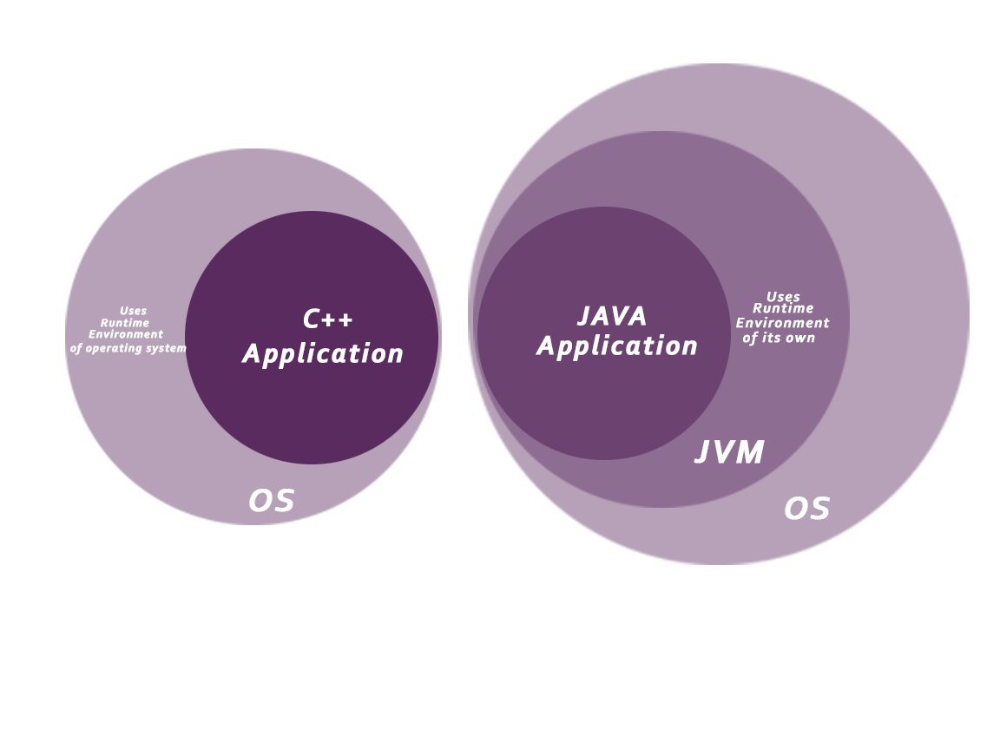

Java is a `high level`, `robust`, `object-oriented` and `secure` programming language. Developed by Sun Microsystems - 1995. James Gosling is known as the father of Java. Before Java, its name was Oak.       

Java is a programming language and a platform. Any hardware or software environment in which a program runs, is known as a platform. Since Java has a runtime environment (JRE) and API, it is called a platform.

According to Sun, 3 billion devices run Java.
The current stable release of Java is `Java SE 10`.

There are mainly 4 types of applications that can be created using Java programming:
- <ins>**Standalone Application**</ins> (Desktop Applications)       
Traditional software that we need to install on every machine.
Examples: Media player, Antivirus
AWT and Swing are used in Java for creating standalone applications.

- <ins>**Web Application**</ins>       
Runs on the server side and creates a dynamic page on client.
Servlet, JSP, Struts, Spring, Hibernate, JSF, etc. are used for creating web applications.

- <ins>**Enterprise Application**</ins>       
An application that is distributed in nature. Offers benefits like high-level security, load balancing, and clustering.
Examples: Banking Applications
In Java, EJB is used for creating enterprise applications.

- <ins>**Mobile Application**</ins>       
Application created for mobile devices.
Currently, Android and Java ME are used for creating mobile applications.

**Java Platforms:**
- <ins>Java SE</ins> (Java Standard Edition)
    - Java programming platform
    - Includes Java programming APIs such as java.lang, java.io, java.net, java.util, java.sql, java.math etc.
    - Includes core topics like OOPs, String, Regex, Exception, Multithreading, I/O Stream, Networking, Collection, etc.


- <ins>Java EE</ins> (Java Enterprise Edition)
    - An enterprise platform which is mainly used to develop web and enterprise applications.
    - Built on the top of the Java SE platform.
    - Includes topics like Servlet, JSP, Web Services, EJB, JPA, etc.


- <ins>Java ME</ins> (Java Micro Edition)
  Micro platform which is mainly used to develop mobile applications.

- <ins>JavaFX</ins>
  Used to develop rich internet applications. It uses a light-weight user interface API.

**Java Features:**


- <ins>Object-Oriented</ins>:
   - Everything in Java is an object.
   - Software is organised as a combination of various objects which incorporate both data and behavior.
   - Basic concepts of OOPs are: Object, Class, Inheritance, Polymorphism, Abstraction, Encapsulation


- <ins>Simple</ins>:
   - Very easy to learn
   - Java syntax is based on C++
   - Many complicated and rarely-used features like pointers, operator overloading, etc are removed.
   - Automatic Garbage Collection in Java allows better handling of unreferenced objects.


- <ins>Secured</ins>:
   - No explicit usage of pointers
   - Java Programs run inside a virtual machine sandbox
   - Classloader in Java is a part of the JRE which is used to load Java classes into the Java Virtual Machine dynamically. It adds security by separating the package for the classes of the local file system from those that are imported from network sources.
   - Bytecode Verifier checks if any illegal code that can violate access right to objects.
   - Security Manager determines what resources a class can access such as reading and writing to the local disk.
   - Application developer can explicitly enhance security through SSL, Cryptography, etc.
   


- <ins>Platform independent</ins>:
   - Other languages like C, C++ are platform dependent as they compile into platform-specific machine. C++ source file in Windows compiles into .exe file & in Linux as .out file.
   - Java platform is a software-based platform that runs on the top of other hardware-based platforms. It has two components: JRE & API. Java code is compiled by the compiler and converted into bytecode. This bytecode is a platform-independent code because it can be run on multiple platforms, i.e., Write Once and Run Anywhere(WORA).


- <ins>Robust</ins>:
   - Uses very strong memory management.
   - No usage of pointer enhances security.
   - Automatic garbage collection which runs on the JVM to get rid of non-referenced objects.
   - Good exception handling and type checking mechanism makes Java Robust(Strong).


- <ins>Portable:</ins>
Facilitates carrying the Java bytecode to any platform, without requiring any pre-implementation.


- <ins>Architecture neutral</ins>:
   - No implementation dependent features.
   - In C programming, int data type occupies 2 bytes of memory for 32-bit architecture and 4 bytes of memory for 64-bit architecture. However, it occupies 4 bytes of memory for both 32 and 64-bit architectures in Java.


- <ins>Dynamic</ins>:
   - Supports dynamic loading of classes. It means classes can be loaded on demand.
   - Also supports functions from its native languages, i.e., C and C++.


- <ins>Interpreted</ins>:
   - Java is an interpreted language that is why it is slower than compiled languages, e.g., C, C++, etc.
   - Java is faster than other traditional interpreted programming languages like python because Java bytecode is "close" to native code.


- <ins>High Performance<ins>:


- <ins>Multithreaded</ins>:
   - A thread is like a separate program, executing concurrently. We can write Java programs that deal with many tasks at once by defining multiple threads.
   - Main advantage is that it doesn't occupy memory for each thread. It shares a common memory area.
   - Important for multi-media applications, web services etc.


- <ins>Distributed:</ins>
Facilitates developers to create distributed applications using RMI and EJB.

`C++ VS Java`

|Feature|Java|C++|
|---|---|---|
||Platform-independent.|Platform-dependent.|
|Major Usage|Application Programming|System Programming|
|Multiple inheritance|Doesn't support through class. Can be achieved by interfaces|Supports|
|Goto|Doesn't Support|Supports|
|Operator Overloading|Doesn't Support|Supports|
|Pointers|Restricted support. Supports internally. Can't write a pointer program|Fully supports. Can write pointer program|
||Uses compiler and interpreter both|Uses compiler only|
||Supports call by value only. No concept of call by reference|Supports both call by value and call by reference|
|Structure & Unions|Doesn't Support|Supports|
|Thread Support|Has built-in thread support.|Doesn't have built-in support for threads. It relies on third-party libraries for thread support|
|Virtual Keyword|Has no virtual keyword. All non-static methods are virtual by default|Supports virtual keyword so that we can decide whether or not override a function|
|Inheritance Tree|Uses a single inheritance tree always because all classes are the child of `Object` class|Creates a new inheritance tree always|
|Hardware|Not so interactive with hardware|Nearer to hardware|
|Object-oriented|Yes. Everything (except fundamental types) is an object in Java|Yes|
|Header files|Doesn't support. Uses import statements|Supports|

**Setting up Java Environment**
1. Install Java JDK in local system.
2. Set path of Java (jdk/bin) in Environment Variables(Windows) & .bashrc file(Linux)
3. Verify Java setup using `java --version` && `javac --version`

```java
    class Intro {  
        public static void main(String args[]) {  
         System.out.println("Hello, JayKay12 Tech!");  
        }  
    }  
```
1. Compile the source file into bytecode using `javac Simple.java`
2. Execute the bytecode using `java Simple`


**Most Basic Details:**
   - `class` keyword is used to declare a class in java.
   - `public` keyword is an access modifier which represents visibility.
   - `static` is a keyword. Advantage is that there is no need to create an object to invoke the static method. The main method is executed by the JVM, so it doesn't require to create an object to invoke the main method. So it saves memory.
   - `void` is the return type of the method. It means it doesn't return any value.
   - `main` represents the starting point of the program.
   - `String[] args` is used for command line argument.
   - `System.out.println()` is used to print statement. Here, System is a class, out is the object of PrintStream class, println() is the method of PrintStream class.

**Valid java main method signature:**

    public static void main(String[] args)  
    public static void main(String []args)  
    public static void main(String args[])  
    public static void main(String... args)  
    static public void main(String[] args)  
    public static final void main(String[] args)  
    final public static void main(String[] args)  
    final strictfp public static void main(String[] args)  

**Invalid java main method signature:**

    public void main(String[] args)  
    static void main(String[] args)  
    public void static main(String[] args)  
    abstract public static void main(String[] args)

**Runtime Execution of bytecode**


 - We can execute `javac Jalaz.java` having class "Tech" which after compilation will result into bytecode as `Tech.class`. But this class need not be public.

 - We can have multiple classes in a single file, each one after compiling source file will form a bytecode as `A.class`, `B.class` & `C.class`

**JDK, JRE & JVM :**

> JVM, JRE, and JDK are platform-dependent because the configuration of each OS is different from each other. Java is platform-independent.

- JVM
   - `Java Virtual Machine`
   - Virtual machine because it doesn't physically exist.
   - Provides a runtime environment in which Java bytecode can be executed. It can also run those programs which are written in other languages and are compiled to Java bytecode.
   - Performs the following main tasks:
      - Loads code
      - Verifies code
      - Executes code
      - Provides runtime environment


- JRE
   - `Java Runtime Environment`
   - Implementation of JVM
   - It physically exists. It contains a set of libraries + other files that JVM uses at runtime.
   - It is used to provide the runtime environment.


- JDK
   - `Java Development Kit`
   - A software development environment which is used to develop Java applications and applets. It physically exists. It contains JRE + development tools.
   - JDK contains a private JVM and a few other resources such as an interpreter/loader (java), a compiler (javac), an archiver (jar), a documentation generator (Javadoc), etc. to complete the development of a Java Application.


**JVM Details :**

- JVM is a specification where working is specified.
- JVM's implementation is called JRE.
- JVM is a runtime instance whenever we run java bytecode using `java XYZ.class`


JVM provides definitions for the
   - Memory area
   - Class file format
   - Register set
   - Garbage-collected heap
   - Fatal error reporting etc.


`Classloader`:
Subsystem of JVM which is used to load class files. 3 built-in classloaders in Java:
   - <ins>Bootstrap ClassLoader</ins>: Loads the rt.jar file which contains all class files of Java SE like java.lang, java.net, java.util, java.io etc.
   - <ins>Extension ClassLoader</ins>: Loads the jar files located inside $JAVA_HOME/jre/lib/ext directory.
   - <ins>System/Application ClassLoader</ins>: Loads the classfiles from classpath.

If you want to create your own classloader, you need to extend the ClassLoader class.

`Class(Method) Area`:
Stores per-class structures such as the runtime constant pool, field and method data, the code for methods.

`Heap`:
The runtime data area in which objects are allocated.

`Stack`:
Stores frames. Holds local variables and partial results, and plays a part in method invocation and return. Each thread has a private JVM stack, created at the same time as thread.       
A new frame is created each time a method is invoked. A frame is destroyed when its method invocation completes.

`Program Counter Register`:
Contains the address of the JVM instruction currently being executed.

`Execution Engine`:
Comprises of a virtual processor, *Interpreter*: Reads bytecode stream then execute the instructions) & *Just-In-Time(JIT) compiler*: Used to improve the performance. JIT compiles parts of the byte code that have similar functionality at the same time, and hence reduces the amount of time needed for compilation
