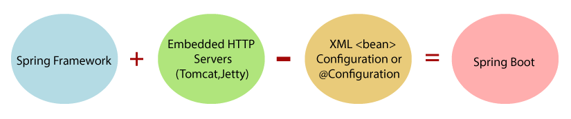
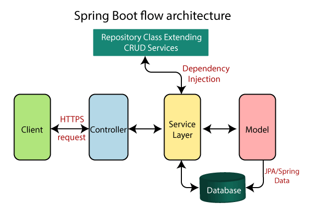

Spring Boot is an open-source micro framework maintained by a company called Pivotal. This is used to build `stand-alone`, `auto-configurable` and `production-ready` Spring Applications.



- Provides an easier and faster way to set up, configure, and run both simple and web-based applications.

- It is basically a Spring module that provides the RAD (Rapid Application Development) feature to the Spring Framework.

**Goals of Spring Boot:**

- Reduces development, unit testing, and integration testing time.
- Avoids defining more Annotation & XML Configuration.
- Avoids writing lots of import statements.

By achieving these, Spring Boot framework reduces development time, developer's effort, and increases productivity.

**Notable features of Spring Boot:**

- `Autoconfiguration`: Developers can manually configure their Spring application. However when not done, Spring Boot can change the configuration based on the listed dependencies.
For Eg: If "MySQL" is listed in dependencies, & connection configuration classes are not defined, then it will configure your Spring application with the “MySQL connector”.

- `Standalone`: No need to deploy the application to a web server. Simply enter the run command to start the application.

- `Opinionated`: Spring Boot decides itself the defaults to be used for the configuration. Also, it decides which packages to install for the required dependencies.
For Eg: If Spring Boot starter “pom” for “JPA” is listed, it will autoconfigure an in-memory database, a hibernate entity manager, and a simple data source. This opinionated default configuration can be overridden.

**Advantages of Spring Boot:**

- Makes use of Java, which is one of the most popular programming languages in the world.
- Acts as really good tool for creation & deployment of production-grade applications quickly without worrying about setting up tricky configurations.
- Helps to autoconfigure all components for a production-grade Spring application.
- Avoids writing lots of boilerplate code, annotations, and XML configuration.
- Comes with embedded HTTP servers like Tomcat or Jetty to test web applications.

**Limitations of Spring Boot:**

- The opinionated style installs many extra dependencies it assumes you’ll need. Due to which the deployment binary size can become very large.
- The Spring Boot artifact can be directly deployed into Docker containers. This is great for quickly creating microservices. However, Since the framework has been built to be agile and lightweight, it should therefore not be used for monolithic applications.
- It's quite a struggle to upgrade legacy spring code to spring boot.

**Spring V/S Spring Boot:**

`Spring Framework`:
- A lightweight & widely-used Java EE framework for building applications.
- Aims to simplify Java EE development which makes developers more productive.
- Primary feature is **Dependency Injection** _(Inversion of Control)_ through which it provides flexibility.
- Simplication is achieved by allowing to develop loosely coupled applications.
- Has support for both XML and annotation configuration.
- A lot of code (boilerplate code) needs to be written for doing the minimal task.
- Does not provide support for an in-memory database.
- For testing the Spring project, server needs to be setup explicitly.
- Developers manually define dependencies for the Spring project in pom.xml file.

`Spring Boot Framework` :
- An integration framework widely used to develop REST APIs.
- Built on top of the Spring framework, and it comes with many dependencies that can be plugged into the Spring application.
- Focuses on shortening the code length & provides easiest way to develop Web Applications.
- Primary feature is **Autoconfiguration**. It automatically configures the classes based on the requirement.
- Helps to create a stand-alone application with less configuration.
- Reduces boilerplate code.
- Provides with an easy way to run the Spring application.
- Offers embedded server such as Jetty and Tomcat, etc for testing the project.
- Offers several plugins for working with an embedded and in-memory database such as H2.
- Comes with the concept of starter in pom.xml file that internally takes care of downloading the dependencies JARs based on the requirement.

---

**Layers in Spring Boot:**
- Presentation Layer : _{Handles HTTP Requests | Authentication | JSON Transactions | Front-End Views}_

- Business Layer : _{Handles Business Logic | Authorization | Validation}_

- Persistence Layer : _{Handles Storage Logic | Translates Business Objects from and to DB Rows}_

- Database Layer : _{Actual Database | CRUD (create, retrieve, update, delete) operations}_



## Annotations

Annotations is a form of metadata that provides data about a program. These are used to provide supplemental information about a program.

**Core Spring Framework Annotations :**

- `@Required`: Applies to the bean setter method. Indicates that the annotated bean must be populated at configuration time with the required property.

```java
    public class Car {  
        private Integer cost;  

        @Required  
        public void setCost(Integer cost) {  
            this.cost = cost;  
        }      
    }  
```

- `@Autowired`: Is used to autowire spring bean on setter methods, instance variable, and constructor.

```java
    @Component  
    public class Customer {
        private Person person;  

        @Autowired  
        public Customer(Person person) {   
            this.person = person;
        }  
    }  
```

- `@Configuration`: Class-level annotation | Used as a source of bean definitions.

- `@ComponentScan`: Used to scan a package for beans. Used with the annotation _@Configuration_

```java
    @ComponentScan(basePackages = "tech.jaykay12")  
    @Configuration  
    public class Car {  
        // ...
    }  
```

- `@Bean`: Method-level annotation | Alternative of XML <bean> tag. Tells the method to produce a bean to be managed by Spring Container.

```java
    @Bean  
    public Car createCarObject() {  
        return new Car();  
    }  
```

**Spring Framework Stereotype Annotations :**

**Spring Boot Annotations :**

- `@EnableAutoConfiguration`: Auto-configures the bean that is present in the classpath and configures it to run the methods. Usage reduced now.

- `@SpringBootApplication`: A combination of three annotations _@EnableAutoConfiguration_, _@ComponentScan_, and _@Configuration_.

**Spring MVC and REST Annotations :**
