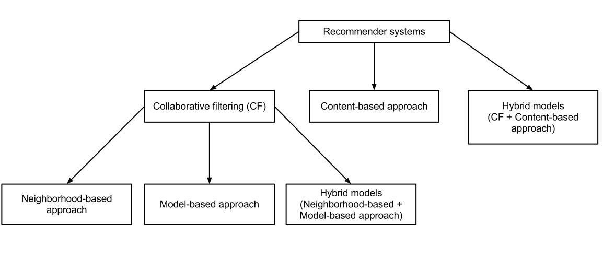

Recommender System are a subclass of information filtering system that seeks to predict the "rating" or "preference" a user would give to an item.      

Major Examples:
- Playlist generators for video and music services like Netflix, YouTube and Spotify.
- Product recommenders for services such as Amazon and IndiaMART.
- Content recommenders for social media platforms like Facebook and Twitter.

Recommender System makes use of either or both of Collaborative filtering-based approach & content-based approach. Nowadays, Knowledge-based system approach is also in use.

**Collaborative filtering** approaches build a model from a user's past behavior (items previously purchased or selected and/or numerical ratings given to those items) as well as similar decisions made by other users.      
_Major example is Last.fm._      
Last.fm creates a "station" of recommended songs by observing what bands and individual tracks the user has listened to on a regular basis and comparing those against the listening behavior of other users.

**Content-based filtering** (Personality-based) approaches utilize a series of discrete, pre-tagged characteristics of an item in order to recommend additional items with similar properties.       
_Major example is Pandora Music._       
Pandora uses the properties of a song or artist to seed a "station" that plays music with similar properties. User feedback is used to refine the station's results, deemphasizing certain attributes when a user "dislikes" a particular song and emphasizing other attributes when a user "likes" a song.

## Collaborative Filtering

Collaborative filtering is based on the assumption that people who agreed in the past will agree in the future, and that they will like similar kinds of items as they liked in the past.
By locating peer users/items with a rating history similar to the current user or item, they generate recommendations using this neighborhood.
Thus Collaborative filtering has 2 approaches: item-item based CF & user-user based CF.

**Advantages :**
1. Does not rely on machine analyzable content and therefore it is capable of accurately recommending complex items such as movies without requiring an "understanding" of the item itself.
2. It's scope is unlimited in nature.     

**Drawbacks :**
1. **_Cold start:_** For a new user or item, there isn't enough data to make accurate recommendations.
2. **_Scalability:_** In many of the environments in which these systems make recommendations, there are millions of users and products. Thus, a large amount of computation power is often necessary to calculate recommendations.
3. **_Sparsity:_** The number of items sold on major e-commerce sites is extremely large. The most active users will only have rated a small subset of the overall database. Thus, even the most popular items have very few ratings.

**Data Collection Strategies behind Recommenders:**
- Explicit Data Collection:
   - Asking for user ratings
   - User's search pattern
   - User's playlist or shopping lists
   - Presenting 2 items & let him choose 1 of the two     

- Implicit Data Collection:
   - Analyse user's social media & discovering similar likes/dislikes
   - Clickstream data for user's engangement on platform
   - User's order history or watch history

## Context-based Filtering
Based mainly on item's description and user profile's preferences. These methods are best suited to situations where there is known data about item, but not on the user. In this, the recommeder is basically a classifier acting on user-specific classifification problem which acts on user's likes and dislikes based on an item's feature.     

In this approach, item is decsribed using keywords(good,bad,excellent) & user profile is created to indicate the type of items liked by user. These algorithms try to recommend items that are similar to those that a user liked in the past, or is examining in the present. This approach has its roots in information retrieval and information filtering research.     

To create a user profile, the system mostly focuses on two types of information:
1. A model of the user's preference.
2. A history of the user's interaction with the recommender system.

**Advantages :**
1. Needs very little information to start

2. These can also include opinion-based recommender systems. These user-generated texts in the form of feedback or reviews are implicit data for the recommender as these are rich source of items' feature & users' sentiments to the item.

**Drawbacks :**
1. These are far more limited in scope (for example, it can only make recommendations that are similar to the original seed).

2. Key issue with this approach is whether the system is able to learn user preferences from users' actions regarding one content source and use them across other content types. For example, recommending news articles based on browsing of news is useful, but would be much more useful when music, videos, products, discussions etc. from different services can be recommended based on news browsing.

## Other prominent approaches

1. **Opinion-based Recommendations** : _Discussed earlier_

2. **Hybrid Recommendations** : Most recommender systems now use a hybrid approach, combining collaborative filtering, content-based filtering, and other approaches.
_**Netflix**_ is the best example of hybrid recommender systems. The platform makes recommendations by comparing the watching and searching habits of similar users (i.e., collaborative filtering) as well as by offering movies that share characteristics with films that a user has rated highly (content-based filtering).

3. **Mobile Recommender Systems** : _(Location-based Recommendations)_      
Mobile recommender systems make use of internet-accessing smart phones to offer personalized, context-sensitive recommendations. The 3 factors that affect these recommenders & their prediction accuracy: the context, the recommendation method and privacy.
_**Uber**_ makes the best usage of mobile recommenders for generating traffic routes for drivers. It uses GPS data of drivers to recommend a list of pickup points along a route, with the goal of optimizing occupancy times and profits.

4. **Knowledge-base Systems**: _Will be discussed later_

## Details of Collaborative Filtering

The motivation for collaborative filtering comes from the idea that people often get the best recommendations from someone with tastes similar to themselves. This technique can filter out items that a user might like on the basis of reactions by similar users.

**Requirements of CF Recommenders:**
- users' active participation
- an easy way to represent users' interests
- algorithms that are able to match people with similar interests.

**Work-flow of simple CF:**
1. A user expresses his or her preferences by rating items. These ratings are an approximate representation of user's interest in the item.
2. The system matches this user's ratings against other users' and finds the people with most "similar" tastes.
3. With similar users, the system recommends items that the similar users have rated highly but not yet being rated by this user.

**Dataset:**    
Data that contains a set of items and a set of users who have reacted to some of the items.
This matrix is called user-item matrix. A matrix with mostly empty cells is called sparse, and the one with mostly filled cells is called dense.

**Phases of CF:**    
For building a system that can automatically recommend items to users based on the preferences of other users, 2 steps are there:

1. Finding similar users or items

2. Predicting the ratings of the items that are not yet rated by a user.     

For achieving both these phases, there is no single way.
CF is a family of algorithms where there are multiple ways to find similar users or items and multiple ways to calculate rating based on ratings of similar users.

One important thing to keep in mind is that in an approach based purely on collaborative filtering, the similarity is not calculated using factors like the age of users, genre of the movie, or any other data about users or items. It is calculated only on the basis of the rating (explicit or implicit) a user gives to an item. For example, two users can be considered similar if they give the same ratings to ten movies despite there being a big difference in their age.

#### Approaches of Collaborative-Filtering

- Memory-based approaches     
Algorithms in which statistical techniques are applied to the entire dataset to calculate the predictions.

    - User-Based Collaborative Filtering (_Will be discussed in detail_)
    - Item-Based Collaborative Filtering (_Will be discussed in detail_)

- Model-based approaches which involve a step to reduce or compress the large but sparse user-item matrix. For sparse matrix, Dimensionality Reduction is used & achieved using Matrix factorization, Autoencoders, Single Value decompositions etc.

**User-Based Collaborative Filtering:**

To find the rating **R** that a user **U** would give to an item **I**, the approach includes:

1. Finding users similar to **U** who have rated the item **I**.
2. Calculating the rating **R** based on the ratings of users found in Step 1.
