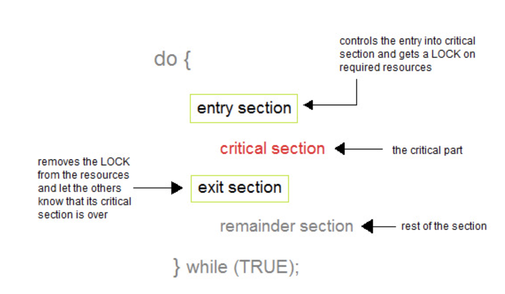

- `Multiprocessing` and `Multithreading` -> Used to achieve `Multitasking`.
- Multithreading in Java is a process of executing multiple threads simultaneously. Although on the CPU world, there is lot of context switch happening behind the scenes depending upon the cores, but to the application world, this looks like simulatenous executions.
- Java Multithreading is heavily used in games, animation, etc.

### Multitasking

  Process of executing multiple tasks simultaneously. We use multitasking to utilize the CPU.


  - <ins>**Process-based Multitasking**</ins>
      - `Multiprocessing`
      - Process is an instance of the program under execution.
      - Each process has an address in memory. In other words, each process gets allocated a separate memory area. (Heap memory)
      - Cost of communication between the process is high.
      - Switching from one process to another requires some time for saving and loading registers, memory maps, updating lists, etc.
      - Eg, Web browser and music player. The user can browse the internet on the web browser while listen to the music in the music player without any delay or interruption.

  - <ins>**Thread-based Multitasking**</ins>
      - `Multithreading`
      - A thread is a lightweight sub-process, is the smallest unit of processing.
      - Threads share the same address space. (Heap memory)
      - Cost of communication between the thread is low.
      - Threads are independent, so it doesn't affect other threads if an exception occurs in a single thread.
      - In the video player application, one thread might be responsible for playing the video while another thread handles the subtitles.


## Memory Explaination


```
Multithreading and concurrency are important concepts in Java that allow for efficient use of system resources and better performance in multi-tasking applications.
Supported through the use of threads and synchronization mechanisms such as locks, semaphores, and monitors.
```

Multithreading can help improve the responsiveness of a program by allowing it to continue running while performing other tasks in the background.
Concurrency, on the other hand, refers to the ability of multiple threads to access shared resources simultaneously.
Basically, `Concurrency helps us do MultiThreading in a failsafe manner`


## Java Multithreading

  - <ins>**Life cycle of a Thread**</ins>
    - The life cycle of the thread in java is controlled by JVM.
    - A thread can be in one of the five states:
       1. `new`: Instance created of Thread class but start() not called
       2. `runnable`: start() is called but thread scheduler hasn't selected it to be the running thread.
       3. `running`: Once thread scheduler has selected it to be the running thread.
       4. `non-runnable`: when the thread is still alive, but is currently not eligible to run
       4. `terminated`: run() has exited.

  

  - <ins>**Thread Scheduler**</ins>
    - Part of the JVM which decides the thread that should be run.
    - No guarantee that which runnable thread will be chosen to run by the thread scheduler.
    - Only one thread at a time can run in a single process.
    - Mainly uses `preemptive` or `time slicing` scheduling to schedule the threads.
       - <ins>Preemptive scheduling</ins>: The highest priority task executes until it enters the waiting or dead states or a higher priority task comes into existence.
         
       - <ins>Time slicing scheduling</ins>: A task executes for a predefined slice of time and then re-enters the pool of ready tasks. The scheduler then determines which task should execute next, based on priority and other factors.

 #### Creating Threads in Java

There are 2 ways to carry out multi-threading in java:
 
1. Extending the `Thread class`
  - Should be extended by any class whose instances are intended to be executed by a thread
  - Internally implements Runnable interface.
  - Useful methods:
    - _public void start()_
    - _public void run()_
    - _public void sleep(long miliseconds)_
    - _public void join(long miliseconds)_
    - _public Thread currentThread()_
    - _public Thread.State getState()_
    - _public void setDaemon(boolean b)_
    - _public void interrupt()_

2. Implementing the `Runnable interface`
  - Should be implemented by any class whose instances are intended to be executed by a thread.
  - Only 1 method: _public void run()_


Starting a thread: start() method of Thread class is used to start a newly created thread. Following tasks are done:
  - New thread is started with new callstack.
  - thread state moves from new -> runnable.
  - On getting scheduled by Thread scheduler, JVM internally calls the run() method and state moves from runnable -> running.

- Achieving Multithreading using `Thread class`

```java
class SimpleThread1 extends Thread {  
  public void run() {  
    System.out.println("Task 1 Running");  
  }  
}  

class SimpleThread2 extends Thread {  
  public void run(){  
    System.out.println("Task 2 Running");  
  }  
}  

class ThreadClassUsage {  
  public static void main(String args[]) {  
    SimpleThread1 t1 = new SimpleThread1();  
    SimpleThread2 t2 = new SimpleThread2();  

    t1.start();  
    t2.start();  
  }  
}
```

- Creating a thread using `Runnable interface`

```java
class RunnableUsage1 implements Runnable {  
  public void run() {  
    System.out.println("Task 1 Running");  
  }
}

class RunnableUsage2 implements Runnable {  
  public void run() {  
    System.out.println("Task 2 Running");  
  }
}
  
class RunnableInterfaceUsage { 
  public static void main(String args[]) {  
    Runnable r1 = new RunnableUsage1();
    Runnable r2 = new RunnableUsage2();   
    Thread t1 = new Thread(r1);
    Thread t2 - new Thread(r2);
    t1.start();
    t2.start();
  }  
}
```

- <ins>**Important points**</ins>
  - After starting a thread, it can never be started again. If one does so, an `IllegalThreadStateException` is thrown.
  - Since Java doesn't support multiple inheritence, so recommended way of implementing multi-threading is using the Runnable Interface.

  - If directly run() is called, instead of JVM invoking it implicitedly after start() then, the run() method goes onto the current call stack rather than at the beginning of a new call stack. There will be no context-switching as they will be treated as normal object not thread object.


#### Sleeping, Joining, Naming and Setting priority of Threads:

- Default priority of a thread is 5 (NORM_PRIORITY). The value of MIN_PRIORITY is 1 and the value of MAX_PRIORITY is 10.

    ```java
    class SampleThread extends Thread {  
       public void run() {  
          for(int i=1;i<=5;i++){  
             try{  
              Thread.sleep(500);  
             } catch(Exception e) {System.out.println(e); }  
          System.out.println(Thread.currentThread().getName() + " printing: " +i);  
          }  
     }

        public static void main(String args[]) {  
           SampleThread t1 = new SampleThread();  
           SampleThread t2 = new SampleThread();  
           SampleThread t3 = new SampleThread();
           t1.setName("MainThread");
           t2.setPriority(Thread.MIN_PRIORITY);  
           t3.setPriority(Thread.MAX_PRIORITY);
           
           t1.start();  
           try {  
             t1.join();  
           } catch(Exception e){ System.out.println(e); }


           t2.start();  
           t3.start();  
         }  
    }
    ```

    `OUTPUT`
    ```bash
    MainThread printing: 1
    MainThread printing: 2
    MainThread printing: 3
    MainThread printing: 4
    MainThread printing: 5
    Thread-1 printing: 1
    Thread-2 printing: 1
    Thread-1 printing: 2
    Thread-2 printing: 2
    Thread-1 printing: 3
    Thread-2 printing: 3
    Thread-1 printing: 4
    Thread-2 printing: 4
    Thread-1 printing: 5
    Thread-2 printing: 5
    ```


  - <ins>**Daemon Threads**</ins>
    - Service provider thread that provides services to the user thread.
    - It's life depend on the mercy of user threads i.e. when all the user threads dies, JVM terminates this thread automatically.
    - gc, finalizer etc are java daemon threads running automatically.
    - It provides services to user threads for background supporting tasks. It has no role in life than to serve user threads.
    - It is a low priority thread.
    - _public void setDaemon(boolean status)_ & _public boolean isDaemon()_ are 2 methods.


  - <ins>**Thread Pool**</ins>
    - Represents a group of worker threads that are waiting for the job and can be reused many times.
    - Improves performance as there is no need to create new thread and thus, saves time.
    - Used in Servlet and JSP where container creates a thread pool to process the incoming requests.

    `WorkerThread.java`
    ```java
    class WorkerThread implements Runnable {  
        private String message;  
        public WorkerThread(String s) {  
            this.message = s;  
        }

         public void run() {  
            System.out.println(Thread.currentThread().getName()+" (Start) message = "+message);  
            processmessage();
            System.out.println(Thread.currentThread().getName()+" (End)");     //prints thread name  
        }

        private void processmessage() {  
            try {  Thread.sleep(2000);  } catch (InterruptedException e) { e.printStackTrace(); }  
        }  
    }
    ```

    `ThreadPoolExample.java`
    ```java
    import java.util.concurrent.ExecutorService;
    import java.util.concurrent.Executors;

    public class TestThreadPool {  
         public static void main(String[] args) {  
            ExecutorService executor = Executors.newFixedThreadPool(5);  
            for (int i = 0; i < 10; i++) {
                Runnable worker = new WorkerThread("" + i);  
                executor.execute(worker);
              }  
            executor.shutdown();  
            while (!executor.isTerminated()) {   }  

            System.out.println("Finished all operations");  
        }  
    }  
    ```

    `OUTPUT`
    ```bash
    pool-1-thread-1 (Start) message = 0
    pool-1-thread-2 (Start) message = 1
    pool-1-thread-3 (Start) message = 2
    pool-1-thread-5 (Start) message = 4
    pool-1-thread-4 (Start) message = 3
    pool-1-thread-2 (End)
    pool-1-thread-2 (Start) message = 5
    pool-1-thread-1 (End)
    pool-1-thread-1 (Start) message = 6
    pool-1-thread-3 (End)
    pool-1-thread-3 (Start) message = 7
    pool-1-thread-4 (End)
    pool-1-thread-4 (Start) message = 8
    pool-1-thread-5 (End)
    pool-1-thread-5 (Start) message = 9
    pool-1-thread-2 (End)
    pool-1-thread-1 (End)
    pool-1-thread-4 (End)
    pool-1-thread-3 (End)
    pool-1-thread-5 (End)
    Finished all operations
    ```

  - <ins>**Thread Group**</ins>
    - Its required to group multiple threads in a single object.
    - Using this, we can suspend, resume or interrupt group of threads by a single method call.
    - Java thread group is implemented by `java.lang.ThreadGroup class`
    - A thread group can also include the other thread group.
    - 2 constructors for creating thread group: _ThreadGroup(String name)_ & _ThreadGroup(ThreadGroup parent, String name)_

    - Useful methods:
        - _void checkAccess()_
        - _int activeCount()_
        - _void destroy()_
        - _int getMaxPriority()_
        - _String getName()_
        - _void interrupt()_
        - _void list()_

    ```java
    public class ThreadGroupExample implements Runnable {  
        public void run() {  
              System.out.println(Thread.currentThread().getName());  
        }

        public static void main(String[] args) {  
            Runnable runnable = new ThreadGroupExample();  
            ThreadGroup tg1 = new ThreadGroup("Jalaz Thread group");  
            Thread t1 = new Thread(tg1, runnable, "First Thread");  
            t1.start();  
            Thread t2 = new Thread(tg1, runnable, "Second Thread");  
            t2.start();

            System.out.println("Thread Group Name: "+tg1.getName());  
            tg1.list();  

        }  
    }
    ```
    
    `OUTPUT`
    ```bash
    First Thread
    Second Thread
    Thread Group Name: Jalaz Thread group
    java.lang.ThreadGroup[name=Jalaz Thread group,maxpri=10]
    ```

  - <ins>**Garbage Collection**</ins>
     - In java, garbage means unreferenced objects.

     - Garbage Collection is process of reclaiming the runtime unused memory automatically.

     - We use `free()` function in C and `delete()` in C++. But, in java it is performed automatically. So, java provides better memory management.

     - There are 3 ways of unreferencing objects:
        - By nulling the reference
        - By assigning a reference to another
        - By anonymous object etc.

     - we can use `finalise()` or `gc()` for garbage collection.

     - Neither finalization nor garbage collection is guaranteed.    


  - <ins>**Java Runtime class**</ins>
     - Is used to interact with java runtime environment.

     - There is only one instance of `java.lang.Runtime class` available for one java application.

     - Provides methods to execute a process, invoke GC, get total and free memory etc.

     ```java
     public class RunTimeExample {  
          public static void main(String args[]) throws Exception {  
               Runtime r = Runtime.getRuntime();
               System.out.println("Total Memory: " + r.totalMemory());                                         // 100139008
               System.out.println("Free Memory: " + r.freeMemory());                                           // 99474824

               for(int i=0;i<10000;i++)
                  new MemoryTest();  

               System.out.println("After creating 10000 instance, Free Memory: "+r.freeMemory());              // 99310552
               System.gc();  
               System.out.println("After gc(), Free Memory: "+r.freeMemory());                                 // 100182832
          }  
     }
     ```

## Concurrency & Synchronization

There are multiple synchronization mechanisms in java which helps implement concurrency:

- Synchronization
- Semaphors & Monitors
- Atomic Operations

Synchronization is the capability to control the access to any shared resource. Used when we want to allow only one thread to access the shared resource.
It prevents thread interference & prevent consistency issues. (Inconsistent writes, deadlocks & race conditions)

2 Types of Synchronization is required in the industry tech:
  - Process Synchronization
  - Thread Synchronization

In Process synchronization ,we share system resources between processes in a such a way that, concurrent access to the shared data is handled properly thereby minimizing the chance of inconsistent data.


Critical section problem is the prevalent problem in synchronization.



Any solution to CS problem requires to follow these 3 conditions:
1. Mutual Exclusion
2. Progress
3. Bounded Waiting

In Java, Thread Synchronization is achieved using 2 main domains:
 - `Mutual Exclusion` using synchronized block, synchronized method & static Synchronization.
 - `Cooperation using Inter-thread communication`

Thread synchronization uses an internal entity known as the `lock` or `monitor`.
 - Every object has an lock associated with it.
 - By convention, a thread that needs consistent access to an object's fields has to acquire the object's lock before accessing them, and then release the lock when it's done with them.
 - the package `java.util.concurrent.locks` contains several lock implementations.

<ins>**An example of Unsynchronized world**</ins>

```java
class Table {  
    void printTable(int n){                            // Unsynchronized method
        for(int i=1;i<=5;i++) {  
           System.out.println(n*i);  
           try {  
              Thread.sleep(400);  
           } catch(Exception e) { System.out.println(e); }  
        }  
    }  
}  

public class UnsynchronizedExample {  
    public static void main(String args[]){  
        final Table obj = new Table();                  //only one object  

        Thread t1 = new Thread() {  
            public void run(){  
                obj.printTable(5);
            }  
        };

        Thread t2 = new Thread() {  
            public void run(){  
                obj.printTable(100);
            }  
        };  

        t1.start();  
        t2.start();  
    }  
}
```

`OUTPUT`
```bash
5
100
10
200
15
300
20
400
25
500
```

<ins>**Synchronized method**</ins>

  - Any method declared as synchronized
  - Used to lock an object for any shared resource.
  - When a thread invokes a synchronized method, it automatically acquires the lock for that object and releases it when the thread completes its task.

```java
class Table {  
    synchronized void printTable(int n){                 // synchronized method
        for(int i=1;i<=5;i++) {  
           System.out.println(n*i);  
           try {  
              Thread.sleep(400);  
           } catch(Exception e) { System.out.println(e); }  
        }  
    }  
}  

public class UnsynchronizedExample {  
    public static void main(String args[]){  
        final Table obj = new Table();                  //only one object  

        Thread t1 = new Thread() {  
            public void run(){  
                obj.printTable(5);
            }  
        };

        Thread t2 = new Thread() {  
            public void run(){  
                obj.printTable(100);
            }  
        };  

        t1.start();  
        t2.start();  
    }  
}
```

`OUTPUT`
```bash
5
10
15
20
25
100
200
300
400
500
```

<ins>**Synchronized block**</ins>

  - Used to perform synchronization on any specific resource of the method.
  - If we have `x` lines of code in the method, but we want to synchronize only `y`(<=x) lines, Use synchronized block.

```java
synchronized (this) {   
          //code block   
}
```

<ins>**Static synchronization**</ins>

If any static method is declared synchronized, the lock will be on the class not on object.


The image depicts issue with normal synchronization. Suppose object1 and object2 are 2 instances of a class accessing a shared resource. Now t1 and t2 won't intefere with each other nor will t3 and t4 with each other. But since (t1/t2) cluster carries separate lock from (t3/t4) cluster, thus there are chances that t1 and t3 can interfere etc.

Static synchronization solves this issue.

```java
synchronized static void printTable(int n) {  
    for(int i=1;i<=10;i++) {  
        System.out.println(n*i);  
        try {  
            Thread.sleep(400);  
        } catch(Exception e) {}  
    }  
}  
```

<ins>**Deadlocks in Java**</ins>

Deadlock in java is problem we see when implementing concurrency in multithreading.


Deadlock can occur in a situation when a thread is waiting for an object lock, that is acquired by another thread and second thread is waiting for an object lock that is acquired by first thread. Since, both threads are waiting for each other to release the lock, the condition is called `deadlock`.

```java
public class DeadlockExample {  
    public static void main(String[] args) {  
        final String resource1 = "deshpal singh";  
        final String resource2 = "anita chaudhary";

        Thread t1 = new Thread() {  
            public void run() {  
                synchronized (resource1) {  
                    System.out.println("T-1: Locks R-1");  
                    Thread.sleep(100);  

                    synchronized (resource2) {  
                        System.out.println("T-1: locks R-2");  
                    }  
               }  
            }  
        };  

        Thread t2 = new Thread() {  
            public void run() {  
                synchronized (resource2) {  
                    System.out.println("T-2: Locks R-2");  
                    Thread.sleep(100);  

                    synchronized (resource1) {  
                        System.out.println("T-2: locks R-1");  
                    }  
               }  
            }  
        };

        t1.start();  
        t2.start();  
    }  
}
```

`OUTPUT`
```bash
T-1: Locks R-1
T-2: Locks R-2
```


<ins>**Inter-thread communication**</ins>

  - `Cooperation`
  - Allowing synchronized threads to communicate with each other.
  - Here, a thread is paused running in its critical section and another thread is allowed to enter (or lock) in the same critical section for execution.

  - Implemented by following methods of `Object class`:

    - `wait()`
      - Causes current thread to release the lock and wait until either another thread invokes the notify() method or the notifyAll() method for this object, or a specified amount of time has elapsed.
      - Syntax:
        - _public final void wait() throws InterruptedException_
        - _public final void wait(long timeout) throws InterruptedException_

    - `notify()`
      - Wakes up a single thread that is waiting on this object's monitor.
      - If multiple threads are waiting on this object, one of them is chosen to be awakened. The choice is arbitrary and occurs at the discretion of the implementation.
      - _public final void notify()_

    - `notifyAll()`
      - Wakes up all threads that are waiting on this object's monitor.

      - _public final void notifyAll()_


- wait(), notify() and notifyAll() methods are defined in `Object class` not `Thread class` because they are related to lock and object has a lock.

|wait()|sleep()|
|---|---|
|releases the lock|doesn't release the lock|
|method of Object class|method of Thread class|
|non-static method|static method|
|should be notified by notify() or notifyAll() methods|is completed after the specified amount of time|

```java
class Customer {  
    int amount = 10000;  

    synchronized void withdraw(int amount) {  
        System.out.println("Withdrawl: Initiated");  

        if(this.amount < amount) {  
            System.out.println("Insufficient balance: Waiting for deposit");  
            wait();
        }  
        this.amount -= amount;  
        System.out.println("Withdrawl: Completed");  
    }  

    synchronized void deposit(int amount) {  
        System.out.println("Deposit: Initiated");  
        this.amount += amount;  
        System.out.println("Deposit: Completed");  
        notify();
    }
}

class Test {  
    public static void main(String args[]) {  
        final Customer c = new Customer();

        new Thread() {  
            public void run(){c.withdraw(15000);}  
        }.start();

        new Thread(){  
            public void run(){c.deposit(10000);}  
        }.start();
    }
}
```

`OUTPUT`
```bash
Withdrawl: Initiated
Insufficient balance: Waiting for deposit
Deposit: Initiated
Deposit: Completed
Withdrawl: Completed
```

<ins>**Interrupting threads**</ins>
- If any thread is in sleeping or waiting state (i.e. sleep() or wait() is invoked), calling the interrupt() method on the thread, breaks out the sleeping or waiting state throwing InterruptedException.

- If the thread is not in the sleeping or waiting state, calling the interrupt() method performs normal behaviour and doesn't interrupt the thread but sets the interrupt flag to true

- Useful methods provided by the `Thread class` for thread interruption.:
  - _public void interrupt()_
  - _public static boolean interrupted()_
  - _public boolean isInterrupted()_
