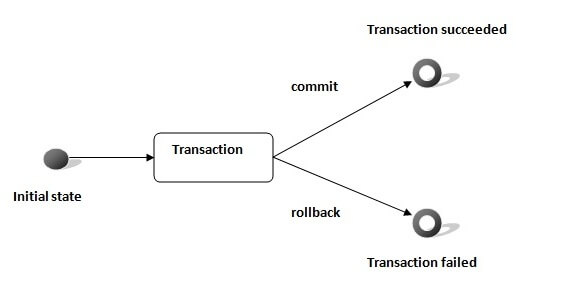

JDBC stands for Java Database Connectivity. Java API to connect and execute the query with the database.


Is a part of JavaSE. API uses JDBC drivers to connect with the database. We can save, update, delete and fetch data from the database.

4 types of drivers:
  - JDBC-ODBC Bridge Driver (Discontinued)
  - Native Driver (vendor client library)
  - Network Protocol Driver (Uses middleware)
  - Thin Driver (Mostly recommended) (fully written in java)


 

## Popular Classes

 `java.sql package` contains classes and interfaces for JDBC API. Few popular ones are:

   - <ins>**DriverManager class**</ins>
      - Acts as an interface between user and drivers.

      - Keeps track of the drivers that are available and handles establishing a connection between a database and the appropriate driver.

      - Useful methods:
         - _public static void registerDriver(Driver driver)_
         - _public static void deregisterDriver(Driver driver)_
         - _public static Connection getConnection(String url,String userName,String password)_


   - <ins>**Connection interface**</ins>
      - Denotes the session between java application and database.

      - Is a factory of Statement, PreparedStatement, and DatabaseMetaData i.e. object of Connection can be used to get the object of Statement and DatabaseMetaData.

      - Provide many methods for transaction management.

      - Useful methods:
         - _public Statement createStatement()_
         - _public Statement createStatement(int resultSetType, int resultSetConcurrency)_
         - _public void setAutoCommit(boolean status)_
         - _public void commit()_
         - _public void rollback()_
         - _public void close()_


   - <ins>**Statment interface**</ins>
      - Provides methods to execute queries with the database

      - Useful methods:
         - _public ResultSet executeQuery(String sql)_
         - _public int executeUpdate(String sql)_
         - _public boolean execute(String sql)_
         - _public int[] executeBatch()_


   - <ins>**ResultSet interface**</ins>
      - Maintains a cursor pointing to a row of a table. Initially, cursor points to before the first row.

      - By default, ResultSet object can be moved forward only and it is not updatable.

      - Useful methods:
         - _public boolean next()_
         - _public boolean previous()_
         - _public boolean first()_
         - _public boolean last()_
         - _public boolean absolute(int row)_
         - _public boolean relative(int row)_
         - _public int getInt(int columnIndex)_
         - _public int getInt(String columnName)_
         - _public String getString(int columnIndex)_
         - _public String getString(String columnName)_
         - _public ResultSetMetaData getMetaData()_


   - <ins>**PreparedStatement interface**</ins>
      - Is a subinterface of Statement.

      - It is used to execute parameterized query.

      ```java
      PreparedStatement stmt = con.prepareStatement("INSERT into TABLE_NAME values(?,?)");  
      stmt.setInt(1,101);
      stmt.setString(2,"Ratan");  
      int i=stmt.executeUpdate();
    ```


   - <ins>**CallableStatement Interface**</ins>
      - Used to call the stored procedures and functions.

      `Stored Procedure on DB`
      ```SQL
      CREATE or REPLACE procedure "insertR"  
      (id IN NUMBER, name IN VARCHAR2)  
      IS  
      BEGIN  
      INSERT INTO USER_TABLE values(id,name);  
      END;  
      /
      ```

      `Usage`
      ```java
      CallableStatement stmt = con.prepareCall("{CALL insertR(?,?)}");  
      stmt.setInt(1,1011);  
      stmt.setString(2,"Amit");  
      stmt.execute();
      ```


   - <ins>**ResultSetMetaData interface**</ins>
      - metadata means data about data i.e. we can get further information from the data.

      - metadata of a table like total number of column, column name, column type etc.

      - Useful methods:
         - _public int getColumnCount()throws SQLException_
         - _public String getColumnName(int index)throws SQLException_
         - _public String getColumnTypeName(int index)throws SQLException_
         - _public String getTableName(int index)throws SQLException_


   - <ins>**DatabaseMetaData interface**</ins>
      - Provides methods to get meta data of a database such as database product name, database product version, driver name, name of total number of tables, name of total number of views etc.

      - Useful methods:
         - _public String getDriverName()throws SQLException_
         - _public String getDriverVersion()throws SQLException_
         - _public String getUserName()throws SQLException_
         - _public String getDatabaseProductName()throws SQLException_
         - _public String getDatabaseProductVersion()throws SQLException_
         - _public ResultSet getTables(String catalog, String schemaPattern, String tableNamePattern, String[] types)throws SQLException_

### Connectivity with Databases

  

 <ins>**MySQL**</ins>

   `mysqlconnector.jar` is required.
   ```java
 import java.sql.*;

 class MySQLConnection {  
     public static void main(String args[]) {  
         try {  
             Class.forName("com.mysql.jdbc.Driver");  
             Connection con = DriverManager.getConnection("jdbc:mysql://<SERVER>:<PORT>/<DATABASE>","<USERNAME>","<PASSWORD>");

             Statement stmt = con.createStatement();  
             ResultSet rs = stmt.executeQuery("SELECT * from XYZ");  
             while(rs.next())  
                System.out.println(rs.getInt(1)+"  "+rs.getString(2)+"  "+rs.getString(3));  
             con.close();

         } catch(Exception e) { System.out.println(e); }  
     }  
 }  
   ```

 <ins>**Oracle**</ins>

   `ojdbc14.jar` is required.
   ```java
 import java.sql.*;

 class OracleConnection {  
     public static void main(String args[]) {  
         try {
             Class.forName("oracle.jdbc.driver.OracleDriver");
             Connection con = DriverManager.getConnection("jdbc:oracle:thin:@<SERVER>:<PORT>:<DATABASE>","<USERNAME>","<PASSWORD>");  

             Statement stmt = con.createStatement();
             ResultSet rs = stmt.executeQuery("SELECT * from XYZ");  
             while(rs.next())  
                System.out.println(rs.getInt(1)+"  "+rs.getString(2)+"  "+rs.getString(3));   
             con.close();  

         } catch(Exception e) { System.out.println(e); }  
     }  
 }
   ```

 <ins>**PostGreSQL**</ins>

   Download the latest jar from [Official Website](https://jdbc.postgresql.org/download.html), `postgresql-9.2-1002.jdbc.jar` type is required.
   ```java
 import java.sql.*;

 public class PostgreSQLConnection {
    public static void main( String args[] ) {
       try {
          Class.forName("org.postgresql.Driver");
          Connection con = DriverManager.getConnection("jdbc:postgresql://<SERVER>:<PORT>/<DATABASE>","<USERNAME>", "<PASSWORD>");

          Statement stmt = con.createStatement();
          ResultSet rs = stmt.executeQuery("SELECT * from XYZ");  
          while(rs.next())  
             System.out.println(rs.getInt(1)+"  "+rs.getString(2)+"  "+rs.getString(3));   
          con.close();

       } catch ( Exception e ) { System.err.println(e); }
    }
 }
   ```

### Storing & Retrieving Images
   - By the help of PreparedStatement we can retrieve and store the image in the database.

   - _setBinaryStream()_ method of PreparedStatement is used to set Binary information.

   - _getBlob()_ method of PreparedStatement is used to get Binary information, it returns the instance of Blob. Calling _getBytes()_ method on the blob object, we get array of binary information which can be written into the image file.

   `SQL`
   ```sql
      CREATE TABLE "IMGTABLE"   
      (
        "NAME" VARCHAR2(4000),   
        "PHOTO" BLOB  
      )
   ```

   `ImageHandlingDB.java`
   ```java
   import java.sql.*;  
   import java.io.*;

   public class ImageHandlingDB {  
       public static void main(String[] args) {  
           try {  
               Class.forName("oracle.jdbc.driver.OracleDriver");  
               Connection con=DriverManager.getConnection(  
               "jdbc:oracle:thin:@<SERVER>:<PORT>:<DATABASE>","<USERNAME>","<PASSWORD>");

               //-------------------------- Storing images -----------------------------

               PreparedStatement ps = con.prepareStatement("INSERT into IMGTABLE values(?,?)");
               ps.setString(1,"image-001");  
               FileInputStream fin = new FileInputStream("/home/jalaz/tech/upload.jpg");  
               ps.setBinaryStream(2, fin, fin.available());  
               int i = ps.executeUpdate();
               fin.close()

               //-------------------------- Retrieving images --------------------------

               PreparedStatement ps = con.prepareStatement("SELECT * from IMGTABLE");
               ResultSet rs = ps.executeQuery();  
               if(rs.next()) {
                  Blob b = rs.getBlob(2);
                  byte barr[] = b.getBytes(1, (int)b.length());
                  FileOutputStream fout=new FileOutputStream("/home/jalaz/tech/download.jpg");  
                  fout.write(barr);  
                  fout.close()
               }

               //----------------------------------------------------------------------

               con.close();

           } catch (Exception e) { e.printStackTrace(); }  
       }  
   }
   ```

### Storing & Retrieving Files
  - By the help of PreparedStatement we can retrieve and store the files in the database.

  - _setCharacterStream()_ method of PreparedStatement is used to set character information

  - _getClob()_ method of PreparedStatement is used to get file information from the database.

  `SQL`
  ```sql
     CREATE TABLE "FILETABLE"   
     (    
      "ID" NUMBER,   
      "NAME" CLOB
     )
  ```

  `FileHandlingDB.java`
  ```java
  import java.sql.*;  
  import java.io.*;

  public class FileHandlingDB {  
      public static void main(String[] args) {  
          try {  
              Class.forName("oracle.jdbc.driver.OracleDriver");  
              Connection con=DriverManager.getConnection(  
              "jdbc:oracle:thin:@<SERVER>:<PORT>:<DATABASE>","<USERNAME>","<PASSWORD>");

              //-------------------------- Storing files -----------------------------

              PreparedStatement ps=con.prepareStatement("INSERT into FILETABLE values(?,?)");
              File f = new File("/home/jalaz/tech/upload.txt");
              FileReader fr = new FileReader(f);
              ps.setInt(1,101);  
              ps.setCharacterStream(2, fr, (int)f.length());  
              int i = ps.executeUpdate();

              //-------------------------- Retrieving files --------------------------

              PreparedStatement ps = con.prepareStatement("SELECT * from FILETABLE");
              ResultSet rs = ps.executeQuery();
              rs.next();
              Clob c = rs.getClob(2);  
              Reader r = c.getCharacterStream();              
              FileWriter fw = new FileWriter("/home/jalaz/tech/download.txt");
              while((int i = r.read())!=-1)
                  fw.write((char)i);  
              fw.close();

              //-----------------------------------------------------------------------

              con.close();

          } catch (Exception e) { e.printStackTrace(); }  
      }  
  }
  ```

## Transaction Management
   - Transaction represents a single unit of work.

   - ACID properties describes the transaction management well. ACID stands for Atomicity, Consistency, isolation and durability.
      - Atomicity means either all successful or none.
      - Consistency ensures bringing the database from one consistent state to another consistent state.
      - Isolation ensures that transaction is isolated from other transaction.
      - Durability means once a transaction has been committed, it will remain so, even in the event of errors, power loss etc.

   - TXN Management provides fast performance, as database is hit only at the time of commit.

   

   ```java
   import java.sql.*;  
   import java.io.*;

   class TXNManagement {  
       public static void main(String args[]) {  
           try {  
               Class.forName("oracle.jdbc.driver.OracleDriver");  
               Connection con = DriverManager.getConnection("jdbc:oracle:thin:@<SERVER>:<PORT>:<DATABASE>","<USERNAME>","<PASSWORD>");  
               con.setAutoCommit(false);  

               PreparedStatement ps = con.prepareStatement("INSERT into USERS values(?)");  

               BufferedReader br = new BufferedReader(new InputStreamReader(System.in));  
               while(true){  
                   System.out.println("Name: ");  
                   String s1 = br.readLine();  
                   int id = Integer.parseInt(s1);  

                   ps.setString(1,name);  
                   ps.executeUpdate();  

                   System.out.println("commit/rollback");  
                   String answer = br.readLine();  
                   if(answer.equals("commit"))
                      con.commit();   
                   else if(answer.equals("rollback"))
                      con.rollback();  
                   else
                      break;
              }
           } catch(Exception e) { System.out.println(e); }  

       }
   }
   ```

## Batch Processing
   - Instead of executing a single query, we can execute a batch (group) of queries. It makes the performance fast.

   - Useful methods of `Statement interface`:
      - _void addBatch(String query)_
      - _int[] executeBatch()_

   ```java
   import java.sql.*;

   class BatchTXN {  
       public static void main(String args[]) throws Exception {  
           Class.forName("oracle.jdbc.driver.OracleDriver");  
           Connection con = DriverManager.getConnection("jdbc:oracle:thin:@<SERVER>:<PORT>:<DATABASE>","<USERNAME>","<PASSWORD>");  
           con.setAutoCommit(false);  

           Statement stmt = con.createStatement();  
           stmt.addBatch("INSERT into USERS values(14MI528,'jalaz')");  
           stmt.addBatch("insert into USERS values(14MI526,'akhilesh')");
           stmt.addBatch("insert into USERS values(14MI550,'atul')");
           stmt.executeBatch();

           con.commit();  
           con.close();  
       }
   }

   ```
