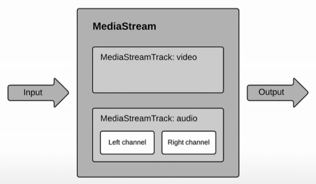
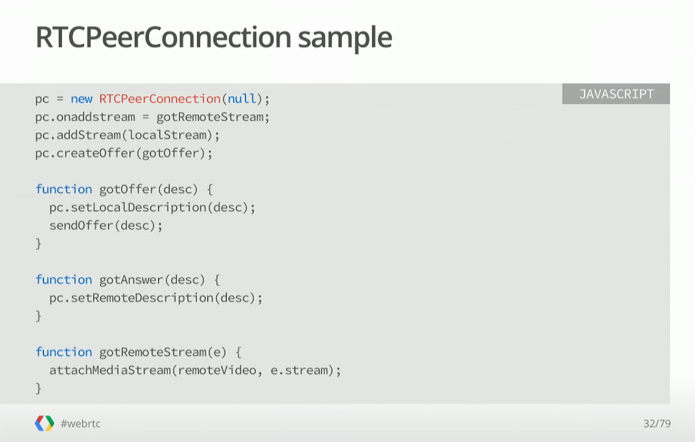
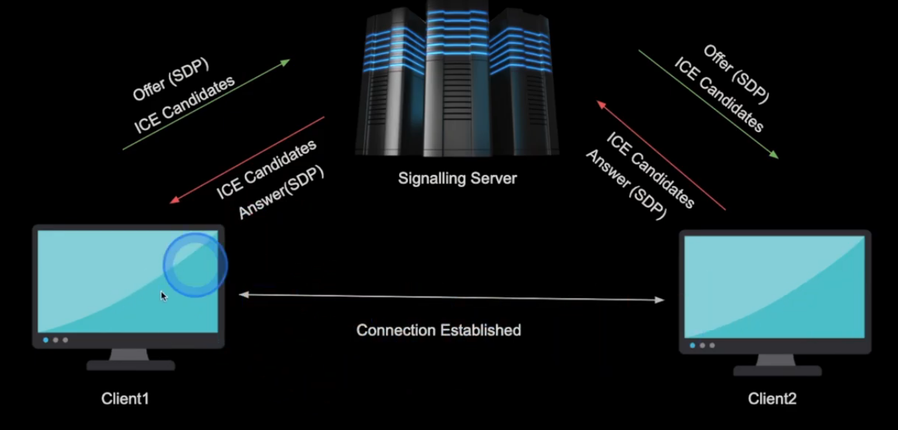
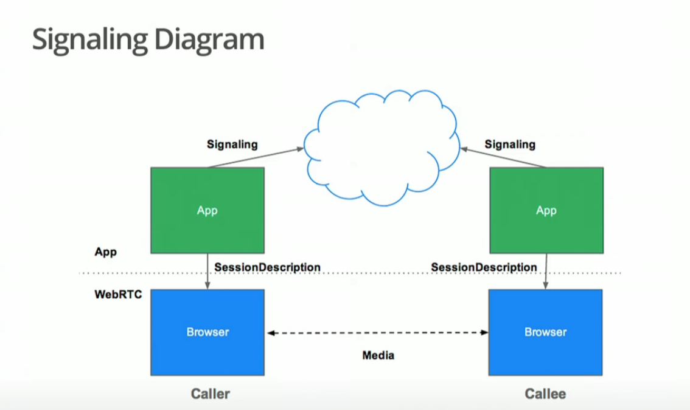
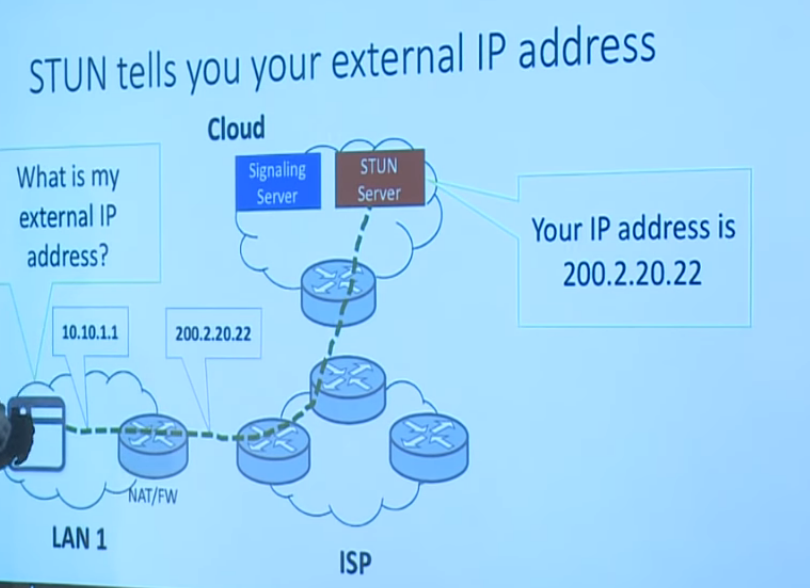
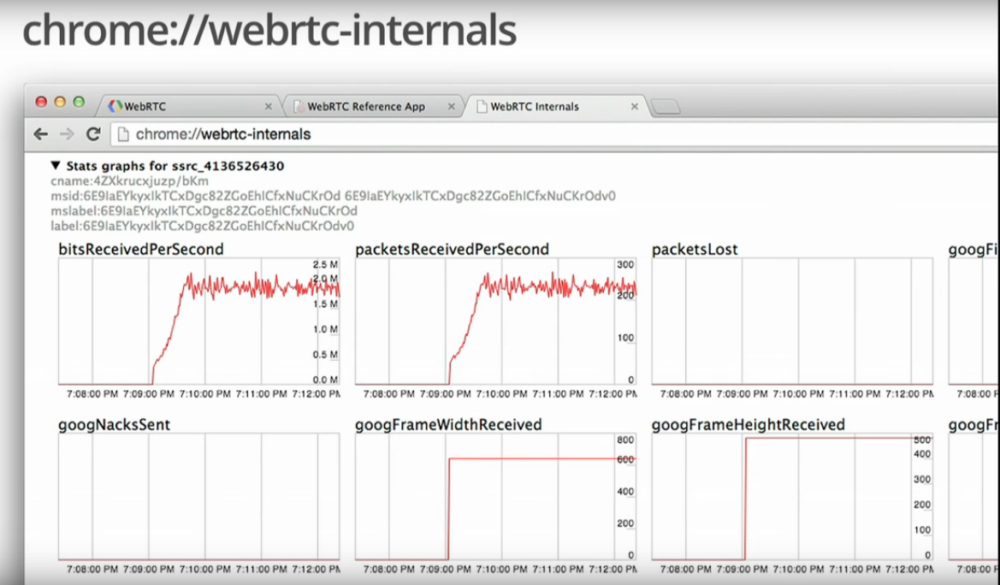

<ins>**WebRTC**</ins>

  - Web Real-time Communications

  - Low cost, high quality audio & video communication

  - Can be used for multiple tasks, but real-time peer-to-peer audio and video (i.e., multimedia) communications is the primary benefit.

  - Implemented open standards for real-time, plugin-free video, audio and data communication.

  

<ins>**Need for WebRTC**</ins>

General flow of information without WebRTC is this.

This data relaying through servers will lead to network latency which is really bad for services like real time gaming, video conferencing, streaming etc.


<ins>**Challenges for WebRTC**</ins>
  - WebRTC works via UDP
  - There is no standard signalling protocol
  - Not fully compatible with all browsers

## WebRTC JS API & Connections setup


<ins>**WebRTC Architecture**</ins>


<ins>**Main Tasks & JS APIs supports**</ins>
  - Acquiring audio and video - `MediaStream API`
  - Communicating audio and video - `RTCPeerConnection API`
  - Communicating arbitrary data - `RTCDataChannel API`

<ins>**MediaStream API**</ins>

  - Grabs access to data streams(audio/video), such as from the user's camera and microphone.

  - Can contain multiple 'tracks'.

  

  - Each MediaStream has an input, which might be a MediaStream generated by getUserMedia(), and an output, which might be passed to a video element or an RTCPeerConnection.

  - Permission only has to be granted once for getUserMedia()

  

`Constraints`
  - Used to set values for video resolution for getUserMedia().

  - Also allows support for other constraints such as aspect ratio, facing mode (front or back camera), frame rate, height and width, along with an applyConstraints() method.

  - Controls the content of the MediaStream

    ```javascript
    video: {
        mandatory: {
          minWidth: 640,
          minHeight: 360
        },
        optional [{
          minWidth: 1280,
          minHeight: 720
        }]
    }
    ```

<ins>**RTCPeerConnection API**</ins>

WebRTC component that handles stable and efficient communication of streaming data between peers.

Audio or video calling, with facilities for encryption and bandwidth management.

Works perfomed:
  - Peer to Peer communication
  - Codec handling
  - Signal processing
  - Bandwidth management
  - Security




<ins>**RTCDataChannel API**</ins>

Enables peer-to-peer exchange of arbitrary data, with low latency and high throughput.

Potential use cases for the API are:
  - Gaming
  - Remote desktop applications
  - Real-time text chat
  - File transfer
  - Decentralized networks

Communication occurs directly between browsers, so RTCDataChannel can be much faster than WebSockets.


<ins>**WebRTC Connection Setup flow**</ins>




## Servers for WebRTC


Majorly, 4 types of servers are required in WebRTC:


<ins>**Signalling Servers**</ins>

  - WebRTC uses RTCPeerConnection for communicating streaming data between peers

  - Signalling is a mechanism to coordinate this communication and sending control messages.

  - In Signalling, Peers exchanges 3 types of information:
    - Session control messages: Initialising & closing connections
    - Network configuration: IP Addresses & ports
    - Media capabilities: Media codecs & resolution handled by browser


`Signal Description Protocol` objects are exchanged which carry:
  - Format supported
  - Information that is to be sent( Audio/Video/Data)
  - Networking information for Peer-to-Peer connection setup


There is no standarisation for Signalling from WebRTC end. Usage of any messaging mechanism & protocol is on implementers' choice.



<ins>**STUNs & TURNs**</ins>

`Issue of NAT Traversal`


In the ideal world, all devices are having unique IP and are easily identifiable.
There is no issue in connecting peers.


But in the real world, due to lack of IP address spaces, various gateways, NATs are used which provide private IPs to the internal devices and this private IP is masked to the outside world.
So, setting up a connection between peers seems tough during WebRTC negotiation.


To tackle this situation, `ICE` was introduced.

`ICE: Interactive Connectivity Establishment`
Protocol for establishing peer-to-peer media connections between peers behind NATs and firewall devices.

Using ICE, tries to find the best path for each call.
Around 86% of the calls are P2P & 14% are Relayed.

2 Types of ICE Servers:
  - STUN Servers
  - TURN Servers

`STUN (Session Traversal Utilities for NAT)`
  - Tell me what my public IP address is
  - Simple server, cheap to run
  - Data flows peer-to-peer

  

  


`TURN (Traversal using Relay NAT)`
  - Provides a cloud fallback, if P2P communication fails
  - Data is relayed through this server, uses server bandwidth
  - Ensures the call works in almost all environments

  

  


||STUN|TURN|
|---|---|---|
||Session Traversal Utilities for NAT|Traversal using Relay NAT|
|Work|Returns the external IP address|Relays media|
|When needed|Almost always|Infrequently|
|Operation cost|Cheap|Expensive|


### Improvements in WebRTC

<ins>**Security**</ins>

  - Once WebRTC connection is setup between peers, all audio/video streams and data packets are fully secure with end-to-end encryption mechanism. For Signalling also, we should use HTTPS.

  - WebRTC is not a plugin: its components run in the browser sandbox and not in a separate process, components do not require separate installation, and are updated whenever the browser is updated.

  - Camera and microphone access must be granted explicitly and, when the camera or microphone are running, this is clearly shown on the UI.

  

<ins>**Performance & topologies**</ins>

- `MESH connectivity`
  - All peers are connected with each & every other.

  - MeetG is built using MESH as of now.

  - Most cost effecient way of running WebRTC, suitable upto limit of 4-5 clients.

  

- `STAR connectivity or SFU`
  - One of the peer having high computation power acts as leader and leads the communication.

  - All peers sends their stream to the SFU & recieve streams from SFU, instead of sending & receiving from each.

  - Suitable for limit of upto 8-10 peers.

  

  


- `MCU connectivity`
  - A centralised server is kept in place which accumulates the streams from all peers and relays them to each.

  - Used for large number of connections.

  

  

- `SFU with Simulcast`
  - This is the state of the art in WebRTC presently.

  - One stream is dominated in full resolution, while all other streams are choosed to be in low resolution (thumbnails)

  


<ins>**Checking out WebRTC statictics**</ins>


