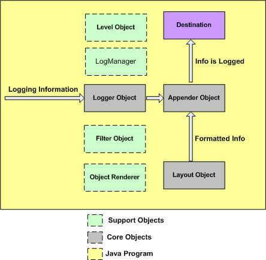
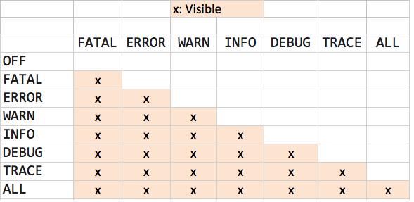

Logging means some way by which we can get indication about the state of the system at runtime.

These log messages are written during program execution to a central place.

Logging allows us to record and persist system states as messages (e.g., runtime statistics) so that they can later be retrieved and analyzed.

<ins>**Requirements for good logging:**</ins>
  - logs must provide sufficient information for understanding the appliation internal processing
  - log writing process should be efficient & must not affect the performance.
  - logging needs to be modified and adapted as per different deployment environments.


<ins>**Advantages of logging:**</ins>
  - Quick debugging
  - Diagnosis of problems precisely and quickly
  - Easy maintenance comes along with quick debugging feature.
  - Cost anf time savings


<ins>**Disadvantages of logging:**</ins>
  - logging adds runtime overhead for generation and writing of log information using device IO.
  - logging increase size of code and adds programming overhead.
  - bad logging causes confusion.
  - logging requires proper planning beforehand.


<ins>**Frameworks for logging:**</ins>
  - SLF4J
  - Log4J
  - java.util.logging


## Java.Util.logging package

  Java JRE implicitly contains the Java Logging API. This logging API allows you to configure which message types are written.
  The `java.util.logging package` provides the logging capabilities via the `Logger class`.

  The basic logging levels are:

  |Level|Value|Usage|
  |---|---|---|
  |SEVERE|1000|Indicates some serious failure|
  |WARNING|900|Potential Problem|
  |INFO|800|General Info|
  |CONFIG|700|Configuration Info|
  |FINE|500|General developer info|
  |FINER|400|Detailed developer info|
  |FINEST|300|Specialized Developer Info|
  |-|-|-|
  |OFF|Integer.MAX_VALUE|Capturing nothing|
  |ALL|Integer.MIN_VALUE|Capturing Everything|

  <ins>**LogManager class**</ins>
   - Provides single global instance to interact with log files.

   - Has static method: _getLogManager()_

   - The log system is centrally managed. There is only one application wide log manager which manages both the configuration of the log system and the objects that do the actual logging.


  <ins>**Logger class**</ins>
   - Provides methods for logging

   - LogManager is the one doing actual logging, its instances are accessed using the _getLogger()_ method of LogManager class.

   - Has a static field `GLOBAL_LOGGER_NAME`, which accesses global logger instance.

  ```java
  import java.io.IOException;
  import java.util.logging.Level;
  import java.util.logging.Logger;
  import java.util.logging.*;

  class DemoLogger {
      private final static Logger LOGGER = Logger.getLogger(Logger.GLOBAL_LOGGER_NAME);

      public void makeSomeLog() {
          LOGGER.log(Level.INFO, "Log generated from the logger class");
      }
  }

  public class LoggerExample {
      public static void main(String[] args)
      {
          DemoLogger obj = new DemoLogger();
          obj.makeSomeLog();

          LogManager lgmngr = LogManager.getLogManager();
          Logger log = lgmngr.getLogger(Logger.GLOBAL_LOGGER_NAME);
          log.log(Level.INFO, "Log generated from the main class");
      }
  }
  ```

  `OUTPUT`
  ```bash
  Sep 19, 2020 7:56:33 PM DemoLogger makeSomeLog
  INFO: Log generated from the logger class
  Sep 19, 2020 7:56:33 AM LoggerExample main
  INFO: Log generated from the major class
  ```

## Log4J logging

  <ins>**Introduction**</ins>
  - A fast, reliable & flexible logging framework
  - Written in Java
  - Open-source logging API
  - Allows storage of logs in a file or DB
  - Works well with large or small projects


  <ins>**Features**</ins>
  - Thread-safe
  - Optimised for speed
  - Uses named logger hierachy as base
  - Supports multiple outputs of appenders per logger
  - log formatting can be easily altered
  - Specially designed to manage java exceptions
  - logging behavior can be set at runtime using configuration file.


  <ins>**Setup & Usage**</ins>

  Add the following entry to the `pom.xml` file:
  ```bash
<dependency>  
    <groupId>log4j</groupId>  
    <artifactId>log4j</artifactId>  
    <version>1.2.17</version>  
</dependency>
  ```

  Running with most basic configuration:
  ```java
import org.apache.log4j.BasicConfigurator;  
import org.apache.log4j.LogManager;  
import org.apache.log4j.Logger;  

public class Log4JBasic {  
    private static final Logger logger  = LogManager.getLogger(HelloWorld.class);  
    public static void main(String[] args) {
        BasicConfigurator.configure();  
        logger.info("Basic logging of information");
    }    
}
  ```

  <ins>**Log4J Architecture**</ins>

  Follows layered architecture where each layer provides different objects for doing different tasks.

  2 types of objects:
  - Core Objects
    - Mandatory objects of the framwork
    - Are: Logger, Appender, Layout


  - Support Objects
    - Optional objects of the framework
    - Supports core objects in performing additional but important tasks
    - Are: Level, Filter, ObjectRenderer, LogManager


  `Logger object`:
  - Core object
  - This forms the top-level layer of the framework
  - Responsible for taking logging info and storing in namespace hierarchy
  - For each class, one Logger object is created which enables log4j there.
  ```java
  static Logger log = Logger.getLogger(ClassName.class.getName())
  ```
  - Methods of Logger are used to generate log statements.
     - debug()
     - info()
     - warn()
     - error()
     - fatal()


  Priority order: `debug < info < warn < error < fatal`


  `Appender object`:
  - Core object
  - Responsible for publishing logging info to preferred destination which may be a file, database, console etc.
  - Appender is an interface not a class. Different implementation classes are:
    - FileAppender
    - ConsoleAppender
    - JDBCAppender
    - SMTPAppender
    - SocketAppender
    - SyslogAppender


  `Layout object`:
  - Core object
  - Used to format logging info in different styles.
  - Supports appender objects before publishing of logs.
  - Helps in publishing logs in human-readable manner.
  - Various layout classes:
    - SimpleLayout
    - PatternLayout
    - HTMLLayout
    - XMLLayout


  

  `Level object`:
  - Support object
  - Defines the priority and granularity of logging info.
  - 7 levels of logging: OFF, DEBUG, INFO, ERROR, WARN, FATAL, ALL


  `Filter object`:
  - Support object
  - Analyses logging info and decides whether info should be logged or not


  `ObjectRenderer object`:
  - Support object
  - Specialised in providing string representation of objects.
  - Used by the `Layout object` for preparing the final logging info.


  `LogManager object`:
  - Support object
  - Manages the logging framework
  - Used for reading configuration from system-wide file or configuarion class.


  <ins>**Configuration file**</ins>
  - `log4j.properties` stores properties in key-value pair.
  - Contains the entire runtime configuration used by log4j.
  - By default, LogManager searches for this file name in CLASSPATH.

  ```bash
  # Root logger option  
  log4j.rootLogger=INFO, file, stdout  

  # Direct log messages to a log file  
  log4j.appender.FILE=org.apache.log4j.FileAppender  
  log4j.appender.file.File=${catalina.home}/logs/api.log  
  log4j.appender.file.layout=org.apache.log4j.PatternLayout  
  log4j.appender.file.layout.ConversionPattern=%m%n

  # Direct log messages to stdout  
  log4j.appender.stdout=org.apache.log4j.ConsoleAppender  
  log4j.appender.stdout.Target=System.out
  log4j.appender.stdout.layout=org.apache.log4j.PatternLayout  
  log4j.appender.stdout.layout.ConversionPattern=%d{yyyy-MM-dd HH:mm:ss} %-5p %c{1}:%L - %m%n  
  ```

  <ins>**Logging levels**</ins>
    - Used for categorizing entries in the log file in a manner of urgency.
    - Using these, filtering is possible during search.
    - Using these, amount of info to be logged can be managed.
    - Each log message is prefixed by the level.
    - They are an instance of `org.apache.log4j.Level` class.

    ```bash
    log4j.rootLogger=ERROR, serviceAppender
    log4j.appender.serviceAppender=org.apache.log4j.ConsoleAppender  
    log4j.appender.serviceAppender.layout=org.apache.log4j.PatternLayout  
    log4j.appender.serviceAppender.layout.ConversionPattern=[%t] %-5p %c %x - %m%n  

    log4j.logger.tech.jaykay12.group-search=INFO, serviceAppender  
    log4j.logger.tech.jaykay12.group-search.logic=DEBUG, serviceAppender
    ```

    

  <ins>**Logging methods**</ins>
    - Logger class has methods to handle logging activities.

    - Supports 2 static methods for obtaining Logger object:
       - _public static Logger getRootLogger();_
       - _public static Logger getLogger(String name);_

    - Methods for printing log info:
       - _public void debug(Object message)_
       - _public void error(Object message)_
       - _public void fatal(Object message)_
       - _public void info(Object message)_
       - _public void warn(Object message)_
       - _public void trace(Object message)_
