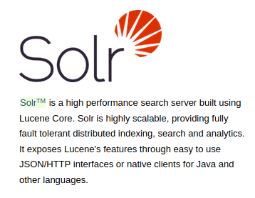
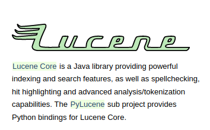
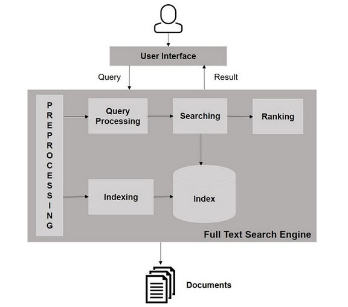
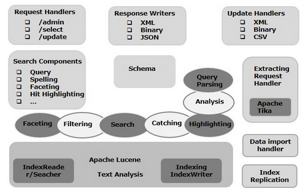
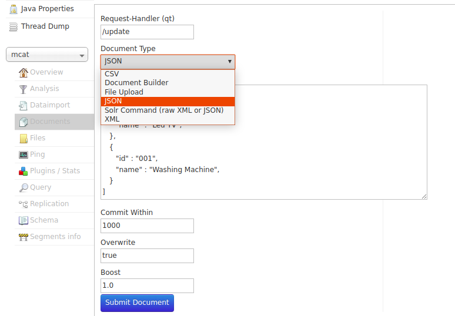

`Apache Solr` is a Scalable & Portable search/storage engine used for searching large volumes of text-centric data.

  - Open Source (search/storage) platform

  - Enterprise Search server

  - Used for building Search Applications and Search APIs

  - Created by Yonik Seely in 2004

  - Apache Solr is built on top of Apache Lucene.

  - Along with search purpose, Solr can be used for storage purpose as well just like No-SQL Databases.

  - Provides capabilities for full text search such as tokens, phrases, spell-check etc.

  - Solr exposes Lucene Java APIs as a Rest-full API services.

  - Also used as a document-based NoSQL database with transactional support that can be used for storage purposes and even a key-value store.

  - Solr takes in structured, semi-structured and unstructured data from various sources, stores and indexes it, and makes it available for search in near real-time.



`Apache Lucene` is Java-based search library. Used to index and search voluminous amount of text. Basically, we store the index using Lucene & exposes searching on this index through Solr Rest APIs.

  - Written by Dough Cutting in 1999

  - Powerful, Scalable & Efficient Search Algorithm



<ins>**Typical Search Flow**</ins>



There are 3 primary processes in Search:
1. Indexing
2. Querying
3. Ranking

All 3 should be in real-time for humungous amount of data.


`Indexing`

3 approaches for indexing documents:
- Files in json, xml, xlxs, csv format are indexed directly using index handlers
- Rich-text documents like pdf files are indexed using support from Apache Tika & ExtractingRequestHandler plugin.
- Data from databases, emails, RSS feeds are imported using the DataImportHandler plugin.


Solr uses Lucene for creating an inverted index as it inverts a page-centric data structure (documents => words) to a keyword-centric data structure (words => documents)
This resembles the index at the end of the book.

Faster response is achieved as keyword search is done in index instead of the directly scanning the text.


`Querying`

Search can be done for various terms such as keywords, images or geolocation data etc. Solr processes this using query request handlers.

`Ranking`

Solr matches the indexed documents to any query, & ranks the results by their relevance scores.


## Terminology

- <ins>**Document**</ins>
  - Basic unit of information in Solr which can be stored and indexed.
  - Documents are stored in collections.
  - Can be added, deleted, and updated, typically through request handlers(index handlers).


- <ins>**Field**</ins>
  - Field stores the data in a Document holding a key-value pair, where key states the field name and value the actual field data.
  - Solr supports different field types: float, date, text, integer, boolean, etc.


- <ins>**Collection**</ins>
  - Group of shards/cores that form a single logical index.
  - Each collection has its own set of configuration and schema definition, which can be different than other collections.
  - Only has meaning in the context of a Solr cluster in which a single index is distributed across multiple servers.


- <ins>**Core**</ins>
  - Running instance of a lucene index.
  - Uniquely named, managed, and configured index running in a Solr server
  - Composed of a set of configuration files, Lucene index files, and Solr’s transaction log
  - Collection and Core are same if search is not distributed.


- <ins>**Shard**</ins>
  - Allows to split and store index into one or more pieces, thus a shard is a slice of a collection.
  - Each shard lives on a node and is hosted in a core.


- <ins>**Replica**</ins>
  - Physical copy of a shard that runs as a core in a node


- <ins>**Cluster**</ins>
  - Specific to SolrCloud, cluster is made up of one or more nodes that store all the data, providing distributed indexing and search capabilities across all nodes


- <ins>**Node**</ins>
  - Single instance of Solr.
  - Can have multiple cores that can be part of any number of collections.


## Base Concepts

<ins>**Apache Solr Architecture**</ins>



Building blocks of Apache Solr:
  - <ins>**Request Handler**</ins>
  Used to process requests on Solr end, can be query request or index update requests

  - <ins>**Search Component**</ins>
  Feature provided by Solr, example: spellchecking, query, faceting etc.

  - <ins>**Query Parser**</ins>
  Parses the query passed to Solr, checks for syntactic error & translates them into a format lucene understands

  - <ins>**Response Writer**</ins>
  Generates formatted output for the queries. Supports xml, json, csv etc.

  - <ins>**Analyzer/Tokenizer**</ins>
  Lucene recognises data in form of tokens which are passed from Solr end. Analyzer examines the text of fields and generates token stream which is then broken into tokens by the Tokenizer

## Setting up Solr

1. Java Runtime Environment (JRE) version 1.8 or higher is required for solr to work.
  ```bash
  jalaz@jalaz-personal:~/Downloads$ java -version
  java version "1.8.0_60"
  Java(TM) SE Runtime Environment (build 1.8.0_60-b27)
  Java HotSpot(TM) 64-Bit Server VM (build 25.60-b23, mixed mode)
  ```

2. Download the .tgz file of solr from the [official website](https://lucene.apache.org/solr/) & unzip it using
  ```bash
  jalaz@jalaz-personal:~/Downloads$ tar zxf solr-6.5.0.tgz
  ```

3. Run Apache Solr on default 8983 port
  ```bash
  jalaz@jalaz-personal:~/Downloads/solr-6.5.0$ ./bin/solr start
  Waiting up to 180 seconds to see Solr running on port 8983
  Started Solr server on port 8983 (pid=28500). Happy searching!
  ```

4. Run Apache Solr on custom port
  ```bash
  jalaz@jalaz-personal:~/Downloads/solr-6.5.0$ ./bin/solr start -p 8020
  Waiting up to 180 seconds to see Solr running on port 8020
  Started Solr server on port 8020 (pid=28973). Happy searching!
  ```

5. Stop Apache Solr
  ```bash
  jalaz@jalaz-personal:~/Downloads/solr-6.5.0$ ./bin/solr stop
  Sending stop command to Solr running on port 8983 ... waiting up to 180 seconds to allow Jetty process 28066 to stop gracefully.
  ```

6. Checking Apache Solr status
  ```bash
  jalaz@jalaz-personal:~/Downloads/solr-6.5.0$ ./bin/solr status
  Found 1 Solr nodes:
  Solr process 29381 running on port 8983
  {
    "solr_home":"/home/jalaz/Downloads/solr-6.5.0/server/solr",
    "version":"6.5.0 4b16c9a10c3c00cafaf1fc92ec3276a7bc7b8c95 - jimczi - 2017-03-21 20:47:12",
    "startTime":"2020-09-28T18:38:02.490Z",
    "uptime":"0 days, 0 hours, 0 minutes, 9 seconds",
    "memory":"154.9 MB (%31.6) of 490.7 MB"
  }
  ```

7. Creating a Core in Apache Solr
  ```bash
  jalaz@jalaz-personal:~/Downloads/solr-6.5.0$ ./bin/solr create -c students
  Copying configuration to new core instance directory:
  /home/jalaz/Downloads/solr-6.5.0/server/solr/students
  Creating new core 'students' using command:
  {
    "responseHeader":{
      "status":0,
      "QTime":678
    },
    "core":"students"
  }
  ```

8. Running Apache Solr using configurations from some external directory  
  ```bash
  jalaz@jalaz-personal:~ bash /Downloads/solr-6.5.0/bin/solr restart -p 8985 -s /Documents/core-conf/
  ```

#### Directory structure in Solr

```bash
<solr-home-directory>/
   solr.xml
   core_name1/
      core.properties
      conf/
         solrconfig.xml
         managed-schema
      data/
   core_name2/
      core.properties
      conf/
         solrconfig.xml
         managed-schema
      data/
```

<ins>**Important files in Solr**</ins>

`Solr.xml`
Contains Solr information. For loading cores, this file is referred.

`solrconfig.xml`
Contains core-specific configurations related to request handlers, indexing, managing memory, managing cache etc.

`schema.xml`
Contains the entire schema including field & field types

`core.properties`
Contains core configuration properties. Is used for core discovery during Solr start.

`data/`
The directory containing the low level index files.

## Solr Internal details

<ins>**Documents, Fields & Schemas**</ins>

  - Solr is told about the kind of data a field contains by specifying its field type.

  - Solr stores details about the field types and fields it is expected to understand in a schema file, This is defined in solrconfig.xml file.
      - `managed-schema` used by default to support schema changes at runtime via the Schema API, or Schemaless Mode features.

      ```bash
      <schemaFactory class="ManagedIndexSchemaFactory">
      ```

      - `schema.xml` is the traditional schema file which can be edited manually by users.

      ```bash
      <schemaFactory class="ClassicIndexSchemaFactory"/>
      ```

  - General structure of `schema.xml` file:
    ```bash
    <schema>
      <fieldTypes>
      <fields>
      <uniqueKey>
      <copyField>
    </schema>
    ```

  - `Field type`

    ```bash
    <fieldType name="name_text" class="solr.TextField" positionIncrementGap="100">
      <analyzer type="index">
        <tokenizer class="solr.StandardTokenizerFactory"/>
        <filter class="solr.StopFilterFactory" ignoreCase="true" words="stopwords.txt" />
        <filter class="solr.LowerCaseFilterFactory"/>
      </analyzer>
      <analyzer type="query">
        <tokenizer class="solr.StandardTokenizerFactory"/>
        <filter class="solr.StopFilterFactory" ignoreCase="true" words="stopwords.txt" />
        <filter class="solr.SynonymFilterFactory" synonyms="synonyms.txt" ignoreCase="true" expand="true"/>
        <filter class="solr.LowerCaseFilterFactory"/>
      </analyzer>
    </fieldType>
    ```

    Optionally specify a `<similarity/>` that will be used when scoring documents that refer to fields with this type. By default, any field type which does not define a similarity, uses **BM25Similarity**.

  - Implicit Field types in Solr are as follows:
      1. BinaryField
      2. BoolField
      3. CollationField or ICUCollationField
      4. CurrencyField
      5. DateRangeField
      6. ExternalFileField
      7. EnumField
      8. LatLonPointSpatialField
      9. RandomSortField
      10. StrField
      11. TextField
      12. TrieField


  - `Defining fields`
  Once the field types are set up, defining the fields themselves is simple.

  ```bash
  <field name="price" type="float" default="0.0" indexed="true" stored="true"/>
  ```
  
    - <ins>indexed</ins>: field value can be used in queries for retrieving the matching documents, if set to true.

    - <ins>stored</ins>: field value can be retrieved by queries, if set to true.

    - <ins>docValues</ins>: field value will be put in a column-oriented DocValues structure, if set to true.

    - <ins>multiValued</ins>: indicates that a single document might contain multiple values for this field type, if set to true.

    - <ins>omitNorms</ins>: If true, omits the norms associated with this field (this disables length normalization for the field, and saves some memory)

    - <ins>required</ins>: Instructs Solr to reject any attempts to add a document which does not have a value for this field. default(false).

    - <ins>large</ins>: fields are always lazy loaded and will only take up space in the document cache if the actual value is < 512KB.

  - `Copying fields`
  Some document fields can be interpreted in more than one way.

  ```bash
  <copyField source="title" dest="title_text" maxChars="30000" />
  ```

  Fields are copied before analysis is done, meaning we have two fields with identical original content, but which use different analysis chains and are stored in the index differently.

  - `Dynamic fields`
  Allows Solr to index fields that are not explicitly defined in schema.

  ```bash
  <dynamicField name="*_i" type="int" indexed="true"  stored="true"/>
  ```

  If indexing a document with a cost_i field is attempted, but no explicit cost_i field is defined in the schema, then the cost_i field will have the field type and analysis defined for `*_i`.
  Makes application less brittle by providing some flexibility in the documents that can be added to Solr.


  - `uniqueKey`
  Specifies which field is a unique identifier for documents. Used if document in the index are ever needed to be updated.

  ```bash
    <uniqueKey>displayid</uniqueKey>
  ```

  - Schema API allows to use an HTTP API to manage elements of the solr schema.
  This API provides read and write access to the Solr schema. Fields, dynamic fields, field types and copyField rules may be added, removed or replaced.


  - `DocValues`
    - A way of recording field values internally that is more efficient for some purposes, such as sorting and faceting, than traditional indexing.

    - DocValue fields are column-oriented fields with a document-to-value mapping built at index time.

    - If docValues="true" for a field, then DocValues will automatically be used any time the field is used for sorting, faceting or function queries.


<ins>**Analyzers & Tokenizers**</ins>

## Indexing in Solr

Systematically arranging documents in the Solr core.
  - Indexing collects, parses, and stores documents.
  - Indexing is done to increase the speed and performance of a search query while finding a required document.

In Apache Solr, we can index (add, delete, modify) various document formats such as xml, csv, pdf, etc.

Primarily 3 Ways:

  1. <ins>**Solr Web Interface**</ins>

      

  2. <ins>**post tool**</ins>

      ```bash
      jalaz@jalaz-personal:~$ ./bin/post -c mcats similar-mcats.json
      jalaz@jalaz-personal:~$ ./bin/post -c intent -host fts-master.intermesh.net -p 8020 brands.csv
      jalaz@jalaz-personal:~$ ./bin/post -c keyword-mapping -host fts-master2.intermesh.net -p 8020 buyleads/bltransacted-*.xml -commit yes
      ```

  3. <ins>**Client APIs : SolrJ**</ins>

      ```java
      import java.io.IOException;  

      import org.apache.Solr.client.Solrj.SolrClient;
      import org.apache.Solr.client.Solrj.SolrServerException;
      import org.apache.Solr.client.Solrj.impl.HttpSolrClient;
      import org.apache.Solr.common.SolrInputDocument;

      public class DocumentIndexer {
         public static void main(String args[]) throws Exception {

            String urlString = "http://localhost:8983/Solr/mcat";
            SolrClient Solr = new HttpSolrClient.Builder(urlString).build();   

            SolrInputDocument doc = new SolrInputDocument();
            doc.addField("mcatid", "003");
            doc.addField("mcatname", "Paper cutting machine");
            Solr.add(doc);
            Solr.commit();

            System.out.println("Documents indexed");
         }
      }
      ```

<ins>**Deletion/Modification/Addition formats**</ins>


## Querying in Solr
_<Coming soon . . .>_

## Request Handlers & Search Components in Solr
_<Coming soon . . .>_

## Faceting in Solr
_<Coming soon . . .>_

## Clustering in Solr
_<Coming soon . . .>_

#### SolrJ: Client API for Java

#### Apache Solr VS ElasticSearch


||Apache Solr|ElasticSearch|
|---|---|---|
|Installation and Configuration|Easy & have supportive documentation|Easy & have supportive documentation|
|Configuration files|XML-based configuration files|YML format|
|Indexing: data sources|Supports data ingestion from XML, CSV, JSONs, databases, PDFs etc. Apache Tika library allows over one thousand file types|Completely JSON-based|
|Searching|Support NRT (near real-time) searches and take advantage of all of Lucene’s search capabilities|Support NRT (near real-time) searches and take advantage of all of Lucene’s search capabilities|
|Indexing|Earlier Solr versions required a defined schema before indexing data. However, Solr now supports a schemaless mode|Elasticsearch is schemaless, it's easy to index unstructured data and dynamic fields without defining the schema of the index in advance|
|Use-Cases|Focuses on enterprise-directed text searches with advanced information retrieval. More suited for search applications that use massive amounts of static data|Focuses more on scaling, data analytics, and processing time series data to obtain meaningful insights and patterns. Large-scale log analytics performance makes it quite popular|
|Scalability and Clustering|Requires Support from Solr Cloud and Apache Zookeeper for cluster coordination|Have better inherent scalability & optimal design for cloud deployments|
|Shard/Node failure|Rebalancing is complex and hard to manage|Does cluster rebalancing itself and rarely requires a manual intervention|
|Community|Large ecosystem but now losing touch|Thriving ecosystem for ELK stack backed by Elastic Inc.|
|Pros|Offers great functionalities in the field of information retrieval|Much easier to take into production and scale|
