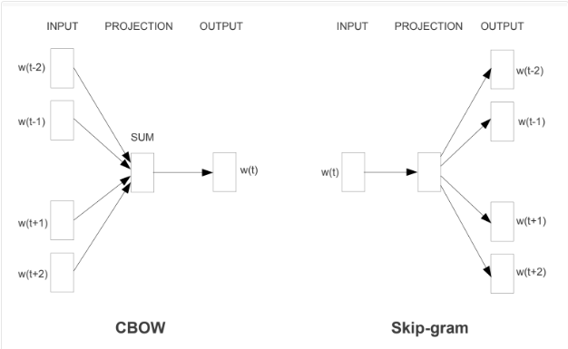
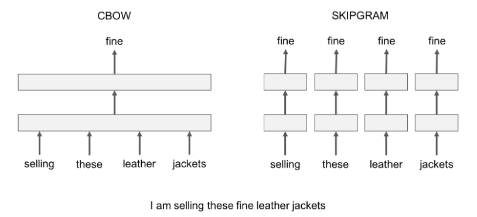

An open-source, free, lightweight library created by Facebook R&D that learns text representations and build text classifiers.


- Written in C++ and supports multiprocessing during training.

- Allows us to train supervised and unsupervised representations of words and sentences.

<ins>**Setting it up**</ins>
```bash
$ pip install fasttext
----------------------------Installing-------------------------
$ python
Python 2.7.15 |(default, May  1 2018, 18:37:05)
Type "help", "copyright", "credits" or "license" for more information.
>>> import fasttext
>>>
```

### Word Embeddings

- For processing natural language & extracting useful info from that text using ML, requires that this text should be understandable by machine. For this purpose, the text is converted into set of real numbers, technically a vector.

- WE is basically a learned representation for text where words that have the same meaning have a similar representation in the vector space.

- The process of converting words into real numbers/vectors -> Vectorization.


- Word embeddings help in the following use cases.
  - Compute similar words
  - Calculate semantics behind words
  - Document clustering/grouping
  - Feature extraction for text classifications
  - Natural language processing.


- Word embeddings can be calculated using pre-trained methods from libraries such as,
  - Word2Vec — From Google
  - Fasttext — From Facebook
  - GloVe — From Stanford


- These are distributed representations of text in an n-dimensional space. Essential for solving most NLP problems.

- These vectors capture hidden information about a language, like word analogies or semantics.


### Word Embedding Methods

These methods learn a real-valued vector representation for a predefined fixed sized vocabulary from a corpus of text.

Most famous architectures such as Word2Vec, Fasttext, Glove helps to convert text to word vectors and leverage cosine similarity for word similarity features.

1. <ins>**Embedding layer**</ins>
  - Most native approach

  - Here word embeddings are learned jointly with a neural network model on a specific natural language processing task.

  - The embedding layer is used on the front end of a neural network and is fit in a supervised way using the Backpropagation algorithm.

  - This approach of learning an embedding layer requires a lot of training data and is slow.


  - 2 methods:
    - FeedForward Neural Net Language Model (NNLM)
    - Recurrent Neural Net Language Model (RNNLM)


  - NNLM, RNNLM outperforms for the huge dataset of words but computation complexity is a big overhead

2. <ins>**Word2Vec**</ins>

  - Developed at Google

  - Word representations in Vector Space, or word2vec algorithm.

  - Makes the neural-network-based training of the embedding more efficient and is now the de facto standard for developing pre-trained word embedding.

  - Takes a large text corpus as I/P and produces a vector space, of several hundred dimensions, with each unique word in the corpus being assigned a corresponding vector in this space.

  - Word vectors are positioned in the vector space such that words that share common contexts in the corpus are located in close proximity to one another.

  - 2 learning models were introduced for learning the word embedding:
    - Continuous Bag-of-Words, or CBOW model.
    learns the embedding by predicting the current word based on its context.

    - Continuous Skip-gram Model.
    learns the embedding by predicting the surrounding words given a current word.

    

  - Key benefit is that high-quality word embeddings can be learned efficiently (low space and time complexity), allowing larger embeddings to be learned (more dimensions) from much larger corpora of text (billions of words).


3. <ins>**GloVe**</ins>

  - Developed at Stanford.

  - Global Vectors for Word Representation, or GloVe, algorithm is an extension to the Word2Vec method for efficiently learning word vectors.

  - an approach to combine both the global statistics of matrix factorization techniques like LSA (Latent Semantic Analysis) with the local context-based learning in Word2Vec.

  - Rather than using a window to define local context, GloVe constructs an explicit word-context or word co-occurrence matrix using statistics across the whole text corpus. The result is a learning model that may result in generally better word embeddings.

### Fasttext

We can either generate word vectors for any raw data or use the pre-trained word vectors which ship with Fastext.

<ins>**Example**</ins>

`Downloading & cleaning raw dataset`
```bash
jalaz@jalaz-personal:~ wget -c http://mattmahoney.net/dc/enwik9.zip -P data/
jalaz@jalaz-personal:~ unzip data/enwik9.zip -d data/
jalaz@jalaz-personal:~ perl /home/jalaz/fastText/wikifil.pl data/enwik9 > data/fil9
```

`Generation of word vectors`
```python
import fasttext

# Generation by default settings
model = fasttext.train_unsupervised('data/fil9')

# Saving the model for later use
model.save_model("result/fil9.bin")
model = fasttext.load_model("result/fil9.bin")
```

2 models for computing word representations:
  1. **skipgram model** learns to predict a target word thanks to a nearby word.
  2. **cbow model** predicts the target word according to its context. The context is represented as a bag of the words contained in a fixed size window around the target word.

  

Practcally, skipgram models works better with subword information than cbow models.

`Tweaking parameters`
```python
model1 = fasttext.train_unsupervised('data/fil9_small', model="cbow")
model2 = fasttext.train_unsupervised('data/fil9_small', model="skipgram")
model3 = fasttext.train_unsupervised('data/fil9', minn=2, maxn=5, dim=300)
model4 = fasttext.train_unsupervised('data/fil9', epoch=1, lr=0.5)
model5 = fasttext.train_unsupervised('data/fil9', thread=4)
```

- **dim** (dimension)
  - Controls the size of the vectors
  - larger dim -> more information capture but requires more data to be learned.
  - If too large -> harder and slower to train.
  - By default, dim = 100, but any value in the 100-300 range is as popular.


- **subwords**
  - All the substrings contained in a word between **minn** and **maxn**.
  - By default, subword = (3,6), for different languages ranges may vary.


- **epoch**
  - Controls how many times the model will loop over the dataset.
  - By default, epoch = 5. For massive dataset, epoch should be less.


- **lr**
  - Higher lr -> faster the model converge to a solution but at the risk of overfitting to the dataset.
  - By default, lr = 0.05

- **thread**
  - fastText is multi-threaded and uses 12 threads by default.
  - This can easily be tweaked using this parameter for lesser-core CPUs.

`Usage of word embeddings`

- Word embedding generated for a word can be checked
```python
print(model.words)
print("\n-------------------------------------\n")
print(model.get_word_vector("female"))
```
```bash
['the',
 'of',
 ...
 'germany',
 ...
 'actress',
 ...
 'governor',
 'players',
 ...
 'models',
 ...]
 -------------------------------------
[ 0.01122757  0.18961109 -0.16199729  0.11208588
 ---      ---     ---     ---     ---     ---     ---
  0.19992262 -0.06550902 -0.40920728 -0.16724268]
```


- Semantic information of the vectors are captured with the **nn functionality**.
```python
model.get_nearest_neighbors('london')
```
```bash
[(0.7785311341285706, 'princeton'),
 (0.7696226239204407, 'cambridge'),
 (0.7583264112472534, 'glasgow'),
 (0.7519310116767883, 'oxfordshire'),
 ...,
 (0.7124481797218323, 'routledge')]
```


- **nn functionality** can also be used for spellcorrections.
```python
model.get_nearest_neighbors('actres')
```
```bash
[(0.9361368417739868, 'actress'),
 (0.9093650579452515, 'actresses'),
 (0.852777361869812, 'actor'),
 (0.8409433364868164, 'songwriter'),
 ...,
 (0.771904468536377, 'snooker')]
```


- **analogies functionality** can be used for managing analogies between data points
```python
model.get_analogies("berlin", "germany", "france")
```
```bash
[(0.896462, u'paris'),
 (0.768954, u'bourges'),
 ...,
 (0.740635, u'bordeaux'),
 (0.736122, u'pigneaux')]
```


- **character n-grams** are really important. Using subword-level information helps building vectors for unknown words.
```python
model_without_subwords = fasttext.train_unsupervised('data/fil9_small', maxn=0)
model_normal = fasttext.train_unsupervised('data/fil9_small')
model_without_subwords.get_nearest_neighbors('accomodation')
print("\n------------------------------------\n")
model_normal.get_nearest_neighbors('accomodation')
```
```bash
[(0.775057, u'sunnhordland'),
 (0.769206, u'accomodations'),
 (0.753011, u'administrational'),
 ...,
 (0.732465, u'asserbo')]
 ------------------------------------
[(0.96342, u'accomodations'),
 (0.942124, u'accommodation'),
 (0.915427, u'accommodations'),
 ...,
 (0.701426, u'hospitality')]
```

## Text Classification

This deals with classifying text into 1 or more labels.
  - Spam detection, language identification, sentiment analysis comes under this domain.

  - Can be single-label classifiers (like spam identifier: spam-not spam) or multi-label classifiers (like language detector: hindi-english-telugu-tamil etc.)

  - For building such classifiers, labeled data is required, which consists of documents and their corresponding labels.

<ins>**Preparing dataset**</ins>

1. Download this awesome dataset on news item classification from [Kaggle](https://www.kaggle.com/rmisra/news-category-dataset).

2. Analyse the dataset present in JSON-Lines type file using
```bash
jalaz@jalaz-personal:~$ head -2 data/news-articles.jsonl
{"category": "CRIME", "headline": "There Were 2 Mass Shootings In Texas Last Week, But Only 1 On TV", "authors": "Melissa Jeltsen", "link": "https://www.huffingtonpost.com/entry/texas-amanda-painter-mass-shooting_us_5b081ab4e4b0802d69caad89", "short_description": "She left her husband. He killed their children. Just another day in America.", "date": "2018-05-26"}
{"category": "ENTERTAINMENT", "headline": "Will Smith Joins Diplo And Nicky Jam For The 2018 World Cup's Official Song", "authors": "Andy McDonald", "link": "https://www.huffingtonpost.com/entry/will-smith-joins-diplo-and-nicky-jam-for-the-official-2018-world-cup-song_us_5b09726fe4b0fdb2aa541201", "short_description": "Of course it has a song.", "date": "2018-05-26"}
```

2. Comparing this raw dataset with the standard dataset provided by [Facebook Research](https://dl.fbaipublicfiles.com/fasttext/data/cooking.stackexchange.tar.gz),
```bash
jalaz@jalaz-personal:~$ head -5 data/cooking.stackexchange.txt
__label__sauce __label__cheese How much does potato starch affect a cheese sauce recipe?
__label__food-safety __label__acidity Dangerous pathogens capable of growing at acidic environments
__label__cast-iron __label__stove How can I cover up the white spots on my cast iron stove?
__label__restaurant Michelin Three Star Restaurant, but the chef is not there
__label__knife-skills __label__dicing Without knife skills, how can I quickly and accurately dice vegetables?
```


3. Data cleaning & standarization achieved using:
```python
  import json
  fileReader = open("data/news-articles.jsonl", "r")
  fileWriter = open("data/news-articles.txt", "w")
  for line in fileReader:
      news = dict(json.loads(line))
      fileWriter.write("__label__"+news["category"].lower()+" "+news["headline"].lower()+"\n")
```


4. Final dataset ready for fasttext classifier:
```bash
jalaz@jalaz-personal:~$ head -5 data/news-articles.txt
__label__crime there were 2 mass shootings - texas last week, but only 1 on tv
__label__entertainment will smith joins diplo and nicky jam the 2018 world cups official song
__label__entertainment hugh grant marries the first at age 57
__label__entertainment jim carrey blasts castrato adam schiff and democrats new artwork
__label__entertainment julianna margulies uses donald trump poop bags to pick up after her dog
```

5. Training-Validation splitting (80-20):
```bash
jalaz@jalaz-personal:~$ wc data/news-articles.txt
200832  2189821 15670354 data/news-articles.txt
jalaz@jalaz-personal:~$ head -n 160000 data/news-articles.txt > data/news-articles.train
jalaz@jalaz-personal:~$ tail -n 40832 data/news-articles.txt > data/news-articles.valid
```

`Creating, saving & using model`
```python
import fasttext
model = fasttext.train_supervised(input="data/news-articles.train")

model.save_model("model/news-classifier-v1.bin")
modelLoaded = fasttext.load_model("model/news-classifier-v1.bin")

model.predict("Roger Federer wins US Grand Slam Men's final")
model.predict("North Korea threatens Japan with back to back 4 nuclear tests")
print("\n-----------------------\n")
model.predict("Britain exit from the European Union confirmed", k=5)
print("\n-----------------------\n")
model.predict("narendra modi aquitted for gujarat riots by the court", k=-1, threshold=0.1)
```
```bash
(('__label__sports',), array([0.91453463]))
(('__label__politics',), array([0.88016534]))
-----------------------
(('__label__politics', '__label__worldpost', '__label__impact', '__label__business', '__label__religion'), array([0.41946396, 0.15596035, 0.13890333, 0.09830396, 0.02962857]))
-----------------------
(('__label__worldpost', '__label__crime', '__label__politics'), array([0.30460522, 0.25598988, 0.14045343]))
```

`Testing model accuarcy`

<ins>**Precision**</ins>: Number of correct labels among the predicted labels.
<ins>**Recall**</ins>: Number of real labels that could be predicted.

```python
model.test("data/news-articles.valid")
model.test("data/news-articles.valid", k=5)
```
```bash
(40832, 0.5363685344827587, 0.5363685344827587)
(40832, 0.1458170062695925, 0.7290850313479624)
```

`Tweaking parameters & improvisations`

- **epochs & lr**

  <ins>epoch</ins> denotes the number of iterations of training over each datapoint while <ins>lr</ins> denotes the learning rate.

  ```python
  modelv2 = fasttext.train_supervised(input="data/news-articles.train", epoch=25)
  modelv2.test("data/news-articles.valid")
  modelv3 = fasttext.train_supervised(input="data/news-articles.train", lr=1.0)
  modelv3.test("data/news-articles.valid")
  modelv4 = fasttext.train_supervised(input="data/news-articles.train", epoch=25, lr=1.0)
  modelv4.test("data/news-articles.valid")
  ```
  ```bash
  (40832, 0.617701802507837, 0.617701802507837)
  (40832, 0.698226880877743, 0.698226880877743)
  (40832, 0.5116085423197492, 0.5116085423197492)
  ```

- **word n-grams**

  - <ins>word n-grams:</ins>
  Performance of model can be improved by using word bigrams, instead of just unigrams. Important for classification problems where word order is important like sentiment analysis.

  - <ins>unigram</ins> refers to a single undividing unit, or token. Can be a word or a letter depending on the model. In fastText, we work at the word level and thus unigrams are words.

  - <ins>bigram</ins> is the concatenation of 2 consecutive tokens or words.

  - "Last donut of the night"
    - unigrams: 'last', 'donut', 'of', 'the', 'night'.
    - bigrams: 'Last donut', 'donut of', 'of the', 'the night'.

  ```python
  modelv5 = fasttext.train_supervised(input="data/news-articles.train", epoch=25, lr=1.0, wordNgrams=2)
  modelv5.test("data/news-articles.valid")
  modelv5.predict("narendra modi aquitted for gujarat riots by the court", k=-1, threshold=0.1)
  ```
  ```bash
  (40832, 0.6719974529780565, 0.6719974529780565)
  (('__label__politics', '__label__crime', '__label__worldpost'), array([0.55176157, 0.24307342, 0.18037586]))
  ```

- **loss**
  - hs (scaling up for production)
    - training can be made faster for large dataset by using the hierarchical softmax, instead of the regular softmax
    - hierarchical softmax is a loss function that approximates the softmax with a much faster computation

  - ova (multi label classification)
    - for handling multiple labels, convenient way is to use independent binary classifiers for each label
    - one vs all loss helps achieve this.

`Autotuning the hyperparameters`
  - Finding best hyperparametsr value is crucial for building efficient ml models.

  - Tuning the values manually is cumbersome since these parameters are dependent & their effects on final model vary from dataset to dataset.

  - fastText provides autotune feature for this task.

  ```python
  modelv10 = fasttext.train_supervised(input='data/news-articles.train', autotuneValidationFile='data/news-articles.valid')
  modelv11 = fasttext.train_supervised(input='data/news-articles.train', autotuneValidationFile='data/news-articles.valid', autotuneDuration=600)
  modelv12 = fasttext.train_supervised(input='data/news-articles.train', autotuneValidationFile='data/news-articles.valid', autotuneModelSize="2M")
  ```
