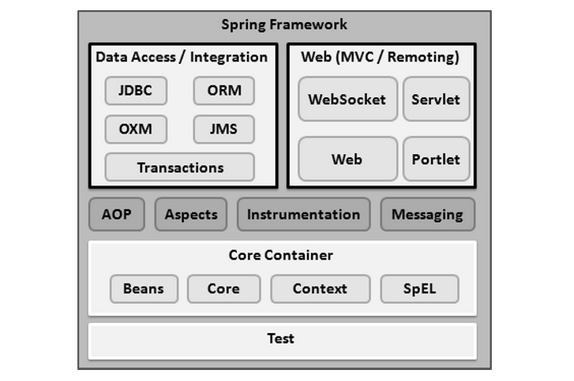

Spring is an open-source & most popular aplication development framework for enterprise java.
- Developed by Rod Johnson & released in 2003.
- Better over other J2EE frameworks like Java Servlets & JSPs.
- Used for creating high performance, easily testable & reusable code.

<ins>**Benefits of Spring:**</ins>

- Universal acceptance & great supporting community.
- Flexible in usage (Due to wide-range of extensions & 3rd party libraries)
- Super productive (Reduces extra efforts of developers like auto-configurable etc in Boot)
- Fast performance (Reduced startup & shutdown - optimised execution - nonblocking architecture - live reload features)
- Highly secure

<ins>**Features provided by Spring:**</ins>

## Spring Insiders

#### Runtime Architecture

#### Important Modules

- <ins>**Spring AOP**</ins>
  - Aspect Orinted Programming

- <ins>**Spring ORM**</ins>

- <ins>**Spring DAO**</ins>

- <ins>**Spring Web Flow**</ins>

- <ins>**Spring Context**</ins>

- <ins>**Spring Web MVC**</ins>

- <ins>**Spring Core**</ins>

## Spring Core Concepts

#### DI

<ins>**Annotation-based**</ins>

<ins>**XML-based**</ins>

#### IOC

#### Aspect Oriented Programming

#### POJO

#### Spring Bean & lifecycle

###
