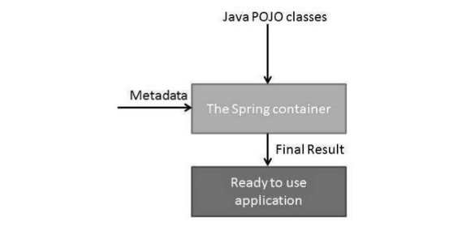

Spring is an open-source & most popular application development framework for enterprise java.
- Developed by Rod Johnson & released in 2003.
- Better over other J2EE frameworks like Java Servlets & JSPs.
- Used for creating high performance, easily testable & reusable code.


<ins>**Benefits of Spring:**</ins>

- Universal acceptance & great supporting community.
- Flexible in usage (Due to wide-range of extensions & 3rd party libraries)
- Super productive (Reduces extra efforts of developers like auto-configurable etc in Spring Boot)
- Fast performance (Reduced startup & shutdown - optimised execution - nonblocking architecture - live reload features)
- Highly secure

<ins>**Features provided by Spring:**</ins>


## Spring Concepts

#### Runtime Architecture

Spring framework is modular, allows us to pick & choose modules application, without having to bring in the rest.

Main 20 modules form part of Spring Framework:


1. <ins>**Core Container:**</ins>
  - `core` module provides fundamental features like DI & IOC.
  - `beans` module provides BeanFactory.
  - `context` module builds upon the core & beans modules, providing medium to the objects defined & configured.
  - `SpEL` module provides powerful expression language for querying & manipulating objects at runtime.

2. <ins>**Data Access/Integration Container:**</ins>
  - `JDBC` module provides an abstraction layer over JDBC operations.
  - `ORM` module provides integration layer for prominent object-relational mapping APIs like Hibernate, JPA etc.
  - `OXM` module provides support for object-xml mappings implementations for Castor, XMLBeans, JAXB etc.
  - `JMS` module (Java Messaging Services) contains features for producing & consuming messages.
  - `transaction` module supports transaction management.

3. <ins>**Web Container:**</ins>
  - `web` module provides basic web integration features like mutli-part file uploads & IOC container initialisation using servlets listeners & web-oriented application context.
  - `web-mvc` module contains Model-View-Controller implementation for web application.
  - `web-socket` modules provides support for 2-way communication.
  - `web-portlet` module mirrors functionality of web-servlets.

4. <ins>**Miscellanous:**</ins>
  - `AOP`, `aspects` & `instrumentation` module provides support for Aspect Oriented programming.

  - `test` module provides testing support of Spring components with JUnit & TestNG.


### Terminology

<ins>**Spring Containers**</ins>
Spring containers, also called IoC containers are at the core of Spring Framework.
- containers create objects, wires them together, configures them & manages their complete lifecycle from creation to destruction.
- containers uses DI to manage the components (Spring Beans) that makes up the application.
- containers gathers instructions on what components to instantiate, configure or assemble by reading configuration metadata provided in the form of java annotations or xml files.



2 main IoC containers are there:
- BeanFactory container provides basic support.
- ApplicationContext container provides more enterprise-specific features & includes all the functionality of BeanFactory container.

#### Spring Bean

<ins>**Bean**</ins> is an
- object that is instantiated, managed & configured by IoC container.
- forms the backbone of the spring framework
- created by the configuration metadata which is supplied to the IoC container.

Using the configuration metadata, IoC container gathers following info:
- Creation of bean
- Bean's lifecycle details
- Beans's dependencies

Following properties are set for each bean:
- `class` : specifies the bean class to be used for creation.
- `name` : uniquely identifies the bean.
- `scope` : specifies the scope of objects created from a particular bean definitions.
- `constructor-arg` : used for injecting dependencies.
- `properties` : used for injecting dependencies.
- `autowiring mode` : used for injecting dependencies.
- `lazy-initialisation mode` : tells the IoC container to create bean instance when requested, rather than at the startup.
- `initialisation method` : callback to be called after setting all the necessary properties on the bean by the IoC container.
- `destruction method` : callback to be called after destroying the bean.

Configuration metadata  can be provided to the spring container using 3 methods:
- XML-based configuration files
- Annotataion-based configuration files
- Java-based configuration files

<ins>**Bean scopes**</ins>
For each beans defined, scope of the bean can be declared.
There are 5 scopes available, out of which 3 can only be used in web-aware ApplicationContext.

- singleton
  - scopes the bean definition to a single instance per IoC container.
  - when we wish that spring should return the same bean instance when needed.

- prototype
  - scopes the bean defintion to have any number of object instances.
  - foces spring to produce a new bean instance each time when needed.

- request
  - scopes the bean definition to an HTTP request.

- session
  - scopes the bean definition to an HTTP session.

- global session
  - scopes the bean definition to a global HTTP session.

<ins>**Bean lifecycle**</ins>
Lifecycle is quite easy to understand. When instantiated, some initialisation is required for the bean to get into a useful state. When usage of bean is completed & is no longer required, then some clean-up is required.

init-method & destroy-method parameters are used to define the setup & teardown of bean.
- init-method specifies the method to be called on bean upon instantiation.
- destroy-method sepcifies the method that is called just before a bean is removed from the container.

```bash
<bean id = "exampleBean1" class = "examples.ExampleBean1" init-method = "init"/>
<bean id = "exampleBean2" class = "examples.ExampleBean2" destroy-method = "destroy"/>
```

```java
public class ExampleBean1 {
   public void init() {
      // do some initialization work
   }
}

public class ExampleBean2 {
   public void destroy() {
      // do some destruction work
   }
}
```

Apart from this way, direct methods are also there which doesn't require confguring the metadata in xml files:

```java
public class ExampleBean1 implements InitializingBean {
   public void afterPropertiesSet() {
      // do some initialization work
   }
}

public class ExampleBean2 implements DisposableBean {
   public void destroy() {
      // do some destruction work
   }
}
```

<ins>**Bean Post Processor**</ins>

The interface defines callback methods that can be used for providing own instantiation logic, dependency-resolution logic etc.

BPP operates on bean instances, means that IoC container instantiates bean instance before BPP works.

`Quote.java`
```java
public class Quote {
   private String title;

   // GETTER - SETTER

   public void init() {
      System.out.println("Bean is going through init.");
   }

   public void destroy() {
      System.out.println("Bean will destroy now.");
   }
}
```

`jalazBPP.java`
```java
public class jalazBPP implements BeanPostProcessor {
   public Object postProcessBeforeInitialization(Object bean, String beanName) throws BeansException {
      System.out.println("BeforeInitialization : " + beanName);
      return bean;
   }

   public Object postProcessAfterInitialization(Object bean, String beanName) throws BeansException {    
      System.out.println("AfterInitialization : " + beanName);
      return bean;
   }
}
```

`bean-config.xml`
```bash
<beans xmlns = ""
   xmlns:xsi = ""
   xsi:schemaLocation = "">

   <bean id = "quote" class = "tech.jaykay12.Quote"
      init-method = "init" destroy-method = "destroy">
      <property name = "title" value = "\"Glory in the sky!\""/>
   </bean>

   <bean class = "tech.jaykay12.jalazBPP" />
</beans>
```

`Runner.java`
```java
public class Runner {
   public static void main(String[] args) {
      AbstractApplicationContext context = new ClassPathXmlApplicationContext("bean-config.xml");

      Quote q = (Quote) context.getBean("quote");
      q.getTitle();
      context.registerShutdownHook();
   }
}
```

`OUTPUT`
```bash
BeforeInitialization : quote
Bean is going through init.
AfterInitialization : quote
Title : "Glory in the sky!"
Bean will destroy now.
```

## Spring Core Concepts

Dependency Injection & AOP are 2 prime spring core concepts.
DI is the more prominent one though.

### Dependency Injection

For a fully-functional application, several objects must work together. In complex application, all classes should be as indepedent as possible from rest for reusability, scalability & easy testability.

DI basically,
- helps in gluing these classes together while keeping them indepedent.
- makes our code loosely coupled.
- is achieved by 2 ways:
  - DI using constructors
  - DI using Setter methods

Creating objects using new() or using factory methods comes under the domain of dependency lookup. It carries problems like tight coupling & hard to test.

`W/O DI`
```java
public class Employee {
   private Address address;
   public Employee() {
      address = new Address();
   }
}
```

`Constructor-based DI`
```java
public class Employee{  
  private Address address;  
  public Employee(Address address){  
    this.address=address;  
  }
}
```

`Setter-based DI`
```java
public class Employee{  
  private Address address;  
  public void setAddress(Address address){  
    this.address=address;  
  }
}
```

In both these cases, instance of Address class is provided by external source such as XML file.

We can mix both, but it is convention to use C-DI for mandatory dependencies & S-DI for optional dependencies.

Code is cleaner with DI & more effective decoupling.

|Constructor-DI|Setter-DI|
|---|---|
||Supports Partial dependency|
|Is overridden by S-DI|Used in case of conflicting|
||More flexible|

#### XML-based

<ins>**Primitive Constructor-DI**</ins>

`Employee.java`
```java
public class Employee {  
    private int id;
    private String name;

    public Employee(int id, String name) {  
        this.id = id;
        this.name = name;
    }
}
```

`app-config.xml`
```bash
<?xml version="1.0" encoding="UTF-8"?>  
<beans  
    xmlns=""  
    xmlns:xsi=""  
    xmlns:p=""  
    xsi:schemaLocation="">  

    <bean id="employee" class="tech.jaykay12.Employee">  
        <constructor-arg value="10" type="int" ></constructor-arg>  
        <constructor-arg value="Jalaz"></constructor-arg>
    </bean>
</beans>
```

`Runner.java`
```java
public class Runner {  
    public static void main(String[] args) {  
        Resource res = new ClassPathResource("app-config.xml");  
        BeanFactory factory = new XmlBeanFactory(res);
        Employee s = (Employee)factory.getBean("employee");    
    }
}
```

<ins>**Constructor-DI with dependent object**</ins>

`Address.java`
```java
public class Address {
    private String city;
    private String state;
    public Address(String city, String state) {
        this.city = city;
        this.state = state;
    }
}
```

`Employee.java`
```java
public class Employee {
    private String name;
    private Address address;

    public Employee(String name, Address address) {  
        this.name = name;
        this.address = address;
    }
}
```

`app-config.xml`
```bash
<?xml version="1.0" encoding="UTF-8"?>  
<beans  
    xmlns=""  
    xmlns:xsi=""  
    xmlns:p=""  
    xsi:schemaLocation="">  

    <bean id="address" class="tech.jaykay12.Address">  
        <constructor-arg value="Saharanpur"></constructor-arg>  
        <constructor-arg value="UP"></constructor-arg>
    </bean>

    <bean id="employee" class="tech.jaykay12.Employee">   
        <constructor-arg value="Jalaz"></constructor-arg>
        <constructor-arg>
          <ref bean="address" />
        </constructor-arg>
    </bean>
</beans>
```

`Runner.java`
```java
public class Runner {  
    public static void main(String[] args) {  
        Resource res = new ClassPathResource("app-config.xml");  
        BeanFactory factory = new XmlBeanFactory(res);
        Employee s = (Employee)factory.getBean("employee");    
    }
}
```

<ins>**Primitive Setter-DI**</ins>

`Employee.java`
```java
public class Employee {  
    private int id;
    private String name;
    //SETTERS & GETTERS
}
```

`app-config.xml`
```bash
<?xml version="1.0" encoding="UTF-8"?>  
<beans  
    xmlns=""  
    xmlns:xsi=""  
    xmlns:p=""  
    xsi:schemaLocation="">  

    <bean id="employee" class="tech.jaykay12.Employee">  
        <property name="id">
            <value>75655</value>
        </property>
        <property name="name">
            <value>"Jalaz"</value>
        </property>
    </bean>
</beans>
```

`Runner.java`
```java
public class Runner {  
    public static void main(String[] args) {  
        Resource res = new ClassPathResource("app-config.xml");  
        BeanFactory factory = new XmlBeanFactory(res);
        Employee s = (Employee)factory.getBean("employee");    
    }
}
```

<ins>**Setter-DI with Dependent object**</ins>

`Address.java`
```java
public class Address {
    private String city;
    private String state;
    //GETTERS & SETTERS
}
```

`Employee.java`
```java
public class Employee {
    private String name;
    private Address address;
    //GETTERS & SETTERS
}
```

`app-config.xml`
```bash
<?xml version="1.0" encoding="UTF-8"?>  
<beans  
    xmlns=""  
    xmlns:xsi=""  
    xmlns:p=""  
    xsi:schemaLocation="">  

    <bean id="address" class="tech.jaykay12.Address">  
        <property name="city" value="Saharanpur" />
        <property name="state" value="UP" />
    </bean>

    <bean id="employee" class="tech.jaykay12.Employee">   
        <property name="name" value="Jalaz" />
        <property name="address" ref="address" />
    </bean>
</beans>
```

`Runner.java`
```java
public class Runner {  
    public static void main(String[] args) {  
        Resource res = new ClassPathResource("app-config.xml");  
        BeanFactory factory = new XmlBeanFactory(res);
        Employee s = (Employee)factory.getBean("employee");    
    }
}
```

Till now, beans were declared using `<bean>` & injected using `<constructor-arg>` & `<property>` elements in XML config file.

`Autowiring` is a concept of reducing this effort more. Used prominently with Annotation-based & Java-based configuration approaches.

#### Annotation-based

With Spring 2.5, DI can be configured using annotations.
- Annotation injection is done before XML injection
- Is overridden by XML injection.
- Is not turned on in IoC container by default.
- `<context:annotation-config/>` is inserted in config file for turning on annotations.

Few important annotations:
- `@Required` : Applies to bean property setter methods & mandates that the property should be populated at configuration time.

- `@Autowired` : Can be applied to property setter methods, consructors, properties or non-setter methods as well. Autowired with (required-false) is of great usage.

- `@Qualifier` : Used in scenarios when we have more than 1 bean of same type in our configurations. Used along with Autowired to remove this confusion.
```java
public class Profile {
   @Autowired
   @Qualifier("student1")
   private Student student;
}
```


- Other JSR-250 annotations like:
  - `@Resource`
  - `@PostConstruct` :
      - Used as alternate initialisation callback.
      - Not used prominently.
      - In sync with `init-method` defined with a bean in xml config.
  - `@PreDestroy` :
      - Used as alternate destruction callback.
      - Not used prominently.
      - In sync with `destroy-method` defined with a bean in xml config.

#### Java-based

Helps in writing entire spring configuration without any XML file.

- `@Configuration` : Indicates that the class can be used by IoC containers as source of bean definitions.

- `@Bean` : When annotated on any method, return type of this method should be registered as a bean in the spring application context.

- `@Scope` : By default is singleton, used for setting the scope of bean

`JavaConfig.java`
```java
@Configuration
public class JavaConfig {
    @Bean
    @Scope("prototype")
    public Blog blog(){
      return new Blog();
    }
}
```

This is equivalent to the XML configuration.

`XMLConfig.xml`
```bash
<beans>
   <bean id = "blog" class = "tech.jaykay12.Blog" />
</beans>
```

`Blog.java`
```java
public class Blog {
   private String title;
   // Setters & Getters
   }
}
```

`Runner.java`
```java
public class Runner {
   public static void main(String[] args) {
      ApplicationContext ctx = new AnnotationConfigApplicationContext(JavaConfig.class);

      ctx.register(ExtraConfig.class);            // Useful in case of multi config files
      ctx.refresh();

      Blog blog = ctx.getBean(Blog.class);
      blog.setTitle("Goa Plans!");
      helloWorld.getTitle();
   }
}
```

### Aspect Oriented Programming
_Will touch-down this topic any time in the future._


### Spring MVC
Java framework which is used to build web applications.
- Follows the Model-View-Controller design pattern.
- Uses `DispatcherServlet`, a special class that receives the incoming request and maps it to the right resource such as controllers, models, and views.


Contains annotations like `@Controller`, `@RequestMapping` etc.

`pom.xml`
```bash
<dependency>  
    <groupId>org.springframework</groupId>  
    <artifactId>spring-webmvc</artifactId>  
    <version>5.1.1.RELEASE</version>  
</dependency>  

<dependency>    
    <groupId>javax.servlet</groupId>    
    <artifactId>servlet-api</artifactId>    
    <version>3.0-alpha-1</version>    
</dependency>  
```
