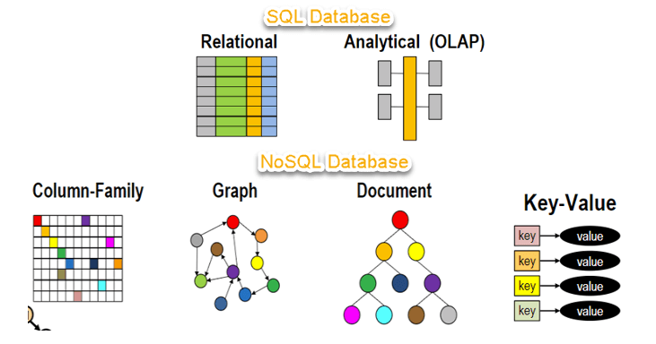
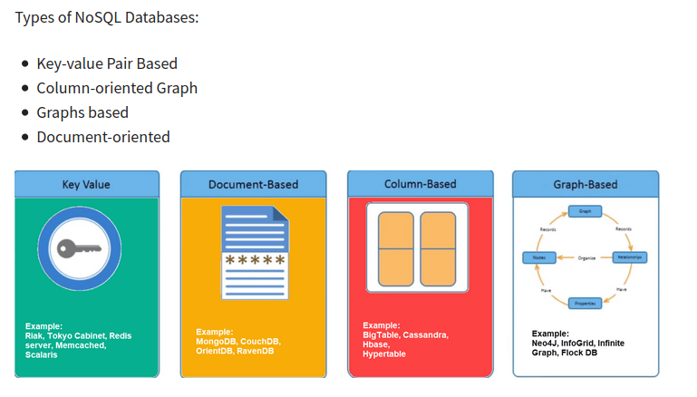
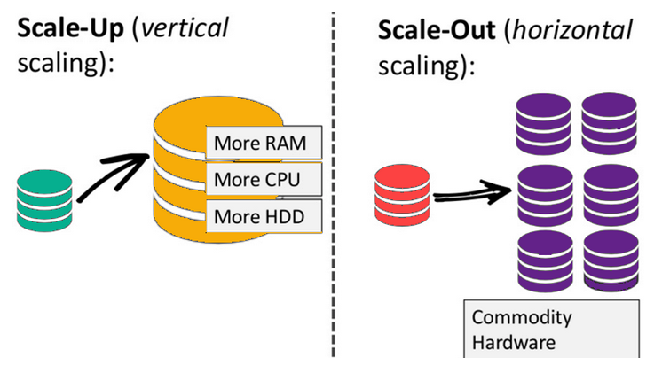
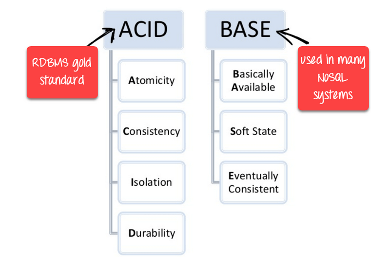

NoSQL databases are non tabular, and store data in a different way than the relational databases.

- Provides flexible schemas.
- Scale easily with large amounts of data and supports high user loads.

**Features:**
- Non relational
- Schema-less
- Distributed
- Provides Simple API

### Need for NoSQL

- <ins>**Data Relationships**</ins>
  - NoSQL DBs store relationship data differently than how relational databases store
  - Modeling the relationship between data is more easier

- <ins>**Storage Cost**</ins>
  - Drastic drop in the storage cost after 90s, developer cost became major one. For easing developer's effort NoSQL DBs were introduced & optimised.
  - Software engineers used to normalize their databases in order to reduce data duplication during earlier days.

- <ins>**Randomness & Quanity of data**</ins>
  - Data started coming in different shapes & sizes.
  - Amount of data generated & fed into the system has also increased manifold.
  - NoSQL DBs allow developers to store huge amounts of unstructured data, providing a lot of flexibility.

- <ins>**Introduction of cloud-computing**</ins>
  - Enterprises desired their applications & data hosted on cloud. This data was required to be distributed on multiple servers & regions for application resilience.
  - Also helped in better geo-placing their data.
  - NoSQL DBs like Mongo provided these capabilities

#### Types of NoSQL Databases

<ins>**Document Databases:**</ins>
- Stores data in form of documents similar to JSON objects.
- Each document contains pairs of fields and values.
- Due to presence of variety of field types & powerful query languages, used as general purpose databases.
- Can be easily scale-out for storing humongous amount of data.
- Example:
  - MongoDB - https://jaykay12.github.io/tech/mongodb-database/
  - MariaDB
  - Apache Solr - https://jaykay12.github.io/tech/apache-solr-indexing-configurations/

<ins>**Key-value Databases:**</ins>
- Store data in the form of keys and values.
- Simpler database design
- Great for storing large amounts of data but there is no need of performing complex queries to retrieve that data.
- Useful for caching purposes or storing user preferences/context.
- Example:
  - Aerospike - https://jaykay12.github.io/tech/aerospike/
  - Couchbase - https://jaykay12.github.io/tech/couchbase/
  - Redis - https://jaykay12.github.io/tech/redis/
  - DyanoDB

<ins>**Wide-column Stores:**</ins>
- Store data in the form of tables, rows, and dynamic columns.
- Provides lot of flexibility over relational databases as each row is not required to have the exact same columns(schema less).
- Great when large amounts of data is stored and the future query patterns can be preicted.
- Commonly used for storing IoT data and user profile data. (Clickstream data)
- Example:
  - Cassandra
  - HBase

<ins>**Graph Databases:**</ins>
- Store data in the form of nodes and edges
- Nodes store information about entities(users, company, products) while edges store information about the relationships between these nodes.
- Great for usecases where we need to traverse relationships to look for patterns such as social networks, fraud detection, and recommendation engines.
- Example:
  - Neo4j
  - JanusGraph
  - Aerospike-Graph

#### When should NoSQL be used over SQL

- **Development Pace**
  - NoSQL development can be relatively faster as compared to SQL
  - In case of frequent code changes, NoSQL supports quick changes as opposed to SQL, where schema needs to be updated by DB Admin, Data unload & Data load is required for each change.

- **Mutli-form Data**
  - NoSQL DBs can better handle & are evolved for varied forms of data.
  - NoSQL DBs are better suited for storing & modeling structured, semi-structured & unstructured data together.
  - NoSQL DBs store data in a form that is similar to the objects used in application thus, reducing the efforts & cost in translation.

- **Supports large amount of data**
  - NoSQL DBs use scale-out mechanism(Horizontally Scaling) which is much better than the scale-up(Vertical Scaling) method of SQL DBs.
  - Scale-out architecture is one of the most affordable ways to handle large volumes of traffic
  - Scale-out architectures also provide benefits such as being able to upgrade a database or change its structure with zero downtime.

- **Multi Application paradigm support**
  - NoSQL can serve both transactional and analytical workloads from the same database. In SQL DBs, separate data warehouse is required to support analytics.
  - NoSQL have superior integration capabilities with real-time streaming technologies like aerospike ingestions.

### Advantages of No-SQL

- <ins>**High Availability**</ins>
  - Supported by the Auto-replication feature of NoSQL DBs
  - In case of failure, data automatically replicates to a previous consistent state making the system available most of the time.

- <ins>**High Scalability**</ins>
  - NoSQL DBs use sharding for horizontal scaling.
    - Sharding: Partitioning of data and placing it on multiple machines in such a way that the order of the data is preserved.
  - NoSQL can handle such huge amount of data as they provide Horizontal Scaling by design, as the data grows NoSQL scale itself to handle that data in an more efficient manner.

### Drawbacks of No-SQL

- <ins>**Narrow focus**</ins>
  - Mainly designed for storage capabilities & lacks the transactional management features.

- <ins>**Mostly Open-source**</ins>
  - Due to this, no reliable software standards.

- <ins>**No GUI**</ins>
  - GUI mode tools for db access are not available, CLI tools are there.

- <ins>**Large document size**</ins>
  - Data stored is of bigger size & stored in formats like JSON makes these packets transfer costly in network bandwidth

- <ins>**Management challenge**</ins>
  - Data management in NoSQL is more challenging than SQL DBs.
  - Setting up of NoSQL DB is more cumbersome.
 
---

### SQL vs NoSQL Databases

`CAP theorem` states that it's impossible for a distributed data store to offer all three of these at a time, we have to settle with any 2 of them:

- **Consistency:**
  - Data should remain consistent after the execution of an operation.
  - Once data is written, any future read request should contain that version of the data.

- **Availability:**
  - Database should always be available and responsive.
  - Should not have any downtime.

- **Partition Tolerance:**
  - System should continue to function even if the communication among the servers is not stable.

Just like SQL DBs follow ACID rules, NoSQL DBs follow BASE rules.

- **Basically available** means DB is available all the time as per CAP theorem
- **Soft state** means even without an input; the system state may change
- **Eventual consistency** means that the system will become consistent over time
