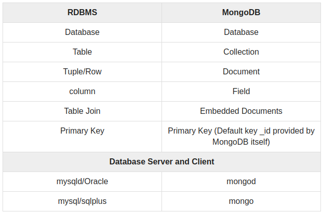

MongoDB is a
  - cross-platform
  - document-oriented NoSQL DB

provides
  - Easy scalability
  - High performance
  - High availability


### Concepts & Terminologies

MongoDB works on the concept of Collections & Documents.

- <ins>**Database**</ins>
  - Physical container for collections.
  - Each DB gets its own set of files on the file system.
  - A single MongoDB server has multiple databases.

- <ins>**Collection**</ins>
  - Group of MongoDB documents.
  - Equivalent of an RDBMS table.
  - A collection can only exists within a single database.
  - Collections do not enforce a schema.
  - Documents within a collection can have different fields.

- <ins>**Document**</ins>
  - Set of key-value pairs.
  - Documents have dynamic schema.
  - `Dynamic schema` - Documents in the same collection can have different set of fields or structure, and the common fields may hold different types of data in any 2 documents.



`_id`
- 12 bytes hexadecimal number which assures the uniqueness of every document.
- `_id` can be provided while inserting the document. If not provided then MongoDB provides a unique id for every document.
- These 12 bytes
  - first 4 bytes -> current timestamp,
  - next 3 bytes -> machine id
  - next 2 bytes -> process id of MongoDB server
  - remaining 3 bytes -> simple incremental VALUE.

### Installation & Configuration

**Step 1:** Adding Official MongoDB repository in the ubuntu packages & refresh sources list.

```bash
jalaz@jalaz-personal:~$ wget -qO - https://www.mongodb.org/static/pgp/server-4.4.asc | sudo apt-key add -
[sudo] password for jalaz:
OK

jalaz@jalaz-personal:~$ echo "deb [ arch=amd64,arm64 ] https://repo.mongodb.org/apt/ubuntu xenial/mongodb-org/4.4 multiverse" | sudo tee /etc/apt/sources.list.d/mongodb-org-4.4.list
deb [ arch=amd64,arm64 ] https://repo.mongodb.org/apt/ubuntu xenial/mongodb-org/4.4 multiverse

jalaz@jalaz-personal:~$ sudo apt-get update
...
Get:3 https://repo.mongodb.org/apt/ubuntu xenial/mongodb-org/4.4 Release [4,437 B]
Get:4 https://repo.mongodb.org/apt/ubuntu xenial/mongodb-org/4.4 Release.gpg [801 B]
...
Fetched 14.5 kB in 3s (5,065 B/s)
Reading package lists... Done
```

**Step 2:**  Installation (Standard one)(Works for 12.04, 14.04, 16.04)
```bash
jalaz@jalaz-personal:~$ sudo apt install -y mongodb
jalaz@jalaz-indiamart:~$ mongo --version
```

**Additional:** For 18.04 MongoDB is not officially supported. Used ubuntu packages which are not maintained by MongoDB org. This step is a replacment to Step 1 & Step 2.

```bash
jalaz@jalaz-indiamart:~$ sudo apt-get install mongodb
jalaz@jalaz-indiamart:~$ mongo --version
MongoDB shell version v3.6.8
```

**Step 3:** Starting, Stopping & Checking status

```bash
jalaz@jalaz-personal:~$ sudo systemctl start mongodb
jalaz@jalaz-personal:~$ sudo systemctl status mongodb
● mongodb.service - An object/document-oriented database
   Loaded: loaded (/lib/systemd/system/mongodb.service; enabled; vendor preset: enabled)
   Active: active (running) since Wed 2021-01-20 15:55:48 IST; 6min ago
     Docs: man:mongod(1)
 Main PID: 16863 (mongod)
    Tasks: 23 (limit: 4915)
   Memory: 40.2M
   CGroup: /system.slice/mongodb.service
           └─16863 /usr/bin/mongod --unixSocketPrefix=/run/mongodb --config /etc/mongodb.conf
jalaz@jalaz-personal:~$ sudo systemctl stop mongodb
```

#### MongoDB package components

- <ins>**Core Processes**</ins>
  - `mongod` : core database process
    - primary daemon process for the MongoDB system.
    - It handles data requests, manages data access, and performs background management operations.

  - `mongos` : controller and query router for sharded clusters.
    - For a sharded cluster, the mongos instances provide the interface between the client applications and the sharded cluster.
    - The mongos instances route queries and write operations to the shards.
    - From the perspective of the application, a mongos instance behaves identically to any other MongoDB instance.

  - `mongo` : interactive MongoDB Shell.
    - provides a powerful interface for system administrators as well as a way for developers to test queries and operations directly with the database.

- <ins>**Import/Export**</ins>
  - `mongodump`
    - provides a method for creating BSON dump files from the mongod instances.

  - `mongorestore`
    - restore these BSON dumps into mongod instances.

  - `bsondump`
    - converts BSON dump files into JSON.

  - `mongoimport`
    - provides a method for taking data in JSON, CSV, or TSV and importing it into a mongod instance.

  - `mongoexport`
    - provides a method to export data from a mongod instance into JSON, CSV, or TSV.

- <ins>**Diagnostics**</ins>
  - `mongotop`
  - `mongostat`

- <ins>**Security**</ins>
  - `mongoldap`
  - `mongokerberos`

### Basic Usage

MongoDB provides 2 types of data models:
- Embedded data model
- Normalized data model

<ins>**Embedded data model**</ins>

```json
{
    _id: "<ObjectId101>",
    Emp_ID: "75655",
    Personal_details: {
        Name: "Jalaz Kumar",
        Date_Of_Birth: "1995-08-12"
    },
    Contact: {
        e-mail: "jalaz.kumar@indiamart.com",
        city: "Almora"
    }
}
```

<ins>**Normalized data model**</ins>

`Employee`
```json
{
    _id: "<ObjectId101>",
    Emp_ID: "75655"
}
```

`Personal Details`
```json
{
    _id: "<ObjectId102>",
    DocEmpID: "<ObjectId101>",
    Name: "Jalaz Kumar",
    Date_Of_Birth: "1995-08-12"
}
```

`Contact`
```json
{
    _id: "<ObjectId103>",
    DocEmpID: "<ObjectId101>",
    e-mail: "jalaz.kumar@indiamart.com",
    city: "Almora"
}
```

#### Important Commands

<ins>**Creation & Insertion**</ins>

    use DATABASE_NAME
    show dbs
    db.dropDatabase()

    db.createCollection(name, options)
    show collections
    db.COLLECTION_NAME.drop()
    db.COLLECTION_NAME.insert(document)
    db.COLLECTION_NAME.insert([document1,document2])
    db.COLLECTION_NAME.insertOne(document)
    db.COLLECTION_NAME.insertMany(document1,document2)

<ins>**Querying**</ins>

    db.COLLECTION_NAME.find()
    db.COLLECTION_NAME.find().pretty()
    db.COLLECTIONNAME.findOne()

|SQL DBs (RDBMS)|NoSQL DBs|
|---|---|
|where name = 'jalaz'|db.students.find({"name":"jalaz"})|
|where likes < 50|db.students.find({"likes":{$lt:50}})|
|where name in ["Raj", "Ram", "Raghu"]|db.students.find({"name":{$in:["Raj", "Ram", "Raghu"]}})|
|where team = 'search' AND company = 'indiamart'|db.students.find({$and:[{"team":"search"},{"company": "indiamart"}]})|
|where likes>10 AND (skill = 'solr' OR name = 'jalaz')|db.students.find({"likes":{$gt:10}, $or: [{"skill": "solr"},{"name": "jalaz"}]})|
|where age is not greater than 25|db.students.find({"Age": {$not: {$gt:"25"}}})|

<ins>**Projection & Advanced Querying**</ins>

    db.COLLECTION_NAME.find({},{KEY_1:1, KEY_2:0, KEY_3:1})
    db.COLLECTION_NAME.find().limit(NUMBER)
    db.COLLECTION_NAME.find().limit(NUMBER).skip(NUMBER)
    db.COLLECTION_NAME.find().sort({KEY:1})

<ins>**Updation & Deletion**</ins>

2 functions are used prominently:
- update() : updates the value in the existing document.
- save() : replaces the existing document with the document passed as argument.


    db.COLLECTION_NAME.update(SELECTION_CRITERIA, UPDATED_DATA)
    db.COLLECTION_NAME.save({_id:ObjectId(),NEW_DATA})
    db.COLLECTION_NAME.findOneAndUpdate(SELECTIOIN_CRITERIA, UPDATED_DATA)
    db.COLLECTION_NAME.updateOne(<filter>, <update>)
    db.COLLECTION_NAME.updateMany(<filter>, <update>)

    db.COLLECTION_NAME.remove(DELETION_CRITERIA)
    db.COLLECTION_NAME.remove(DELETION_CRITERIA,1)

<ins>**Indexing**</ins>
- Indexes support the efficient resolution of queries
- W/O indexes, MongoDB has to scan the humongous amount of data & that is quite inefficient.
- Indexes are special Data structure which stores the small portion of data in easy-to-traverse form.


    db.COLLECTION_NAME.createIndex({KEY:1})
    db.COLLECTION_NAME.createIndex({KEY_1:1, KEY_2:-1})
    db.COLLECTION_NAME.createIndex({KEY:1}, OPTIONS)
    db.COLLECTION_NAME.dropIndex({KEY:1})
    db.COLLECTION_NAME.dropIndexes({KEY_1:1, KEY_2:-1})
    db.COLLECTION_NAME.getIndexes()

<ins>**Aggregation**</ins>
- Aggregation operation processes data records & returns computed results
- Aggregation in MongoDB is equivalent to `count(*)` & `GROUP BY` of SQL.
- Using aggregation, multiple documents can be grouped & final results are provided after performing various operations on this grouped data.


    db.COLLECTION_NAME.aggregate(AGGREGATE_OPERATION)

|SQL DB|NoSQL DB|
|---|---|
|SELECT author, count(*) FROM books GROUP BY author|db.books.aggregate([{$group : {_id : "$author", num_books : {$sum : 1}}}])|


### Practical Usage

`Data Information`

Employee information are used as sample dataset.

Fields: name, team, college

`Database & Collection setup`

```bash
jalaz@jalaz-personal:~$ mongo
MongoDB shell version v3.6.8
connecting to: mongodb://127.0.0.1:27017
Implicit session: session { "id" : UUID("3474ef53-05e5-43a9-a73a-0569aadcb8ec") }
MongoDB server version: 3.6.8
> show dbs
admin    0.000GB
config   0.000GB
> use tech
switched to db tech
> db.createCollection("employee")
{ "ok" : 1 }
> show collections
employee
```

`Insertion into collection`

```bash
> db.employee.insert({name: "Jalaz Kumar", team: "Search", college: "NIT Hamirpur"})
WriteResult({ "nInserted" : 1 })
> db.employee.insert([{name: "Atul Agarwal", team: "Personalization", college: "NIT Hamirpur"},{name:"Narendra Dodwaria", team: "SOA-ML", college: "NIT Hamirpur"},{name: "Shreya", team: "LEAP-ML", colllege: "NIT Hamirpur"}])
BulkWriteResult({
	"writeErrors" : [ ],
	"writeConcernErrors" : [ ],
	"nInserted" : 3,
	"nUpserted" : 0,
	"nMatched" : 0,
	"nModified" : 0,
	"nRemoved" : 0,
	"upserted" : [ ]
})
> db.employee.insertOne({name: "Tripti", team: "Search", college: "DCRUST Murthal"})
{
	"acknowledged" : true,
	"insertedId" : ObjectId("60106838ccdbc60bd56cd61c")
}
> db.employee.insertMany([{name: "Arpit Mathur", team: "WebERP", college: "Jaypee Noida"},{name:"Akash Kumar", team: "Gl-Admin", college: "GEC Dwarka"}, {name: "Shivam Chimra", team: "M-Site", college: "Jaypee Noida"}])
{
	"acknowledged" : true,
	"insertedIds" : [
		ObjectId("601068b7ccdbc60bd56cd61d"),
		ObjectId("601068b7ccdbc60bd56cd61e"),
		ObjectId("601068b7ccdbc60bd56cd61f")
	]
}
```

`Querying the collection`

```bash
> db.employee.find()
{ "_id" : ObjectId("601066eeccdbc60bd56cd617"), "name" : "Jalaz Kumar", "team" : "Search", "college" : "NIT Hamirpur" }
{ "_id" : ObjectId("601067b8ccdbc60bd56cd619"), "name" : "Atul Agarwal", "team" : "Personalization", "college" : "NIT Hamirpur" }
{ "_id" : ObjectId("601067b8ccdbc60bd56cd61a"), "name" : "Narendra Dodwaria", "team" : "SOA-ML", "college" : "NIT Hamirpur" }
> db.employee.find().pretty()
{
	"_id" : ObjectId("601066eeccdbc60bd56cd617"),
	"name" : "Jalaz Kumar",
	"team" : "Search",
	"college" : "NIT Hamirpur"
}
{
	"_id" : ObjectId("601067b8ccdbc60bd56cd619"),
	"name" : "Atul Agarwal",
	"team" : "Personalization",
	"college" : "NIT Hamirpur"
}
{
	"_id" : ObjectId("601067b8ccdbc60bd56cd61a"),
	"name" : "Narendra Dodwaria",
	"team" : "SOA-ML",
	"college" : "NIT Hamirpur"
}
> db.employee.find({"team":"Search"})
{ "_id" : ObjectId("601066eeccdbc60bd56cd617"), "name" : "Jalaz Kumar", "team" : "Search", "college" : "NIT Hamirpur" }
{ "_id" : ObjectId("60106838ccdbc60bd56cd61c"), "name" : "Tripti", "team" : "Search", "college" : "DCRUST Murthal" }
> db.employee.find({$or:[{"team":"M-Site"},{"college":"GEC Dwarka"}]})
{ "_id" : ObjectId("601068b7ccdbc60bd56cd61e"), "name" : "Akash Kumar", "team" : "Gl-Admin", "college" : "GEC Dwarka" }
{ "_id" : ObjectId("601068b7ccdbc60bd56cd61f"), "name" : "Shivam Chimra", "team" : "M-Site", "college" : "Jaypee Noida" }
```

`Advanced Querying`
```bash
> db.employee.find({},{name:1,_id:0,team:1})
{ "name" : "Jalaz Kumar", "team" : "Search" }
{ "name" : "Atul Agarwal", "team" : "Personalization" }
{ "name" : "Narendra Dodwaria", "team" : "SOA-ML" }
{ "name" : "Shreya", "team" : "LEAP-ML" }
{ "name" : "Tripti", "team" : "Search" }
{ "name" : "Arpit Mathur", "team" : "WebERP" }
{ "name" : "Akash Kumar", "team" : "Gl-Admin" }
{ "name" : "Shivam Chimra", "team" : "M-Site" }
> db.employee.find({},{name:1,_id:0,team:1}).limit(2)
{ "name" : "Jalaz Kumar", "team" : "Search" }
{ "name" : "Atul Agarwal", "team" : "Personalization" }
> db.employee.find({},{name:1,_id:0,team:1}).limit(2).skip(3)
{ "name" : "Shreya", "team" : "LEAP-ML" }
{ "name" : "Tripti", "team" : "Search" }
> db.employee.find({},{name:1,_id:0,team:1}).sort({name:1})
{ "name" : "Akash Kumar", "team" : "Gl-Admin" }
{ "name" : "Arpit Mathur", "team" : "WebERP" }
{ "name" : "Atul Agarwal", "team" : "Personalization" }
{ "name" : "Jalaz Kumar", "team" : "Search" }
{ "name" : "Narendra Dodwaria", "team" : "SOA-ML" }
{ "name" : "Shivam Chimra", "team" : "M-Site" }
{ "name" : "Shreya", "team" : "LEAP-ML" }
{ "name" : "Tripti", "team" : "Search" }
> db.employee.find({},{name:1,_id:0,team:1}).sort({team:-1})
{ "name" : "Arpit Mathur", "team" : "WebERP" }
{ "name" : "Jalaz Kumar", "team" : "Search" }
{ "name" : "Tripti", "team" : "Search" }
{ "name" : "Narendra Dodwaria", "team" : "SOA-ML" }
{ "name" : "Atul Agarwal", "team" : "Personalization" }
{ "name" : "Shivam Chimra", "team" : "M-Site" }
{ "name" : "Shreya", "team" : "LEAP-ML" }
{ "name" : "Akash Kumar", "team" : "Gl-Admin" }
```

`Updating Documents`

```bash
> db.employee.find({"name":"Tripti"},{name:1,_id:0,team:1, college:1})
{ "name" : "Tripti", "team" : "Search", "college" : "DCRUST Murthal" }
> db.employee.update({"name":"Tripti"},{$set:{"college":"DCRUST Sonipat"}})
WriteResult({ "nMatched" : 1, "nUpserted" : 0, "nModified" : 1 })
> db.employee.find({"name":"Tripti"},{name:1,_id:0,team:1, college:1})
{ "name" : "Tripti", "team" : "Search", "college" : "DCRUST Sonipat" }
> db.employee.find({},{name:1,college:1})
{ "_id" : ObjectId("601066eeccdbc60bd56cd617"), "name" : "Jalaz Kumar", "college" : "NIT Hamirpur" }
{ "_id" : ObjectId("601067b8ccdbc60bd56cd619"), "name" : "Atul Agarwal", "college" : "NIT Hamirpur" }
{ "_id" : ObjectId("601067b8ccdbc60bd56cd61a"), "name" : "Narendra Dodwaria", "college" : "NIT Hamirpur" }
{ "_id" : ObjectId("601067b8ccdbc60bd56cd61b"), "name" : "Shreya" }
{ "_id" : ObjectId("60106838ccdbc60bd56cd61c"), "name" : "Tripti", "college" : "DCRUST Sonipat" }
{ "_id" : ObjectId("601068b7ccdbc60bd56cd61d"), "name" : "Arpit Mathur", "college" : "Jaypee Noida" }
{ "_id" : ObjectId("601068b7ccdbc60bd56cd61e"), "name" : "Akash Kumar", "college" : "GEC Dwarka" }
{ "_id" : ObjectId("601068b7ccdbc60bd56cd61f"), "name" : "Shivam Chimra", "college" : "Jaypee Noida" }
> db.employee.save({"_id" : ObjectId("601067b8ccdbc60bd56cd61b"), "name" : "Shreya", "college": "NIT Hamirpur"})
WriteResult({ "nMatched" : 1, "nUpserted" : 0, "nModified" : 1 })
> db.employee.find({},{name:1,college:1})
{ "_id" : ObjectId("601066eeccdbc60bd56cd617"), "name" : "Jalaz Kumar", "college" : "NIT Hamirpur" }
{ "_id" : ObjectId("601067b8ccdbc60bd56cd619"), "name" : "Atul Agarwal", "college" : "NIT Hamirpur" }
{ "_id" : ObjectId("601067b8ccdbc60bd56cd61a"), "name" : "Narendra Dodwaria", "college" : "NIT Hamirpur" }
{ "_id" : ObjectId("601067b8ccdbc60bd56cd61b"), "name" : "Shreya", "college" : "NIT Hamirpur" }
{ "_id" : ObjectId("60106838ccdbc60bd56cd61c"), "name" : "Tripti", "college" : "DCRUST Sonipat" }
{ "_id" : ObjectId("601068b7ccdbc60bd56cd61d"), "name" : "Arpit Mathur", "college" : "Jaypee Noida" }
{ "_id" : ObjectId("601068b7ccdbc60bd56cd61e"), "name" : "Akash Kumar", "college" : "GEC Dwarka" }
{ "_id" : ObjectId("601068b7ccdbc60bd56cd61f"), "name" : "Shivam Chimra", "college" : "Jaypee Noida" }
```

`Deleting Documents`

```bash
> db.employee.remove({"_id":ObjectId("60106786ccdbc60bd56cd618")})
WriteResult({ "nRemoved" : 1 })
```

`Dealing with Indexes`

```bash
> db.employee.createIndex({"name":1})
{
	"createdCollectionAutomatically" : false,
	"numIndexesBefore" : 1,
	"numIndexesAfter" : 2,
	"ok" : 1
}
> db.employee.getIndexes()
[
	{
		"v" : 2,
		"key" : {
			"_id" : 1
		},
		"name" : "_id_",
		"ns" : "tech.employee"
	},
	{
		"v" : 2,
		"key" : {
			"name" : 1
		},
		"name" : "name_1",
		"ns" : "tech.employee"
	}
]
> db.employee.dropIndex({"team":1})
{
	"nIndexesWas" : 2,
	"ok" : 0,
	"errmsg" : "can't find index with key: { team: 1.0 }",
	"code" : 27,
	"codeName" : "IndexNotFound"
}
> db.employee.dropIndex({"name":1})
{ "nIndexesWas" : 2, "ok" : 1 }
> db.employee.getIndexes()
[
	{
		"v" : 2,
		"key" : {
			"_id" : 1
		},
		"name" : "_id_",
		"ns" : "tech.employee"
	}
]
```

`Aggregations`

```bash
> db.employee.aggregate([{$group: {_id:"$team","team strength": {$sum:1}}}])
{ "_id" : "M-Site", "team strength" : 1 }
{ "_id" : "Search", "team strength" : 2 }
{ "_id" : "Gl-Admin", "team strength" : 1 }
{ "_id" : "Personalization", "team strength" : 1 }
{ "_id" : "SOA-ML", "team strength" : 1 }
{ "_id" : null, "team strength" : 1 }
{ "_id" : "WebERP", "team strength" : 1 }
> db.employee.aggregate([{$group: {_id:"$college","college strength": {$sum:1}}}])
{ "_id" : "GEC Dwarka", "college strength" : 1 }
{ "_id" : "Jaypee Noida", "college strength" : 2 }
{ "_id" : "NIT Hamirpur", "college strength" : 4 }
{ "_id" : "DCRUST Sonipat", "college strength" : 1 }
> db.employee.aggregate([{$group: {_id:"$college","contactperson": {$first:"$name"}}}])
{ "_id" : "GEC Dwarka", "contactperson" : "Akash Kumar" }
{ "_id" : "Jaypee Noida", "contactperson" : "Arpit Mathur" }
{ "_id" : "NIT Hamirpur", "contactperson" : "Jalaz Kumar" }
{ "_id" : "DCRUST Sonipat", "contactperson" : "Tripti" }
```

`Dropping collection & database`

```bash
> show collections
employee
> db.employee.drop()
true
> show collections
> db
tech
> db.dropDatabase()
{ "dropped" : "tech", "ok" : 1 }
> db
test
```

### Advanced Concepts

1. Sharding

2. Replication

3. Backups

4. Deployment
