> Unified analytics engine for large-scale real-time & batch data processing.

Main strengths of Apache Spark:
- **Speed**:
  - Run workloads 100x faster as compared to Hadoop.
  - Achieves high performance for both batch and streaming data.
- **Ease of Use**:
  - Write applications quickly in Java, Scala, Python, R, and SQL.
  - Can be used interactively from the Scala, Python, R, and SQL shells too.
- **Generality**:
  - Combine SQL, streaming, and complex analytics together.
  - It powers a stack of libraries including SQL and DataFrames, MLlib for machine learning, GraphX, and Spark Streaming.
- **Runs Everywhere**:
  - Spark runs on Hadoop, Apache Mesos, Kubernetes, standalone, or in the cloud.
  - It can access diverse data sources like HDFS, Alluxio, Apache Cassandra, Apache HBase, Apache Hive etc.

# Introduction to Apache Spark

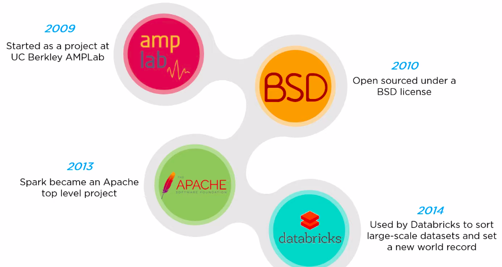

### Features of Apache Spark
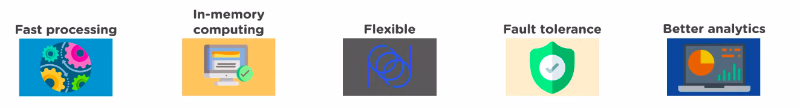

### Need for Apache Spark over Hadoop
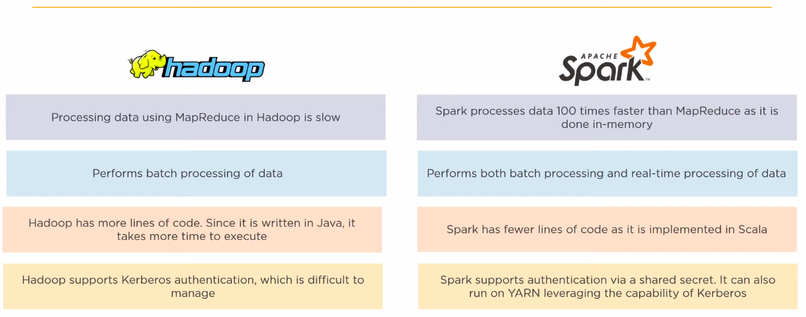
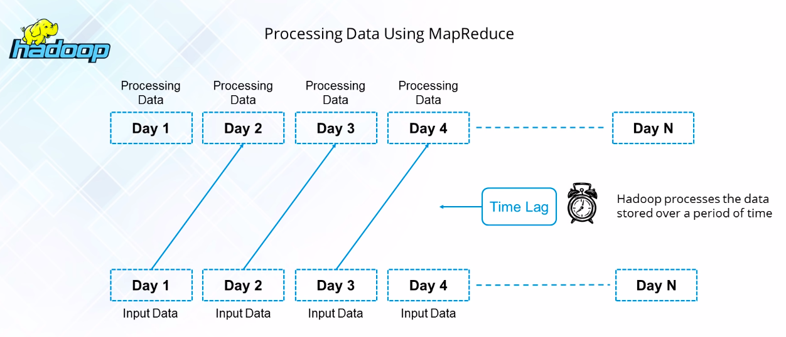
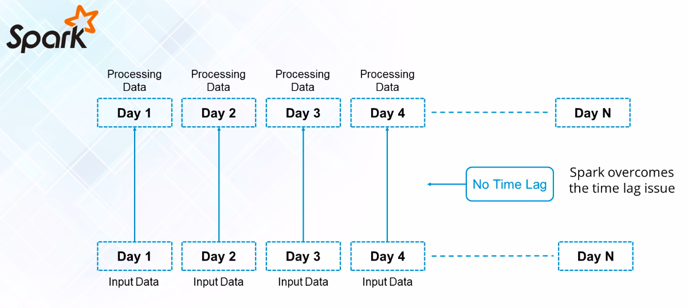
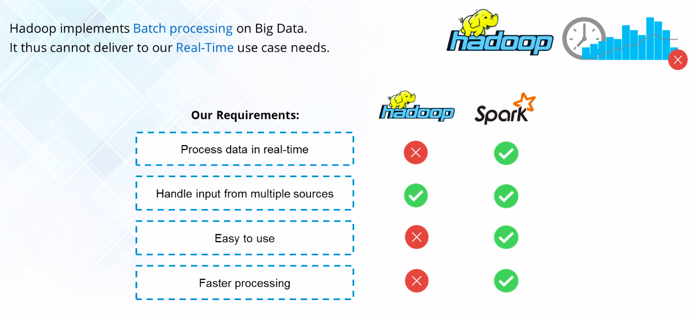

## Components of Apache Spark

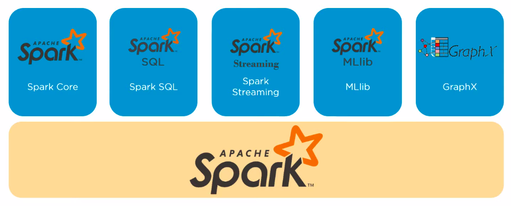
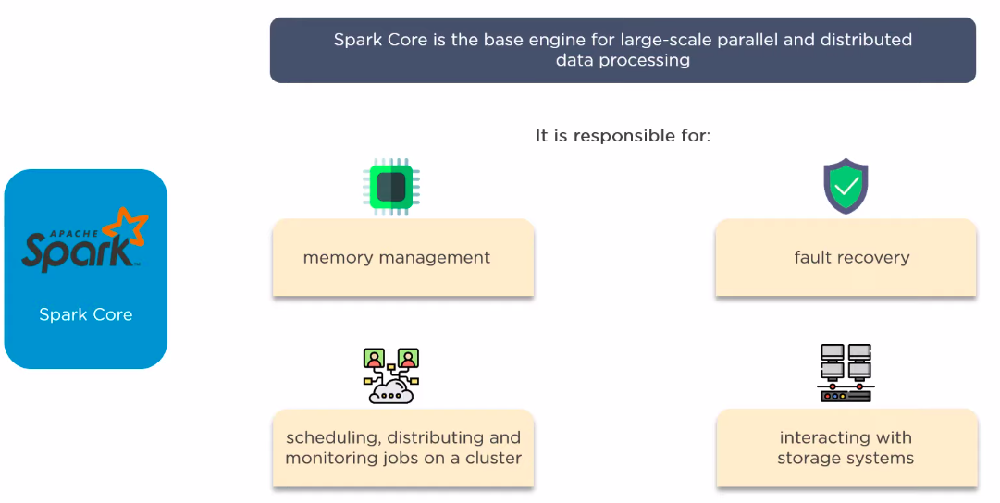

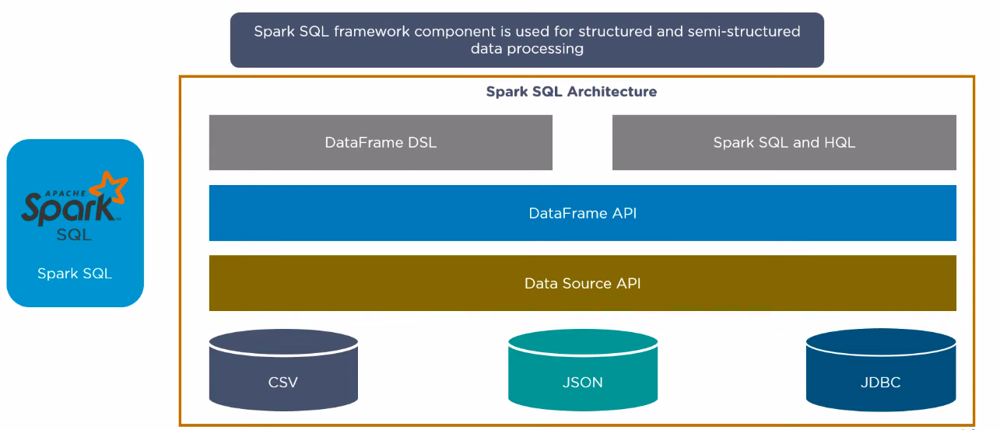
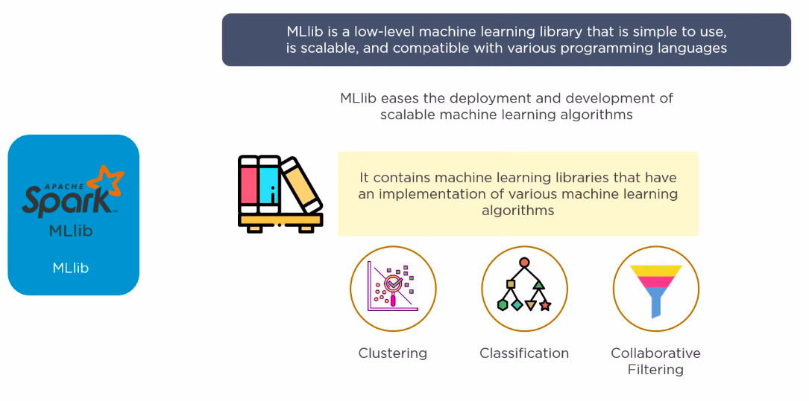
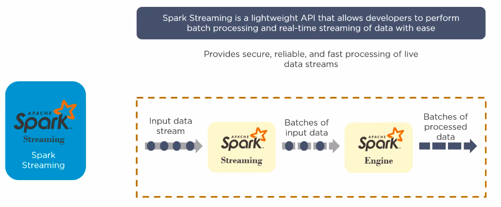
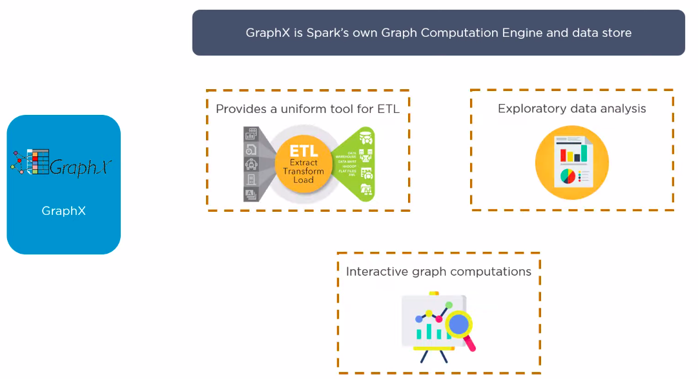

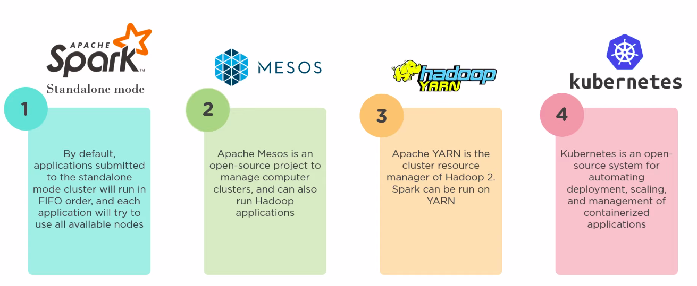

# Apache Spark Architecture

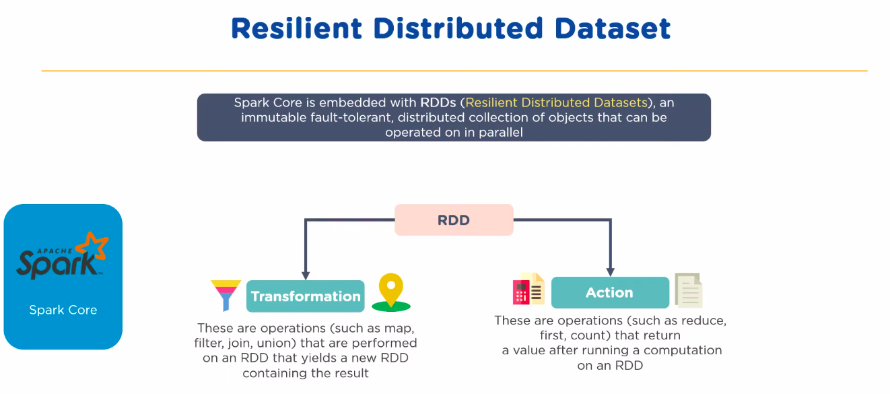
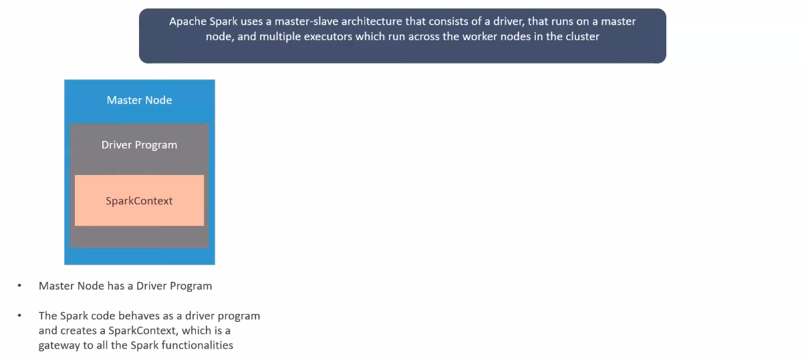
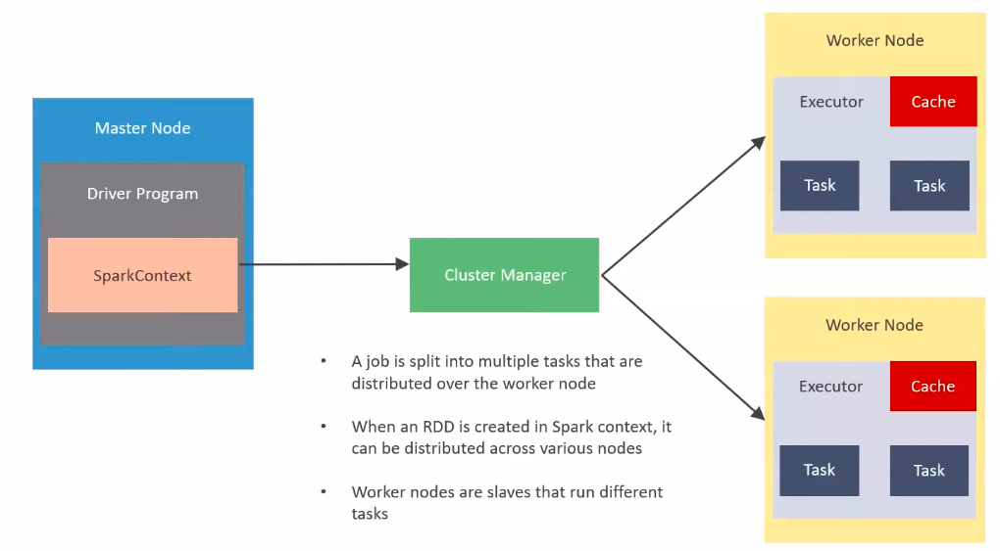
