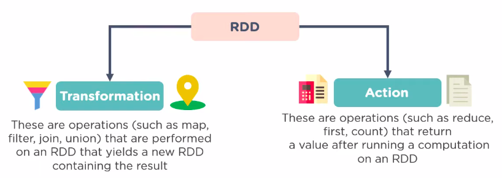

> Unified analytics engine for large-scale real-time & batch data processing.

Main strengths of Apache Spark:
- **Speed**:
  - Run workloads 100x faster as compared to Hadoop.
  - Achieves high performance for both batch and streaming data.
- **Ease of Use**:
  - Write applications quickly in Java, Scala, Python, R, and SQL.
  - Can be used interactively from their interactive shells too.
- **Generality**:
  - Combine SQL, streaming, and complex analytics together.
  - It powers a stack of libraries including SQL and DataFrames, MLlib for machine learning, GraphX, and Spark Streaming.
- **Runs Everywhere**:
  - Spark runs on Hadoop, Apache Mesos, Kubernetes, standalone, or in the cloud.
  - It can access diverse data sources like HDFS, Alluxio, Apache Cassandra, Apache HBase, Apache Hive etc.

# Introduction to Apache Spark

Apache Spark is an Open-Source, distributed processing system suitable for big data workloads. It utilizes in-memory caching, and optimized query execution for fast analytic queries of any size.

This data processing framework can quickly perform processing tasks on very large data sets, and can also distribute tasks across multiple computers, either on its own or in tandem with other distributed computing tools.

Apache Spark started off in 2009, at the University of California, Berkley Lab. In 2013, it became one of the top projects under Apache Foundation.

### Features of Apache Spark

The goal of Spark was to create a new framework, which is optimized for real-time data processing and interactive data analysis, while retaining the scalability, and fault tolerance of Hadoop MapReduce.

### Need for Apache Spark over Hadoop

**Hadoop MapReduce**
- Programming model for processing big data sets (batch processes) with a parallel, distributed algorithm.
- Entire job is a sequential multi-step process which poses as a challenge for Hadooop MapReduce.
- With each step, MapReduce reads data from the cluster, performs operations, and writes the results back to HDFS.
- Because each step requires a disk read, and write, jobs are slower due to the disk I/O latency.

**Apache Spark**
- Was created to address the limitations of MapReduce
    - by doing in-memory processing
    - reducing the number of steps in a job
    - by reusing data across multiple parallel operations.
- With Spark, only one-step is needed where data is read into memory, operations are performed, and the results are written back — resulting in a much faster execution.
- Spark also reuses data by using an in-memory cache to greatly speed up machine learning algorithms that repeatedly call a function on the same dataset.
- Data re-use is accomplished through Resilient Distributed Dataset (RDD). This lowers the overall latency making Spark 100X times faster than MapReduce, especially when doing machine learning, and interactive analytics.

In Hadoop, it was not possible to process data in real-time. There is a time-lag associated after which batches of data can be processed. Apache Spark extended this batch-processing capability to real-time stream processing.

<ins>Apache Hadoop:</ins> An open source framework that has
- HDFS as storage
- YARN as a way of managing computing resources used by different applications
- MapReduce programming model's implemented as an execution engine.

<ins>Apache Spark:</ins> An open source framework
- Focused on interactive query, machine learning, and real-time workloads.
- Does not have its own storage system
- Runs analytics on other storage systems like HDFS, Amazon Redshift, Amazon S3, Couchbase, Cassandra, etc.
- Spark on Hadoop leverages YARN to share a common cluster and dataset.

## Components of Apache Spark

The Spark framework includes:
- Spark Core as the foundation for the platform.
- Spark SQL for interactive queries.
- Spark Streaming for real-time analytics in orgs like Amazon, Flipkart etc.
- Spark MLlib for machine learning.
- Spark GraphX for graph processing in orgs like LinkedIn, Facebook etc.

<ins>**Spark Core:**</ins>

Spark Core is exposed through an application programming interface (APIs) built for Java, Scala, Python and R. These APIs hide the complexity of distributed processing behind simple, high-level operators.

<ins>**Spark SQL:**</ins>

- Distributed query engine that provides low-latency, interactive queries up to 100x faster than MapReduce.
- Business analysts can use standard SQL or the Hive Query Language for querying data.
- Developers can use APIs, available in Scala, Java, Python, and R.
- Supports various data sources including JDBC, ODBC, JSON, HDFS, Hive, ORC, and Parquet. Popular stores — Amazon Redshift, Amazon S3, Couchbase, Cassandra, MongoDB, Elasticsearch, Solr etc are also supported.

<ins>**Spark MLlib:**</ins>

- Library of algorithms to do machine learning on data at scale.
- ML models can be trained by data scientists with R or Python on any Hadoop data source, saved using MLlib, and imported into a Java or Scala-based pipeline.
- Spark was designed for fast, interactive computation that runs in memory, enabling fast model training.
- The algorithms inside library include the ability to do classification, regression, clustering, collaborative filtering, and pattern mining.

<ins>**Spark Streaming:**</ins>

- Real-time solution that makes use of Spark Core’s fast scheduling capability to do analytics on streaming data.
- It ingests data in mini-batches, and enables analytics on that data with the same application code written for batch analytics. This improves developer productivity, because they can use the same code for batch processing, and for real-time streaming applications.
- Spark Streaming supports data from Twitter, Kafka, Flume, HDFS, RabbitMQ etc.

<ins>**Spark GraphX:**</ins>

- Distributed graph processing framework built on top of Spark Core.
- Provides ETL, exploratory analysis, and iterative graph computation which enables the users to interactively build, and transform a graph data structure at scale.

# Apache Spark Architecture

## Abstractions of Architecture

### Resilient Distributed Dataset (RDD)

Immutable, fault-tolerant and distributed collection of objects that can be operated on in parallel.

RDDs are the building blocks of any Spark application. RDDs Stands for:
- Resilient: Fault tolerant and is capable of rebuilding data on failure
- Distributed: Data present in the multiple nodes of a cluster
- Dataset: Collection of partitioned data and values

Once an RDD is created, it becomes immutable. Immutable object - whose state cannot be modified after it is created, but they can surely be transformed.
There are 2 ways to create RDDs
− Parallelizing an existing collection in your driver program
- Referencing a dataset in an external storage system, such as a shared file system, HDFS, HBase, etc.

Each dataset in RDD is divided into logical partitions, which may be computed on different nodes of the cluster. Due to this, transformations or actions on the complete data can be performed parallelly. We don’t have to worry about the distribution, as Spark takes care of that.

### Directed Acyclic Graph (DAG)

Direct - Transformation is an action which transitions data partition state from A to B.
Acyclic - Transformation cannot return to the older partition

DAG is a sequence of computations performed on the data. Each node is an RDD partition and edge is a transformation on top of data. The DAG abstraction helps eliminate the Hadoop MapReduce multi-stage execution model and provides performance enhancements over Hadoop MapReduce.

Using these 2 abstractions, Spark overruled the Hadoop MapReduce:
The advantage of having DAG and RDD is that they replace the disk IO with in-memory operations and support in-memory data sharing across DAGs, so that different jobs can be performed with the same data allowing complicated workflows.

## Components of Architecture

<ins>**Spark Driver - Master Node**</ins>
- Driver program runs the main () function of the application
- is the central place where
  - Spark Context and RDDs are created
  - Transformations and Actions are performed.
  - Translation of spark user code into the actual spark jobs which are executed on the cluster using components like:
    - DAGScheduler
    - TaskScheduler
    - BackendScheduler
    - BlockManager

Detailed Description of the work done:
- Driver program running on the master node of the cluster schedules the job execution and negotiates with the cluster manager.
- It translates the RDD’s into the execution graph and splits the graph into multiple stages.
- Driver stores the metadata about all the RDDs and their partitions present all over the cluster.
- Driver acts as the Cockpits of Jobs and Tasks Execution:
  - Converts a user application into smaller execution units known as tasks which are then executed by the worker processes
  - After the task has been completed, all the executors submit their results to the Driver.
- Driver exposes the information about the running spark application through a Web UI at port 4040.

<ins>**Executer - Worker Nodes**</ins>
- Distributed agent responsible for the execution of tasks.
- Every spark application has its own executor process which usually run for the entire lifetime of a spark application.

Detailed Description of the work done:
- Executor running on the worker nodes of the cluster performs all the data processing and returns the results to the Driver.
- Reads from and writes data to the external sources like HDFS.
- Executor stores the computation results as in-memory data, cache or on HDDs.

<ins>**Cluster Manager**</ins>
- External service which is responsible for acquiring resources on the Spark cluster and allocating them to a spark job.

## Spark Run-time Architecture

<ins>**Overview**</ins>
Inside the driver program, its required to create a Spark Context, acts as a gateway to all the Spark functionalities. Analogous to Database connection.

Driver talks to the cluster manager and negotiates the resources. Cluster manager launches executors in worker nodes on behalf of the driver.

Spark Context takes the job, breaks the job in tasks and distribute them to the worker nodes. These tasks work on the partitioned RDD, perform operations, collect the results and return to the main Spark Context.

<ins>Step 1 - Spark application code Submission:</ins>
- Driver implicitly converts the code containing transformations and actions into a logical DAG.
- Driver program also performs certain optimizations like pipelining transformations
- Converts the logical DAG into physical execution plan with set of stages.
- After creating the physical execution plan, it creates small physical execution units referred to as tasks under each stage. Then tasks are bundled to be sent to the Spark Cluster.

<ins>Step 2 - Allocation:</ins>
- Driver program then talks to the cluster manager and negotiates for resources.
- Cluster manager then launches executors on the worker nodes on behalf of the driver.
- At this point the driver sends tasks to the cluster manager based on data placement.
- Before executors begin execution, they register themselves with the driver program so that the driver has holistic view of all the executors.

<ins>Step 3 - Processing:</ins>
- Executors start executing the various tasks assigned by the driver program.
- At any point of time when the spark application is running, the driver program will monitor the set of executors that run.
- Driver program also schedules future tasks based on data placement by tracking the location of cached data.

<ins>Step 4 - Completion:</ins>
- When driver programs main() method exits or when it call the stop() method of the Spark Context, it will terminate all the executors and release the resources from the cluster manager.

### Practical Visualisation on Spark UI

# Spark Development

# Spark Developmet
