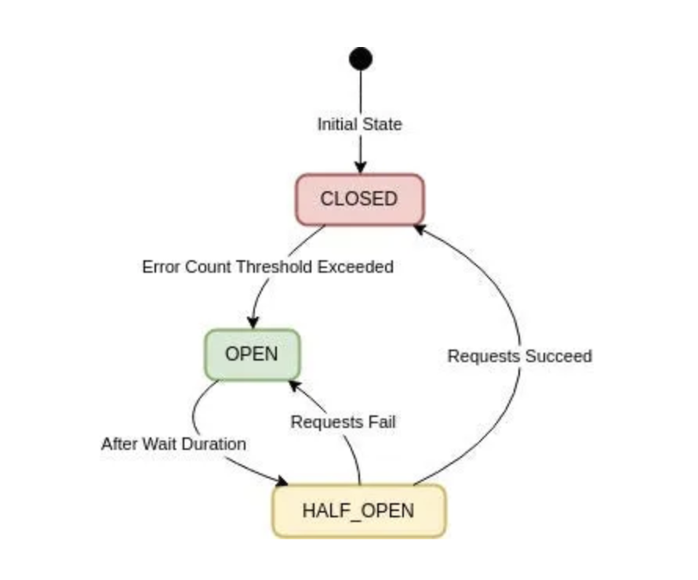
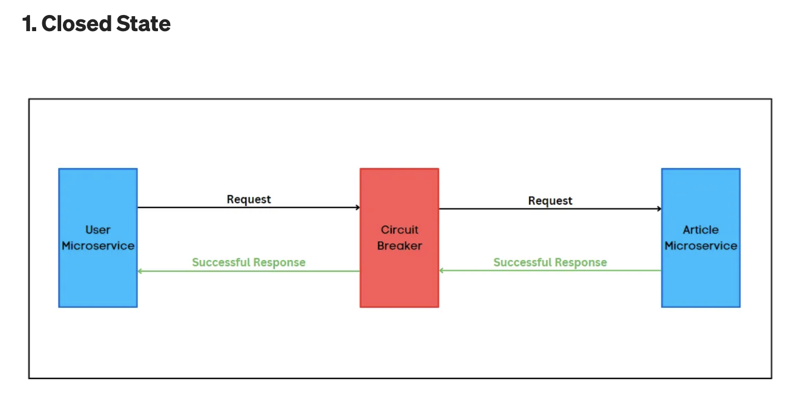
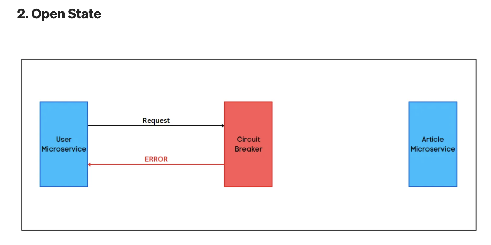
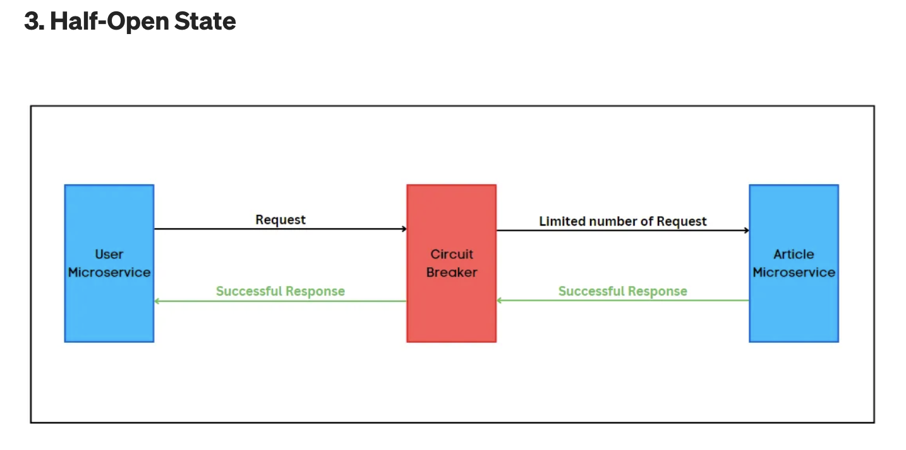

# Fault Tolerance & Resiliency

<ins>Fault Tolerance:</ins>
Upto what extent the system can tolerate a SINGLE fault. How much impact does it create?
Suppose we have an application comprising of multiple microservices. If one service/component goes down, how does it impact the overall system, does the entire system goes down or does it impact stays confined to a set of services/components. More the impact confined, higher is the fault tolerance.

<ins>Resilience:</ins>
How many faults can the system tolerate before it is brought down to the knees. This is measured in terms of availability (99.9%)
This also covers how well the system can bounce back & how good is the system in recovering from those faults.

Most of the time, these 2 go-together. Our aim is to have a `high fault tolerant & highly resilent systems`.

Issues which can happen in Microservies|Impact|Solutions
---|---|---
Instance on which service is hosted goes down|All calls from callin service fails|Spawn multiple instances(Replication)
Instance on which service is hosted goes slow|Other services are impacted due to hung threads (which lead to system resources getting used up)|Timeouts
Service having timeouts goes slow|If the rate at which service timeouts < service-qps, then this will still lead to hung threads|Circuit-breaker

1. Cicuit Breaker pattern
Provides these 3 benefits:
  - Fail fast
  - Fallback functionality
  - Automatic recovery

2. Bulk Head Pattern is just having separate threadpools for the all the dependent services. It's with analogy to the ship building where we have separate water tight compartments which can get flooded in case of holes/wrekkage.

# Circuit Breaker Pattern

A design pattern 

- that falls under the `sustainable design patterns` category.

- Used in microservices architecture where multiple services interact with each other over a network, and CB protects them from cascading failures to enhance the resiliency and fault tolerance of a distributed system.

- Protective and safety mechanism that prevents your application from continuously making requests to a service that has got some problems or is down.

In a microservices architecture, services have to communicate with each other. Sometimes, there can be service failures, or it takes significant time to respond to requests due to network connectivity issues. So, a failure of a single microservice can have a cascading effect on all microservices and can significantly affect system availability.

### Working

Developers needed a method to prevent this cascading effect between microservices in case of network connectivity issues, timeouts, or service unavailability.
CB Pattern allows developers to prevent cascading failures in microservices architecture by invoking remote services through a proxy.

The circuit breaker pattern is a fail-safe mechanism to prevent cascading failures of microservices.

CB pattern works by wrapping each service call in an object that serves as a proxy. This object monitors the success and failure rates of the service calls and maintains a state which reflects the health of the service. 

Open|Closed|Half-Open
---|---|---
|CB allows normal service communication  CB monitors the responses from the service for errors. For successful responses w/o issues    remains in the `closed state`|When num(failures)>threshold, CB switches to the `open state`, preventing requests from reaching the service and providing a fallback response.   (threshold Value like 5 failures within 10 seconds)|Once the timeout or reset interval passes, the circuit breaker goes to the `half-open state`.   CB allows a limited number of test requests to pass through for seeing if the service has recovered or not.   If the test requests succeed, the circuit breaker goes back to `closed state`.   If any of the test requests fails, it means the service has still issues and the circuit breaker goes to `Open` state to block further requests.
||||

This pattern is inspired by the electrical circuit breaker, which automatically opens the circuit if the current flow exceeds a certain threshold. This prevents the circuit from overheating and causing a fire.

In a microservices architecture, it works the same way, monitors the health of a microservice and automatically blocks requests from that service if it becomes unhealthy.

When one service synchronously calls another, there’s a possibility that another service can be down for some reason. In such a case, threads are blocked as they keep on waiting for the other service to respond. This can lead to resource exhaustion and the caller service will also be unable to handle further requests. This is called a cascading effect and can take down our entire microservices architecture.

To prevent such scenarios, a circuit breaker comes into the picture. It will block all subsequent calls to the other service immediately. After the timeout period, some requests are passed through. If they succeed, then the circuit breaker resumes normal flow. Otherwise, the timeout period starts again.

### Advantages

- Suitable for handling asynchronous communications.
- Improves availability and performance by reducing the overall application downtime.
- Enhancing or keeps user experience intact, by handling internal services error gracefully & end-user not witnessing major impact.
- Facilitates faster recovery and maintenance. Due to the intermediate state of `half-open`, the service gets enough time & buffer to get itself up & become healthy.
- By avoiding unnecessary requests to failed or slow services and reducing the impact of network latency and congestion, the circuit breaker pattern can help increase system performance.
- Provides fallback responses or alternative actions when a service is unavailable or degraded instead of waiting for timeouts or returning errors.
- Makes it easier to isolate failures and allows them to heal without affecting the rest of the system.
- Provides feedback and metrics on the health of your services through monitoring dashboards.

### Challenges

- Good infrastructure management is required to maintain circuit breakers.
- Misconfiguration of circuit breakers can cause throughput issues of the service.
- High maintainability & testing overheads.

## Prominent Leaders

Technology|Id|Details
---|---|---
<ins>**Hystrix**</ins>||
<ins>**Resilience4j**</ins>||
<ins>**Istio**</ins>||
<ins>**Sentinel**</ins>||
<ins>**AWS App Mesh**</ins>|

#### Netflix Hystrix: (Later)

#### Resilience4j: (Later)
      
### Istio:
  - Service mesh platform that helps us manage traffic between microservices.
  - Provides a number of features:
     - Load balancing: It can distribute traffic between microservices efficiently.
     - Circuit breaker: A fault tolerance pattern that can route traffic away from unhealthy microservices and automatically retry failed requests.
     - Security: Istio can authenticate and authorize microservices, and it can also encrypt traffic between them.
     - Observability: Istio can collect metrics and telemetry data from microservices, which can be used to monitor and troubleshoot your application.

#### Alibaba Sentinel:
  - Open-source library actively maintained by Alibaba Group
  - Official part of the Spring Cloud Circuit Breaker.
  - Offers features like flow control, concurrency limiting, circuit breaking, and adaptive system protection to guarantee the reliability of microservice architecture.
  - Allows monitoring using dashboard similar to hystrix.
  - Flow control (Rate-limiting)
      - Sentinel controls the speed of random incoming requests to avoid the overloading of microservices.
      - Ensures that our service isn’t killed by a surge in traffic.
      - Supports a variety of traffic shaping strategies:
        - Direct Rejection Mode
        - Slow Start Warm-Up Mode
  - Circuit breaker
      - Uses the principle of max concurrency limiting to implement circuit breaking.
      - Reduces the impact of unstable resources by restricting the number of concurrent threads.
      - All calls to the affected resource will be rejected in the specified time window. This prevents the cascading effect.
  - Adaptive System Protection
      - Sentinel protects our server in case the system load goes too high.
      - Uses load1 (system load) as the metric to initiate traffic control. The request will be blocked under the following conditions:
         - Current system load (load1) > threshold (highestSystemLoad);
         - Current concurrent requests (thread count) > estimated capacity (min response time * max QPS)
  

#### AWS App Mesh:
   - Developed by Amazon for monitoring and controlling services running on AWS.
   - Service mesh based on the Envoy proxy.
   - App Mesh standardizes how your microservices communicate, giving us end-to-end visibility and helping to ensure high availability for your applications.
   - App Mesh gives us consistent visibility and network traffic controls for every microservice in an application.
   - This can be integrated with AWS Fargate, Amazon ECS, Amazon EKS, Kubernetes on AWS, and Amazon EC2.

