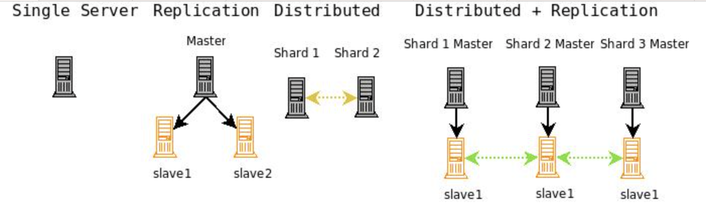
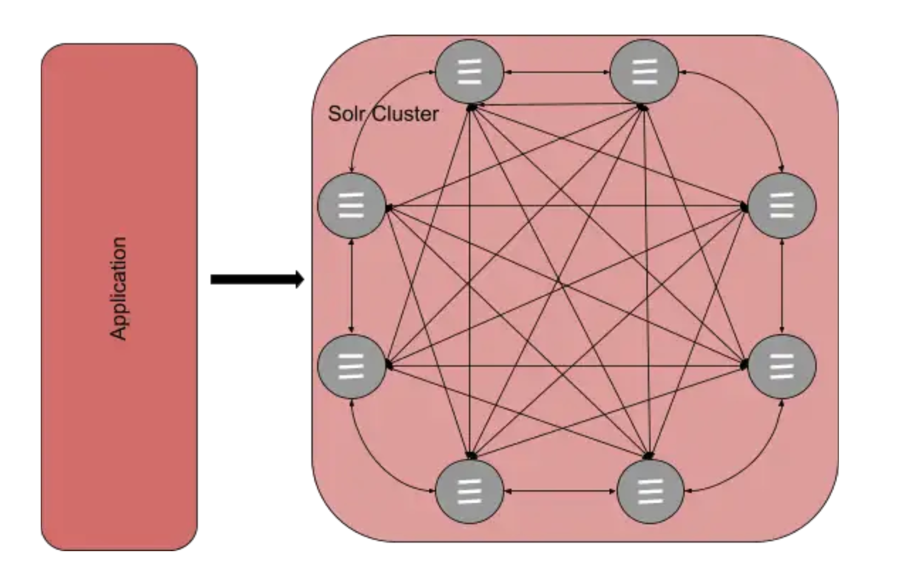
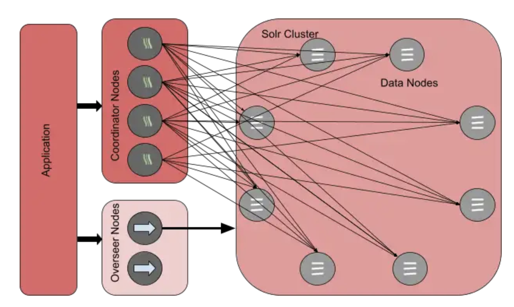
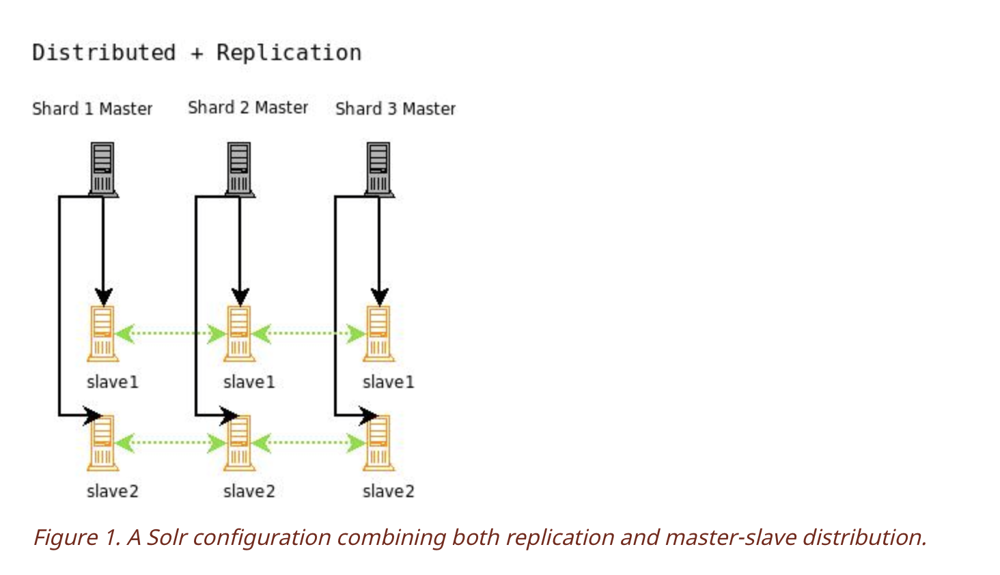

Deep dive into concepts of Sharding, Distributed Index management & SolrCloud

# Sharding

Sharding is a method of splitting and storing a single logical dataset in multiple machines.

   - This becomes necessary if a dataset is too large to be stored in a single database.
   - A single machine can store and process data upto a limit. Sharding overcomes this limitation by splitting data into smaller chunks, called shards, and storing them across several machines.

### Partitioning vs Sharding

Partitioning is the process of splitting a database table into multiple groups. Partitioning is classified into two types: 

   - Vertical partitioning creates different partitions of the database columns.
      - Effective when queries usually return only a subset of columns of the data.
      - Domain specific. We draw a logical split within the application data, storing them in different databases.
      - Always implemented at the application level.

   - Horizontal partitioning splits the database by rows.
      - Effective when queries return a subset of rows that are often grouped together.
      - Splits a homogeneous type of data into multiple databases. That’s why sharding can be implemented at either the application or database level.
      - Sharding is a first-class concept for DBs & they are natively sharded like HDFS, MongoDB, HBase etc.
      - Helps in parallel processing. Speeds up query resolution, since each machine has to scan fewer rows when responding to a query.

Sharding is a form of Horizontal partitioning, but involves multiple machines.
For eg: segments of solr index is a kind of horizontal partitoning, but shards is a different concept altogether.

### Benefits of Sharding

- _Improves response time_
Data retrieval takes longer on a single large database. System needs to search through many rows to retrieve the correct data. Since, shard is a logical subset of this entire database, it takes less time to retrieve specific information from a sharded database. 

- _Avoid total service outage_
If the machine/database fails, the application depending on the database fails too. Database sharding prevents this by distributing parts of the database into different machines. Failure of one of the computers does not shut down the application because it can operate with other functional shards. Sharding is also often done in combination with data replication across shards. So, if one shard becomes unavailable, the data can be accessed and restored from an alternate shard.

- _Scale efficiently_
Once a database is horizontally sharded, we can scale it further by going more granular or using varying sharding schemes.

### Challenges of Sharding

Sharding adds additional programming and operational complexity to the application codebase, this this is kind of last resort that is taken up when no other scaling methods works.
Managing multiple servers having different logical partions of data adds operational challenges. 

> Before we begin, see whether sharding can be avoided or deferred.

1. Getting more expensive/bigger machine. Storage capacity is growing at the speed of Moore’s law. 
2. Vertically partition by functionality. Binary blobs tend to occupy large amounts of space and are isolated within your application.

Operations may need to search through many databases to find the requested data. These are called **cross-partition operations** and they tend to be inefficient. Sharding schemes attempt to minimize the number of cross-partition operations.
**Hotspots** are another common problem — having uneven distribution of data and operations. Hotspots largely counteract the benefits of sharding.
Once sharding is employed, **redistributing data** is an important problem.

## Types of Sharding

There exist various sharding strategies. Each strategy has pros and cons.

**Shard** or Partition Key is a portion of primary key which determines how data should be distributed. 
A partition key allows you to retrieve and modify data efficiently by routing operations to the correct database. Entries with the same partition key are stored in the same node. 

- A logical shard is a collection of data sharing the same partition key.
- A database node, sometimes referred as a physical shard, contains multiple logical shards.

Suppose, we shard our entire AS index, based upon generationSources & say we divide our cluster into 2 physical shards. Shard 1 will have logical shards of gS:[Organic,Bootstrapped] & Shard 2 will have logical shards of gs: [Generative,LM,GenAI]

Sharding operates on a shared-nothing architecture. Each physical shard operates independently and is unaware of other shards. Now, since Sharding as a concept can be intrinsic or application-driven.
In former, only the physical shards that contain the data that you request will process the data in parallel for you. 
For latter, the application layer coordinates data storage and access from these multiple shards.

### Key-based or Algorthmic Sharding

- In algorithmic sharding, the client can determine shard without any help. The data is simply plugged into a hash function to determine which shard each data value must go to.
- Algorithmically sharded databases use a sharding function (partition_key) -> database_id to locate data. A simple sharding function may be "hash(key) % NUM_DB"
- A hash function takes a piece of input data and generates a discrete output value known as the hash value. In key-based sharding, the hash value is the shard ID, which determines in which shard the data is stored.

**Advantages:**
- Distributes data evenly & prevent hotspots
- No need to maintain a data map, as data is distributed algorithmically.

**Disadvantages:**
- Difficult to dynamically add or remove additional servers to the database, as data-rebalancing may be required.
- During data rebalancing, both new and old hashing functions could become invalid
- Does not do sharding based on the meaning of the information.

### Range-based Sharding

 - This involves sharding data according to the ranges of a given value. The range is based on a field, which is known as the shard key.

**Advantages:**
- straightforward implementation
- can be done algorithmly as well.

**Disadvantages:**
- May create database hotspots, since data could be unevenly distributed. For eg: We choose to shard our AS index based upon first character.
- Poor choice of shard key could create unbalanced shards and adversely impact performance. For eg: fitso shards user information based upon age groups.

### Directory Sharding

- In directory-based sharding, a lookup table is created and maintained. It uses a shard key to track which physical shard holds what kind of data.

**Advantages:**

- Provides greater flexibility in terms of dynamically assigning data to shards
- Superior to key-based sharding because it doesn't require a hash function
- Superior to range-based sharding since it ties each key to its own specific shard. (to check)

**Disadvantages:**
- Can have a negative impact on application performance because it requires connection to the lookup table before every read or write
- Corruption or failure of the lookup table could lead to data loss or accessibility issues.

For eg: Search Infra uses this kind of Directory sharding, where in lookup table is maintained in config-service, & for any product/listing to be indexed, they refer the directory to get the shard information.

## Legacy Scaling and Distribution (Solr Context)

Distribution|Replication
---|---
Searches are taking too long|High QPS which one machine cannot handle, so you need to distribute searches across multiple read-only copies of the index
Index is approaching the physical limitations of machine|Separate indexing and searching
We divide the index into partitions called shards, each of which runs on a separate machine. Solr then partitions searches into sub-searches, which run on the individual shards, reporting results collectively|Indexing opertaions (committing, segments creation, optimising index) are costly, we don't want them to be having on machines which fall in user path
The architectural details underlying index sharding are abstracted, we simply experience faster performance on queries against very large indexes|

This is how Solr scaling cycle progresses, AutoSuggest is at step 2, Serving is at step 4.

#### Index Sharding (Distributed Indexing)

In legacy setup, getting your documents indexed on different shards (sharding-logic) resides with application. Solr supports distributed indexing (routing) in its true form only in the SolrCloud mode.

In the legacy distributed mode, Solr does not calculate universal term/doc frequencies. 
Solr calculates TF/IDF at the shard level. However, if our collection is heavily skewed in its distribution across servers & we use TF/IDFs, then it may lead to irrelevancy. 

### Distributed Searches (Querying/Serving)

If a query request includes the **shards** parameter, the Solr server distributes the request across all the shards listed as arguments to the parameter.

   - Preferred to configure the shard parameter as a default in the RequestHandler section of solrconfig.xml, instead of passing in the request-params
   - Only query requests are distributed. This includes requests to the SearchHandler (or any handler extending from org.apache.solr.handler.component.SearchHandler) using these standard components that support distributed search.
       - Query component
       - Facet component
       - Highlighting component
       - Stats component
       - Debug component
    
   - The nodes allowed in the shards parameter is configurable through the shardsWhitelist property in solr.xml. This whitelist is automatically configured for SolrCloud but needs explicit configuration for master/slave mode.
   - using `-Dsolr.disable.shardsWhitelist=true` we can skip this whitelisting checks.
   - Shard information can be returned with each document in a distributed search by including fl=id,[shard] in the search request. This returns the shard URL.

  - Every node calls the replicas of other shards & its own sharded-index. The calling shard aggregates/merge the response
  - 2 different kinds of operations are happening in every node

  - Aggregator nodes only calls data-nodes(shards) & only serves to merge the response.
  - Only 1 kind of operation happens in aggregator-node & data-node.

#### Practical working.

TBA

#### Limitations of Legancy Distributed Searching:

1. Each document indexed must have a unique key. "id" field must be of type: stored.
2. The number of shards is limited by number of characters allowed for GET method’s URI; most Web servers generally support at least 4000 characters, but many servers limit URI length to reduce their vulnerability to Denial of Service (DoS) attacks. (This can be made entirely config-driven)
3. TF/IDF relevancy computations only used shard-local statistics.
4. SolrCloud provides for a truly distributed set of features with support for things like automatic routing, leader election, optimistic concurrency and other sanity checks that are expected out of a distributed system.

There are concepts like: ShardHandlerFactory, ShardDoc which Distributed Searching uses, & was reused later in SolrCloud also. Will cover those later in the section of SolrCloud.

#### Combining Distribution and Replication

When we have a query volume that single shards cannot keep up with, it’s time to replicate each shard in your distributed search setup.

   - The idea is to combine distributed search with replication.
   - Combined distributed-replication configuration features a master server for each shard and then 1-n slaves that are replicated from the master.
   - Query requests should be load balanced across each of the shard slaves.
   - None of the master shards in this configuration know about each other. You index to each master, the index is replicated to each slave, and then searches are distributed across the slaves, using one slave from each master/slave shard.
   -  Using ELBs or haProxies (this entire sharding & replication can be sorted)

## SolrCloud

### How it is better than Legacy
