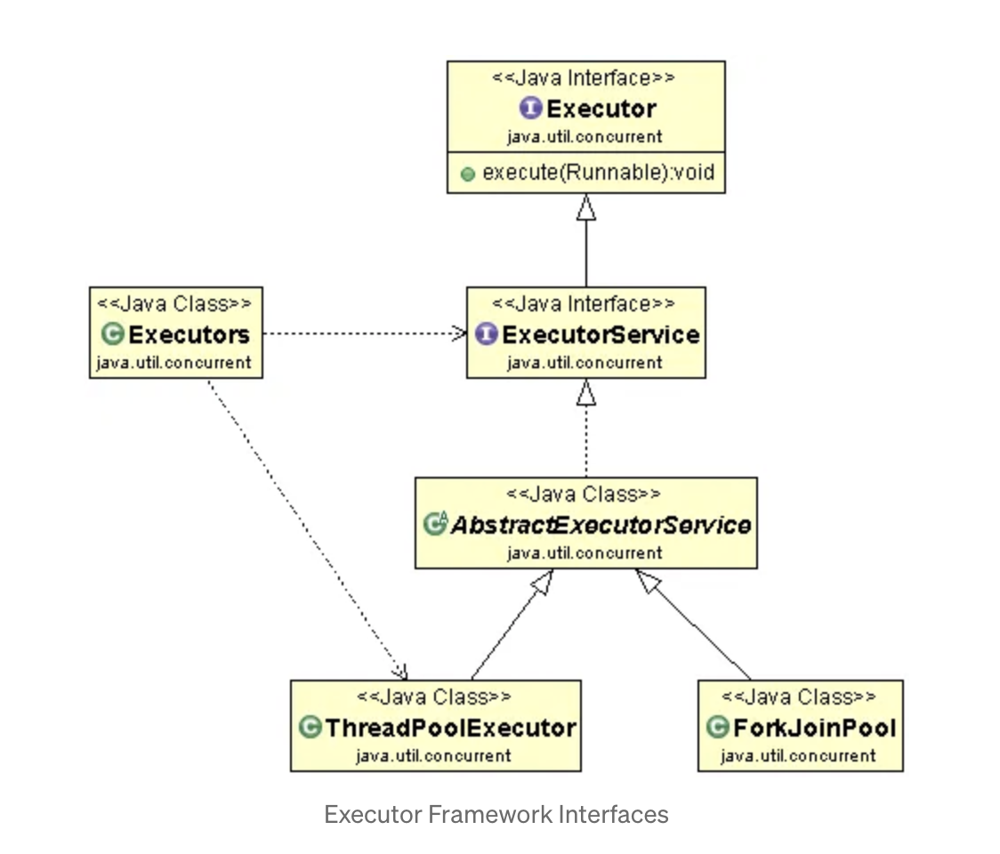

### Synchronous-Asynchronous & Blocking-NonBlocking

### Concepts related to Asychronous Programming

We can create threads using 2 methods in Java:
 - Extending `Thread class` which implements `Runnable interface`
 - Implementing `Runnable interface`

<ins>**Callable**</ins>

 - One feature lacking in  `Runnable interface` is that a thread can't return result when it terminates, i.e. when run() completes. For supporting this feature, the `Callable interface` is present in Java.

 - For implementing `Runnable`, the run() method needs to be implemented which does not return anything, while for a `Callable`, the call() method needs to be implemented which returns a result on completion.

 - A thread can’t be created with a Callable, it can only be created with a Runnable.

<ins>**Future**</ins>

 - When the call() method completes, answer must be stored in an object known to the main thread, so that the main thread can know about the result that the thread returned.
For this, a Future object is used.

 - Future is an object that holds the result – it may not hold it right now, but it will do so in the future (once the Callable returns).

 - Useful methods:
    - _public boolean cancel(boolean mayInterrupt)_
    - _public Object get() throws InterruptedException, ExecutionException_
    - _public boolean isDone()_
  
    - 

`Callable` is similar to Runnable, in that it encapsulates a task that is meant to run on another thread, whereas a `Future` is used to store a result obtained from a different thread.

To create the thread, a `Runnable` is required. To obtain the result, a `Future` is required.

</ins>**FutureTask**</ins>

The Java library has the concrete type `FutureTask`, which implements `Runnable` and `Future`, combining both functionality conveniently.

```java
import java.util.Random;
import java.util.concurrent.Callable;
import java.util.concurrent.FutureTask;

class CallableExample implements Callable {
    public Object call() throws Exception {
        Integer randomNumber = new Random().nextInt(5);
        Thread.sleep(randomNumber * 1000);
        return randomNumber;
    }
}

public class CallableFutureTest{
    public static void main(String[] args) throws Exception {
        FutureTask[] randomNumberTasks = new FutureTask[5];

        for (int i = 0; i < 5; i++) {
            Callable callable = new CallableExample();
            randomNumberTasks[i] = new FutureTask(callable);
            Thread t = new Thread(randomNumberTasks[i]);
            t.start();
        }

        for (int i = 0; i < 5; i++)
            System.out.println(randomNumberTasks[i].get());
    }
}
```


</ins>**Completable Future**</ins>

Implementation of `Future` that provides method for defining & composing asynchronous tasks.

- `thenApply()` -> for chaining multiple tasks
- `allof()` -> wait for multiple tasks to complete

## Executor Framework in Java

Executor Framework (Introduced from Java 5) is used to run the Runnable objects without creating new threads every time and mostly re-using the already created threads.

This framework have bunch of components that are used for managing worker threads efficiently.
Implementation of the `Producer-Consumer` pattern.



- <ins>**Executor Interface**</ins>:
  - Core of the framework
  - defines a simple execute(Runnable) method that takes a task, which is then submitted for execution by a thread from a pool of worker threads.

- <ins>**ExecutorService**</ins>:
  - Easiest way to create ExecutorService is to use one of the factory methods of the Executors class.
  - We can configure our own executor service (which is not required most of the time), in the following way.
    ```java
    ExecutorService executorService = new ThreadPoolExecutor(1, 1, 0L, TimeUnit.MILLISECONDS, new LinkedBlockingQueue<Runnable>());
    ```

- <ins>**ThreadPoolExecutor**</ins>:
  - Most commonly used implementations of the Executor interface.
  - Manages a pool of worker threads and provides fine-grained control over thread management, allows us to specify parameters
    - core pool size
    - maximum pool size
    - various queueing strategies

   
- <ins>**ForkJoinPool**</ins>:
  - Introduced with Java7
  - Discussed in detail later.


- <ins>**Executors Utility Class**</ins>: 
  - Offers factory methods for creating instances of Executor and ScheduledExecutorService.
  - Simplifies the process of creating thread pools with various configurations.
  - In detail, discussed below.

#### Benefits of threadpool over simple-thread creations:

- If we create a new thread without causing any throttling to existing processes, we end up adding large number of threads, which causes wastage of resource & memory.
- Overhead of thread creation -> helps in improving responsiveness.
- For managing individual thread life-cycle, the execution time increases.

For using the `executor framework`, we require some thread pool, which executes the task when submitted to it.


Few important factory methods provided in the Executors Utility Class that are used to create ThreadPools of worker threads:

```java
// thread pool of single thread.
// used to execute tasks sequentially.
ExecutorService executor = Executors.newSingleThreadExecutor();

// thread pool of a fixed number of threads.
// uses Blocking Queue for handling additional tasks.
ExecutorService fixedPool = Executors.newFixedThreadPool(2);

// thread pool that creates new threads as needed, but will reuse previously constructed threads when they are available.
// uses SynchronousQueue queue.
ExecutorService executorService = Executors.newCachedThreadPool();

// used when we have a task that needs to be run at regular intervals or if we wish to delay a certain task.
ScheduledExecutorService scheduledExecService = Executors.newScheduledThreadPool(1);
```

```java
import java.util.concurrent.ExecutorService;
import java.util.concurrent.Executors;

public class ExecutorFrameworkRunner {
    
    public static void main(String[] args) {
        // Create a FixedThreadPool with 3 threads
        ExecutorService executor = Executors.newFixedThreadPool(3);

        // Submit 10 tasks for execution
        for (int i = 1; i <= 10; i++) {
            final int taskId = i;
            executor.execute(new Runnable() {
                public void run() {
                    System.out.println("Task " + taskId + " is running on thread: " + Thread.currentThread().getName());
                }
            });
        }

        // Shutdown the executor when done
        executor.shutdown();
    }
}
```

`OUTPUT`
```bash
task 2 is running on thread: pool-1-thread-2
task 1 is running on thread: pool-1-thread-1
task 4 is running on thread: pool-1-thread-2
task 6 is running on thread: pool-1-thread-2
task 3 is running on thread: pool-1-thread-3
task 7 is running on thread: pool-1-thread-2
task 5 is running on thread: pool-1-thread-1
task 9 is running on thread: pool-1-thread-2
task 8 is running on thread: pool-1-thread-3
task 10 is running on thread: pool-1-thread-1
```

#### Assigning tasks to the ExecutorService

ExecutorService can execute Runnable and Callable tasks.
We can use these 4 methods to submit these tasks to the Executor Service: `execute()` | `submit()` | `invokeAny()` | `invokeAll()`

```java
import java.util.concurrent.ExecutorService;
import java.util.concurrent.Executors;
import java.util.concurrent.Callable;
import java.util.concurrent.Future;

import java.util.ArrayList;
import java.util.List;

public class ExecutorFrameworkRunner {
    
    public static void main(String[] args) throws Exception {
        // Create a FixedThreadPool with 3 threads
        ExecutorService executorService = Executors.newFixedThreadPool(3);
        
        Runnable runnableTask = () -> {
            System.out.println("task is running on thread: " + Thread.currentThread().getName());
        };

        // Submit 5 tasks for execution
        System.out.println("\n\nExecution of Runnable tasks");
        for (int i = 1; i <= 5; i++) {
            executorService.execute(runnableTask);
        }
        
        // Isolating
        Thread.sleep(5000);
        
        Callable<String> callableTask = () -> {
            System.out.println("task is running on thread: " + Thread.currentThread().getName());
            return "task executed";
        };
        
        // Submit 5 tasks for execution
        System.out.println("\n\nExecution of Callable tasks");
        List<Future<String>> futureLists = new ArrayList();
        for (int i = 1; i <= 5; i++) {
            futureLists.add(executorService.submit(callableTask));
        }
        
        Thread.sleep(5000);
        System.out.println("Results gathered from tasks, count: " + futureLists.size());

        // Isolating
        Thread.sleep(5000);
        
        List<Callable<String>> callableTasks = new ArrayList<>();
        callableTasks.add(callableTask);
        callableTasks.add(callableTask);
        callableTasks.add(callableTask);

        System.out.println("\n\nExecution of invokeAny Callable tasks");
        String result = executorService.invokeAny(callableTasks);

        // Isolating
        Thread.sleep(5000);
        System.out.println("\n\nExecution of invokeAll Callable tasks");
        List<Future<String>> futures = executorService.invokeAll(callableTasks);

        // Shutdown the executor when done
        executorService.shutdown();
    }
}
```

`OUTPUT`
```bash
Execution of Runnable tasks
task is running on thread: pool-1-thread-3
task is running on thread: pool-1-thread-3
task is running on thread: pool-1-thread-3
task is running on thread: pool-1-thread-1
task is running on thread: pool-1-thread-2


Execution of Callable tasks
task is running on thread: pool-1-thread-1
task is running on thread: pool-1-thread-2
task is running on thread: pool-1-thread-1
task is running on thread: pool-1-thread-2
task is running on thread: pool-1-thread-3
Results gathered from tasks, count: 5


Execution of invokeAny Callable tasks
task is running on thread: pool-1-thread-1


Execution of invokeAll Callable tasks
task is running on thread: pool-1-thread-2
task is running on thread: pool-1-thread-3
task is running on thread: pool-1-thread-1
```

#### Important Points:

- `submit()` returns a Future for task result tracking, while `execute()` is void and used for fire-and-forget tasks.
- Best practice is to shut down an executor for releasing its resources. Failure to do so might lead to resource leaks and prevent the application from terminating properly.
- Once an executor is shut down using the shutdown() method, it cannot be reused. Require to create new executor.

</ins>**ThreadPoolExecutor**</ins>

</ins>**ForkJoinPool**</ins>

</ins>**WorkStealingPool**</ins>

</ins>**FixedThreadPool**</ins>

</ins>**CachedThreadPool**</ins>

</ins>**SingleThreadPool**</ins>


