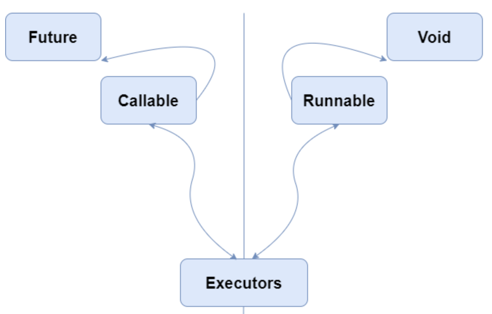
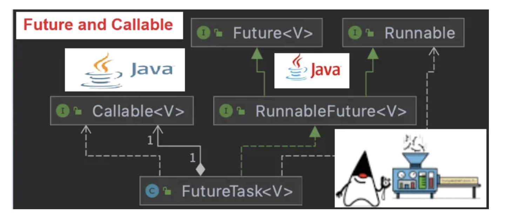
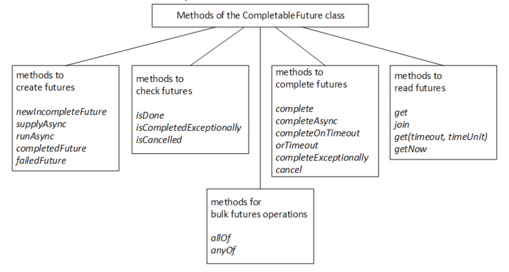

Parameter|Synchronous Programming|Asynchronous Programming
---|---|---
Principle|the main thread starts an axillary task and blocks until this task is finished. When the axillary task is completed, the main thread continues the main task|the main thread starts an axillary task in a worker thread and continues its task. When the worker thread completes the auxiliary task, it notifies the main thread
Pros|simplest and most reliable code|shorter execution time as some tasks run in parallel
Cons|longest execution time as all tasks run sequentially|most complicated code

For a spectrum of programming in java, we have blocking-synchronous programming & non-blocking-asynchronous programming on the extreme ends.

Readability & Debuggability is highest of blocking-sync codes.
Performance is super of non-blocking-async codes.

Blocking calls|Non-Blocking calls
---|---
function type which makes the execution await when called|function type which can work on any Future object & return similar Future object
Future.get()|Future.isDone()
CompletableFuture.get(),CompletableFuture.join()|CompletableFuture.thenApply(),CompletableFuture.thenRun()


## Concepts related to Asychronous Programming

We can create threads using 2 methods in Java:
 - Extending `Thread class` which implements `Runnable interface`
 - Implementing `Runnable interface`



<ins>**Callable Interface**</ins>

 - One feature lacking in  `Runnable interface` is that a thread can't return result when it terminates, i.e. when run() completes.
 - For supporting this feature, the `Callable interface` was introduced in Java 5.
 - Interface that represents a task that can be executed concurrently and returns a result. It is similar to `Runnable interface`, but it can return a value and throw a checked exception.
 - For implementing `Runnable`, the run() method needs to be implemented which does not return anything, while for a `Callable`, the call() method needs to be implemented which returns a result on completion.
 - A thread can’t be created with a Callable, it can only be created with a Runnable.

```java
try {
    int result = future.get(1, TimeUnit.SECONDS);
} catch (ExecutionException | TimeoutException e) {
    // Handle the exception thrown by the Callable task or the timeout
}
```

<ins>**Future Interface**</ins>


 - Future<V> Interface that represents the result of an asynchronous computation.
 - Allows us to cancel a task, check if it has completed, and retrieve the result of the computation.
 - When the call() method completes, answer must be stored in an object known to the main thread, so that the main thread can know about the result that the thread returned.
For this, a Future object is used.
 - Future is an object that holds the result – it may not hold it right now, but it will do so in the future (once the Callable returns).
 - Useful methods:
    - _public boolean cancel(boolean mayInterrupt)_
    - _public Object get() throws InterruptedException, ExecutionException_
    - _public boolean isDone()_

```
We use Future and Callable together to perform concurrent tasks and retrieve the results in a thread-safe manner.
```



`Callable` is similar to Runnable, in that it encapsulates a task that is meant to run on another thread, whereas a `Future` is used to store a result obtained from a different thread.

To create the thread, a `Runnable` is required. To obtain the result, a `Future` is required.

<ins>**RunnableFuture Interface**</ins>

RunnableFuture<V> interface extends both Future<V> and Runnable interfaces.


<ins>**FutureTask class**</ins>

- FutureTask<V> class implements RunnableFuture. It wraps either a Callable<T> or Runnable.
- The Java library has the concrete type `FutureTask`, which implements `Runnable` and `Future`, combining both functionality conveniently.
- FutureTask is a concrete implementation of the Future, Runnable, and RunnableFuture interfaces and therefore can be submitted to an ExecutorService instance for execution.

```java
import java.util.Random;
import java.util.concurrent.Callable;
import java.util.concurrent.FutureTask;

class CallableExample implements Callable {
    public Object call() throws Exception {
        Integer randomNumber = new Random().nextInt(5);
        Thread.sleep(randomNumber * 1000);
        return randomNumber;
    }
}

public class CallableFutureTest{
    public static void main(String[] args) throws Exception {
        FutureTask[] randomNumberTasks = new FutureTask[5];
        
        for (int i = 0; i < 5; i++) {
            Callable callable = new CallableExample();
            randomNumberTasks[i] = new FutureTask(callable);
            Thread t = new Thread(randomNumberTasks[i]);
            t.start();
        }

        // Blocking calls
        for (int i = 0; i < 5; i++)
            System.out.println(randomNumberTasks[i].get());
    }
}
```

If we directly do, a Future.get(), then this becomes a blocking call. The main thread waits here. For carrying out non-blocking calls, we can make use of `Future.isDone()`


## CompletableFuture class

It is building block and a framework, with about 50 different methods for composing, combining, and executing asynchronous computation steps and handling errors.

Introduced in Java 8 that allows us to write asynchronous, non-blocking code.
It offers non-blocking methods, composition methods, better exception handling, and explicit completion methods, which makes it easier to write robust and scalable concurrent code.

### Introduction

CompletableFuture class is implementing both Future and CompletionStage interfaces.

```java
public class CompletableFuture<T> implements Future<T>, CompletionStage<T> {
    ...... ...... ......
}
```

It’s an extension of Future(introduced in Java5).

When we use this, behind the scene it’s delegating the tasks into several threads. It actually uses the global ForkJoinPool => commonPool to execute the tasks in parallel. If we want, we can pass our own thread pool also.

```java
import java.util.concurrent.*; 
  
class CF { 
    public static void main(String[] args) throws Exception 
    { 
        CompletableFuture<String> greetingFuture = CompletableFuture.supplyAsync(() -> { 
                  // some async computation 
                  return "Jalaz Kumar's blog"; 
              }); 
  
        System.out.println(greetingFuture.get());
    } 
}
```

It represents a future result of an asynchronous computation. It provides a number of methods to perform various operations on the result of the async computation.

Future and CompletableFuture are both abstractions for representing a result that will be available in the future, but there are some important differences between them:

Pivots|Future|CompletableFuture
---|---|---
Blocking vs non-blocking|1. Future.get() method blocks the thread so, it’s not fully asynchronous.<br><br> 2. No further action can be peformed on a Future's result without blocking.<br><br> 3. Callback function can't be attached to the Future and it be get called automatically when the Future’s result is available.|With CompletableFuture object, we can use various non-blocking methods to retrieve the result & act on it, such as thenApply(), thenAccept(), or join().
Composition|1. Multiple Futures can't be combined. We have x different Futures that run in parallel and we can't run some function after all of them completes <br><br> 2. Multiple Futures cannot be chained together. Let we execute a long-running computation and when the computation is done, we need its result as I/P to another long-running computation, and so on. We can not create such asynchronous workflow with Futures.|1. CompletableFuture provides a more powerful composition API than Future.<br><br> 2.CompletableFuture provides methods such as thenCompose(), thenCombine(), and allOf() that helps compose multiple asynchronous operations and handling their results in a non-blocking way.
Exception Handling|1. Future API does not have any exception handling construct<br> 2. With Future, you can only check if the computation completed successfully or not. If an exception occurs during the computation, we have to catch it explicitly.|With CompletableFuture, we can handle exceptions in a more declarative way using methods like exceptionally() and handle()
Completion|1. With a Future object, there is no way to explicitly complete the future. Once a task is submitted to an executor service and get a Future object in return, we can only wait for the task to complete.<br><br> 2. Let’s say we call an API, due to an issue we get an error. We need to return a cached response in that case. We can not do this with future.|With CompletableFuture, we have more control over the completion of the future. It can be explicitly completed by calling complete(), completeExceptionally(), or cancel() methods.

`CompletableFuture provides a more flexible and powerful API for working with asynchronous computations than Future`



### Caller Methods

- **runAsAsync()**:
   - For running some task asynchronously & we dont want to return anything from the task.
   - It takes a Runnable object and returns CompletableFuture<Void>
   - ```java
     // Using Lambda Expression
     CompletableFuture<Void> future = CompletableFuture.runAsync(() -> {
         // Simulate a long-running Job   
         try {
             TimeUnit.SECONDS.sleep(1);
         } catch (InterruptedException e) {
             throw new IllegalStateException(e);
         }
         System.out.println("Running compute-heavy task");
     });
     ```

- **supplyAsAsync()**:
   - It takes a Supplier<T> and returns CompletableFuture<T> where T is the type of the value obtained by calling the given supplier.
   - ```java
     // Using Lambda Expression
     CompletableFuture<String> future = CompletableFuture.supplyAsync(() -> {
         try {
             TimeUnit.SECONDS.sleep(1);
         } catch (InterruptedException e) {
             throw new IllegalStateException(e);
         }
         return "Result of the asynchronous computation";
     });
     ```

```bash
// Variations of runAsync() and supplyAsync() methods
static CompletableFuture<Void>	runAsync(Runnable runnable)
static CompletableFuture<Void>	runAsync(Runnable runnable, Executor executor)
static <U> CompletableFuture<U>	supplyAsync(Supplier<U> supplier)
static <U> CompletableFuture<U>	supplyAsync(Supplier<U> supplier, Executor executor)
```

```java
Executor executor = Executors.newFixedThreadPool(10);
CompletableFuture<String> future = CompletableFuture.supplyAsync(() -> {
    try {
        TimeUnit.SECONDS.sleep(1);
    } catch (InterruptedException e) {
        throw new IllegalStateException(e);
    }
    return "Result of the asynchronous computation";
}, executor);
```

### Callback Methods

CompletableFuture.get() method is blocking. It waits until the Future is completed and returns the result after its completion.

For building asynchronous systems we should be able to attach a callback to the CompletableFuture which should automatically get called when the Future completes. 
Using this way, we dont need to wait for the result, we can write the logic chains. For this we have:

- **thenApply()**:
   - It processes and transforms the result of a CompletableFuture when it arrives.
   - It takes a Function<T,R> as an argument. Function<T,R> is a simple functional interface representing a function that accepts an argument of type T and produces a result of type R.
   - ```java
     // Non-Blocking workflows
     CompletableFuture<String> welcomeText = CompletableFuture.supplyAsync(() -> {
         return "Jalaz Kumar";
     }).thenApply(name -> {
         return "This is " + name;
     }).thenApply(greeting -> {
         return greeting + ", Welcome to my Tech Blog!";
     });

     // Blocking execution
     System.out.println(welcomeText.get());
     // Prints - This is Jalaz Kumar, Welcome to my Tech Blog!
     ```

If we don’t want to return anything from the callback function and just want to run some piece of code after the completion of the Future, we use these 2.
These methods are consumers and are often used as the last callback in the callback chain.

- **thenRun()**:
    - It takes a Consumer<T> and returns CompletableFuture<Void>.
    - It has access to the result of the CompletableFuture on which it is attached.
    - ```java
      CompletableFuture.supplyAsync(() -> {
      	   return ZuluService.getProductDetails(productId);
      }).thenAccept(product -> {
      	   System.out.println("Got product detail from zulu service " + product.getName())
      });
      ```

- **thenAccept()**:
    - It takes a Runnable and returns CompletableFuture<Void>
    - doesn’t even have access to the Future’s result.
    - ```java
      CompletableFuture.supplyAsync(() -> {
          // Run some computation  
      }).thenRun(() -> {
          // Computation Finished.
      });
      ```

```bash
// thenApply() variants
<U> CompletableFuture<U> thenApply(Function<? super T,? extends U> fn)
<U> CompletableFuture<U> thenApplyAsync(Function<? super T,? extends U> fn)
<U> CompletableFuture<U> thenApplyAsync(Function<? super T,? extends U> fn, Executor executor)
```

These async callback variations help you further parallelize your computations by executing the callback tasks in a separate thread.
Task inside `thenApply()` is executed in the same thread where the supplyAsync() task is executed, or in the main thread if the supplyAsync() task completes immediately, 
For thenApplyAsync() callback, then task will be executed in a different thread obtained from ForkJoinPool.commonPool()

### Aggregator Methods

- **thenCombine()**:
    - Used to combine two Futures where one future is dependent on the other
    - ```java
      CompletableFuture<User> getUsersDetail(String userId) {
        	return CompletableFuture.supplyAsync(() -> {
        		  return GalactusService.getUserDetails(userId);
        	});	
      }
      
      CompletableFuture<double> getCreditRating(User user) {
        	return CompletableFuture.supplyAsync(() -> {
        		  return CreditRatingService.getCreditRating(user);
        	});
      }

      CompletableFuture<double> result = getUserDetail(userId)
              .thenCompose(user -> getCreditRating(user));
      ```
    - If we would have used, thenApply() here, it would have led us to have nested CompletableFuture.  

- **thenCompose()**:
   - Used when we want two Futures to run independently and do something after both are complete.
   - callback function passed to thenCombine() will be called when both the Futures are complete.
   - ```java
     System.out.println("Getting weight!");
     CompletableFuture<Double> weightInKgFuture = CompletableFuture.supplyAsync(() -> {
         TimeUnit.SECONDS.sleep(1);
         return 65.0;
     });
     
     System.out.println("Getting height!");
     CompletableFuture<Double> heightInCmFuture = CompletableFuture.supplyAsync(() -> {
         TimeUnit.SECONDS.sleep(1);
         return 177.8;
     });
     
     System.out.println("Calculating BMI.");
     CompletableFuture<Double> combinedFuture = weightInKgFuture
             .thenCombine(heightInCmFuture, (weightInKg, heightInCm) -> {
         Double heightInMeter = heightInCm/100;
         return weightInKg/(heightInMeter*heightInMeter);
     });
     ```

- **allOf()**:
    - Used in scenarios when we have a List of independent futures that you want to run in parallel and do something after all of them are complete.
    - Let we have to hit 4 shards to get response of any DB call & carry out aggregation/ranking once all are completed.
    - ```java
      CompletableFuture<ResponsePojo> getShardResponse(String url) {
        	return CompletableFuture.supplyAsync(() -> {
        		  // Code to hit the URL and return the content
        	});
      }

      List<String> shardUrls = Arrays.asList(...)	// A list of all shard URLs

      // Download contents of all the web pages asynchronously
      List<CompletableFuture<ResponsePojo>> shardResponseFutures = shardUrls.stream()
              .map(url -> getShardResponse(url))
              .collect(Collectors.toList());

      // Create a combined Future using allOf()
      CompletableFuture<Void> allFutures = CompletableFuture.allOf(
              shardResponseFutures.toArray(new CompletableFuture[shardResponseFutures.size()])
      );

      // When all the Futures are completed, call `future.join()` to get their results and collect the results in a list -
      CompletableFuture<List<ResponsePojo>> allShardResponsesFuture = allFutures.thenApply(v -> {
         return shardResponseFutures.stream()
                 .map(shardResponseFuture -> shardResponseFuture.join())
                 .collect(Collectors.toList());
      });
      ```

- **anyOf()**:
    - Returns a new CompletableFuture which is completed when any of the given CompletableFutures complete, with the same result.
    - takes a varargs of Futures and returns CompletableFuture<Object>.
    - ```java
      CompletableFuture<String> future1 = CompletableFuture.supplyAsync(() -> {
          TimeUnit.SECONDS.sleep(8);
          return "Result of Future 1";
      });
      
      CompletableFuture<String> future2 = CompletableFuture.supplyAsync(() -> {
          TimeUnit.SECONDS.sleep(3);
          return "Result of Future 2";
      });

      CompletableFuture<String> future3 = CompletableFuture.supplyAsync(() -> {
          TimeUnit.SECONDS.sleep(11);
          return "Result of Future 3";
      });

      CompletableFuture<Object> anyOfFuture = CompletableFuture.anyOf(future1, future2, future3);

      System.out.println(anyOfFuture.get());
      // prints "Result of Future 3"
      ```


Problem with CompletableFuture.anyOf() is that if you have CompletableFutures that return results of different types, then we won’t know the type of the final CompletableFuture.


### Exception Handling Methods

```java
CompletableFuture.supplyAsync(() -> {
 	// Code which might throw an exception
 	return "Some result";
}).thenApply(result -> {
	 return "processed result";
}).thenApply(result -> {
	 return "result after further processing";
}).thenAccept(result -> {
	 // do something with the final result
});
```

If an error occurs in the original supplyAsync() task, then none of the thenApply() callbacks will be called and future will be resolved with the exception occurred. If an error occurs in first thenApply() callback then 2nd and 3rd callbacks won’t be called and the future will be resolved with the exception occurred, and so on.

- **exceptionally()**:
   - Gives us a chance to recover from errors generated from the original Future.
   - We can log the exception here and return a default value.
   - Takes a Function — exception which is executed when the stage completes exceptionally. We will only get the error and not the result as before.
   - ```java
     CompletableFuture.supplyAsync(() -> {
         int x = 10;
         return x / 0;
     }).exceptionally(error -> {
         System.out.println("Error occurred!: " + error.getMessage());
         return 0;
     }).thenAcceptAsync(x -> {
         System.out.println(x + 10);
     });
     ```

- **handle()**:
   - It is called whether or not an exception occurs.
   - Takes a BiFunction — result and exception which is executed when the stage completes either successfully or exceptionally. It does not matter whether program is executed properly or not.
   - If an exception occurs, then the res argument will be null, otherwise, the ex argument will be null.
   - ```java
     CompletableFuture<Integer> future = CompletableFuture.supplyAsync(() -> {
         int x = 10;
         return x / 2;
     }).handle((result, error) -> {
         if (error != null) {
             System.out.println("Error occurred!: " + error.getMessage());
             return 5;
         }
         return result;
     }).thenApplyAsync(x -> x + 20);
     System.out.println(future.join());
     ```

- **whenComplete()**:
  - This takes a BiFunction — result and exception which is executed when the stage completes either successfully or exceptionally.
  - This is mostly the last step of the callback chain.
  - ```java
    CompletableFuture.supplyAsync(() -> {
        int x = 10;
        return x / 2;
    }).whenComplete((result, error) -> {
        if (error != null) {
            System.out.println("Error occurred!: " + error.getMessage());
        } else {
            System.out.println(result);
        }
    });
    ```

### Completion Methods

- **complete()**:


## Executor Framework in Java

Executor Framework (Introduced from Java 5) is used to run the Runnable objects without creating new threads every time and mostly re-using the already created threads.

This framework have bunch of components that are used for managing worker threads efficiently.
Implementation of the `Producer-Consumer` pattern.


- <ins>**Executor Interface**</ins>:
  - Core of the framework
  - defines a simple execute(Runnable) method that takes a task, which is then submitted for execution by a thread from a pool of worker threads.
  - Contains execute() to support Runnables.
    ```java
    Executor executor = new ThreadPoolExecutor(1, 10, 0L, TimeUnit.MILLISECONDS, new LinkedBlockingQueue<Runnable>());
    executor.execute(runnableTask);
    ```

- <ins>**ExecutorService**</ins>:
  - Easiest way to create ExecutorService is to use one of the factory methods of the Executors class.
  - ExecutorService is an extended version of Executor with more methods and features.
  - Contains submit(), invokeAny() & invokeAll() for supporting Futures & Callables.
  - We can configure our own executor service (which is not required most of the time), in the following way.
    ```java
    ExecutorService executorService = new ThreadPoolExecutor(1, 1, 0L, TimeUnit.MILLISECONDS, new LinkedBlockingQueue<Callable<String>>());
    Future<String> result = executorService.submit(callableTask);
    ```

- <ins>**ThreadPoolExecutor**</ins>:
  - Most commonly used implementations of the Executor interface.
  - Manages a pool of worker threads and provides fine-grained control over thread management, allows us to specify parameters
    - core pool size
    - maximum pool size
    - various queueing strategies

   
- <ins>**ForkJoinPool**</ins>:
  - Introduced with Java7
  - Discussed in detail later.


- <ins>**Executors Utility Class**</ins>: 
  - Offers factory methods for creating instances of Executor and ScheduledExecutorService.
  - Simplifies the process of creating thread pools with various configurations.
  - In detail, discussed below.

#### Benefits of threadpool over simple-thread creations:

- If we create a new thread without causing any throttling to existing processes, we end up adding large number of threads, which causes wastage of resource & memory.
- Overhead of thread creation -> helps in improving responsiveness.
- For managing individual thread life-cycle, the execution time increases.

For using the `executor framework`, we require some thread pool, which executes the task when submitted to it.


Few important factory methods provided in the Executors Utility Class that are used to create ThreadPools of worker threads:

```java
// thread pool of single thread.
// used to execute tasks sequentially.
ExecutorService executor = Executors.newSingleThreadExecutor();

// thread pool of a fixed number of threads.
// uses Blocking Queue for handling additional tasks.
ExecutorService fixedPool = Executors.newFixedThreadPool(2);

// thread pool that creates new threads as needed, but will reuse previously constructed threads when they are available.
// uses SynchronousQueue queue.
ExecutorService executorService = Executors.newCachedThreadPool();

// used when we have a task that needs to be run at regular intervals or if we wish to delay a certain task.
ScheduledExecutorService scheduledExecService = Executors.newScheduledThreadPool(1);
```

```java
import java.util.concurrent.ExecutorService;
import java.util.concurrent.Executors;

public class ExecutorFrameworkRunner {
    
    public static void main(String[] args) {
        // Create a FixedThreadPool with 3 threads
        ExecutorService executor = Executors.newFixedThreadPool(3);

        // Submit 10 tasks for execution
        for (int i = 1; i <= 10; i++) {
            final int taskId = i;
            executor.execute(new Runnable() {
                public void run() {
                    System.out.println("Task " + taskId + " is running on thread: " + Thread.currentThread().getName());
                }
            });
        }

        // Shutdown the executor when done
        executor.shutdown();
    }
}
```

`OUTPUT`
```bash
task 2 is running on thread: pool-1-thread-2
task 1 is running on thread: pool-1-thread-1
task 4 is running on thread: pool-1-thread-2
task 6 is running on thread: pool-1-thread-2
task 3 is running on thread: pool-1-thread-3
task 7 is running on thread: pool-1-thread-2
task 5 is running on thread: pool-1-thread-1
task 9 is running on thread: pool-1-thread-2
task 8 is running on thread: pool-1-thread-3
task 10 is running on thread: pool-1-thread-1
```

#### Assigning tasks to the ExecutorService

ExecutorService can execute Runnable and Callable tasks.
We can use these 4 methods to submit these tasks to the Executor Service: `execute()` | `submit()` | `invokeAny()` | `invokeAll()`

```java
import java.util.concurrent.ExecutorService;
import java.util.concurrent.Executors;
import java.util.concurrent.Callable;
import java.util.concurrent.Future;

import java.util.ArrayList;
import java.util.List;

public class ExecutorFrameworkRunner {
    
    public static void main(String[] args) throws Exception {
        // Create a FixedThreadPool with 3 threads
        ExecutorService executorService = Executors.newFixedThreadPool(3);
        
        Runnable runnableTask = () -> {
            System.out.println("task is running on thread: " + Thread.currentThread().getName());
        };

        // Submit 5 tasks for execution
        System.out.println("\n\nExecution of Runnable tasks");
        for (int i = 1; i <= 5; i++) {
            executorService.execute(runnableTask);
        }
        
        // Isolating
        Thread.sleep(5000);
        
        Callable<String> callableTask = () -> {
            System.out.println("task is running on thread: " + Thread.currentThread().getName());
            return "task executed";
        };
        
        // Submit 5 tasks for execution
        System.out.println("\n\nExecution of Callable tasks");
        List<Future<String>> futureLists = new ArrayList();
        for (int i = 1; i <= 5; i++) {
            futureLists.add(executorService.submit(callableTask));
        }
        
        Thread.sleep(5000);
        System.out.println("Results gathered from tasks, count: " + futureLists.size());

        // Isolating
        Thread.sleep(5000);
        
        List<Callable<String>> callableTasks = new ArrayList<>();
        callableTasks.add(callableTask);
        callableTasks.add(callableTask);
        callableTasks.add(callableTask);

        System.out.println("\n\nExecution of invokeAny Callable tasks");
        String result = executorService.invokeAny(callableTasks);

        // Isolating
        Thread.sleep(5000);
        System.out.println("\n\nExecution of invokeAll Callable tasks");
        List<Future<String>> futures = executorService.invokeAll(callableTasks);

        // Shutdown the executor when done
        executorService.shutdown();
    }
}
```

`OUTPUT`
```bash
Execution of Runnable tasks
task is running on thread: pool-1-thread-3
task is running on thread: pool-1-thread-3
task is running on thread: pool-1-thread-3
task is running on thread: pool-1-thread-1
task is running on thread: pool-1-thread-2


Execution of Callable tasks
task is running on thread: pool-1-thread-1
task is running on thread: pool-1-thread-2
task is running on thread: pool-1-thread-1
task is running on thread: pool-1-thread-2
task is running on thread: pool-1-thread-3
Results gathered from tasks, count: 5


Execution of invokeAny Callable tasks
task is running on thread: pool-1-thread-1


Execution of invokeAll Callable tasks
task is running on thread: pool-1-thread-2
task is running on thread: pool-1-thread-3
task is running on thread: pool-1-thread-1
```

#### Important Points:

- `submit()` returns a Future for task result tracking, while `execute()` is void and used for fire-and-forget tasks.
- Best practice is to shut down an executor for releasing its resources. Failure to do so might lead to resource leaks and prevent the application from terminating properly.
- Once an executor is shut down using the shutdown() method, it cannot be reused. Require to create new executor.

</ins>**ThreadPoolExecutor**</ins>

</ins>**ForkJoinPool**</ins>

</ins>**WorkStealingPool**</ins>

</ins>**FixedThreadPool**</ins>

</ins>**CachedThreadPool**</ins>

</ins>**SingleThreadPool**</ins>


