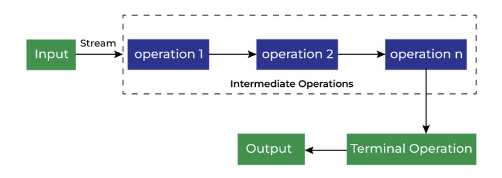

Major Concepts of Java 8:
- Functional Interfaces
- CompletetableFutures
- Stream API & ParallelStreams
- Lambda functions

# Stream API

Introduced in Java 8 (JDK 1.8), Stream API is used to 
- perform bulk operations
- process collections of objects.

Saliant Features:
1. Functional-style operations
2. Pipelining
3. Lazy evaluation
4. Parallel Processing

Stream is
- not a data structure to store objects
- not supporting indexed access

```bash
import java.util.stream.*;

Stream<T> stream;
Here T is either a class, object, or data type. Collections API is closely related to Stream API.
```

Stream once used, can't be reused.

```java
List<String> names = Arrays.asList("Jalaz", "Narendra", "Saurabh");
Stream<String> streamedNames = names.stream();
streamedNames.forEach(y -> System.out.println(y));
streamedNames.forEach(y -> System.out.println(y));
```
```bash
Jalaz
Narendra
Saurabh
ERROR!
Exception in thread "main" java.lang.IllegalStateException: stream has already been operated upon or closed
```




Different operations on Stream API:
1. Intermediate Operations
2. Terminal Operations

**Intermediate Operations** are the types of operations in which multiple methods are chained in a row. They take Stream as argument & returns Stream. Eg: map(), filter(), sorted()
**Terminal Operations** are the type of Operations that return the result. These Operations are not processed further just return a final result value. eg: collect(), reduce(), forEach()

Intermediate operations are lazy. This means that they will be invoked only if it is necessary for the terminal operation execution.

Short circuiting intermediate operations -> produces finite stream for an infinite stream. Eg, limit() and skip()
Short circuiting terminal operations -> if it may terminate in finite time for infinite stream. Eg, anyMatch, allMatch, noneMatch, findFirst and findAny.

Important Points:
1. A stream comprises of a source followed by pipeline of zero or more intermediate methods and a final terminal method which obtains the results as per the pipeline.
2. Streams don’t change the original data structure, they only provide the result as per the pipelined methods.

```java
import java.util.*;
import java.util.stream.*;
 
class Demo {
    public static void main(String args[])
    {

         List<Integer> number = Arrays.asList(5, 2, 1, 4);
         List<String> names = Arrays.asList("Jalaz", "Sukhbir", "Saurabh", "Narendra");

        List<Integer> square = number.stream().map(x -> x * x).collect(Collectors.toList());
        System.out.println(square);

        List<String> result = names.stream().filter(s -> s.startsWith("S")).collect(Collectors.toList());
        System.out.println(result);
 
        List<String> show = names.stream().sorted().collect(Collectors.toList());
        System.out.println(show);
 
        number.stream().map(x -> x * x).forEach(y -> System.out.println(y));
 
        int even = number.stream().filter(x -> x % 2 == 0).reduce(0, (ans, i) -> ans + i);
        System.out.println(even);
    }
}
```
```bash
[25, 4, 1, 16]
[Sukhbir, Saurabh]
[Jalaz, Narendra, Saurabh, Sukhbir]
25
4
1
16
6
```

Other important methods part of Stream APIs:

function|little-info
---|---
boolean allMatch(Predicate<? super T> predicate)|checks if all elements of the stream matches with the predicate
boolean anyMatch(Predicate<? super T> predicate)|checks if any element of the stream matches with the predictate & breaks
<R,A> R collect(Collector<? super T,A,R> collector)|
static <T> Stream<T> concat(Stream<? extends T> a, Stream<? extends T> b)|
long count()|
Stream<T> distinct()|
static <T> Stream<T> empty()|
Stream<T> filter(Predicate<? super T> predicate)|returns a stream comprising of all elements which matches with the predicate
Optional<T> findAny()|returns any element from the stream
Optional<T> findFirst()|used for ordered stream, for unordered stream, acts as same as findAny
void forEach(Consumer<? super T> action)|
Stream<T> limit(long maxSize)|
Optional<T> max(Comparator<? super T> comparator)|
Optional<T> min(Comparator<? super T> comparator)|
Stream<T> peek(Consumer<? super T> action)|performs the specified operation on each element of the stream and returns a new stream which can be used further. peek() is an intermediate operation
Optional<T> reduce(BinaryOperator<T> accumulator)|
T reduce(T identity, BinaryOperator<T> accumulator)|
Stream<T> skip(long n)|
Stream<T> sorted()|
Stream<T> sorted(Comparator<? super T> comparator)|
Object[] toArray()|converts a stream to an array

map()|flatMap()
---|---
<R> Stream<R> map(Function<? super T,? extends R> mapper)|<R> Stream<R> flatMap(Function<? super T,? extends Stream<? extends R>> mapper)
produces a new stream after applying a function to each element of the original stream. The new stream could be of different type.|stream can hold complex data structures like Stream<List<String>>. this helps us to flatten the data structure to simplify further operations


# ParallelStream

The API allows us to create parallel streams, which perform operations in a parallel mode. 

When the source of a stream is a Collection or an array, it can be achieved with the help of the parallelStream() method:
```java
Stream<Product> streamOfCollection = productList.parallelStream();
boolean isParallel = streamOfCollection.isParallel();
boolean bigPrice = streamOfCollection
  .map(product -> product.getPrice() * 12)
  .anyMatch(price -> price > 200);
```

If the source of a stream is something other than a Collection or an array, the parallel() method should be used:
```java
IntStream intStreamParallel = IntStream.range(1, 150).parallel();
boolean isParallel = intStreamParallel.isParallel();
```

Under the hood, Stream API automatically uses the ForkJoin framework to execute operations in parallel. By default, the common thread pool will be used and there is no way (at least for now) to assign some custom thread pool to it.

The stream in parallel mode can be converted back to the sequential mode by using the sequential() method:
```java
IntStream intStreamSequential = intStreamParallel.sequential();
boolean isParallel = intStreamSequential.isParallel();
```


## Points against Java Stream API

There are other stream APIs like Apache Kafka Stream API, RxJava etc. Comparing to them, these are the pitfalls:

1. Batch, Not Streaming

2. Chain, Not Graph

3. Internal, Not External Iteration


