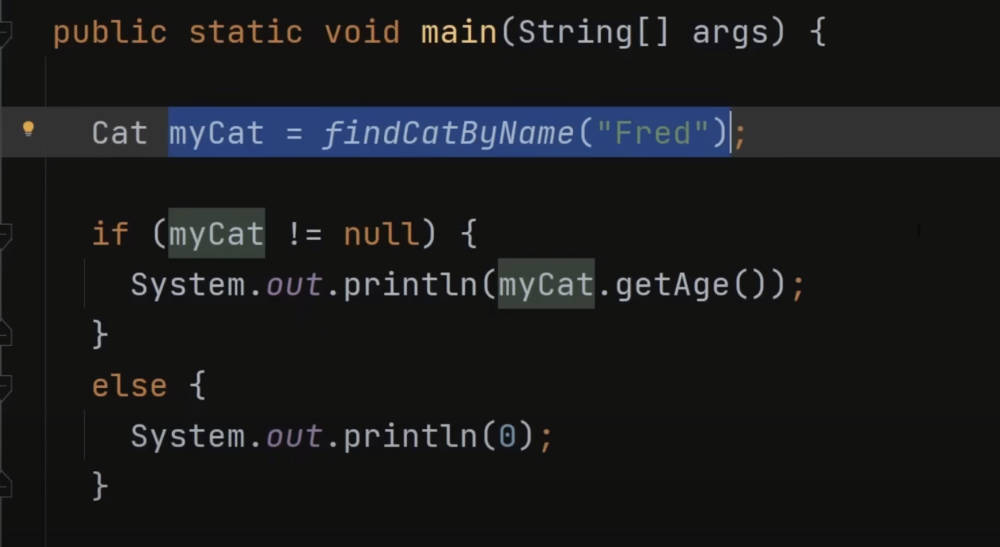
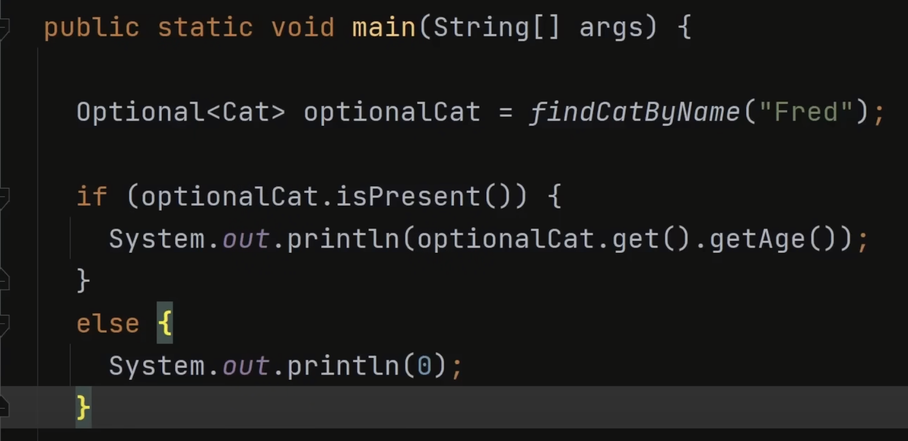

Java Launched multiple features with JDK 1.8, facilitating & making Java more closer to user as compared with languages like python etc.
Few of them are covered as separate blog posts:

1. CompletableFuture & Executor Service:
2. Stream API
3. Covering in this post:
    1. Lambda Expressions
    2. Optional
    3. Functional Interfaces
    4. Generics

# Lambda Expressions

`Inteface` basically defines the contracts. Any class which implements that interface needs to override those abstract methods with proper implementations.

```java
// Before Java 8: (Using Inner Classes)
PersonInterface person = new PersonInterface() {  
    @Override 
    public void how() {
        System.out.println("Before Java 8 without lambda");
    }  
};

// Java 8: (Using lambda expression)
PersonInterface p2 = () -> { System.out.println("Lambda implemented"); };
```

Lambdas is an anonymous (no name) function where we do not need to define the data type of input parameters & does not have a return type. Lambda expression in java implements the functional interface and can be treated as any other java object. It can be used to create threads, comparators and can be used to add event Listeners.

Lambda Expressions implements only the abstract function of the interface.
We can't define a lambda expression over an interface having more than 1 abstract function. If we do so, it results in an error.

```java
interface FuncInterface {
    // An abstract function
    void abstractFun(int x);

    // A non-abstract function
    default void normalFun() {
       System.out.println("Hello Jalaz..!!");
    }
}

class Test {
    public static void main(String args[]) {
        
        FuncInterface fobj = (int x) -> System.out.println(2*x);
        fobj.abstractFun(5);
    }
}
```

Lambda expressions are just like functions and they accept parameters just like functions. 
3 Lambda Expression Parameters as mentioned below:

- Zero Parameter
- Single Parameter
- Multiple Parameters

```java
interface Welcomable {  
    public String welcomeMsg(String name);
}  
  
public class Runner{  
    public static void main(String[] args) {  
      
        Welcomable w1Admin = (name)-> {  return "Hello, Admin: "+name;  };  
        System.out.println(w1Admin.welcomeMsg("Jalaz"));  
          
        Welcomable w2User= name -> {  return "Hello, User: "+name;  };  
        System.out.println(w2User.welcomeMsg("Jalaz"));  
        
        System.out.println(guestLogin(w2User));  
    }  
    
    public static String guestLogin(Welcomable wImpl) {
        return wImpl.welcomeMsg("Guest");
    }
}
```
```bash
Hello, Admin: Jalaz
Hello, User: Jalaz
Hello, User: Guest
```

<ins>Benefits:</ins>
- provides the implementation of Functional interface.
- less coding.
- can be passed around as if it was an object and executed on demand.

<ins>Drawbacks:</ins>
- Java lambda functions can be only used with functional interfaces.
- they lack names and documentation, meaning that the only way to know what they do is to read the code.

`Be aware of the scope of variable you are using in the lambda expression`

Inner class|Lambda Expression
---|---
creates a new scope|work with enclosing scope
We can hide local variables from the enclosing scope by instantiating new local variables with the same names.|We can’t hide variables from the enclosing scope inside the lambda’s body
We can also use the keyword this inside our inner class as a reference to its instance|In this case, the keyword this is a reference to an enclosing instance.


# Optional

Optional class in Java 8 is a container object which is used to contain a value that might or might not be present. It was introduced as a way to help reduce the number of NullPointerExceptions & try-catch checks that occur in Java code.

One of the key benefits of using `Optional` is that it forces us to handle the case where the value is absent. This means that we are less likely to miss important checks in the code and reduces the risk of NPE. If a value is not present, we can either provide a default value or throw an exception.

Optional comes along with a strong move towards `functional programming` in Java.

`null checks`|`Optional`
---|---
|
sometimes necessary, but not mandatory due to which system produce unexpected runtime errors like NullPointerExceptions.|should always be treated properly at compile time to get the value inside of it. This obligation to handle an Optional at compile time results in fewer unexpected NullPointerExceptions.

### Optional class methods

Creation Methods|Working|Signature
---|---|---
Optional.ofNullable()|returns an Optional describing the specified value, if non-null, otherwise returns an empty Optional.|`public static <T> Optional<T> ofNullable(T value)`	
Optional.of()|returns an Optional with the specified present non-null value|`public static <T> Optional<T> of(T value)`
Optional.empty()|returns an empty Optional object|`public static <T> Optional<T> empty()`

Usage Methods|Params
---|---
Optional.get()|If a value is present in this Optional, returns the value, otherwise throws NoSuchElementException.|`public T get()`
Optional.isEmpty()|returns true if the wrapped value is null. Introduced in Java 11|
Optional.isPresent()|returns true if the wrapped value is not null|`public boolean isPresent()`
Optional.orElse()|returns the value if present, otherwise returns the default value specified|`public T orElse(T default)`
Optional.orElseGet()||`public T orElseGet(Supplier<? extends T> other)`
Optional.orElseThrow()|returns the contained value, if present, otherwise throw an exception to be created by the provided supplier. It works exactly the same as Optional.get()|

```java
public String getMyDefault() {
    System.out.println("Some API call to get default Value...");
    return "Default Value";
}

@Test
public void whenOrElseGetAndOrElseDiffer_thenCorrect() {
    String text = "Text present";

    System.out.println("Using orElseGet:");
    String defaultText 
      = Optional.ofNullable(text).orElseGet(this::getMyDefault);
    assertEquals("Text present", defaultText);

    System.out.println("Using orElse:");
    defaultText = Optional.ofNullable(text).orElse(getMyDefault());
    assertEquals("Text present", defaultText);
}
```
```bash
Using orElseGet:
Using orElse:
Some API call to get default Value...
```

Cost is obvious when using orElse(), instead of orElseGet().

Extra Methods|Working|Signature
---|---|---
Optional.filter()|normally used this way to reject wrapped values based on a predefined rule.|`yearOptional.filter(y -> y % 4).isPresent();`
Optional.map()|used to transform a value to some other value. Keep in mind that this operation does not modify the original value.|`nameOptional.map(String::length).orElse(0);`
Optional.empty()||

#### Benefits of Optionals
- Better than null checks
- Helps to Design Clear Intention APIs
- Supports Declarative Programming Paradigm

#### Misuse of Optionals

Using Optional abusively can lead to a drop in performance and code cluttering. Some bad practices around usage are:

- passing an Optional parameter to a method.
- Optional is not Serializable. For that reason, it’s not intended to be used as a field in a class.
- practice of using Optional as a method parameter is even discouraged by some code inspectors.

`The intent of Java when releasing Optional was to use it only as a return type`

# Generics in Java

Introduced in Java 5, Generics help alot in code reusability & extensibility.
Code Reuse & Type Safety are 2 prime advantages of Generics.

- makes the programmer’s job easier and less error-prone.
- enforces type correctness at compile time. errors like ClassCastException are avoided at runtime.
- most importantly, enable the implementation of generic algorithms without causing any extra overhead to our applications.

`Generics don't work with primitive data-types` like int, double. We require Wrapper classes for them like Integer, Double etc.
  - generics are a compile-time feature, meaning the type parameter is erased and all generic types are implemented as type Object.
  - type parameters must be convertible to Object. Since primitive types don’t extend Object, we can’t use them as type parameters.

## Generic Class

#### Without Generics
```java
class Runner {
    public static void main(String[] args) {
        IntegerPrinter intPrinter = new IntegerPrinter(10);
        intPrinter.print();
        
        StringPrinter stringPrinter = new StringPrinter("Jalaz");
        stringPrinter.print();
    }
}

class IntegerPrinter {
    Integer thingToPrint;
    
    public IntegerPrinter(Integer thingToPrint) {
        this.thingToPrint = thingToPrint;
    }
    
    public void print() {
        System.out.println(thingToPrint);
    }
}

class StringPrinter {
    String thingToPrint;
    
    public StringPrinter(String thingToPrint) {
        this.thingToPrint = thingToPrint;
    }
    
    public void print() {
        System.out.println(thingToPrint);
    }
}
```
```bash
10
Jalaz
```

#### With Generics

```java
class Runner {
    public static void main(String[] args) {
        Printer<Integer> intPrinter = new Printer<>(10);
        intPrinter.print();
        
        Printer<String> stringPrinter = new Printer<>("Jalaz");
        stringPrinter.print();
    }
}

class Printer <T> {
    T thingToPrint;
    
    public Printer(T thingToPrint) {
        this.thingToPrint = thingToPrint;
    }
    
    public void print() {
        System.out.println(thingToPrint);
    }
}
```
```bash
10
Jalaz
```

## Bounded Generics

Bounded means “restricted,” and we can restrict the types that a method accepts.

```java
ArrayList<Object> cats = new List<>();
cats.add(new Cat("Bubly",3));
cats.add(new Dog("Bruno",6));

Cat myCat = (Cat)cats.get(0);
Cat myCat = (Cat)cats.get(1);    //Classcast Exception
```

These kind of issue do come with generics, due to which there is a way in which we can have bounded generics, which restrict which kind of objects can be held.

```java
class Runner {
    public static void main(String[] args) {
        Printer<Dog> dogPrinter = new Printer<>(new Dog());
        dogPrinter.print();
        
        Printer<Cat> catPrinter = new Printer<>(new Cat());
        catPrinter.print();
    }
}

class Printer <T extends Animal> {
    T thingToPrint;
    
    public Printer(T thingToPrint) {
        this.thingToPrint = thingToPrint;
    }
    
    public void print() {
        System.out.println(thingToPrint.sound());
    }
}

interface Animal {
    public String sound();
}

class Dog implements Animal {
    public String sound() {
        return "bark!";
    }
}

class Cat implements Animal {
    public String sound() {
        return "meow!";
    }
}
```
```bash
bark!
meow!
```

We can have multiple constructs within bounded generics.

`class Printer <T extends Animal & Serializable>`

- Only 1 class & it always come first within bounded list, as java doesnt support multiple inheritance
- Multiple bounds will be separated by &

## Generic Methods

```java
class Runner {
    public static void main(String[] args) {
        print("Jalaz");
        print(2311);
    }
    
    private static <T> void print(T anythingToPrint) {
        System.out.println(anythingToPrint + "...!!");
    }
}
```
```bash
Jalaz...!!
2311...!!
```

this can be extended to multiple function arguments as well.
```java
class Runner {
    public static void main(String[] args) {
        print("Jalaz", "Kumar");
        print(2311, "Flipkart");
    }
    
    private static <T, V> void print(T firstPrint, V secondPrint) {
        System.out.println(firstPrint + " <> " + secondPrint + "...!!");
    }
}
```
```bash
Jalaz <> Kumar...!!
2311 <> Flipkart...!!
```

We can also have generic return types.
```java
public <T> List<T> fromArrayToList(T[] a) {   
    return Arrays.stream(a).collect(Collectors.toList());
}
```

## Generic Conventions

The type parameters naming conventions are important to learn generics thoroughly. The common type parameters are as follows:
T – Type
E – Element
K – Key
N – Number
V – Value

## Wildcards in Generics


# Functional Interfaces

An interface which has only one abstract method is called functional interface. 
Java provides an anotation `@FunctionalInterface`, which is used to declare an interface as functional interface.


1. Consumer

2. Predicate

3. Supplier

4. Function

5. Operator
