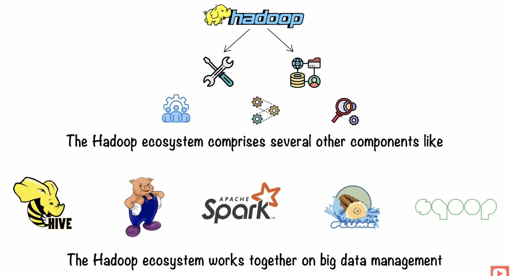
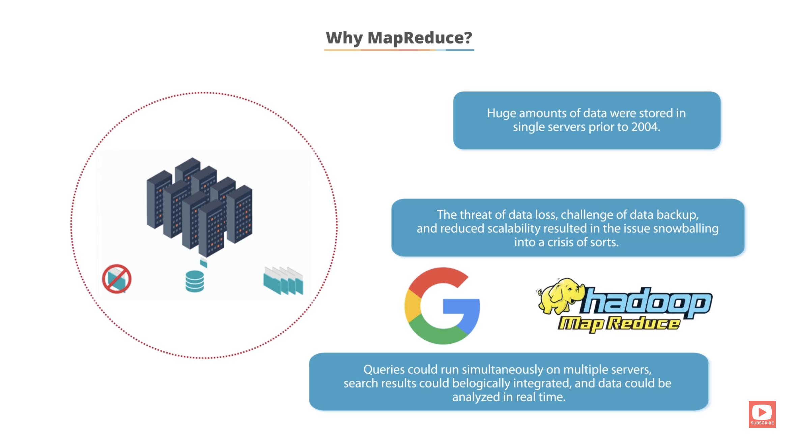
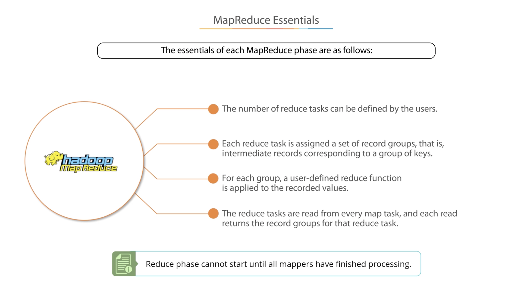
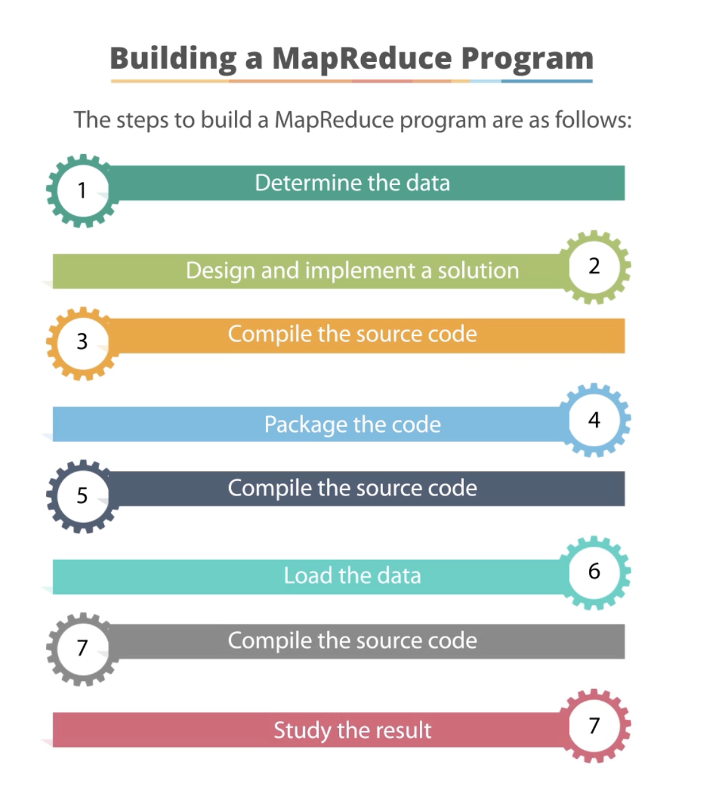
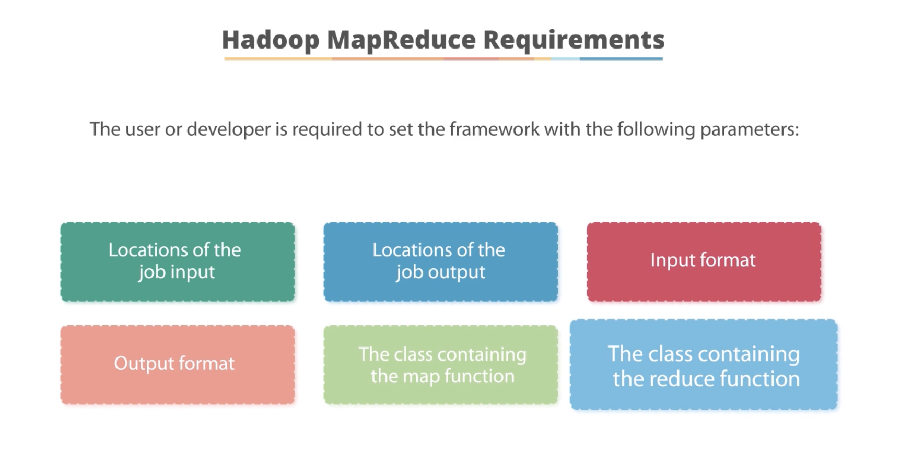
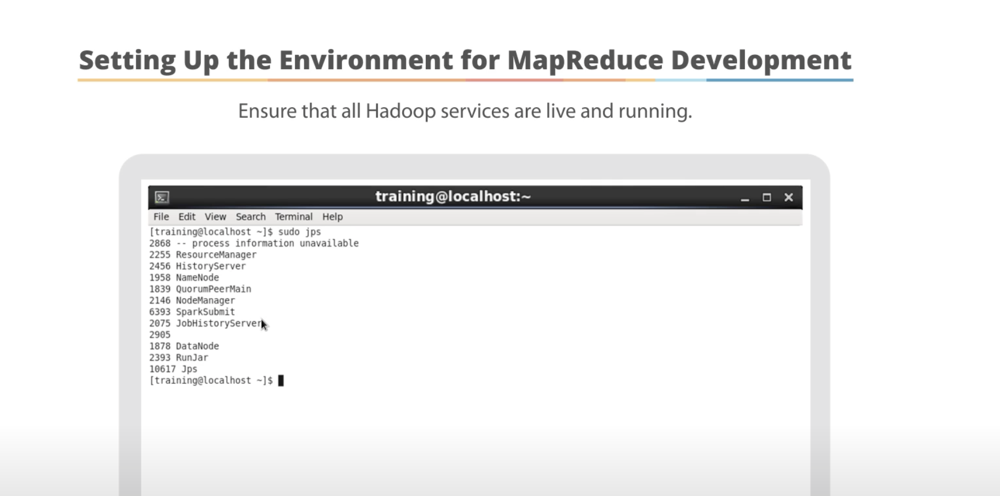
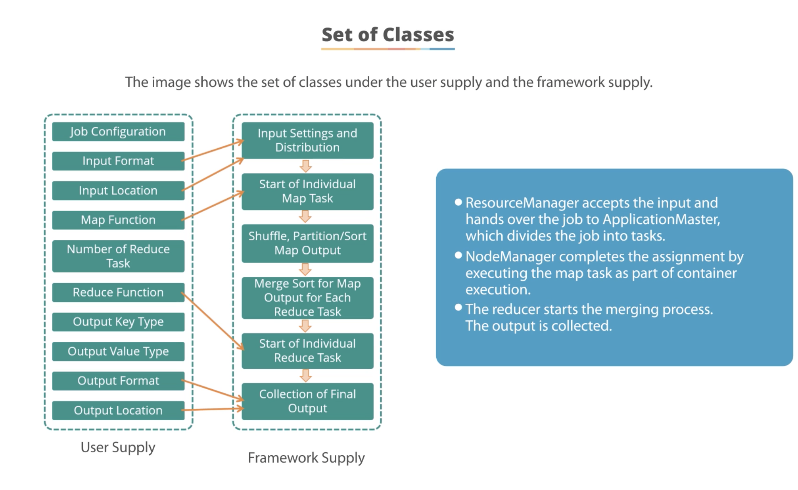
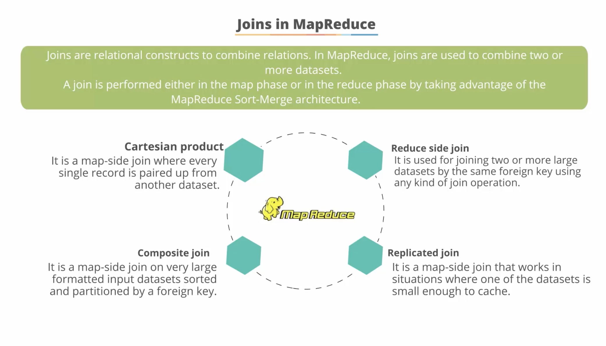

# Introduction

## Evolution of Hadoop

## Components of Hadoop

|Component|Details
---|---
HDFS|
MapReduce|
Yarn|

## Hadoop Ecosystem

Apart from these 4 important components, when we talk about Hadoop Ecosystem it comprises of many others as well:
- Hive
- Apache Pig
- Spark etc.

# Architecture

# MapReduce

---

---

---

---

---

---

---

---

---

---

---

---

---

---

# YARN

---

---

---

---

---

---

---

---

---

---

# HDFS Commands
