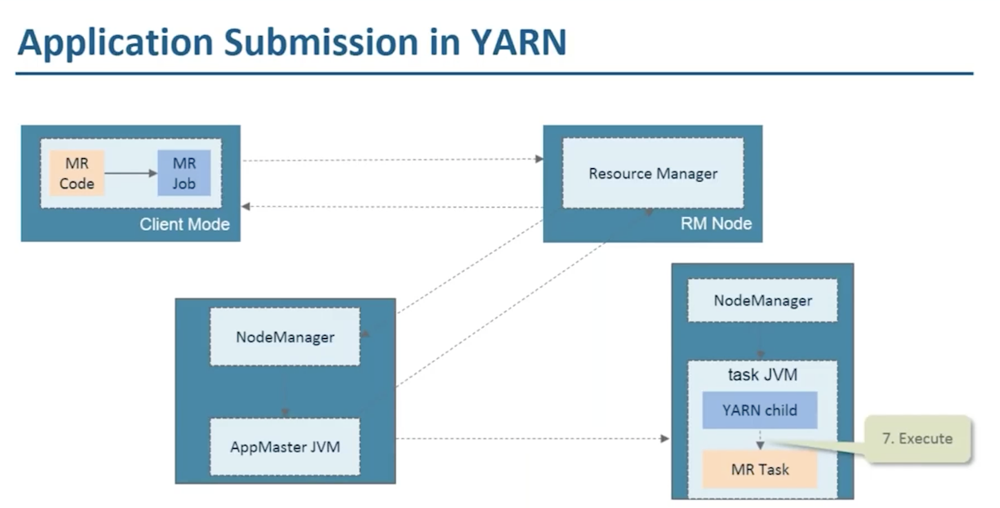

# Introduction

An open-source framework developed by Apache for storing, processing, and analysing large amounts of data.
- Java-based
- batch/offline processing system

## Evolution of Hadoop

# Hadoop Ecosystem

Hadoop is not a single tool. It’s an ecosystem that includes multiple modules that work together to manage data storage, processing, and resource coordination.

HDFS, MapReduce, Yarn & Hadoop Commons are the 4 primary pillars of Hadoop ecosystem.

## Benefits of Hadoop

Hadoop was designed to deal with large amounts of data, so here are the five primary benefits:
Name|Details
---|---
Speed|Hadoop's concurrent processing, MapReduce model, and HDFS enables this
Diversity|HDFS can hold a variety of data forms, including structured, semi-structured, and unstructured data.
Cost-Effective|Open-source and stores data on commodity technology
Resilient|HDFS has the ability to replicate data over the network & provides replication factor of 3
Scalable|Distributed in nature, we can quickly add extra servers to Hadoop & quickly scale it horizontally

## Challenges in Hadoop

Name|Details
---|---
Security|Lot of confidential information. Hadoop still has to provide suitable identity, data encryption, provisioning, and auditing procedures.
High Learning Curve|For running query in Hadoop, it requires developing MapReduce functions in Java. In addition, the ecosystem is made up of many other components.
Not All Datasets can be Handled the Same|Hadoop does not provide a “one-size-fits-all” benefit. Different components operate in different ways, lot trial and error needed
MapReduce is Limited|Although MapReduce is a fantastic programming model, it relies on a file-intensive technique which is tough to handle

## Components of Hadoop

|Component|Details
---|---
HDFS|
MapReduce|
Yarn|

## Key Features of Hadoop

These are mainly:
- Distributed storage and processing allow it to store extremely large datasets and query them.
- Horizontal scalability without requiring high-end machines.
- Data locality optimization, moving computation to where the data resides.
- Resilience to failure via replication and task re-execution.

These 4 features make Hadoop well-suited for batch data processing, log analysis, and ETL pipelines. Hadoop is a classic case study for distributed computing, where computation happens across multiple nodes to increase the overall efficiency and scale.

# Hadoop Distributed File System (HDFS)

HDFS is Hadoop’s primary storage system. It is designed to reliably store the vast amounts of data across a cluster of machines.
HDFS architecture is highly optimized for fault tolerance, scalability, and data locality.

## Architecture & Components

HDFS follows a master-slave model. 
- At the top sits the **NameNode**
  - which manages metadata like the file system’s directory tree and information about each file’s location.
  - It doesn’t store the actual data.
  - Serves as the Master, guiding the Datanode.

- The **DataNodes** are the workhorses or slaves.
  - They manage storage attached to the nodes and serve read/write requests from clients.
  - Each DataNode regularly reports back to the NameNode with a heartbeat and block reports to ensure consistent state tracking.

## Data Storage & Fault Tolerance

When a file is written to HDFS, it’s broken into fixed-size 64MB blocks. Each block is then distributed across different DataNodes.
Data in HDFS isn’t just stored once. Each block is replicated (the default is three copies) and spread across the cluster.

- During a read operation, the system pulls data from the nearest available replica to maximize throughput and minimize latency.
- Writes go to one replica first and then propagate to the others, ensuring durability without immediate bottlenecks.

HDFS is built with failure in mind. HDFS ensures data availability through its replication mechanism. 
- **DataNode Failure**
  NameNode detects the failure via missed heartbeats and schedules the replication of lost blocks to healthy nodes.

- **NameNode Failures**
  To Be Researched and Added

# MapReduce

MapReduce is the Hadoop’s processing engine. It allows for distributed computation across large datasets by breaking down tasks into smaller, independent operations that can be executed in parallel, which is what makes Hadoop so fast.

## Stages and Components of MapReduce

MapReduce follows a two-phase programming model: the Map and Reduce phases:

- The **Map() function** converts DataBlocks into Tuples, which are just key-value pairs.
- The **Reduce() function** then joins these broken Tuples or key-value pairs based on their Key value and creates a set of Tuples, and performs operations such as sorting, summing, and so on, before sending them to the final Output Node.

Cascading is a very popular java framework for writing MR Jobs. In recent times, Spark jobs have replaced MR/Cascading Jobs in production.

## Benefits of MapReduce

## Usage of MapReduce

# YARN

---

---

---

---

---

---

---

---

---

---

# HDFS

https://hadoop.apache.org/docs/stable/hadoop-project-dist/hadoop-hdfs/HdfsDesign.html

