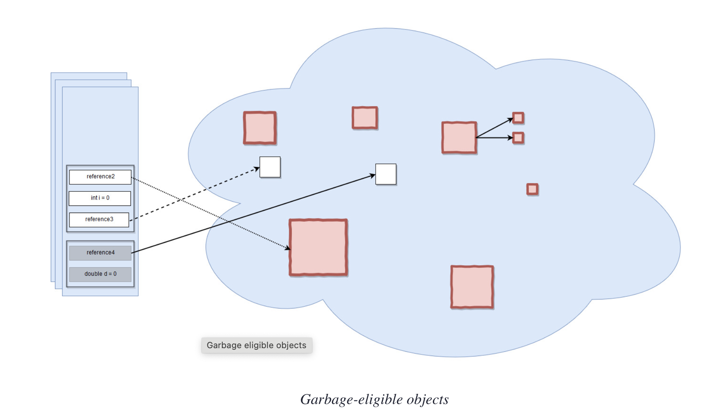
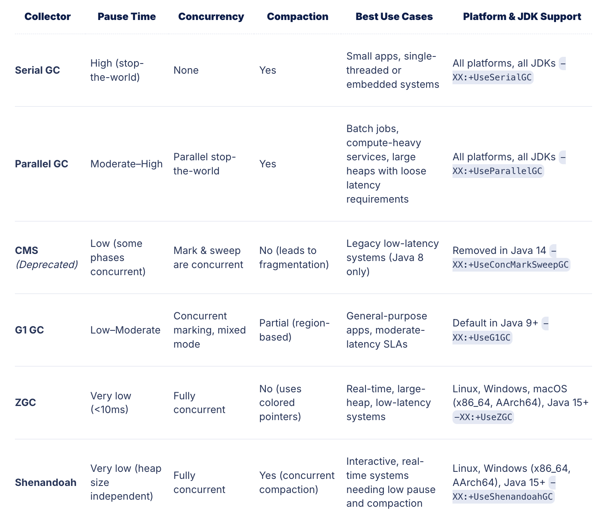

# Java Memory Management

This refers to how the JVM allocates, manages, and releases memory during the execution of Java applications. JVM uses GC to reclaim memory by removing unused objects, eliminating the need for manual memory management, thus relieving developers work & headache.

Efficient memory management is very critical to building reliable, high-performance Java applications. JVM handles memory allocation and garbage collection automatically, but deeper understanding of how the memory is structured and managed under the hood is essential for diagnosing issues, tuning performance, and writing optimized code.

## Java Memory Model

JVM divides the system memory into several logical runtime data areas, each serving a specific role during program execution. This structured memory model ensures isolation between different types of data, supports multithreading, and enables features like automatic GC.

At runtime, the JVM creates a set of runtime data areas. These include:

- Heap Memory
- Stack Memory
- Method Area (Implemented as Metaspace in Java 8+)
- Program Counter (PC) Register
- Native Method Stack

Each area plays a unique role in executing Java programs and managing resources.

### Heap Memory

This part of memory stores the actual object in memory. Those are referenced by the variables from the stack.
There exists only one heap memory for each running JVM process & is shared among all Java Virtual Machine threads.

Depending on the configuration of the system, the size of the heap can be dynamic or fixed. We use `-Xmx` for maximum heap size & `-Xms` for initial heap size.

If a computation requires more heap than can be made available by the automatic storage management system, then JVM throws an `OutOfMemoryError`

Heap space is the area where all the objects are allocated, whether 
- the object is created inside a thread’s local method
- or is a member variable of an object
- or is a referenced object.
- Static member variables are also allocated on the heap space. (PS: There is no concept of global scope variables in Java)

In Java, we have different types of references: strong, weak, soft, and phantom references. The difference between the types of references is that the objects on the heap they refer to are eligible for GC under different criteria.

Pending: Add table for all 4 reference types & their details

### Stack Memory

In JVM, stack memory plays a crucial role in method execution. Unlike heap memory, which stores objects for longer-term use and is shared across threads, the stack is thread-local and exists independently for each thread.

When a thread is created, the JVM allocates a new Java stack for that thread. This stack consists of a series of stack frames, each representing a single method invocation. As methods are called and return, frames are pushed to and popped from the top of the stack in a strict last-in, first-out (LIFO) order.

#### Stack Frames

On any method invocation, JVM allocates a new stack frame on the thread’s stack. This frame is a self-contained unit of memory that holds all the necessary data for executing that method. Once the method returns, its frame is removed from the stack, and the memory is automatically reclaimed; no garbage collection is required for stack memory.

- are lightweight
- quick to allocate.
- are thread-local and do not require synchronization, so operations on the stack (method calls and returns) are extremely fast.

Only references to objects are stored on the stack. The actual objects, including their fields and internal state, reside in the heap.

Each thread’s stack is limited in size, which can be configured using the `-Xss` JVM option.

If a thread calls too many nested methods or recurses too deeply, the stack may exceed this limit and trigger a `StackOverflowError`.

### Method Area (MetaSpace in Java8+)

Critical part of the JMM which stores per-class metadata necessary for the JVM to execute Java applications. Unlike the heap, which holds individual object instances, the method area is used to store class-level information that is shared across all instances of a class and all threads within the application.

It's actual implementation has evolved over different versions of the JVM, most notably with the transition from Permanent Generation (PermGen) to Metaspace in Java 8.

- It stores class metadata, such as the class structure, method information, and the constant pool.
- Static variables are now stored in the heap. This is a change from older Java versions (pre-Java 8), where they were stored in a special area of the heap called the Permanent Generation (PermGen).
- In Java 8 and later, the actual data for static variables is allocated on the heap, even though the class metadata (which includes a reference to the static variable) is in Metaspace

#### PermGen (Prior to Java 8)

Method area was physically implemented in a fixed-size memory region called the Permanent Generation (PermGen). PermGen resided in the heap and had to be explicitly sized using JVM flags like, `-XX:PermSize` & `-XX:MaxPermSize`

Challenges with fixed nature of PermGen:
- Class metadata exceeding PermGen space, leading to `java.lang.OutOfMemoryError: PermGen space`, especially in applications that dynamically load many classes.
- Since PermGen was part of heap, its memory management was limited and difficult to tune correctly.

#### MetaSpace (Post Java 8)

JVM replaced PermGen with a new memory region called Metaspace. Unlike PermGen, Metaspace is not part of the Java heap; it is allocated from native memory, which allows it to grow dynamically as needed (limited by system capability)

Improvements:
- No longer need to worry about sizing PermGen manually.
- Reduced risk of OutOfMemoryError: PermGen space
- Class metadata is handled more flexibly and efficiently.

While Metaspace can grow automatically, it is still constrained by available system memory. If too many classes are loaded (or not properly unloaded), Metaspace can still overflow, leading to a new error: `java.lang.OutOfMemoryError: Metaspace`

To control Metaspace usage, the JVM provides the following flags: `-XX:MetaspaceSize` & `-XX:MaxMetaspaceSize`

### Program Counter (PC Register)

Very small but essential component of the JMM. While other memory areas like the heap and stack handle data and objects, the PC register is concerned with instruction-level control: keeping track of which bytecode instruction a thread should execute next.

Each thread in the JVM has its own private Program Counter register. This isolation is necessary because the JVM supports multithreaded execution, where multiple threads can run independently and simultaneously. By maintaining a separate PC for each thread, the JVM ensures that threads do not interfere with each other’s execution flow.

This allows the JVM to resume execution from the correct point after:
 - A method call
 - A branch (e.g., if/else, loop)
 - An exception handler
 - A thread context switch

Internally, the PC register helps drive the **JVM execution engine**, which fetches the bytecode instruction pointed to by the PC, decodes it, and then executes it.

PC register is not something developers interact with directly, but it becomes visible in several situations:
- Stacktraces during Exception Handling logs
- Debugging tools, profiler & breakpoints

PC Register is so low-level and lightweight, so does not require GC or tuning, and it has no configurable size or visibility at the language level. However, it is essential for:
- enabling Java’s method execution model
- thread isolation
- exception reporting.

### Native Method Stack

Dedicated memory region in the JVM that supports the execution of native methods, methods written in languages other than Java, such as C or C++. These methods are typically called through the **Java Native Interface (JNI)**, which acts as a bridge between the JVM and native libraries.

When a native method is invoked, the JVM hands control over to the host operating system, which executes the method using the machine’s native call stack rather than the Java call stack. 

Each thread in the JVM has its own native method stack, separate from the standard Java stack used for executing bytecode. The JVM doesn’t manage the internals of this stack in the same way it manages Java method execution. Instead, it delegates the execution entirely to the native system runtime, allowing native code to execute as if it were part of a regular C/C++ program.

While Java handles heap and stack memory automatically, native methods executed via JNI operate in native memory, which is outside the JVM’s control. Although often overlooked, native memory leaks are one of the hardest issues to detect in Java applications.

These risks make it essential to use JNI and native code sparingly, and only when absolutely necessary.

# Garbage Collection

This is a cornerstone of Java’s automatic memory management system. It eliminates the need for developers to manually free memory, which reduces the risk of memory leaks, dangling pointers, and other low-level memory errors common in languages like C or C++.

This process enables Java applications to manage memory more safely and efficiently, but it doesn’t come without trade-offs. Garbage collection is a background process that periodically pauses application threads, and its efficiency has a direct impact on application performance, latency, and scalability.

Garbage collection:
- Frees up memory occupied by unreachable objects
- Prevents memory leaks and heap exhaustion
- Ensures long-running applications continue to operate without manual intervention

### Details of Heap Memory Management

Heap memory is automatically managed by GC, which reclaims memory occupied by objects that are no longer in use. To optimize this process and reduce application pause times, the JVM divides the heap into two regions: the Young Generation and the Old Generation. This layout, known as the **Generational Heap Model**, is based on the principle that most objects in Java applications are short-lived, and those that survive are likely to live much longer.

#### Young Generation

Here all newly created objects begin their lifecycle. It is optimized for fast allocation and frequent GC. Because the majority of objects are short-lived (e.g., method-local objects, temporary buffers), this region is collected often using **Minor GCs**, which are typically fast and efficient. Internally, the Young Generation is divided into three spaces:

 - **Eden Space**: This is the starting point for new object allocations. As soon as an object is created, the JVM attempts to place it in Eden. When Eden fills up, a Minor GC is triggered.
- **Survivor Spaces**: The two survivor spaces, commonly referred to as S0 and S1, act as staging areas for objects that survive a garbage collection. After each Minor GC, reachable objects from Eden are moved into one of the survivor spaces. Objects that continue to survive are moved between the two survivor spaces across collection cycles.

As objects survive more garbage collection cycles, their age increases. Once an object’s age exceeds a threshold (controlled by the JVM flag `-XX:MaxTenuringThreshold`), it is promoted to the Old Generation. Promotion is also forced when the survivor spaces do not have enough room to hold surviving objects.

Proper tuning of the Young Generation can help reduce promotion rates and delay costly collections in the Old Generation:
 - The size of the Young Generation with `-Xmn`
 - The Eden-to-Survivor space ratio using `-XX:SurvivorRatio`
 - The promotion age threshold with `-XX:MaxTenuringThreshold`

#### Old Generation

This is also known as the Tenured Generation, is designed to hold long-lived objects, those that have survived multiple Minor GCs. 
While the Young Generation handles the frequent allocation and disposal of short-lived data, the Old Generation is where objects that remain in use for extended periods are eventually stored. 
Examples include:
 - Persistent application-level caches
 - Static or shared data structures that are retained across requests

Since the Old Generation contains objects that are more likely to still be in use, it is collected less frequently than the Young Generation. Garbage collection in this region is referred to as a **Major GC**, and when both generations are collected together, the process is known as a **Full GC**.

Collections in the Old Generation are more expensive and typically involve:
- A full stop-the-world pause
- Tracing all reachable objects starting from the GC roots
- Compacting memory to eliminate fragmentation

If the Old Generation becomes full and GC is unable to reclaim sufficient memory, the JVM will throw a `java.lang.OutOfMemoryError: Java heap space`. This is often a sign of excessive object retention, memory leaks, or incorrect heap sizing.

To control the size and behavior of the Old Generation, you can adjust:
 - The total heap size using -Xmx (maximum) and -Xms (initial)
 - The size of the Young Generation using -Xmn, which affects how much memory is left for the Old Generation
 - The ratio between the two using -XX:NewRatio

### Types of GC Algorithms

### Garbage Collection Phases

 - **Mark**: The collector scans through live references and marks all reachable objects by tracing from the GC roots.
 - **Sweep**: Once marking is complete, the collector reclaims memory occupied by objects that were not marked (i.e., unreachable).
 - **Compact** (optional): To reduce fragmentation, some collectors move live objects into contiguous memory regions and update references.

This process ensures that memory is efficiently reused, and fragmentation is minimized (especially important in long-running applications).

# Best Practices fo JMM:

- Minimize Unnecessary Object Creation
- Avoid Memory Leaks
- Choose the Right Data Structures
- Be Mindful of Object Retention in Collections
- Tune the JVM for Your Workload
- Monitor and Profile Regularly
- Understand Application-Specific Memory Patterns

# References (Good ones for reading)

Good Reference Blogs for JMM:
- https://www.digitalocean.com/community/tutorials/java-jvm-memory-model-memory-management-in-java
- https://medium.com/@amitvsolutions/jvm-part-3-memory-management-89acca050442
- https://www.linkedin.com/pulse/memory-management-java-softyoi-llp-wxrsf

Good Reference Blogs for GC:
- https://www.digitalocean.com/community/tutorials/java-jvm-memory-model-memory-management-in-java
- https://dzone.com/articles/java-memory-management
- https://medium.com/@RamLakshmanan/how-to-achieve-high-gc-throughput-2a5405417d95

Interview Questions:
- https://www.javacodegeeks.com/2024/09/java-memory-management-key-interview-questions-and-expert-answers.html
- https://www.baeldung.com/java-memory-management-interview-questions

