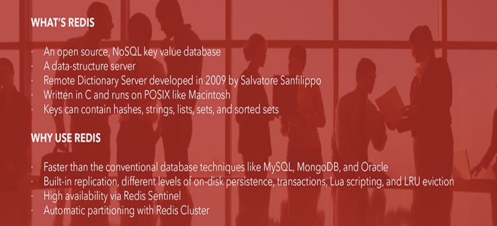
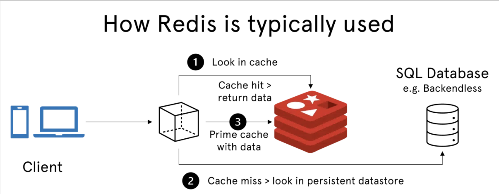
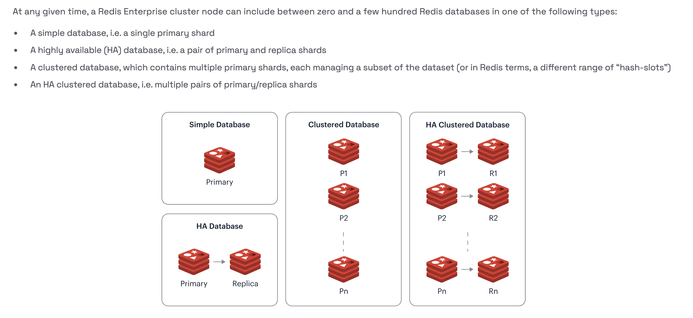
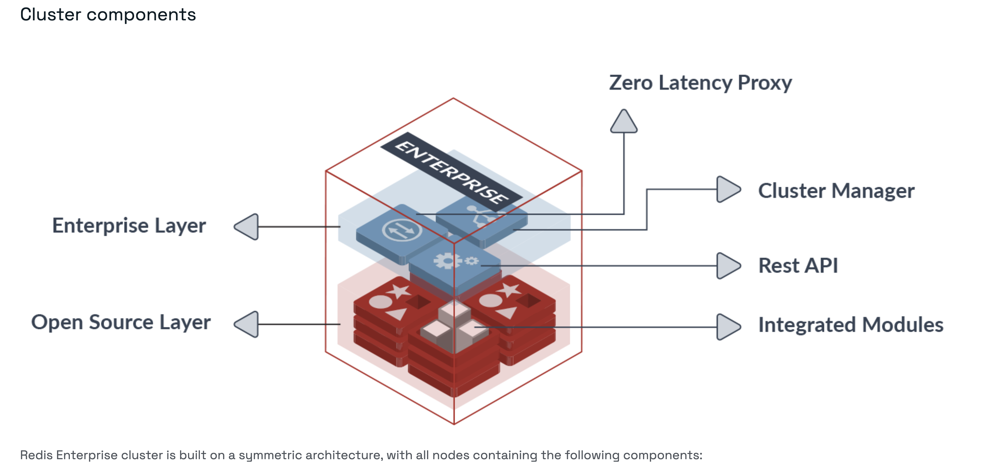
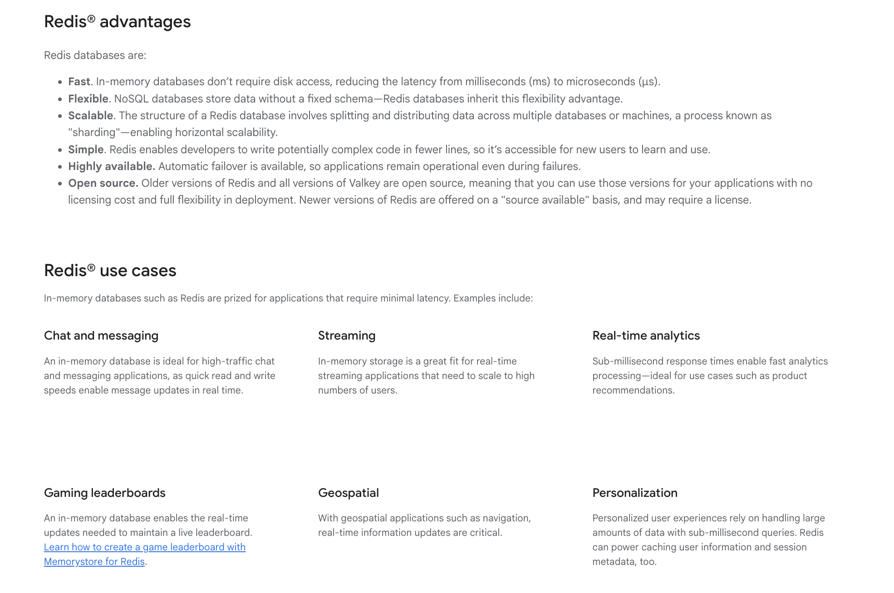
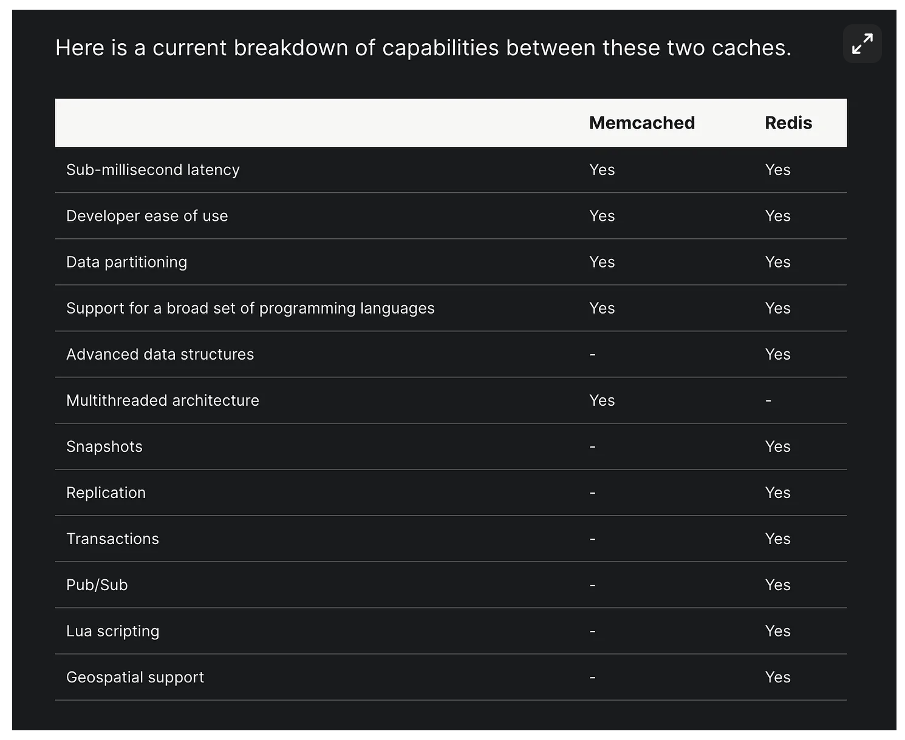
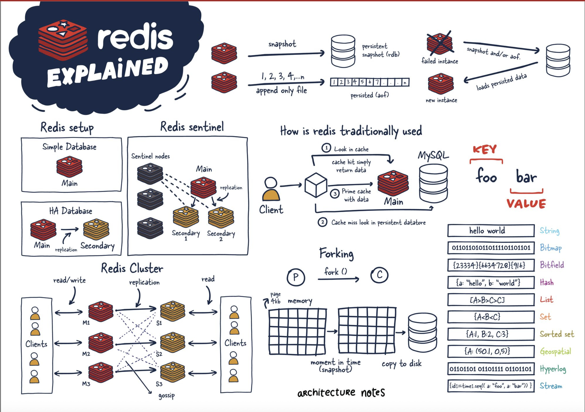

Redis (**RE**mote **DI**ctionary **S**erver) is an open source, in-memory, NoSQL key/value store that is used primarily as an application cache or quick-response document store database.

    Redis stores all data in memory, rather than on a disk or SSD, which helps deliver unparalleled speed, reliability, and performance

# Introduction

When an application relies on external data sources, the latency and throughput of those external sources can create a performance bottleneck, especially as the application scales. 

One way to improve performance in these cases is to store and manipulate data in-memory, physically closer to the application. 
    
    Redis is built for this task.

Redis has built-in replication, Lua scripting, LRU eviction, transactions, and different levels of on-disk persistence, and provides HA with Redis Sentinel and automatic partitioning with Redis Cluster.



`Fast, open source in-memory data store for use as a database, cache, message broker, and queue.`

In 2024 Redis Inc. was formed, with aim to make some part of Redis as Enterprise, keeping some OpenSource. To maintain an open source alternative, several core Redis community members launched `Valkey`, forking & starting off from the last open source version of Redis.

As DBMS, Redis offers both an in-memory database and a key-value store.
- **In-memory database**: Redis stores all data directly in the memory. This results in very fast access times, even for large amounts of unstructured data.
- **Key-value store**: Impressive with the high performance and easy scalability. A key is created for each entry which can then be used to retrieve the information.

`Most standard application for Redis is a cache`

Redis is an in-memory database used as a cache in front of another "real" database like MySQL or PostgreSQL to help improve application performance. It leverages the speed of memory and alleviates load off the central application database for:
- Data that changes infrequently  and is requested often
- Data that is less mission-critical and is frequently evolving.



Redis actually has now blurred the lines between a cache and datastore. 
With Redis, reading and manipulating data in memory is much faster than traditional datastores which use SSDs or HDDs.

# Redis Architecture

There are 4 widely used configurations of Redis Deployments:
- Single Redis Instance
- Redis HA
- Redis Sentinel
- Redis Cluster



## Redis Sentinel
- stand-alone distributed system that helps developers calibrate their instances to be highly available for clients.
- Sentinel uses a series of monitoring processes, notifications, and automatic failovers to inform users when there is something wrong with master and slave instances, while automatically reconfiguring new connections for applications when necessary.

## Redis Cluster
- distributed implementation of Redis that can automatically splits datasets among multiple nodes.
- With this, Redis can be horizontally scaled massively ensuring high availability and performance.

## Redis Pub/Sub
- users can design high-performance chat and messaging services across all their applications and services.
- This includes the ability to use list data structures to run atomic operations and blocking capabilities.

## Redis persistence
- Redis uses persistent disk storage designed to survive process outages and network bottlenecks.
- Redis can persist datasets by taking regular snapshots of data and appending them with changes as they become available.
- In the event of server failure, this will ensure database durability and integrity.

# Redis Architecture & How's



## Internal Components

### Redis Persistence

By default, Redis stores data in memory, which means that it is lost when the Redis server is shut down or restarted. **Redis persistence** enables data to be saved to disk and restored when the Redis server starts up again, ensuring that data is not lost in the event of a crash or shutdown.

`Ensures data durability and availability`


### Redis HA

### Redis Cluster

### Single-Threaded Redis

#### Why Redis, Why? 

Isn't it more efficient to use multithreading and tap into all available CPU cores for parallel computation?

`Nature of Redis’s workload` 
- Redis is like a chef in a kitchen, handling one task at a time to ensure perfection.
- Using single thread it achieves precision, avoids chaos and ensures that each task is flawlessly executed.

The single-threaded approach simplifies the design, ensuring that commands are executed sequentially without the complexities of managing multiple threads and potential synchronisation issues.
Since each command is executed atomically, it guarantees consistency. This simplicity contributes to faster execution, as the single thread can fully utilise the CPU cache, minimising cache misses and optimal performance.

#### Managing Thousands in Harmony

How does Redis scale for many incoming & outgoing requests simultaneously? Won't the single thread get blocked?

`I/O multiplexing` -> secret sauce, which allows Redis to be concurrent.

1. Redis Server is running at some address
2. Redis accepts multiple TCP connections through clients, so network socket is established between redis and the client.
3. Without I/O multiplexing, Redis would have to invoke `read()` IO system-call on all the sockets again & again, consuming data if present, which is non-performant.
4. With I/O multiplexing, Redis monitors multiple connections simultaneously without blocking its main thread. 
    1. Redis single-thread uses `select()` and `poll()` IO monitoring-calls for asynchronous eveny-driven approach.
    2. When an event occurs on the registered sockets, the monitoring call returns, Redis single-thread invokes `read()` system call.


# Usecases for Redis



Redis excels in various applications, including:

Purpose|Details
---|---
**Caching**|Supports multiple eviction policies & key expiration along with sub-millisecond latencies
**Distributed Session Store**| Offers session data caching like checkout experience, payment processing where session data needs to be maintained
**Data Structure Server**| Provides many low-level data structures (strings, lists, sets, hashes, sorted sets, JSON, etc.) with high-level semantics (counters, queues, leaderboards, rate limiters), further supporting transactions & scripting.
**NoSQL Data Store**| Key-value, document, and time series data storage.
**Search and Query Engine**| Indexing for hash/JSON documents, supporting vector search, full-text search, geospatial queries, ranking, and aggregations via Redis Query Engine.
**Event Store & Message Broker**| Implements queues (lists), priority queues (sorted sets), event deduplication (sets), streams, and pub/sub with probabilistic stream processing capabilities.
**Vector Store for GenAI**| Integrates with AI applications (e.g. LangGraph, mem0) for short-term memory, long-term memory, LLM response caching (semantic caching), and retrieval augmented generation (RAG).
**Real-Time Analytics**| Powers personalization, recommendations, fraud detection, and risk assessment.

### Redis vs Memcached

When developed, Redis was most commonly compared to Memcached, which lacked any nonvolatile persistence at the time.

Memcached
- created by Brad Fitzpatrick in 2003, predating Redis by six years.
- It originally started as a Perl project and was later rewritten in C. 
- It was the de facto caching tool of its day.

Memcached Limitations wrt Redis:
- lack the data types
- lacks the non-volatile persistence
- LRU is the only eviction policy supported
- Being multi-threaded, it is performant as caching environment but requires some setup in a distributed cluster, while Redis has support for this out of the box.



### Drawback of Redis

Issue|Detail|Solution
---|---|---
Stores data in-memory|sensitive to data loss in the event of a crash or shutdown|Redis provides features such as persistence and replication, which allow data to be saved to disk and replicated across multiple servers
single-threaded system|limit the performance and scalability of Redis in applications that require high concurrency and parallelism|Redis provides clustering and sharding features that allow data to be distributed across multiple servers



# Redis Usage

## Setting up Redis

    ```
    curl -fsSL https://packages.redis.io/gpg | sudo gpg --dearmor -o /usr/share/keyrings/redis-archive-keyring.gpg
    echo "deb [signed-by=/usr/share/keyrings/redis-archive-keyring.gpg] https://packages.redis.io/deb $(lsb_release -cs) main" | sudo tee /etc/apt/sources.list.d/redis.list
    sudo apt-get update
    sudo apt-get install redis
    ```

- https://redis.io/docs/latest/develop/get-started/data-store/
- https://redis.io/docs/latest/develop/get-started/document-database/
- https://redis.io/docs/latest/develop/get-started/vector-database/


More Ref:
- https://adevait.com/redis/what-is-redis
- https://backendless.com/redis-what-it-is-what-it-does-and-why-you-should-care/
- https://architecturenotes.co/redis/
- https://medium.com/@ayushsaxena823/what-is-redis-and-how-does-it-work-cfe2853eb9a9
