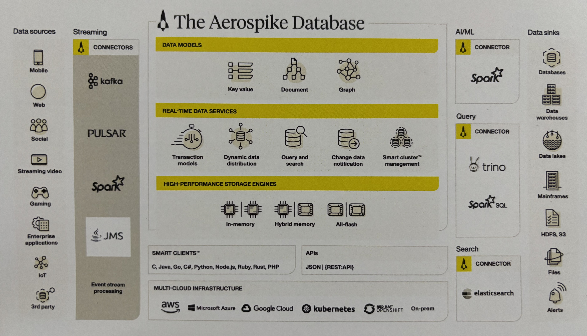
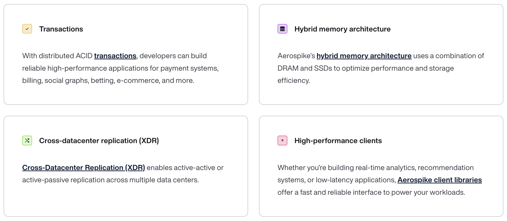
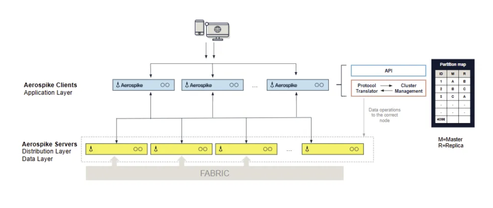
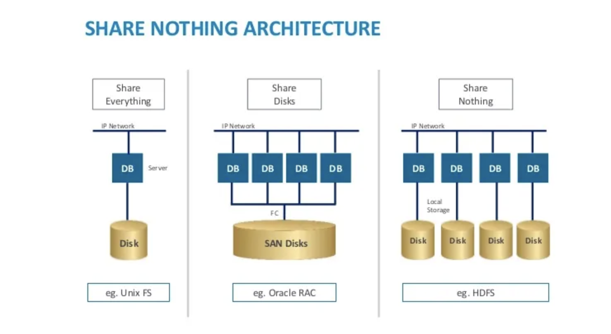
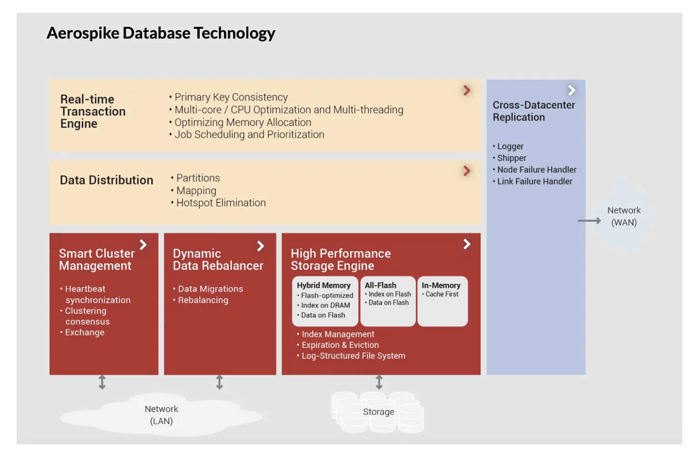
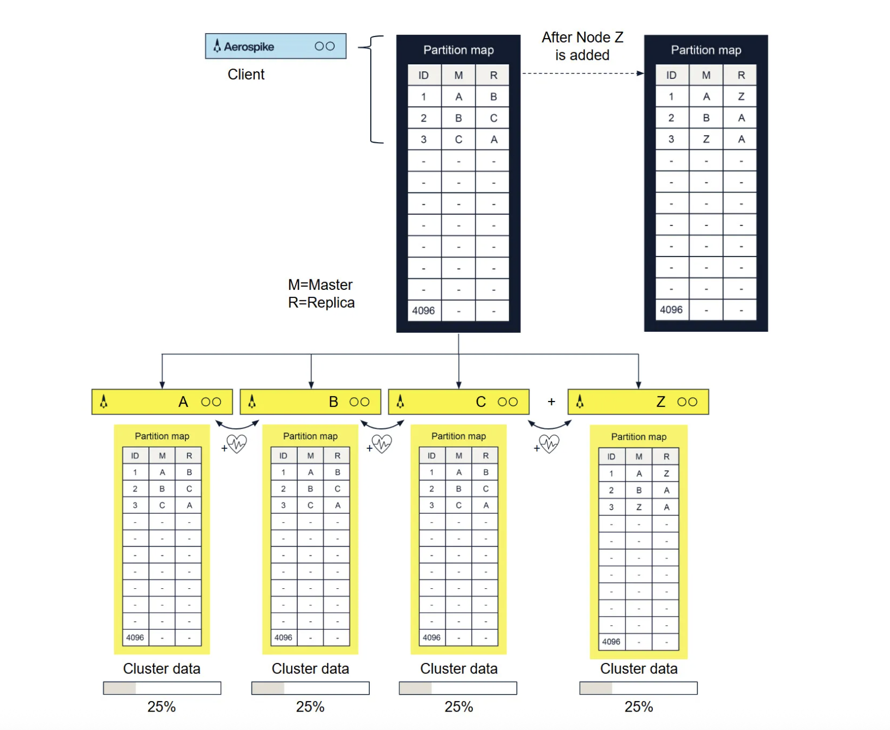
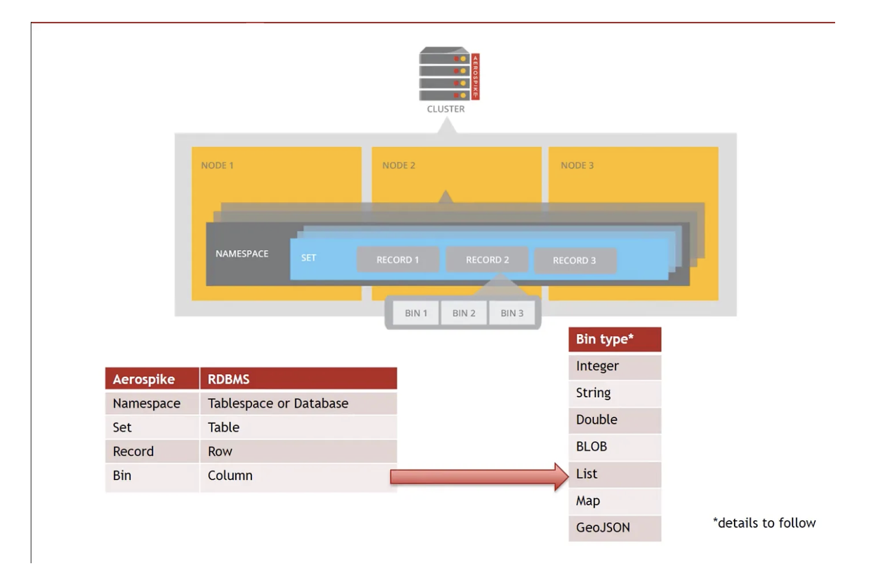
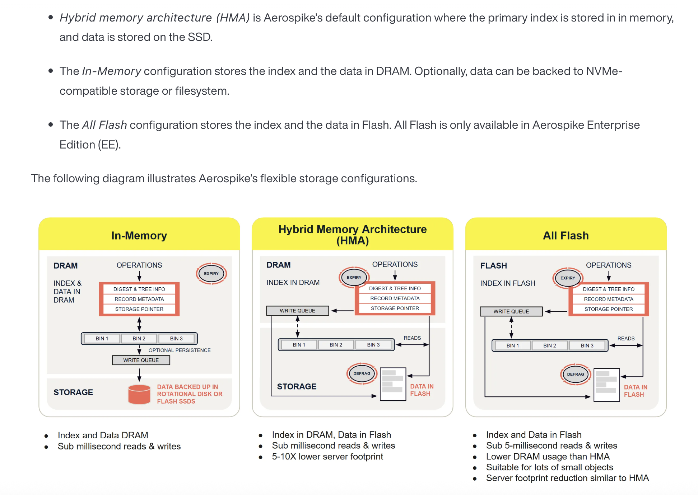
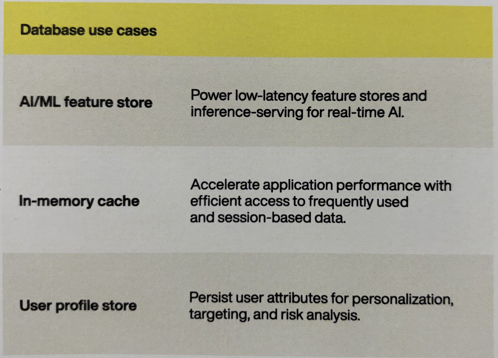
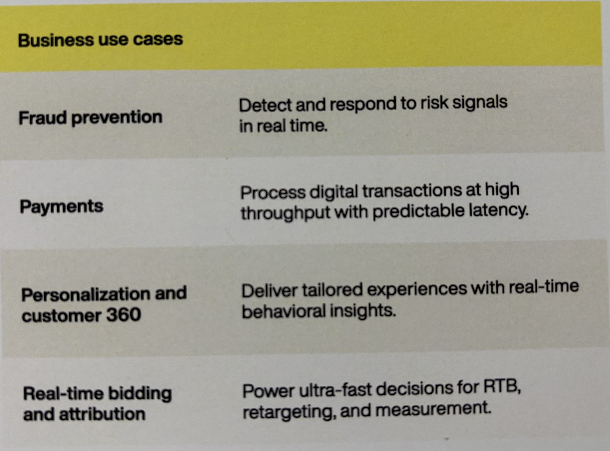

`The realtime database built for massive scale, speed and savings`

Aerospike is a
- Distributed NoSQL database
- has a diverse data model which support scaling upto PetaBytes of data
- Deliver's lowest latency in the industry with the highest throughput
- Excels at processing millions of TPS with the smallest infrastructure footprint

It is a multi-model DB that supports both Key-Value Store and Document Store models (and Graph) through a flexible, underlying record structure.
- **Key-Value Store**: Low-latency, & fast key-based lookups (the original & primary strength).
- **Document Store**: Storing, indexing, and querying flexible JSON documents using its Map and List Collection Data Types.
- **Graph Database**: Offering a dedicated Graph database component with recent releases.

# Introduction

These are the saliant features of Aerospike:
1. **Scalability** - Flash and Hybrid Memory Architectures allows Aerospike DB to scale upto PBs of data
2. **Speed** - Low Latency is maintained at a very high scale
3. **Low TCO** - Due to hybrid memory architecture and compression, Aerospike provides significantly lower (~20%) total cost of operations
4. **Automatic Sharding** - Distributes data automatically across nodes for load balancing and redundancy.
5. **ACID Compliance** - Maintains data integrity, consistency, and durability, critical for transactional operations.

Aerospike was developed by Srini Srinivasan and Brian Bulkowski, and it was first introduced in 2009. Currently Aerospike 8.0 is the most recent version.

# Aerospike Details

    Aerospike's architecture is:
    - built on a shared-nothing architecture
    - which incorporates
      - smart client libraries,
      - self-managed clusters
      - and hybrid memory system
    to efficiently balance loads, eliminate network hotspots, and recover quickly in failure situations.

## Architecture Overview

Ref Link for more details: https://aerospike.com/docs/database/learn/architecture/

There are 3 Primary parts:

1. **Cluster-aware client layer** - provided by open source client libraries, implements developer APIs, tracks the cluster state, and knows where data resides in the cluster.
2. **Clustering and data distribution layer** - manages inter-node communication (network fabric) and automates fail-over, replication, rack awareness, intelligent rebalancing, data migration, and cross-datacenter replication (XDR).
3. **Data storage layer** - stores data reliably in flash SSDs, DRAM (memory), or Intel® Optane™ Persistent Memory (PMem) for fast retrieval.

### Client Layer

Aerospike clients are implemented as an open source linkable library available in C, Java, Go, C#, Python, Node.js, examples:
  - https://github.com/aerospike/aerospike-client-java
  - https://github.com/aerospike/aerospike-client-go
  - https://github.com/aerospike/aerospike-client-nodejs

Responsibility of Client Layer:
  - Developer API & Client-Server Protocol Implementation, and interacts directly with the cluster.
  - Tracks the cluster state and knows where each record is stored, instantly being aware of the cluster state & configuration (node going down or joining)
  - Sends requests directly to the node with the record and retries or reroutes requests to the replicas if needed

### Distribution layer

Aerospike “shared nothing” architecture is designed to scale linearly while reliably storing terabytes and petabytes of data.

Primary Responsibility of Distribution layer is to eliminate manual operations with the systematic automation of all cluster management functions. 
It includes three modules:
  - Cluster Management Module
  - Data Migration Module
  - Transaction Processing Module

#### Cluster Management Module

Tracks nodes in the cluster. The key algorithm is a Paxos-based gossip-voting process that determines which nodes are considered part of the cluster. Aerospike implements a special active and passive heartbeat to monitor inter-node connectivity.

#### Data Migration Module

Each node in the cluster uses a distributed hash algorithm to divide the primary index space into data partitions and assign owners. 
The Aerospike Data Migration module intelligently balances data distribution across all nodes in the cluster, ensuring that each bit of data replicates across all cluster nodes and datacenters.

#### Transaction Processing Module

Reads and writes data, and provides the consistency and isolation guarantees.
  - Sync/Async Replication: For writes with Strong consistency, it propagates changes to all replicas before committing the data and returning the result to the client.
  - Duplicate Data Resolution: For clusters recovering from being partitioned, it resolves any conflicts between different copies of data

`Every namespace has its own partition map`

### Data Storage Layer

- Each key in Aerospike is efficiently stored in just 64 bytes, 1 Billion keys taking up 64 GB space
- Native, multi-threaded, multi-core Flash I/O and an Aerospike log structured file system take advantage of low-level SSD read and write patterns.
- Defragmenter and Evictor work together to ensure that there is space in DRAM, that data is never lost, and that data is always written to disk safely.

Aerospike is a multi-model (key-value, document, graph) data store with a schemaless data model.

  - Data flows into policy containers, `namespaces`, which are semantically similar to databases in an RDBMS.
  - Within a namespace, data is subdivided into `sets` (RDBMS tables) and `records` (RDBMS rows).
  - Each record has an indexed key unique in the set, and one or more named `bins` (RDBMS columns) that hold values associated with the record.

`Bins are not typed, so different records can have the same bin with values of different types.`

  - Indexes: primary index and the optional secondary indexes, are stored by default in DRAM(in-memory) for ultra-fast access.
  - The primary index can also be configured to be stored in Persistent Memory or on an NVMe flash device. 
  - Values can be stored either in DRAM or more cost-effectively on SSDs. 
  - Each namespace can be configured separately, so small namespaces can take advantage of DRAM and larger ones gain the cost benefits of SSDs.

## CAP Theorem & Aerospike

In distributed systems, we can only guarantee two out of three properties: Consistency, Availability, and Partition tolerance.

Aerospike handles the CAP theorem by providing a tunable consistency model that allows us to choose which two properties to prioritize on a per-namespace basis:

- **Available and Partition-tolerant (AP) Mode**
  - Provides Eventual Consistency
  - Is the default mode
  - The cluster continues to accept reads and writes on all sides of the partition. This ensures high availability, but clients may read stale data or lose writes until the partition is resolved and the data converges.

- **Strongly Consistent and Partition-tolerant (CP) Mode**
  - Provides Strong Consistency
  - Aerospike uses a roster-based strong consistency scheme.
  - To uphold SC, the minority side (the smaller part of the partitioned cluster) or a partitioned node will stop accepting writes and may become temporarily unavailable for that data. This enforces consistency by sacrificing availability on the affected nodes/partitions.

`Aerospike prioritizes either of consistency and availability while maintaining strong partition tolerance`

## Benefits

`Aerospike is Capable of real-time transactional workloads that support mission-critical applications.`

Hybrid Memory Architecture™ delivers RAM-like performance with SSDs that scale from GBs to PBs with sub-millisecond latency.

- Lightning-fast performance
  - Realtime transactions with low latency

- Highly Scalable & Distributed
  - Database can be scaled as storage needs increases
  - Distributed architecture allows horizontal scalability with ease
 
- Transactional Workloads
  - Best for applications that desire flexibility of NoSQL with ACID guarantees.

## Industry Usecases

Tech Usecase|Business Usecase
---|---
|

## Head on Head Comparision with Redis

If we are building mission-critical applications where data consistency is a must, then Redis is not likely the right choice. Redis has not passed the Jepsen test for strong consistency.

To scale Redis, more nodes and DRAM are needed because it’s a single-threaded system designed for in-memory processing. But DRAM is expensive, and thus managing increasingly large clusters isn’t easy. 

### Challenges in Redis

1. One Master, multiple Slaves — i.e. the ‘write’ throughput is limited by the one machine on which the master is running on.
2. Redis is single-threaded - no vertical scalability in terms of CPU.
3. Real-time master-slave synchronization issues — huge amount of writes on the master requires that all the changes had to be synchronized with the slaves. This can only be done by taking slaves offline for synchronization because huge chunks of data sync and serve incoming requests at the same time is not possible
4. No handy way of storing multiple different types of data in the same database - had to store different entities in different Redis instances
5. Redis is in-memory only, which means it becomes very costly at scale

### How Aerospike Helps

1. Partitioning — 4096 partitions by default, spreaded across the cluster nodes. This helps us with the ‘write’ throughput.
2. Aerospike is multithreaded - making the most of the resources
3. 0 downtime for master-replica synchronizations — ‘write’ policy can be configured such that the write-request is considered ‘finished’ only after the replica creation confirmation.
4. Namespaces - different types of data can be stored in the same cluster under different namespaces
5. Aerospike has two modes: SSD versus in-memory - Offers competitive performance with SSDs.

# Usage

## Setting up in Local

## AQL Commands

# Demo

